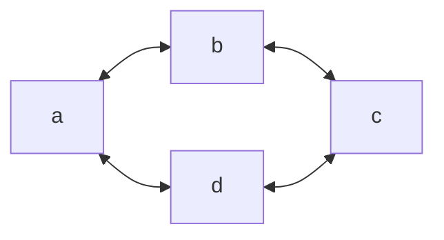
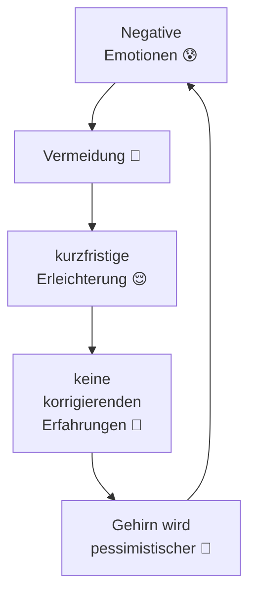
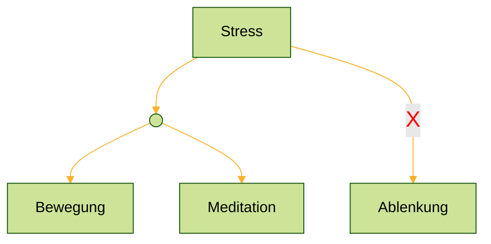

# fast notes
- Biraz Türkçe konusabiliyorum ama şu sıralar pratik yapmadığım için pek bilmiyorum.
- Biraz Türkçe konusabiliyorum ama şu anda bu konuda yeterli pratiğe sahip değilim.
- alıştırma - Übung

# Planung
- Schule mache ich jetzt so lange bis ich meinen Master habe, ich investiere darin nicht mehr so viel zeit
- der Master ist die <u><font color="#00b0f0">Priorität</font></u>
- Wenn ich den <u>Abschluss</u> habe, dann schaue ich mich nach einem Job um
- ich möchte definitiv etwas machen bei dem ich konzentriert und in Ruhe arbeiten kann und nicht so viel reden und erklären muss.
# Geschäftliche Nachrichten 

## ebay 26-07-06
Hi,
I am writing in english since you are operating from poland?

Thank you for the fast delivery and the product.

I have a question concering the night mode. This does not have the expected effect. On contrary it isn't weaker in the night mode as I expected, it switches to speed mode L2 fixed, so it is even "stronger" faster. The only effect is that the display turns off after a few seconds, but you cannot change the speed mode.

I think for night even L1 is too strong.

In the product description it is written: 
2 Modi (Normal/Nacht) or how it is called in the english manual normal/sleep mode, but why you cannot change the speed in the sleep mode, which is obviously only for switching of the display after a few seconds.

Did I do something wrong or miss something?
I could send you a short video.


Kind regards
Lukas

## Christian-Morgenstern-Schule
Liebes Team der Christian-Morgenstern-Schule,

ich war heute nach meinem Einsatz an der Bernhard-Adelung-Schule bei Ihnen, um nach einer Einstellung als VSS Kraft zu fragen. 

Dabei hatte ich ein kurzes Gespräch mit der Konrektorin Frau Behrenroth, die mir dazu riet eine E-Mail zu schreiben, um ein Gesprächstermin auszumachen.

Zu mir und meinem Anliegen:

Ich heiße Lukas Walter und schreibe zur Zeit meine Masterarbeit in Physik am Institut der kondensierten Materie.

Ich habe bereits von Januar '24 bis Januar '25 an der Justus-Liebig Schule als VSS Kraft gearbeitet und dabei viele wertvolle Erfahrungen gesammelt.

An der Universität habe ich viele Jahre als Übungsleiter für Mathematik und Physik Lehrveranstaltungen für verschiedenste Fachbereiche und als Experimentbetreuer im Grundpraktikum der Physik gelehrt.  
Ich habe zu Beginn Lehramt an Gymnasium mit den Fächern Mathematik und Physik studiert, bis ich zum Bachelor/Master Studiengang Physik gewechselt bin. 

Nachdem ich im letzten Jahr bis Februar diesen Jahres in der IT gearbeitet habe, bin ich seit Anfang März wieder als Vertretungskraft aktiv, da sich bei mir das Bewusstsein gefestigt hat, dass ich im Bereich der Kinder- und Jugendpädagogik meine Stärken und meine Persönlichkeit sehr gut entfalten und am wirksamsten einsetzen kann.  
Momentan bin ich vorwiegend an der Bernhard-Adelung-Schule (BAS) eingesetzt. 

In meiner Jugend war ich in der katholischen Gemeinde, sowie in Schauspielvereinen meines Geburtsorts sehr aktiv, habe dort Gruppenleiterkurse belegt und war als Obermessdiener, Ferien- und Zeltlagerbetreuer in der Kinder- und Jugendbetreuung eingebunden.  
  
In meiner Freizeit bin ich seit 2022 im Chor der Mathematik Fachschaft aktiv, beteilige mich an den Musikabenden der Fachschaft Physik  und Mathematik und musiziere an verschiedensten Instrumenten mit Freunden in verschiedensten Musik Genres.

Ich würde mich daher freuen, mit Ihnen ins Gespräch zu kommen, ob und wie ich Sie im Rahmen der verlässlichen Schule unterstützen kann.

Freundliche Grüße

Lukas Walter

## ernst-elias-niebergall-Schule
Liebes Team der Ernst-Elias-Niebergall-Schule,

ich war heute während Ihres pädagogischen Tags in Ihrer Schule, um nach einer Einstellung als VSS Kraft zu fragen. 

Dabei hatte ich ein kurzes Gespräch mit der Schulleiterin Frau Mai, die mir dazu riet eine E-Mail zu schreiben, um ein Gesprächstermin auszumachen.

Zu mir und meinem Anliegen:

Ich heiße Lukas Walter und schreibe zur Zeit meine Masterarbeit in Physik am Institut der kondensierten Materie.

Ich habe bereits von Januar '24 bis Januar '25 an der Justus-Liebig Schule als VSS Kraft gearbeitet und dabei viele wertvolle Erfahrungen gesammelt.

An der Universität habe ich viele Jahre als Übungsleiter für Mathematik und Physik Lehrveranstaltungen für verschiedenste Fachbereiche und Experimentbetreuer im Grundpraktikum der Physik gearbeitet.

Ich habe zu Beginn Lehramt an Gymnasium mit den Fächern Mathematik und Physik studiert, bis ich zum Bachelor/Master Studiengang Physik gewechselt bin. 

Nachdem ich im letzten Jahr bis Februar diesen Jahres in der IT gearbeitet habe, bin ich seit Anfang März wieder als Vertretungskraft aktiv, da sich bei mir das Bewusstsein gefestigt hat, dass ich im Bereich der Kinder- und Jugendpädagogik meine Stärken und meine Persönlichkeit sehr gut entfalten und am wirksamsten einsetzen kann.  
Momentan bin ich vorwiegend an der Bernhard-Adelung-Schule (BAS) eingesetzt. 

In meiner Jugend war ich in der katholischen Gemeinde, sowie in Schauspielvereinen meines Geburtsorts sehr aktiv, habe dort Gruppenleiterkurse belegt und war als Obermessdiener, Ferien- und Zeltlagerbetreuer in der Kinder- und Jugendbetreuung eingebunden.

In meiner Freizeit bin ich seit 2022 im Chor der Mathematik Fachschaft aktiv, beteilige mich an den Musikabenden der Fachschaft Physik  und Mathematik und musiziere an verschiedensten Instrumenten mit Freunden in verschiedensten Musik Genres.

Ich würde mich daher freuen, mit Ihnen ins Gespräch zu kommen, ob und wie ich Sie im Rahmen der verlässlichen Schule unterstützen kann.

Freundliche Grüße

Lukas Walter
## spatial business integration
Dear Spatial Business ~={Crimson}Integration=~ Team,

I am a physicist with a bachelor's degree and I am currently writing my master thesis in the field of soft condensed matter.
I have very good programming experiences in Python, Java and C++.
I am also well educated in biology, agriculture and forestry.
Optics, image editing and data processing are also part of my knowledge base.

I am searching for 80h/m work student job.

I look forward to your reply.

Kind regards 
Lukas Walter 
# Nachrichten an Leute

## 2026-07-27 flo
Ah also wurde sie jetzt doch aktiv zerstört oder meinst du die "Nachbarbibliothek" von der Andrej spricht?
---
Ja safe. Das Christentum hat ja auch extrem viele innere kämpfe insbesondere gegen das immer wieder aufkommende Reform Christentum die als Ketzer verfolgt wurden und dann später eingegliedert wurden 🤭. Zb Franziskaner 

Ich finde es halt immer dann auch sehr "rassistisch" wenn der Islam als vermeintliches Gegenüber so verklärt wird. Ich glaube dass ist der romanitsierung im 19. Jh durch den orientalismus geschuldet.

"Die weißen und edlen Muslime, die uns die Zivilisation der Antike zurück gebracht haben"

"Rassistisch" in dem Sinne da es ähnlich der Verklärung des edlen wilden ist. 

Ich finde immer man sollte möglichst bei einem möglichst sachlichen Blick auf die Dinge sein unter dem Wissen dass man nie wirklich sachlich sein kann.

Es ist einerseits falsch "den Islam" (es kommt immer extrem auf die epoche, den Herrscher und dessen auslegung an zb der Suffismus) in der Zeit zu verteufeln und den Islam bzw dann "die Muslime" als edle und fortschrittliche die das Wissen bewahrt und entwickelt haben zu überhöhen.

Im Detail sieht es halt ganz anders aus. 
Wie andrej es sagte ja die Schriftkunst war groß und der Umgang mit der Medizin war zum Teil ein anderer. 

Allerdings auch nicht so lange. Der Islam war ganz sicher kein hegemonial des Fortschritts sonst wäre das christliche europäische Mittelalter nicht deutlich vorbei gezogen.

Es ist jedenfalls nicht korrekt dem Islam diese anfänglich bessere kulturelle Entwicklungsstand betreffende Situation der unter dem Islam lebenden Völker zuzuschreiben.

Die Bildungsstätten des Islams haben sich im Vergleich zum Christentum nämlich genau umgekehrt entwickelt.

Die Universitäten die in Europa gegründet wurden waren ja ausschließlich klerikale Bildungsstätten, die sich dann mehr und mehr vom hauptsachlich theologischen Bildungskern diversifiziert haben.

Im Islam war es genau umgekehrt. Da wurde zunächst viel wissenschaftliches Arbeiten in den eroberten Gebieten geduldet und Schritt für Schritt wurde das als unislamisch bewertet und verdrängt.

Die Errungenschaften in der goldenen Zeit des Islams haben eigentlich eher trotz des Islams statt gefunden, als wegen des Islams.

Musik, Kunst, Architektur, Astronomie, Medizin und Mathematik, waren Felder die aus den vom Islam eroberten Völker heraus kultiviert wurden. Zb die Mosaike der Mauren.
Viel Fortschritt der dem Islam zugesprochen wird ist eigentlich persischen Ursprungs.

Auch die Verallgemeinerung hier dass etwas dem Islam und nicht der Region zugesprochen wird ist eigentlich weird.

Macht man schließlich auch nicht wenn es um europäische oder chinesische Errungenschaften angeht.
Da steht zu erst italienischer oder niederländischer Maler und dass der Christ war wird vielleicht gar nicht erwähnt oder steht an zweiter Stelle.

Das ist ja gerade das problematische am eurozentrischen Blick der den Islam als monolithschen Block zum Teil verklärt.
In "der" europäischen Sicht wurden "die" Völker ja auch verallgemeinernd als Sarazenen bezeichnet.

Es wird da sehr häufig ausgelassen dass es eine Eroberung mit Gewalt war, die die kulturelle Vielfalt der Länder nach und nach vereinheitlicht und entdiversifiziert hat.

Am besten konnten sich gegen dieses hegemonial die Perser stellen und mehr Eigenständigkeit bewahren und wurden viel weniger stark arabisiert.

So lange der Islam in den Ländern noch frisch war und noch nicht der Mehrheit der Macht hatte, wurde viel mehr zu gelassen an Diversität und was auch die Duldung der örtlichen Religionen anging. Aus dieser Phase stammen auch die kulturellen Errungenschaften.
Mit der Zeit wurde das aber sehr stark anders.
Musik und Kunst die nicht religiös war, wurde mehr und mehr strikter verboten.
Zum Teil Musikinstrumente ganz.

Der Islam war und ist eine Sklavenhaltergesellschaft 🤷‍♂️.

Die Sklaverei ist dort geregelt. Es wurden Sklaven in Europa erbeutet (Korsaren und später Osmanen) und im ganzen Gebiet gehandelt.

Der ostafrikanische Sklavenhandel war wirklich massiv.
Das arabische Wort (Abd) für schwarze Menschen ist nicht umsonst gleichbedeutend mit Sklave.

Ich finde es deshalb durchaus schwierig das europäische Mittelalter mit dem Orient im Bezug auf "Fortschritt" zu vergleichen und dann eindeutige Aussagen zu treffen wie "die Muslime waren fortschrittlicher und haben den in der Dunkelheit versunkenen Europäern die glorreiche Antike wieder gebracht"

Gerade dann der Aspekt "die bösen Christen mit ihren Kreuzzügen" dieser Punkt ist ja auch im meme (nicht ohne Grund). Damit wird ja auch die Anfänge eines koloniales Europas suggeriert.

Was ja faktisch nicht stimmt. Mal abgesehen von den diversen Motivationen die zum großen Teil individualistischer und ökonomischer Natur waren, es waren auch verschiedenste Einzelinteressen und Gruppierungen beteiligt (der Templerorden mit "dem kreuzfahrerkreuz" wird ja sehr gerne intensiv damit in Verbindung gebracht), war die ersten Kreuzzüge eine sehr verspätete Abwehrbewegung zur massiven Eroberung von Muslimischen Herrschern begründet.

800 irgendwas wurde Rom geplündert, viele Mittelmeer Inseln waren besetzt, Spanien war  zum Beginn der reconquista in der Mitte des 8 jh größtenteils besetzt.

Das die eigentlichen Ziele (nach außen propagierten) dauerhaft nicht erreicht wurden, es im Endeffekt durch die Plünderung Konstantinopels in einem der späteren Kreuzzüge der fall Byzanz eher beschleunigt wurde und auch widerwertige Massaker (glaube bei der Eroberung Jerusalems?) behangen wurden mal dahingestellt.

Ich hab sehr häufig die Kreuzzüge als eine vereinfacht böse Tat der Christen und der Kirche zugetragen bekommen. Die Eroberungen/Expeditionen in Südamerika durch die conquistadore sind da meiner Meinung nach ein besseres negativ Beispiel, wobei auch die Taten nicht gut geheißen wurden und es zu Verurteilungen kam...

Bei den Kreuzzügen haben Christen und Muslime auch auf beiden Seiten gekämpft. Das war dann ja zum Teil ein großes Durcheinander was die Feindschaften angeht.

Ich finde es immer Schade und schädlich wenn Geschichte so plakativ und nicht differenziert betrachtet wird und ich weiß dass ich es auch nicht getan habe. Ich habe auch vereinfacht und "dem" islam Unrecht getan damit. Das ist leider wie beim in schutznehmen von Andrej erwähnt, auf plakative zuspitzungen und daraus folgende Bewertungen, braucht es erstmal irgendwie Zuspitzungen und Vereinfachungen von der vermeintlich "anderen Seite", um sich dann in der Mitte zu treffen.

wirklich schade finde ich insbesondere dass aus Geschichte (naheliegend) gerne politische Einfachheiten und Schlussfolgerungen gezogen werden.

Ich hab auch lange "die" allmächtige Kirche als Grund für zu viel übel angesehen.

Ich fand es sehr erhellend und menschlich zu lernen dass es differenzierter war.

Ich finde daraus lernt man viel mehr. 

Auch der Vergleich des innerchristlichen Konflikts mit dem innerislamischen Konflikt ist echt erhellend.

Ich meine der 30 jährige Krieg der wirklich eine krasse Katastrophe war und massive Auswirkungen hatte, ist ja oberflächlich schon irgendwie eine Art Glaubenskrieg gewesen. Auch wenn es irgendwie eine "Konsolidierung" (falsches Wort) der vielen kleinen Herrschaftsgebiete war, die vielfältigste Bündnisse schlossen.

Der inner christliche Konflikt hat sich meiner Wahrnehmung nach seitdem nicht mehr in gewalttätigen Konflikten geäußert. Ah okay naja Nordirland wäre ein Gegenbeispiel.

Ich meine aber generell ist zumindest zwischen der evangelischen und katholischen Kirche eher ein zusammenwachsen zu beobachten.

Der über tausendjährige gewalttätige Konflikt zwischen Schiiten und Sunniten kennt aber kein Ende. 

Wirklich "einig" (nicht mal auf politischer Ebene) sind die sich nur wenn es gegen Israel/die Juden/ den Zustand bzgl Gaza  geht.
## 2026-07-23
https://www.n-tv.de/politik/Brosius-Gersdorf-kritisiert-Haltung-der-Union-zur-Leihmutterschaft-Laschet-kontert-id31110162.html?shem=dsdf,sharefoc,agadiscoversdl,,sh/x/discover/m1/4

Ja gut dass sie kein Verfassungsrichter geworden ist. 

Leihmutterschaft ist nichts anderes als Prostitution und dazu deutlich lebensgefährlicher.
## 2026-07-21 flo
### 1
Ja nach außen meinte ich...

Die reden Recht wenig darüber wie christlich sie seien.

Ich finde ja auch eher dass Leute wie Krah die die waffen SS verharmlosen und auch höcke der ja recht offen völkisch ist.

Ich hatte mir ja das Gespräch bei ben ungeskripted angehört als es raus kam.
Ich fand Einordnung hat es nicht gebraucht bei dem 😅.

Er hat sehr sympathisch wirken wollen, aber hat sich schon Recht klar offenbart.
Ich find's gut wenn man Leute ausreden lässt und in Sicherheit wähnen lässt

### 2
Jo aber ich hab mir da tatsächlich erstmal anhören müssen was die AfD Leute da zu sagen haben.

Was die mit ihrer "Rechte Ordnung der Liebe" meinen.

Bzw was die da sagen. 

Das passt halt schon ziemlich zu gläubigen Basis Christen.

Die glauben halt an Gott und an eine göttliche Transzendenz. 🤷‍♂️

Ist zu akzeptieren und voll kommen OK.

Ich finde nicht dass das Menschenfeinde sind und die extrem problematisch sind. 

Die sind mit unserer Verfassung vereinbar.

Das Menschenbild was durch den Islam hier in Moscheen und im Netz verbreitet wird und unter Jugendlichen verbreitet ist, ist es allerdings nicht...

### 3
Jo hart, was er da über die Verbindungen erzählt.

Kampf gegen die Westliche Dekadenz 

🫣

Ich hab natürlich mal bei der AfD zu "die Rechte Ordnung der Liebe" nachgeschaut.

Der David Engels war da tatsächlich Gastredner.

JD vance wird in deutschen streng christlichen communities schon gefeiert.
Man muss ihm halt auch seinen Werdegang lassen. Ihm hat der Glaube aus diesen echt krassen Verhältnissen heraus geholt.

Ich mag nicht über Glaube an sich urteilen. Das ist immer irgendwie und irgendwo strange.

Wenn Muslime ihren Glauben auf ne positive spirituelle Art leben und daraus Kraft gewinnen ist das auch voll okay.
Gibt da ja auch Suffististen die die Frauen nicht wie Menschen zweiter Klasse behandeln.

Gilt auch für Hindus oder Sikhs.

Was die dann manchmal von sich geben mag befremdlich wirken.

---
Was die Leute auf der AfD Veranstaltung erzählen geht, aber tatsächlich in die Richtung Gottesstaat 🫣🤯.

Man glaubt es echt nicht. 

Es ist echt notwendig sich die original Aussagen anzuhören.

Der eine hält die Säkularisation als Fehler die zum Kommunismus und Nationalsozialismus geführt hat.

Also Ideologien die sich rein auf das weltliche und scheinbar wissenschaftliche beruht haben.

Und im Prinzip hat er ja Recht.

Die schlimmsten und Menschenfeindlichsten Ideologien waren "gottlos".

Das hat bisher keine andere Ideologie geschafft.

Gut vorher gab's aber auch nicht die Mittel dazu...
1. Gab's vorher nicht diese Bevölkerungsexplosion wie zum Ende des 19. Auf das 20. Jh 
2. Gab's nicht die industriellen Mittel Menschen in der Menge umzubringen. (Ok in Ruanda haben sie es auch ohne diese geschafft in 100 Tagen 1mio Menschen umzubringen)

### 3
Ich hab natürlich mal bei der AfD zu "die Rechte Ordnung der Liebe" nachgeschaut.


Die wollen gerade keinen Gottesstaat.

Die sehen eher dass die Gottlosigkeit, der Materialismus und die angebliche Objektivität der Wissenschaft auf die sich Ideologien wie der Kommunismus, der Nationalsozialismus, aber auch der Neoliberalismus berufen haben und berufen zu den menschenfeindlichsten Systemen geführt haben.

Die sind der Ansicht dass es viele Ersatzreligionen gibt und den Leuten Selbsttranszendenz fehlt. 

Die Hinwendung zu einem übermateriellen Streben.

### 4
Ich hab natürlich mal bei der AfD zu "die Rechte Ordnung der Liebe" nachgeschaut.


Die wollen gerade keinen Gottesstaat.

Die sehen eher dass die Gottlosigkeit, der Materialismus und die angebliche Objektivität der Wissenschaft auf die sich Ideologien wie der Kommunismus, der Nationalsozialismus, aber auch der Neoliberalismus/Libertäre berufen haben und berufen zu den menschenfeindlichsten Systemen geführt haben.

Die sind der Ansicht dass es viele Ersatzreligionen gibt und den Leuten Selbsttranszendenz fehlt. 

Die Hinwendung zu einem übermateriellen Streben.

"Das Wahre, das Gute und das Schöne"
Soll der Leitstern sein. 

---

Mir fällt es schwer solche Menschen als extrem problematisch einzuschätzen.

Der David Engels und der Christian Machek sind da auf der Veranstaltung.

Ich würde denen prinzipiell schon zu trauen dass zumindest diese AfD Gruppierung als ganzes sich von diesen Verbindungen zum Iran erwehren kann. 

Ich denke dass deren Welt und Menschenbild nicht mit der Ideologie des Islams vereinbar ist. 

Da sie sich ja eher als Gegenentwurf zum sich in Europa ausbreitenden Islam sehen. 

Die Kirchen bieten wie die auch selbst sagen keinen Platz mehr für viele Christen.

Das kann ich so von meiner Beobachtung auch bestätigen.
## 2026-07-18 E-Mail Arooj 
Hey

🤭Oh typisch Arooj so fleißig, prompt und emsig, dass du direkt ne Briefmarke gekauft hast. 

Ich nehme die dann. 😉

Ich hätte sie dir auch in den Briefkasten geworfen.

3. Person ist Quatsch.

Aber schade dass du offenbar immer noch so viel Abstand zu mir halten musst, dass du jemanden anders schicken musst.

Ich hätte wirklich kein Problem damit dich zu sehen und ehrlich gesagt würde ich dich auch gerne mal wieder sehen, mal so 🤷.

Ich hoffe die Wogen haben sich gelegt. Bei mir haben sie sich jedenfalls definitiv.

Ich bin dir wirklich dankbar dass du so stark warst ,zu dir und deinem Unwohlsein gestanden hast und es durch gezogen hast.

So hart, schmerzhaft, schade es und in der Zeit letztes Jahr unverständlich der Schritt für mich auch war.

Ich hab diese harte Zäsur, den Schmerz, die tiefe Einsamkeit, Ausweglosigkeit und Verlorenheit gebraucht.

Um zu merken, dass ich auf mich allein gestellt bin, ich mich da alleine heraus holen und mein Leben wieder selbst in die Hand nehmen muss und das auch kann. 

Ich war wirklich irgendwas zu tief in der Hilf- und Machtlosigkeit drin und habe mich dieser ergeben, mich dieser unterworfen und mich dann zu sehr von dir emotional abhängig gemacht.
Überhaupt war ich extrem emotional eingesperrt, auch was meine Familie angeht und hab mich da so extrem vom Urteil meiner Eltern abhängig gemacht und darauf die letzten Jahre irgendwie gewartet dass sie da etwas tun und nicht so indifferent sind, es ihnen scheinbar egal ist und mir sogar noch die Verantwortung zu spielen.

Ich musste lernen mich da emotional komplett zu lösen, mich und meinen Wert und die Deutung der Situation mit meiner Schwester nicht mehr vom Urteil meiner Eltern abhängig zu machen.
Ich war da noch in meiner Kindbeziehung zu meiner Familie gefangen und hab immer wieder diese Rolle eingenommen.

Ich musste dem endlich entwachsen.
Seitdem ich zu mir stehe, auch für meine Positionen und für meine Eltern aber auch meine Grenzen ihnen gegenüber einstehe, ist das Verhältnis ganz anders. 

Ich hätte das gerne mit dir zusammen geschafft und auch so vieles mit dir zusammen erlebt.

Ich bin dir wirklich sehr dankbar, dass du über die intensive und wertvolle Zeit die ich mit dir verbringen durfte, immer wieder mein Rückgrat gestärkt hast und mir aus getrieben hast (auch wenn es sehr sehr lange gebraucht hat), dass ich selbst mit mir so abwertend um gehe und für mich und meinen Platz einstehe.

Das habe ich von dir gelernt. Auch wenn du es mir vielleicht nicht glaubst, ich hab es dir zwar auch immer wieder gesagt mich leider auch gleichzeitig darüber immer wieder beschwert, daher war die Botschaft dass ich das als eine hohe Qualität von dir angesehen habe und ich immer sehr zu dir auf geblickt habe nicht so an. 
Ich hab graduell von dir gelernt und hab mich halt immer auch wieder dagegen gewehrt, im Endeffekt war es mein innerer Kampf gegen meine Glaubenssätze und Scham.

Ohne dass du diesen Cut gemacht hast, wäre ich wohl nie da ansatzweise heraus aufgewacht.

Ich hab immer am besten durch Schmerz gelernt.
Ich hätte nur länger Qualen gelitten, das wäre nur ein schleichender Tod gewesen, den ich eh sterben musste.

Ich musste lernen wieder auf eigenen Beinen zu stehen.

Hey

🤭Oh typisch Arooj so fleißig, prompt und emsig, dass du direkt ne Briefmarke gekauft hast. 

Ich nehme die dann. 😉

Ich hätte sie dir auch in den Briefkasten geworfen.

3. Person ist Quatsch.

Aber schade dass du offenbar immer noch so viel Abstand zu mir halten musst, dass du jemanden anders schicken musst.

Ich verstehe das aber und respektiere es.

Ich hätte wirklich kein Problem damit dich zu sehen und ehrlich gesagt würde ich dich auch gerne mal wieder sehen, mal so 🤷.

Ich hoffe die Wogen haben sich gelegt. Bei mir haben sie sich jedenfalls definitiv.

Ich bin dir wirklich dankbar dass du so stark warst ,zu dir und deinem Unwohlsein gestanden hast und es durch gezogen hast.

So hart, schmerzhaft, schade es und in der Zeit letztes Jahr unverständlich der Schritt für mich auch war.

Ich hab diese harte Zäsur, den Schmerz, die tiefe Einsamkeit, Ausweglosigkeit und Verlorenheit gebraucht.

Um zu merken, dass ich auf mich allein gestellt bin, ich mich da alleine heraus holen und mein Leben wieder selbst in die Hand nehmen muss und das auch kann. 

Ich war wirklich irgendwas zu tief in der Hilf- und Machtlosigkeit drin und habe mich dieser ergeben, mich dieser unterworfen und mich dann zu sehr von dir emotional abhängig gemacht.
Überhaupt war ich extrem emotional eingesperrt, auch was meine Familie angeht und hab mich da so extrem vom Urteil meiner Eltern abhängig gemacht und darauf die letzten Jahre irgendwie gewartet dass sie da etwas tun und nicht so indifferent sind, es ihnen scheinbar egal ist und mir sogar noch die Verantwortung zu spielen.

Ich musste lernen mich da emotional komplett zu lösen, mich und meinen Wert und die Deutung der Situation mit meiner Schwester nicht mehr vom Urteil meiner Eltern abhängig zu machen.
Ich war da noch in meiner Kindbeziehung zu meiner Familie gefangen und hab immer wieder diese Rolle eingenommen.

Ich musste dem endlich entwachsen.
Seitdem ich zu mir stehe, auch für meine Positionen und für meine Eltern aber auch meine Grenzen ihnen gegenüber einstehe, ist das Verhältnis ganz anders. 

Ich hätte das gerne mit dir zusammen geschafft und auch so vieles mit dir zusammen erlebt.

Ich bin dir wirklich sehr dankbar, dass du über die intensive und wertvolle Zeit die ich mit dir verbringen durfte, immer wieder mein Rückgrat gestärkt hast und mir aus getrieben hast (auch wenn es sehr sehr lange gebraucht hat), dass ich selbst mit mir so abwertend um gehe und für mich und meinen Platz einstehe.

Das habe ich von dir gelernt. Auch wenn du es mir vielleicht nicht glaubst, ich hab es dir zwar auch immer wieder gesagt mich leider auch gleichzeitig darüber immer wieder beschwert, daher war die Botschaft dass ich das als eine hohe Qualität von dir angesehen habe und ich immer sehr zu dir auf geblickt habe nicht so an. 
Ich hab graduell von dir gelernt und hab mich halt immer auch wieder dagegen gewehrt, im Endeffekt war es mein innerer Kampf gegen meine Glaubenssätze und Scham.

Ohne dass du diesen Cut gemacht hast, wäre ich wohl nie da ansatzweise heraus aufgewacht.

Ich hab immer am besten durch Schmerz gelernt.
Ich hätte nur länger Qualen gelitten, das wäre nur ein schleichender Tod gewesen, den ich eh sterben musste.

Ich musste lernen wieder auf eigenen Beinen zu stehen.

Es war am Ende wirklich nicht mehr mit mir auszuhalten. Ich habe es ja selbst nicht mit mir ausgehalten.
Und dass ich dir und auch mir gerne das geben wollte, was du und ich so dringend wollten, es aber in meiner Paralyse nicht konnte, hat das Leid, den Druck und die Paralyse nur noch größer gemacht.

Ich hab dich leiden gesehen, ich hab darunter auch gelitten, nicht so sein zu können wie ich sein wollte. 
Das weißt du ja auch. Mir hat es immer auch leid getan wie unerträglich ich bei meiner Familie war und auch mit dir in einigen Situationen.

Ich war da extrem gefangen, ich hab um Hilfe gebettelt und sie auch von dir bekommen, ich bin dir dafür wirklich sehr dankbar, du hast dich wirklich sehr auf geopfert, ich hab das auch angenommen und geschätzt, ich konnte leider vieles nicht so schnell umsetzen und verstehen wie ich es wollte. 

Meine Inneren Hürden waren sehr groß, es hat Zeit und viel Erkenntnis durch die Ereignisse der letzten Jahre gebraucht, um daran zu wachsen und sie durchbrechen zu können.
Da waren zu viele starre Muster durch die ich alleine durch musste. 

Danke dass du so stark geblieben bist und mich letztes Jahr im Frühjahr immer wieder abgewehrt und weggestoßen hast.

Sonst wäre ich nie durch diesen Graben gegangen.

Es tut mir echt leid in welche Rolle ich in der Beziehung die letzten Jahre über die Zeit eingenommen hatte und in welche Rolle dich das gedrängt hat. 

Du hast da irgendwann eine Mutterrolle übernommen. Danke dass du das gemacht hast und für mich da warst. 
Ich hab meine Rolle der Hilfs- und Orientierungslosigkeit zu lange eingenommen und konnte ihr nicht schnell genug entfliehen.

Das lag an der falschen Prämisse, ich hab das immer für uns schaffen wollen, aber nie für mich. 
Diese Abhängigkeit, das fehlende für mich stehen, eigenständig, losgelöst von dir etwas tun und ja selbst auch Entscheidungen treffen, was du jahrelang kritisiert hast, ich aber nicht begriffen habe worin die Ursache und die Lösung liegt, eben in dieser emotionalen Abhängigkeit, die ich als etwas positives gedreht habe, auch wenn es mir permanent vor Augen war dass es das nicht ist und mein großes Problem war. 
Die emotionale Abhängigkeit hatte ich ja auch gegenüber meiner Familie.

Durch den Konflikt mit meiner Schwester ist da ja nur noch mehr Bedeutung und Abhängigkeit für mich in die Beziehung gefallen und damit Last auf dich. 
Da hattest du am Ende echt ne große Last zu tragen.
Das war eine tolle Partnerschaft die ich sehr zu schätzen weiß.
Danke dass du so lange diese Last getragen hast und mir immer etwas Gutes wolltest, trotz alle dem.

Ich weiß zumindest dass du mir immer etwas Gutes wolltest, auch wenn ich das nicht immer so wahrgenommen habe. 

Ich hoffe du weißt auch dass ich dir nichts Böses wollte.

Mit dir habe ich so schön meine Freude an den kleinen Dingen im und am Leben wieder entdecken können. 

Liebe Grüße 
Lukas

On Sat, 18 Jul 2026, 13:30 Arooj Sajjad, <sajjadarooj63@gmail.com> wrote:
Hallo Lukas!

vielen Dank für die Info. Ich schlage vor, Du sendest es mir per Post zu. Ich habe soeben eine digitale Briefmarke gekauft:

#PORTO 9TENKEY2

Das ist ein Code für eine Frankierung eines DIN Lang Briefs für bis zu 50g. Sollte der Porto mehr kosten, lass es mich bitte umgehend wissen.

Es würde mich freuen, wenn Du den Code nutzt, um den Brief mit folgender Anschrift überklebt, an mich zu senden:

Weingartenstraße 37
64297 Darmstadt Eberstadt

Alternativ: Ich könnte eine 3. Person für eine Übergabe beauftragen. Der postalische Versand wäre dennoch der einfachste Weg.

Lass mich gerne wissen, wie Du ihn mir zukommen lassen möchtest.

Vielen Dank nochmal für die Info und Danke im Voraus für Deine Bemühungen und alles Gute weiterhin.

Arooj

Fr. Arooj Sajjad عروج سجاد
Am 18.07.2026 um 12:59 schrieb Lukas Ludwig Walter:
Hallo Liebe Arooj,

ich habe eben als ich nach Hause kam in den Briefkasten geschaut.

Da ist ein Brief für dich vom Bundesverwaltungsamt Köln.

Ich war leider seit letzter Woche viel unterwegs und habe seitdem nicht in den Briefkasten geschaut, daher weiß ich nicht seitwann der Brief im Briefkasten lag.

Ich vermute aber dass der erst die letzten Tage kam, da er ganz oben lag.

Ich hoffe es ist alles gut bei dir.

Ich wollte dir so schnell wie möglich Bescheid geben.
Es steht auch "nicht nachsenden" drauf. 

Wie hättest du gerne dass ich dir den Brief zukommen lasse?

Weißt du worum es geht? 
Sag Bescheid wie wichtig es ist.

Du kannst gerne anrufen oder ähnliches, wenn es dir nichts ausmacht.

LG Lukas 

Hier das Bild vom Adressfeld 


## 2026-07-16 Arthur 
### 1
Ich war ja zeitweise auch etwas komisch drauf / überreizt/gestresst von der Soundsituation und hab komisches Zeug gehört, das ging dir ja auch so.

Das war blöd mit den roten Bluetooth boxen die sind dafür kacke, gibt hier dann insgesamt zu viele elektromagnetische Interferenzen.

Prinzipiell geht's uns mit den Störgeräuschen die uns auffallen ja ähnlich.

Beim finden der Ursache waren wir uns nicht ganz einig.

Ich fand's eher auch etwas unfair dass du es dann gestern so rüber gebracht hast, dass "die Kleinigkeiten" an denen ich mich aufhalten würde, bei mir lägen.
An der Soundsituation hast du dich genau so gestört und wir haben die Wechsel nicht nur wegen mir gemacht.

Es war dann auch extrem laut (du machst dich lauter, ich soll den backing track lauter machen und dann mache ich mich auch wieder lauter, dabei will ich es möglichst leise haben), dagegen musste ich dann auch anbrüllen und bin aus der passenden Spannung im vocal trakt gerutscht, dann wird das anstrengend und ich hab insgesamt nicht mehr die geistige Energie.

Manche Dinge sind eben auch keine Kleinigkeit.

Du fandest das mit dem Clean preset ja nicht gut. Und das fand ich wichtig dass wir uns da abstimmen bzw. Wollte ich ja auch wissen wie du es findest.
Der abrupte Wechsel beim Umschalten in das Clean preset ist mir natürlich auch aufgefallen und ist durchaus unangenehm, das klappt wenn ich es richtig time, aber 3 - 4 Sachen gleichzeitig sind da dann echt hart. Dazu kommt dass ich teilweise Gleichgewichts Probleme habe, weshalb mir das Footswitchen schwer fällt 😅.
Der Übergang ist mit der delay Einstellung besser.
Auch wenn ich mit dem delay nicht so zufrieden bin, da der delay dann auch haptik Feedback Probleme in meinem Körper erzeugt 😅.

Es wird alles etwas schwammig und ich rutsch da nur noch leichter aus der Reihenfolge und dem Timing.

Zeitweise hattest du dann das Gefühl ich sei von dir genervt und wäre bzgl deines Vorschlags nicht aufnahmefähig. Dabei bin ich darauf ja eingegangen. 
Ich wusste tatsächlich nicht warum das an der Stelle bei dir so rüber kam.
Im Endeffekt habe ich dann gemerkt dass du beim intro raus gebracht wirst weil ich wohl nicht ganz im Timing bin. 
Das war definitiv zu dem Zeitpunkt so, hat mich auch gestört.
Das lag definitiv am delay in der Soundsituation, durch die vielen Überlagerungen hab ich den Bass nicht richtig gehört 

Ich hatte am Ende auch körperlich neurologische Ausfallerscheinungen, durch das verzerrte Soundfeedback, ich hab dann die Saiten nicht mehr getroffen.
### 2
Ich bin auf nem guten Weg dahin.

Und danke. 

Danke auch immer für die Kritik.

Damit nicht zurück halten, falls du das Gefühl hast mich damit zu verletzen oder zu nerven.

Gestern kam es ja kurz auch so rüber als wäre ich von deinem Einwand bzgl intro Waffenbrüder genervt.

Das war ich nicht. 

Ich war wegen dem delay zum backing track den ich auch nicht ganz gehört habe, da auch nicht on time.

Und das ist störend, für dich und mich. 

Ging dann ja. 

Ich finde du bist dann manchmal auch etwas gestresst und hektisch, wenn es darum geht über die Ursache des jeweiligen Problems zu sprechen und warst zwar zurecht genervt dass wir wieder so lange gebraucht haben bis das Setup gepasst hat, als du diesen Unmut heraus gelassen hast, kam das aber mit einem Ton rüber als hätte nur ich mich an Kleinigkeiten gestört und hätte herum gemacht.

Es ging dir da ja genau so und im Endeffekt waren es Punkte die uns beiden aufgefallen sind.

Du hast dich nicht gehört, ich hab mich nicht gehört, wir haben uns lauter gedreht, wir haben den backing track nicht gehört, am Ende war es zu laut dass es mich überlastet hat und ich dagegen anbrüllen musste.
## Fredin 2026-07-14
Ich würde ja sagen, dass es in der Hölle kaum schlimmer sein kann...

Ich finde es extrem absurd. 

Ich meine, wenn der Krieg ein halbes Jahr gedauert hätte und alle dann gemerkt hätten:
"ja ne... ist zu grausam das ist total sinnlos, wir einigen uns und lassen es bleiben"

Es wurde aber immer nur extremer getrieben.


Aus heutiger Sicht kann man das nicht verstehen. Deshalb ist das auch schwierig aus heutiger Sicht so leichtfertig zu werten und der Meinung zu sein, man hätte jetzt einfach logisch sagen können:
"das wollen wir uns gegenseitig und uns selbst nicht antun"

Hat dann etwas von nem Anschein eines Ehe/Scheidungsstreits, bei der die Macht wirklich so in den Händen von zwei Parteien ist.

Da steckt aus heutiger Sicht auch viel der Gedanke dahinter, dass es so einfach in der Macht Deutschlands gelegen hätte, den Krieg zu beenden.

Ich finde es schade dass es im deutschen Bewusst nahezu fehlt, dass von deutscher Seite vieles versucht wurde den Krieg zu verhindern.
Da wird eher von der Leichtfertigkeit des Blankoschecks gesprochen und damit eine direkte Kriegsschuld/Verantwortung ausgesprochen.

Solche Verträge waren nun mal normal zu dieser Zeit. Es sind Kaskaden durch die viele Beteiligte in so etwas hinein rutschen.

Der Begriff Urkatastrophe ist da sehr zu treffend.
## Arthur 2026-07-07
[7.7., 13:27] Lukas Walter: Wie findest du hier die vocals?

Ich hab versucht es gleichbleibender zu machen.

Beim intro probiere ich gerade noch mit dem Anschlag und der Pickup Wahl.

Das ist hier nicht so gut
[7.7., 13:29] Lukas Walter: Ok 😅 in der 2. Strophe hat das nicht ganz so geklappt zb. Langemark, habe ich zu stark betont
[7.7., 13:31] Lukas Walter: Ok und in der Bridge bin ich aus den vocals raus gerutscht.
Da ich mit der Gitarre aus dem Timing gefallen bin 😅.

Hab ich auch schon besser hinbekommen.

Aber das wird noch.
[7.7., 13:32] Lukas Walter: Ich bin aber doch erstaunt dass das Timing in der Strophe und die Gitarre jetzt recht gut sitzt.
[7.7., 13:32] Lukas Walter: Ich hab mit der weißen Gitarre gespielt
[7.7., 13:43] Lukas Walter: Bridge und solo

Ich bin immer etwas von der Pause vor dem solo überrascht
## fredin 26-07-06 (nicht abgeschickt )
Ist echt schlimm dass ich immer noch diese Gedanken bzgl Arooj habe.

Die sind zwar deutlich weniger geworden, aber kommen je nachdem wieder.

Irgendwie verstehe ich es dann manchmal einfach nicht.
## 26-07-01 Mail an Arooj wegen spatz
Huhu, 

Konnte mich nicht zurück halten dir das mitzuteilen 😅:

Ich hab nen Spatz aus dem Aldi gerettet
Als ich mein Kram eingepackt habe ist der hinter der Selbstzahlerkasse hervor und gegen die Scheibe geflogen
Ich hab ihn jetzt aufgesammelt der hatte gar keine Kraft mehr und hat sich kaum bewegt
Ich hab's jetzt mal abgedunkelt.

Er hockt da ganz ruhig
Der war voll nett in der Hand.

War ganz ruhig und hat sich ruhig um geschaut. Ein bisschen die Augen geschlossen. Gar nicht gewehrt.

Erst als ich fast oben in der Wohnung war, wollte er mir entwischen.

Ich hab ihn aber ganz sanft festgehalten und beruhigt.

Wäre jetzt nicht gut gewesen wenn er im Treppenhaus herumgeflogen wäre🫣

Das ist wie mit dem Alfred '24❤️

Liebe Grüße 
Lukas 


Hier die Bilder: 
## 26-06-28 arthur
ich hatte die Tage gedacht ohje lead und text geht gar nicht.

gerade bei der Bridge, die in der ersten Version einfacher gehalten war, fand ich das matchen zwischen Text und gitarre echt schwer.

war aber einfach nur, dass ich mir  da zu viel druck gemacht habe
## 26-06-24 bilge
Naja also die Sache ist auch die - ich hab's mir gerade nochmal angehört - im Endeffekt hast du sie damit dass du sagtest dass sie gar nicht missbraucht wurde,
(Nicht abgeschickt )
## 26-06-21 Nadine Urban 
Mich hat die Wechselhaftigkeit der Kinder im Verhalten gegenüber mir bzw gegenüber dem Situations bezogenen Ich oder vielleicht gegenüber einer Rolle in der ich war irritiert.

Nur am Alter liegt das definitiv nicht. Bei andern Kindern habe ich bisher nicht so eine Sprunghaftigkeit erlebt, die so in die Extreme geht.

Im Einzelnen oder auch in Teilgruppen sind alle der 5c nach nem kurzen Moment extrem freundlich, einsichtig und verständnisvoll.

Als gesamte Klasse sind sie dann zweitweise ab nem Kipppunkt extrem respektlos und versuchen einen auf der persönlichen Ebene irgendmöglich zu Testen und zu schauen ob man einen zum eskalieren bringen kann. 

Es machen dann nicht alle mit, es sind so 3-4 der Kinder. Beim Rest löst das aber auf ein gewisses Maß die Hemmschwelle zur nicht mehr Einhaltung der Ordnung.

Warum ich dir das schreibe ist folgendes:
Als wir letztens draußen waren und ich bei der dreier Gruppe Mädchen (ohne Daisy) stand und mit denen Ball gespielt habe, hat Sherin mir von sich erzählt - ich glaube meine Eingangsfrage bezog sich auf die Berufswünsche der drei.

Da war sie ganz offen. Ich erinnere mich jetzt auch wieder an Details.
Sie hat erzählt dass sie von einer Tante oder anderen Verwandte wie ein Diener und darüberhinaus behandelt wurde.

Sie musste sie auch massieren und zwar recht häufig und es gab Tendenzen dass es wohl darüberhinaus ging. Schickanierungen und auch Schläge.

Das hat sie vor Delsa und Hazenat erzählt.

Sie hat dann von sich aus den Kontakt abgebrochen.

Ich hab gesagt, dass das Verhalten absolut schrecklich ist und sie sehr stolz auf sich sein kann, dass sie sich das nicht länger hat gefallen lassen und diese klare und richtige Entscheidung getroffen hat. In ihrem jungen Alter.
Das ist bemerkenswert.

Ich glaube auch aufgrund dieser Erfahrung springt Sherin gerne mal in diese trotzige "Nö mach ich nicht Haltung" und geht dann über in "und was wenn nicht?"
Will also wissen was die Konsequenzen sind, um darauf zu kontern, dass es ihr egal ist und ihr die Konsequenzen nichts anhaben kann. 

In diese Spirale bin ich mit ihr eh nicht mehr gegangen, da ich sie in der Hinsicht kenne, das läuft wie ein Programm ab, was im Mitgehen der Spirale nicht dazu führt, was man eigentlich von ihr wollte 🤭.

Ich habe bei ihr meist recht früh davon abgelassen, da sie kurze Zeit später eh wieder anders ist. 

Ich wollte dir diese Geschichte die ich von ihr gehört habe nur mitteilen.
Falls sie dir das nicht schon erzählt hat.

Ich finde das "erklärt" Sherins Art und Verhalten ganz gut.

Ich bin nur immer wieder echt erstaunt wie die Kinder in einem Moment so vertrauenswürdig und verletzlich sind und in einer anderen Situation sind sie herablassend und versuchen auf der persönlichen Ebene beleidigend zu sein. 🤷😅

Das habe ich jetzt aber schon bei so vielen Kindern erlebt.
Erst letztens bei Tuba aus der 5d. 😅

Der Wechsel von Montag auf Freitag war bei Tuba schon sehr stark.

Ich glaube diese Pendelbewegung ist eine Art Abwehrreaktion auf das was innerlich in den Kindern vorgeht.

Denn einerseits öffnen die sich auf einer persönlichen Ebene extrem.

Und zu einem anderen Moment schwingt es dem ganzen wieder entgegen.

Mir scheint es manchmal als eine Mischung aus Test "meint er es ernst mit mir, ist er auch dann noch freundlich, lieb und kann mich ihm öffnen, wenn ich gemein war" (ich glaube die kennen dieses konstante Verhalten und die Ehrlichkeit mit der ich auf deren persönliche Fragen zum Teil antworte nicht) und Abwehrreaktion "vielleicht ist er gar nicht so und ich muss es testen ob das wirklich gut aufgehoben war bei ihm, denn eigentlich bin ich ja immer so hart und unnahbar und jetzt habe ich Sachen erzählt, war so freundlich und oh nein auch verletzlich, das macht mir Angst. Vielleicht nutzt er meine Schwächen und Informationen gegen mich" und dann versuchen sie das mit entsprechendem Verhalten zu überkompensieren. 🤷

Ich weiß es nicht so recht.

Vielleicht fühlen die sich auf eine Art "manipuliert", dass sie sich nem Mann gegenüber so öffnen.

Ist jetzt nur so ne Vermutung.
Ich bin einfach nur wie ich bin. Manipulieren will ich niemanden.

Ich habe habe selbst in meiner Kindheit und Jugend so offene männliche Erwachsene erlebt 
## 26-06-02 Fredin
ich hab jetzt gestern und heute starke meltdowns gehabt, obwohl ich versucht habe meine Energie in der Schule zu schonen.

Ich bin heute, wie auch gestern extra mit Akkustikohrenstöpseln herum gelaufen.
Das hat echt viel gebracht.
Ich packs trotzdem nicht.

Mein Körper ist einfach durch.

ich bin wirklich nicht für die Welt gemacht 😵‍💫

So zerstört habe ich mich die ganze Zeit kaum gefühlt.

ich hab wie gestern den ganzen Nachmittag und frühen Abend geschlafen.

Wirklich logisch gedacht, ich gehöre / passe nicht in diese Welt.

zu dem Entschluss bin ich ja schon länger gekommen - bewusst seit meiner Kindheit. 
Aber ich muss mich dem jetzt auch endlich mal fügen/ es einsehen.

ich hänge allem immer so geistig hinterher.

## 26-05-24

### marietta
Falls du mal wieder reden möchtest, melde dich

### arthur
Hör dir bei Gelegenheit Mal Füsilier 2 - 2025 an. 

Da gibt's ein paar interessante Unterschiede. Zb einen cleanen Background Gesang im Refrain (der fast weiblich klingt)

Mir ist auch noch etwas zum den vocals vom füsilier 2 aufgefallen, da du ja letztens gefragt hast wie es mir mit rhythm + vocals ergeht.

Die struggels die du erwähnt hast, sehe ich auch.

## 26-05-23
### Arthur 
Ich sehe jetzt auch die Schwierigkeit beim füsilier 2.

Die Rhythmus gitarre ist "langsamer" als die vocals.

Sie wird zumindest langsamer gespielt als ich das Gefühl habe spielen zu müssen. 

Geht mir in der 1. Strophe so und in der zweiten ist es durch die harmonics extrem.

## 26-05-22
### Nadine

#### 1
https://www.ardmediathek.de/video/fernsehfilm/portraet-einer-jungen-frau-in-flammen/wdr/Y3JpZDovL3dkci5kZS9CZWl0cmFnLXNvcGhvcmEtMjhmNDM2MmUtMGVjNy00Y2Y2LWFlMTMtMjE1ZjA1NTY2YjAx
schaumal, da gibts nen Film, der im 18. Jh spielt.

da ist echt schöne Alltagskleidung gezeigt, nicht der pompöse Kram.

Ich hab den Film jetzt nicht geschaut und glaube ich werde ihn auch nicht schauen, da es ihn momentan nicht im original ton gibt.

Aber mal durchklicken, um mir schöne Kleidung anzuschauen werde ich
#### 2
😂 ich hab gerade einfach mal durch geklickt.

Dann war ich irritiert, weil plötzlich eine Frau scheinbar von der Decke hängt - was sie auch tut.

Die steigt auf nen Tritt und hängt sich dann wahrscheinlich an einen Balken.
Man sieht nur den unteren Abschnitt.

Da hab ich in die Szene kurz rein geschaut.
Die führen wohl eine Abtreibung mit Pflanzlichen Mitteln durch und sie muss dabei wohl phasenweise hängen.
## 26-05-08
Ach du meine Güte.

Mega witzig 🤣🤣😅🤣🤣😅🤣.

Dann hab ich Tayyba ja doch irgendwie richtig eingeschätzt.

Heute war der Scheidungstermin.

Es kam folgende Sprachnachricht
Die Psyche von Menschen ist hoch interessant und weird 🤣🤭

----

Ich finde den Übergang von Refrain zu ruhig jetzt recht einfach.

Ohne den Switch auf clean ist der Übergang Recht fließend.

Ich hab aber noch ein bisschen Probleme die Rhythmus gitarre durch den ruhigen part komplett durchzuhalten ohne gegen Ende nicht doch rauszufallen.

Aber ist aber nur ne Sache von noch mehr Sicherheit bekommen.

Ich bin am Anfang alleine durch das einsetzen der lead rausgefallen 😅.

Ging mir auch am Anfang beim Übergang im Refrain so, wenn der Text anfängt.

Gestern Abend hab ich dann nur noch zum Lied geübt.

Ist einfacher für die Übergänge die jetzt intuitiver sind und insgesamt für die Einsätze.

Der Song ist viel geiler als er für mich in Vergangenheit schien.
## 26-04-27
### Arthur (nicht abgesendet)
Ja mache ich auch bzw. In dem Fall da ich das schon häufig genug gespielt habe, reichen 5% Schritte.
Ich habe mit 50% begonnen.

Bereits da war ich schon sloppy unterwegs.
Unsauber gegriffen.

Habe Barré-Roll-offs über zu viele Saiten 
## 26-04-25
### Arthur 
Ja richtig, mache ich ja auch.
Gerade bei etwas bei dem ich neu bin. 

Ich hab das Intro ja schon auf 70% gespielt.

Gestern hab ich auch erstmal bei 50% angefangen.
5% Schritte sind vollkommen in Ordnung. Das war auch gut so. 
Ich hab auf den Stufen auch mehrmals gespielt.

Ich war aber bei 50% schon am sloppy spielen. 
Die linke Hand war in den Bewegungen einfach dazu geneigt die roll offs über mehr saiten zu machen als ich spiele.
Und die töne die ich präzise mit den kuppen greife hab ich mit dem roll off bzw. Barre gegriffen.

Da war viel Willenskraft nötig um mich davon abzuhalten.

Viel schlimmer war, dass ich Beim Picking dazu geneigt habe, nicht sauber zwischen sweep und alternate picking zu trennen.
Darauf hatte ich extra geachtet in letzter Zeit.
Kam wie ich auch schon schrieb dadurch dass ich im Sitzen angefangen habe zu spielen.

Ich war zu unruhig gestern und hab mir nicht die nötige mentale Vorbereitungsphase gegeben.

Das habe ich gemerkt und deshalb frühzeitig aufgehört bevor ich mir mit dem Ziel jetzt schnell was aufzunehmen die Sauberkeit wieder nehme die ich mir aufgebaut habe, und die Werte/meine Selbstvorgaben Überboard werfe.

Lieber einen Tag Pause einlegen dann geht's beim nächsten Mal viel besser.
## 26-04-24
### Arthur 
Bin zu sloppy unterwegs gewesen eben.
Ich hab gar nicht erst ne Aufnahme probiert.
Bin zu schnell hoch gegangen mit der Geschwindigkeit.
Hatte schon direkt so ne sloppy Neigung in der linken Hand, die schnell spielen wollte. 
Da neige ich dann nochmal schneller zu werden als das Timing.
Wie so ein Backstein am Schuh wenn man versucht vorsichtig aufs Gaspedal zu drücken.
Ich muss erst nochmal extra langsam üben.
Eine Art Strafrunde.
Ich darf auch nicht im Sitzen spielen da liegt mein arm auf der Gitarre auf und das Handgelenk bewegt sich nicht sauber mit. 

Ne sonst wird das nie was mit den 100% wenn ich jetzt zu schnell spiele und unsauber werde.
Ich hab's mir extra abtrainiert.

Beim solo muss ich permanent sauber bleiben sonst skippe ich töne und das Timing geht futsch.
## 26-04-17
### Nadine 
Sehr nett von dir 🥰🫂🙏.

Das ist Problem wohnt mir ja inne.
Da ist niemand anderes für verantwortlich.
Die letzten 3 Wochen hast du mich ja auch nicht "abgelenkt".

Gut ich war halt leider echt lange krank nach Kanonenfieber und auch noch so komisch krank.

Hab schlecht geschlafen und bin emotional wieder durcheinander gekommen.

Aber das ist nicht deine Verantwortung.

Du hast es ja letztes Jahr als du deine Prüfungen hattest und auch in der Zeit als du deine Thesis geschrieben hast, auch geschafft dich nicht ablenken zu lassen. 

Prokrastination ist ein emotionales Problem.

Und mir hat das jetzt schon geholfen mich zu motivieren und zu aktivieren.

Wieder etwas worauf ich mich freuen kann, wofür es sich lohnt jetzt bis Dienstag noch mal alles zu geben und das aufzuholen was ich die letzten Monate und Jahre nicht geschafft habe🤷‍♂️.

Ich hatte aber auch keine Perspektive.
Nix worauf ich hinarbeiten kann, da ich das Gefühl hatte, dass es eh sinnlos ist. 
Da ich intrinisch und von meinem sein her nicht zu Dingen in der Lage bin, ich mich nicht auf mich und meinen Körper verlassen kann.

Und ich das wichtigste verloren habe.

Alle träume sinnlos sind, da ich sie eh nicht umsetzen kann und auch nicht umsetzen werde, da das einfach so eine Eigenschaft von mir ist. 

Ich habe zu sehr in meinem Kopf, meiner Vorstellung und Träumen gelebt. Worunter ich so extrem gelitten habe. 
Und Arooj dann ja auch.
Ich mir so einen Druck gemacht habe und dadurch noch paralysierter wurde.

Das Arooj darunter gelitten hat und mir Vorwürfe gemacht hat, hat es für mich nur noch schlimmer gemacht.

Es wurde alles zur selbsterfüllenden Prophezeiung.

Dabei weiß ich aus Erfahrung, dass ich ihn kurzer Zeit viel schaffen. Kann.

Warum es sonst nicht geht/ging und wie ich es triggern kann.
Daran leide Ich ja schon seit mindestens 15 Jahren. 

Ich wollte unbedingt davon los kommen, dass ich Angst brauche, um so viel zu schaffen.

Aber Angst ist wohl bis heute mein erstes und bestes ADHS Medikament...🤷‍♂️😓😵‍💫

Ich hasse es🤷‍♂️.
Ich wollte es für die Masterarbeit änders machen. 

Habe ich mir nach meiner Schwerpunktsprüfung '21 geschworen.

Aber durch den Druck den ich mir damit gemacht habe, habe ich alles nur schlimmer gemacht und ich bin erst so abgestürzt.

Ich musste es aber🤷‍♂️ sonst hätte ich so viel nicht erfahren.

Am meisten tut mir dabei leid, dass ich Arooj darunter doch verloren habe🤷‍♂️😓😢😭.

Obwohl ich so viel getan habe. 

Ich vermisse sie. Emotional nicht mehr so sehr.

Meine Limerenz ist auf 0%.

Aber kognitiv, also bewusst und rational vermisse ich sie schon. 

Ich schätze sie wirklich sehr. Und das tut mir am meisten leid dass sie da so ein falsches Bild von mir hat🤷‍♂️. Das ist mir auch extrem unverständlich. Emotional ist es aber OK. 

Ich schätze ihre vielen Qualitäten die im kleinen liegen.
Dass wir uns so gewohnt und vertraut waren. 
Die meiste Zeit so wertschätzend und gegenseitig unterstützend.
Die vielen gemeinsamen Interessen.

Ich hätte wirklich so gerne mit ihr zusammen genäht.

Ich wollte halt endlich mal meine Blockade überwinden.
Herausfinden was das Problem ist und wie ich es lösen kann.

Ich war ja nicht dazu in der Lage solche Dinge zu tun. 

Und sie wusste dass ich auf dem Weg bin das zu ergründen und zu verstehen.

Sie war bei meinem Diagnose Prozess dabei. 
Wusste was ich da selbst alles gestemmt, erreicht und mir gegen widerstände erkämpft habe.
Sie hat auch meine Entwicklung gesehen.
Das war am Anfang halt schleichend.
Gab auch viel zu verarbeiten und zu ergründen.

Und sie wusste was ihr Umgang mit mir macht in solchen Situationen, die sie so ohne Möglichkeit es zu bremsen eskalieren lässt.

Gut, sie hat nunmal auch ihre troubles.

Ich hätte jedenfalls gerne zusammen mit ihr was geplant und genäht.

Ich glaube aber auch dass es von ihrer Seite aus gar nicht möglich gewesen wäre. 
Habe ich in Vergangenheit schon erlebt, wenn ich etwas mit ihr zusammen machen wollte.
Sie hat es nicht so mit Kooperation und gemeinsam Entscheidungen treffen.
Sie kommt mit Kritik, Gegenvorschlägen und gemeinsam abwägen manchmal nicht so gut klar. 

Haben mir aber auch schon andere berichtet. Zb Marietta bzgl PMA.

Und ich habe es bei ihren Proben für ihre Auftritte gemerkt.
Wenn sie mit anderen "kooperiert" hat. Eigentlich muss schon größtenteils das gemacht werden was sie sagt und will.
Ansonsten wird's auch sehr schnell kritisch.
Sie hat auch echt schnell negative Meinungen über Leute. 

Das habe ich ja schon häufiger in vielen Aspekten über meine lange Beobachtungszeit die ich mit ihr hatte, erlebt.

Das Problem hat sie ja auch mit ihren "Freunden". 
Da gab's regelmäßig Phasen mit Kontaktabbruch.

Ich hab diese Befürchtungen ja auch in der Zukunft gehabt, wie es mit Kindern wäre und wenn wir uns im Ort aus dem ich komme engagieren werden.

Ich wusste aus meiner Erfahrung mit den Nachbarn und der AkaFlieg, dass ich wenn sich bei ihr nichts ändert da extrem viel Moderationsarbeit im Hintergrund mit ihr und auch offen zwischen ihr und anderen haben werde. 

Ich hab es ja zu letzt '24 gesehen als sie kurz davor war extrem stress mit ihrem Büro Partner zu bekommen.

Da habe ich auch viel Moderationsarbeit leisten müssen und sie beraten.

Das wäre echt eskaliert.

Sie ist dann ja in einer Nacht und Nebelaktion in ein anderes Büro. Was sie nur mit der Frau abgesprochen hat die mit ihr in dem Büro jetzt ist. 

Das sind alles Dinge an denen ich mit ihr über Jahre gearbeitet habe. 

Aber im Endeffekt so richtig gefruchtet hat es nicht.
Es ist leicht besser geworden.
Aber eine innere Erkenntnis, dass sie da ein Problem hat...

Ich denke wirklich dass es etwas narzisstisches ist.
Eine narzisstische Persönlichkeitsstörung vom verdeckten Typ.

Da kann man nur etwas gegen machen, wenn man es akzeptiert, anerkennt und damit dann aktiv selbstreflektierend und offen umgeht.

Es ist daher gut dass es vorbei ist. 
Denn ich hab da tatsächlich zu viel Energie mit verschwendet die letzten 12 Jahre. 

Es war nicht ich der Energie gekostet hat. Das habe ich leider am Ende geglaubt.

Ich kenne meine Baustellen und aufgrund dieser habe ich so darunter gelitten.

Ich bin zum Glück so weit dass ich mir wieder eine Zukunft und dann auch eine Beziehung, Partnerschaft und Familie vorstellen kann.

### Jamil 
Hallo Jamil,

es folgt ein längerer Text bzgl. TVH und meiner Unterrichtserfahrung.

Ich erwarte nicht dass es alles gelesen wird.

Vielleicht hilft es, um eine Entscheidung zu fällen bzw. Dementsprechend zu planen.

## 26-04-16
### 2 Jamil
Ich würde auch gerne, wenn es möglich ist, jemandem eine zeitlang über die Schulter schauen.

An der Lio habe ich zwar auch für 2 Monate eine Physik Klasse komplett ersetzt, da war ein Lehrer länger ausgefallen. Bevor ich die Klasse übernahm, hatte auch schon eine Weile gar kein Unterricht statt gefunden.

Da bin ich ohne richtiges Briefing über die Struktur der Unterrichtsorganisation (dass zb an einem Tag Optik und am anderen Tag E-Lehre gemacht wurde) an der Schule ins kalte Wasser geworfen worden.

Ich hab dann die Lehrpläne studiert und das dortige Arsenal durchstöbert.

Ich habe mir beim Kollegium die Infos zusammen gesucht die ich brauchte (wo ich was finde) und die ich zum Teil auch erst mit der Zeit bekommen habe. Ich habe dann auch erst spät da ich es selbst herausgefunden habe mit der Fachbereichsleitung für Naturwissenschaften gesprochen. Die wurden damit auch nur von der Schulleitung nicht vorab informiert und waren selbst auch im dunklen wie lange der Lehrer weg ist. Der Bereichsleiter der Physik war zu dieser Zeit nicht da.

Ich habe dann viel Aufbauarbeit und Dialogarbeit geleistet, so dass ich den Stand der Klasse herausgefunden habe. 

Ich habe mit meinen Mitteln und dem Material was ich erstellt habe, in kurzer Zeit viele Wochen Unterrichtsausfall aufgeholt.
Die Vorbereitungen, die Orga und die Gespräche mit dem Kollegium habe ich in meiner Freizeit gemacht.

Zu dem Zeitpunkt hatte ich gerade mal 1,5 Monate mit einem Einsatztag die Woche dort unterrichtet.

Da wäre es dann doch nochmal gut, wenn ich einem erfahrenen Lehrer wenigstens eine Zeit über die Schulter schauen kann. 

Auch was die Erstellung von Klausuren angeht. 

An der Uni habe ich zwar sehr viele Übungen korrigiert, an vielen Klausurkorrekturen teilgenommen, Übungsblätter geplant, reviewed und auch bei der Klausurenkonzeption mitgewirkt.

Da war ich aber nie vollkommen alleine. 

Ich würde auch gerne nochmal etwas Einsichten darüber haben, welche Häppchen die Schüler so aufnehmen können und was dazu an der Tafel stehen muss.

Auch was Heftführung und Wissenssicherung angeht.

Die zwei Mal die ich bisher an der BAS Physik unterrichtet habe, haben ganz gut funktioniert.

Da habe ich die unmittelbare Zeit an dem Tag, die Zeit die ich vor Unterrichtsbeginn da war und die Pausen genutzt, um mich nochmal durch die Sachen zu denken.

Als ich den Unterricht gehalten habe, der schon vorbereitet war und bereits die Arbeitsblätter ausgedruckt waren, habe ich mir nur etwas perspektivisch und ein Tafelbild überlegen müssen. 
Was ich dann zusammen mit dem Wissensstand der Klasse entwickelt habe, um sie dann die Arbeitsblätter machen zu lassen. 

Als ich dann 1h eine 9. Klasse vertreten habe, habe ich mir zu erst den Lehrplan angeschaut, etwa geschätzt was sie können könnten, mir überlegt was ich an die Tafel schreibe und habe mir Aufgaben überlegt.

Das lief im Verhältnis auch ganz gut, auch wenn die Zeit da noch etwas knapper war, da ich erst nicht in den Raum kam und die Klasse Anschluss in Bio musste. 

Da habe ich mir auch behelfsmäßig Gegenstände gesucht, um das Hebelgesetz (einseitiger und zweiseitiger Hebel) zu demonstrieren.
Um dann überhaupt die einfachste Aufgabe, die ich mir überlegt habe, mit der Klasse rechnen zu können, musste ich aber auch erstmal elementare Dinge nachholen.

Mir war auch nicht mehr so ganz bewusst, dass elementare Termumformung, wohl nicht so bekannt ist in der 9. Klasse.

Ich habe dabei auch ein paar "taktische Fehler" gemacht. Also eine leicht andere Reihenfolge wählen sollen. Aber gut, besser als kein Unterricht.
### 1 Jamil 
Ich würde auch gerne, wenn es möglich ist, wem ne Zeitlang über die Schulter schauen.

An der Lio habe ich zwar auch für 2 Monate eine Physik Klasse komplett ersetzt, da war ein Lehrer länger ausgefallen. Bevor ich die klasse übernahm, hatte auch schon eine Weile gar kein Unterricht statt gefunden.

Da bin ich auch ohne richtiges Briefing über die Struktur an der Schule ins kalte Wasser geworfen worden.

Ich hab dann die Lehrpläne studiert und das dortige Arsenal durchstöbert.

Mir beim Kollegium die Infos zusammen gesucht die ich brauchte und zum Teil erst mit der Zeit kamen.

Ich habe auch viel Aufbauarbeit und Dialogarbeit geleistet, so dass ich den Stand der Klasse herausgefunden habe. 

Ich habe dann auch mit meinen Mitteln und dem Material was ich erstellt habe, in kurzer Zeit viele Wochenunterrichtsausfall aufgeholt.
Die Vorbereitungen, die Orga und die Gespräche mit dem Kollegium habe ich in meiner Freizeit gemacht.

Zu dem Zeitpunkt hatte ich gerade mal 1,5 Monate mit einem Einsatztag die Woche dort unterrichtet.

Da wäre es dann doch nochmal gut, wenn ich einem erfahrenen Lehrer wenigstens eine Zeit über die Schulter schauen kann. 
Auch was Klausuren erstellen an geht. 

An der Uni habe ich zwar sehr viele Übungen korrigiert, an vielen Klausurkorrekturen teilgenommen, Übungsblätter geplant, reviewed und auch bei der Klausurenkonzeption mitgewirkt.

Da war ich aber nie vollkommen alleine. 

Ich würde auch gerne nochmal etwas Einsichten darüber haben, welche Häppchen die Schüler so aufnehmen können und was dazu an der Tafel stehen muss.

Auch was Heftführung angeht.

Die zwei Mal die ich bisher an der BAS Physik unterrichtet habe, haben ganz gut funktioniert.

Da habe ich die unmittelbare Zeit an dem Tag, das was ich früher da war und die Pausen genutzt, um mich nochmal durch die Sachen zu denken.

Als ich den Unterricht gehalten habe, der schon vorbereitet war und bereits die Arbeitsblätter ausgedruckt waren, habe ich mir nur etwas perspektivisch und ein Tafelbild überlegen müssen. 
Was ich dann zusammen mit dem Standpunkt der Klasse entwickelt habe, um sie dann die Arbeitsblätter machen zu lassen. 

Als ich dann 1h eine 9. Klasse vertreten habe, habe ich mir zu erst den Lehrplan angeschaut, etwa geschätzt was sie können könnten, mir überlegt was ich an die Tafel schreibe und habe mir Aufgaben überlegt.

Das lief im Verhältnis auch ganz gut, auch wenn die Zeit da noch etwas knapper war, da ich erst nicht in den Raum kam und die Klasse dann in Bio musste. 

Da habe ich mir auch behelfsmäßig Gegenstände gesucht, um ein paar Dinge zu demonstrieren.
Um dann überhaupt die einfachste Aufgabe mit der Klasse rechnen zu können, musste ich aber auch erstmal elementare Dinge nachholen.

Mir war auch nicht mehr so ganz bewusst, dass elementare Termumformung, wohl nicht so bekannt ist in der 9. Klasse.
## 26-04-15 
Ich wollte noch etwas ergänzen zum Unterricht mit der 5c.

Glordi war diesmal ja nicht da, daher bin ich gespannt wie es nächstes Mal wird.

Ich hab mal die Gelegenheit genutzt mit einem Teil der Klasse zu sprechen.

Warum es denn beim letzten Mal so extrem eskaliert ist.

Die waren dann wirklich sehr ruhig und handzahm.

Es wurde später dann zwar mal etwas unruhiger, aber es war wenigstens eine Basis da. 

Ich habe den Jungs zu gehört, die haben sich gegenseitig zur Ruhe ermahnt und sich ausreden lassen. 

Sie meinten dass ich beim ersten Mal bei einer Kleinigkeit - während der Klasse in die Luft treten - direkt zum Schulleiter gegangen bin. (Natürlich war das nicht der einzige Grund, aber ich hab dafür Verständnis)
 
Ich habe so heraus gehört dass es insgesamt um das Maß der Sanktionen geht und der Klasse das Verständnis dafür fehlt, was sanktionswürdiges Verhalten ist.

Das Gefühl unfair behandelt zu werden, baut sich zu einem Klassenklima auf. Die Klasse hat einen wirklich guten Zusammenhalt. Was es dadurch so extrem schwer macht, wenn sich dieses Gefühl im Klassenkollektiv über die Zeit anstaut bzw. aufaddiert.

Sie haben mir unteranderem erzählt dass wohl das Problem bei Glordi sei, dass er am meisten ermahnt wird, es aber nicht immer er ist der laut ist und andere auch etwas machen.(Geht ihm bei allen anderen Lehrern auch so)

Ich habe dazu entgegent, dass ich ihm bereits gesagt habe, dass es nie gegegen ihn persönlich geht, er alles immer sofort persönlich nimmt und leider auch mit am auffälligsten ist, was das Verhalten angeht, da er sobald man sich gerade herum gedreht hat und schon wieder irgendwo anders im Raum ist.

Es ist offenbar auch ein Eindruck von ihm, dass er glaubt immer als einziges ermahnt zu werden.

Dabei habe ich beim letzten Mal an allen Ecken zu kämpfen gehabt. Und ich habe andere genauso häufig ermahnt.

Vielleicht kann es sinnvoll sein, ihn gezielt weniger zu ermahnen, auch wenn er gerade in dem Moment wieder auffällig ist. 
Das schaukelt sich bei ihm hoch und er hat das Gefühl ausgeliefert zu sein und keinen Spielraum zu haben etwas verändern, da es ihn eh immer trifft.
Ich denke dass er da wirklich nicht so viel für kann, dass er so extrem unruhig ist. 
Als ich ihn das erste Mal hatte, ist es deutlich geworden, dass er da selbst darunter leidet.

Ich werde daher, falls er beim nächsten Mal da sein sollte nochmal mit ihm Einzeln sprechen.

Ich hatte zwar schon beim ersten Mal als ich die Klasse hatte, ihm versucht klar zu machen dass es nichts persönliches gegen ihn ist und er einfach darauf achten soll, was er tut. Er fühlt sich sehr schnell unfair behandelt.
Mir scheint, genau das der Punkt zu sein bei dem man ihn bekommen kann. 
Dass es eben nicht darum geht dass sich alle gegen ihn verschworen haben und er lernt momentane Ermahnungen von seiner Person zu trennen.

Die Klasse hat im allgemeinen einen sehr großen Bewegungsdrang und große innere Unruhe.

Vielleicht lässt sich auch etwas tun, wenn man der Klasse in der Mitte der Doppelstunde 15min gibt, sich mal zu bewegen /sich auszutoben, um damit ihre innere Unruhe herauszulassen.

Beim nächsten Mal haben sie gesagt dass sie sich noch etwas besser verhalten werden.

Ich bin mal gespannt 😅.
Ich werde es erst glauben, wenn ich es sehe. 

Mir scheint es aber momentan das bessere Mittel zu sein, auf sie zu zu gehen, sie ernst zu nehmen, als mit Sanktionen zu kommen.

Sanktionen scheinen die Kinder eher mehr anzustacheln. Sie haben zumindest auch das als deren Problem mit Frau Ruthemayer aufgezeigt.

Vielleicht findet sich da ein Mittelweg.

Ich stehe jedenfalls mit Frau Ruthemayer im guten Austausch.
Wir versuchen uns beim nächsten Mal noch etwas mehr und besser abzustimmen.

Ich werde ihr dann auch davon berichten, was ich mit "meinem Teil" der Klasse eruiert habe. 

Ich denke es ist möglich in kleinen Schritten eine gewisse Klassenordnung und Disziplin aufzubauen.

Der Klassenzusammenhalt kann da jedenfalls ein Angriffspunkt sein.
## 26-04-14
### Lisa (Konrektorin )
Hallo Lisa,

ich hoffe ihr konntet euch in der zweiten Ferienwoche etwas erholen.
Kamt ihr schon dazu mit Bahran/dem Schüler zu sprechen?
Und wenn ja habt ihr eine Entscheidung getroffen ob ich wieder kommen darf/ noch eine Chance bekomme?

Liebe Grüße 
Lukas
## 26-04-07
### Flo
ich hab mir die melodie vorgesummt/gesungen, um die Töne zu finden.

und habe dann an der Gitarre durch probiert. Ich habe mich jetzt nicht explizit nach einer Tonleiter orientiert. Aber so ungefähr habe ich mittlerweile im Gefühl, welche Töne zu einer imaginierten Tonleiter passen. also welche Abstände

lag also nicht am instrument.

Ich habs in Vergangenheit auch schon mit dem keyboard gemacht.

Es gab nur irgendwann nen Punkt bei dem ich das Gefühl hatte, gar keinen plan zu haben.
Da ich dann häufig nicht weiß ob der ton jetzt höher oder tiefer ist, außer es ist wirklich klar...

Ich hab mich wirklich stark an meiner Vorgesummten melodie orientiert und das hat echt gut geklappt.

Du hattest das mir ja auch sehr häufig im Chor vorgemacht und zu letzt als ich dich um Hilfe bei Fresh fur gebeten habe.

Es ist wirklich der Punkt, dass ich so sehr erstaunt darüber bin, dass ich dann doch orientierung dahinein bringen konnte, die Töne am instrument zu finden.

Mit meiner Stimme und in meinem Kopf, war ich offenbar ziemlich genau an der Melodie
## 26-04-03
### Arthur
Ich hab mich jetzt nach längerer Pause wieder an das Solo 2 heran probiert.

Der Übergang zu den triolen klappt jetzt ganz gut und ich bin auch wieder 5% schneller

Hier falls du es dir mal anhören und sage magst, ob du da ne Verbesserung wahrnimmst?

Ich hab's übrigens im Stehen gespielt 😃

---
Hab's mir jetzt nochmal mit etwas zeitlichem Abstand angehört
ohje der Anfang ist extrem langsam xD.
Muss ich aber momentan noch, da Die Triolen im Verhältnis recht schnell sind.
ich merke auch, dass ich mich dann bei den Triolen verspielt habe.
## 26-04-02
### fredin
Ne Arooj hat ja schon genau so Haushalt gemacht.

Es hat sich dann halt irgendwie entwickelt dass Arooj immer die Toilette geputzt hat. 

Sie hatte auch als einzige die Dusche geputzt.

Die Fenster habe ich dafür gemacht, die Waschbecken (Küche und Bad) mit Scheuermilch geputzt,  die Spiegel  in der Wohnung.
Etc.

Ich hab halt so wie sie auch, immer spontan nach Lust, bedarf und Situation geputzt.

Staubsaugen und wischen etc.

Es hatte sich dann in einer Zeit nur so ergeben dass sie dann immer die Toilette geputzt hat. 

Hatte ja nix damit zu tun dass ich da keine Lust darauf hatte oder mir zu fein dafür war.

Sie hätte auch gerne gehabt jedes Mal den Tisch zu wischen nach dem Essen. 
Ich hätte das auch gerne...
Auch immer alles sofort wegräumen
Ich hatte ja zu manchen Zeiten für gar nix Energie.

Dieses spontane sauber machen nach Impuls, Lust und Energie hatten wir ja beide. 

Sie wollte dann aus irgendwelchen Gründen feste Tage an dem wir genau das eine machen, bzw. Die Person die dafür eingetragen ist.

Was für mich aber total unlogisch ist. Und mir auch total die Lust und Freude nimmt. Manchmal staubsauge ich jeden zweiten Tag. 
Und warum soll ich nen Tag warten bis ich dann das Waschbecken putze, wenn ich gerade jetzt Lust darauf habe und auch dann wenn eigentlich sie dran wäre. 
Das ist total unentspannt. Ich finde das hätte für mehr Kommunikation/Ärger/Diskussion gesorgt.
Ich hab ihr auch immer gesagt, wenn du möchtest dass ich etwas mache, dann sag mir das, dann mache ich das einfach, aber zwing mich nicht es jetzt sofort zu machen, weil es dir danach ist.


Es ist bei ihr dieses verquere unfair Gefühl gewesen was sie nicht gegen gecheckt hat mit der Realität.

Es ging da auch nie um die Sachen...
Sie hat ihre Emotionen damit über eine Sache ausgedrückt mit der sie vermeintlich Druck machen konnte.

Es waren aber immer andere versteckte Gründe.
Die musste ich dann immer erst erforschen.

Das sind einfach Muster die sie von ihrer Familie hat. 

Ist da haar genau so 

Mir hat das weh getan alles so persönlich zu nehmen.
Statt mit Nachsicht an die Dinge zu gehen.
## 26-04-01
### arthur
Wenn du dir im Herbst die türkische Band ansiehst, wirst du wohl auch microtonale musik hören.

Die verwenden ja auch ne Zaz so weit ich gehört habe. Die Bünde sind da auch zum teil microtonal aufgeteilt.
### Benno3 
Hallo Benno, 

Vielen Dank für die Nachricht.
Es tut mir leid, dass ich erst jetzt antworte.
Ich habe etwas Zeit gebraucht um meine Gedanken zu sortieren und meine Emotionen zu regulieren.

Im Februar konnte ich leider auch kein Maß halten in der Kommunikation. Was mich leider wieder durch Überregulation in den Rückzug von der Kommunikation geworfen hat. 

Ich wollte Dir/Euch ersparen, in endlose Erklärungen zu verfallen, die dann wieder zu Selbstabwertungen führen.
Ich habe mich letzte Woche genug geschämt dir zu schreiben und damit um ein gemeinsames Gespräch bzw. Hilfe mit dem Studienbüro zu bitten, was nach meiner emotionalen Einschätzung zu viel von mir verlangt war, zusammen mit der Aussicht dann dem Studienbüro bzw. Frau Seib-Glaszis zu schreiben, um mich dann in Erklärungen zu verlieren die ich die ganze Zeit dringend vermeiden wollte.
Im Januar/Februar habe ich versucht mein Problem bzgl. Studienbüro zu beschreiben, dass ich eben nicht jetzt wieder anfange mich mit Simulationen zu verlieren, da war ich aber auch zu vage und unkonkret. 
Und zu sehr paralysiert zwischen meinen eigenen Anforderungen an mich, um genug zu haben für eine Ausarbeitung, der Angst vor der konkreten Ausführung dieser und der Notwendigkeit eine Prüfungsleistung zu bestehen.

Die Zeit habe ich genutzt, um den vagen Vorsatz den ich die letzten Jahre zu häufig hatte, in mir konkret werden zu lassen, so dass dieser auch in mir glaubhaft, realistisch und kein Druck und Paralyse erzeugendes Vorhaben ist. 

Kayro hat mir gestern geschrieben, dass am 21.4. eine Lücke im Group Meeting war für die er mich mit einem Project Report eingetragen hat. 

Mein konkreter Plan wäre es jetzt an diesem Tag meinen Proposal Talk zu halten und entsprechend davor meine schriftliche Ausarbeitung des Proposals abgegeben zu haben. 

Wenn du damit einverstanden wärst und das selbst für realistisch hältst, würde ich das so als Vorschlag an das Studienbüro weitergeben, so wie dies Kayro anzukündigen?

Viele Grüße 
Lukas 

### Benno 2 
Hallo Benno, 

Vielen Dank für die Nachricht.
Es tut mir leid, dass ich erst jetzt antworte.
Ich habe etwas Zeit gebraucht um meine Gedanken zu sortieren und meine Emotionen zu regulieren.

Im Februar konnte ich leider auch kein Maß halten in der Kommunikation. Was mich leider wieder durch Überregulation in den Rückzug von der Kommunikation geworfen hat. 

Ich wollte Dir/Euch ersparen, in endlose Erklärungen zu verfallen, die dann wieder zu Selbstabwertungen führen.
Ich habe mich letzte Woche genug geschämt dir zu schreiben und dann dem Studienbüro um mich dann in Erklärungen zu verlieren die ich dringend vermeiden wollte.

Die Zeit habe ich genutzt, um den vagen Vorsatz den ich die letzten Jahre zu häufig hatte, in mir konkret werden zu lassen, so dass dieser auch in mir glaubhaft, realistisch und kein Druck und Paralyse erzeugendes Vorhaben ist. 

Kayro hat mir gestern geschrieben, dass am 21.4. eine Lücke im Group Meeting war für die er mich mit einem Project Report eingetragen hat. 

Mein konkreter Plan wäre es jetzt an diesem Tag meinen Proposal Talk zu halten und entsprechend davor meine schriftliche Ausarbeitung des Proposals abgegeben zu haben. 

Wenn du damit einverstanden wärst und das selbst für realistisch hältst, würde ich das so als Vorschlag an das Studienbüro weitergeben, so wie dies Kayro anzukündigen?

Viele Grüße 
Lukas

### Benno 1
Hallo Benno,

vielen lieben Dank für die Nachricht. Es tut mir leid, dass ich erst so spät antworte. Ich habe seit zwei Wochen einen Husten, der mir zusätzlich Energie raubt.

Ich habe mich leider sehr geschämt wieder in diese Situation gekommen zu sein, da ist meine Angst zur selbsterfüllenden Prophezeiung geworden. 

Die Scham dir diese Mail letzte Woche geschickt zu haben, war auch recht groß, dass ich mich wieder zu sehr in den Gedanken verloren habe, mich für die Situation zu erklären und die Angst mich darin zu verlieren.

ich bin es extrem leid bzw. schäme ich mich dafür immer "Ausreden" und Erklärungen haben zu müssen. 

Das habe ich explizit anders machen wollen und das hat zum Teil auch funktioniert. Und ich bin erstaunt darüber, dass ich es von einem ehrlich gesagt negativem Tempo im letzten Jahr auf über 100 in der Zeit ab September geschafft habe.

Ich hätte nicht gedacht überhaupt in der Lage zu sein, 80h zu arbeiten und dann noch etwas für die Masterarbeit zu machen.

Ich wollte nicht wieder unkontrolliert viel und häufig schreiben, wie das im Februar der Fall war. Da hatte ich in der Überkommunikation kein Maß und keine Kontrolle, was mich leider ziemlich herunter gezogen, wieder die Erfahrung zu machen, dass ich offenbar nicht in der Lage bin ein gesundes Maß zu halten bzgl. meiner Kommunikation. Was dazu geführt hat, dass ich mich zu sehr zurück gezogen habe.  
Entweder kommuniziere ich zu wenig oder zu viel.  
Kognitiv war mir bewusst, dass ich nicht übermäßig in die andere Richtung regulieren sollte. Meine Emotionen und meine wiederkehrenden selbst abwertenden fatalistischen Gedanken entsprechend zu sortieren, dass ich da energetisch nicht zu sehr aus dem Rhythmus falle, um meine Exekutivfunktionen aufrecht zu erhalten und das zu tun, was in dem Moment das Gebot der Stunde ist, dafür war ich noch nicht so weit.

Stattdessen habe ich die letzten Tage versucht meine Gedanken zu sortieren, meine Emotionen zu ordnen, mich entsprechend zu regulieren, um die Situation realistisch zu bewerten und dann auch konkreter und klarer meinen Plan, der in mir selbst noch reifen musste und an dem ich arbeiten musste, um an ihn zu glauben, um dann auch wirklich eine Frist nennen zu können, bzw. überhaupt erst mal im Gefühl zu haben, dass dieser von mir umsetzbar ist.

Ich bin mir über all das bewusst, was du schreibst und 

Kayro hat mir gestern geschrieben, dass ihm aufgefallen ist, dass am 21.4. eine Lücke wäre im Group Meeting und er mich dort für einen Project Report eingetragen hat.

Mein Plan wäre jetzt, dass ich an diesem Tag meinen Proposal Talk halte und entsprechend zu einem vorherigen Datum das schriftliche Proposal abgegeben habe.

Viele Grüße

Lukas
## 26-03-30
Hallo Lisa,
danke für das Gespräch.

Und danke auch dass ihr mir dann gesagt habt, an welchem Tag das "Boxereignis" war. 

Dass ihr mir auf die Sprünge geholfen habt, an welchem 

Ich konnte mich daraufhin auch wieder an die Gesamtsituation, so wie die jeweilige Situation bzw.  eine weitere erinnern die ungeschickt war und als solche gedeutet werden konnte/könnte.
## 26-03-27
### Arthur (schicke ich nicht ab, da ich schon zu viel antworten gebe)
Hast du Tipps beim Übergang auf triolen?

Ich glaube bei mir liegt es aber noch dran dass ich beim triolen Teil noch etwas zu unsicher bin und mein Kurzzeitgedächtnis etwas zu schlecht ist. 

Ich meinem Körper nicht so ganz das Vertrauen gebe.

Und zu sehr denke ich müsste aktiv die Kontrolle haben.

Ich hab gemerkt dass es da hilft alles ohne hinzuschauen zu üben.
So zusagen eine Kontrollebene weg zu nehmen und mich mehr auf das Gefühl zu verlassen darauf zu vertrauen dass die Finger den weg finden. 

Ich gehe aber auch mal davon aus dass ich den Übergang einfach erst nochmal langsamer üben muss.
## 26-03-24

#### Email Benno
Hallo Benno,

wäre es möglich, dass wir zusammen mit dem Studienbüro sprechen könnten?

Ich war so verunsichert über die Anforderungen, denen ich versucht habe in meinem Zustand gerecht zu werden.  
Ich konnte meinen Zustand immerhin soweit verbessern, dass ich mich sortieren, die nächsten Schritte wagen und Ergebnisse liefern und diese in Form des Reports zu verfassen.  

Den Rückmeldungen bin ich nachgekommen, im Prozess die Auswertungsmethode anhand eines über-dämpften ABP Systems zu überprüfen, habe ich mich wieder verrannt, was mich dann wieder mehr verunsichert und meinen Mut geraubt hat, weshalb es mir schwer fiel etwas zusammen zu schreiben.   
  
Nach Rücksprache mit Aritra, dem ich das Problem geschildert habe und was dessen Lösung bedarf, bin ich dran mein Proposal zusammen zu schreiben.  
  
Ich habe versucht und versuche den Umständen entsprechend dem gerecht zu werden.   
  
Ich werde, wie ich bereits in Vergangenheit geschildert habe, erst mit der Zeit wieder Herr über mich und meine Situation. Ich hatte in Vergangenheit keine Basis, wie ich aus dieser Situation heraus kommen sollte.   
Die Situation und mich habe ich nicht verstanden. "Einfach machen" hat auch eher das Gegenteil bewirkt.

---
Hallo Benno,

wäre es möglich, dass wir zusammen mit dem Studienbüro sprechen könnten?

Ich war so verunsichert über die Anforderungen, denen ich versucht habe in meinem Zustand gerecht zu werden.  
Ich konnte meinen Zustand immerhin soweit verbessern, dass ich mich sortieren, die nächsten Schritte wagen, Ergebnisse liefern und diese in Form des Reports zu verfassen.  

Den Rückmeldungen bin ich nachgekommen, im Prozess die Auswertungsmethode anhand eines über-dämpften ABP Systems zu überprüfen, habe ich mich wieder verrannt, was mich dann wieder mehr verunsichert und meinen Mut geraubt hat, weshalb es mir schwer fiel etwas zusammen zu schreiben.   
  
Nach Rücksprache mit Aritra, dem ich das Problem und was für dessen Lösung nötig wäre geschildert habe, bin ich dran mein Proposal zusammen zu schreiben.  
  
Ich habe versuche den Umständen entsprechend dem gerecht zu werden. 

Ich habe in der Zwischenzeit auf ein anderes Medikament gewechselt (seit dem 18.02) und es wurde eine Dosiserhöhung (16.03) vorgenommen. Den Unterschied, was die Verträglichkeit und Wirkung angeht, hätte ich mir vorher gar nicht vorstellen können, dass ich mich danach zu fragen getraut habe, so kurz nach einem erzwungenen Arztwechsel, ist erstaunlich. Seitdem habe ich endlich einen Rhythmus auf den ich mich verlassen kann, was viel zu meiner inneren Ordnung bei getragen hat.

Liebe Grüße

Lukas Walter


#### Arthur 1
Ok danke für die Rückmeldung.

Letzte Woche Dienstag hast du ja bereits ähnliches gesagt. 

Das ist offenbar ein Formulierungsproblem.
"Daran habe ich gearbeitet und bin noch dran. Das ist noch eine Baustelle." (Ich habe auch etwas Angst zu viel zu schreiben)
Ich schreibe das, da ich 

Das hilft mir sehr. Daran werde ich arbeiten.

Ja du hast Recht, dass die Leute der Prozess nicht sonderlich interessiert.

Das macht mir dann aber ja noch mehr Druck, dass nur die Performance im Moment und das Endergebnis zählt, so als hätte ich nichts gemacht.

Das lähmt mich ein wenig.
#### Arthur 2
Du hast auch damit Recht, dass die Leute der Prozess nicht sonderlich interessiert.

Das hat /macht mir dann aber ja noch mehr Druck (gemacht), dass nur die Performance im Moment und das Endergebnis zählt, so als hätte ich nichts gemacht.

Das lähmt mich ein wenig.

Ich möchte mich dahingehend verbessern dass ich dazu in der Lage bin, dass das Ergebnis/die Performance im Moment stimmt. 

Dazu muss ich offenbar meine Verunsicherungen abbauen.

Ich habe daran gearbeitet und bin dabei daran zu arbeiten. (den Prozess wollte ich nicht als abgeschlossen bezeichnen, da habe ich nicht auf meine Formulierung geachtet, es war auch wieder eine Rechtfertigung)

Wie du richtig erkannt hast, haben meine Mittel dafür bisher nicht ausgereicht, um sicherer zu werden. 

Das Fragen nach Feedback fällt mir offenbar auch schwer.

Daher sind meine Äußerungen die zu dieser Konversation geführt haben, auch mit dem Gesamteindruck ausgefallen "das Gefühl zu haben, irgendwo hinein zu passen und daher nicht überlebensfähig zu sein".
### 26-03-23
#### fredin
Danke. 🙏
Dass du so gut von mir denkst.

Es ist mein permanentes Microverhalten, was ich sage und tue ohne aktiv darüber nach gedacht zu haben. 
Das passiert ja ständig.

Ich habe zu wenig Kontrolle über mich und die Situationen.

Das gilt aber für alles. 
Da ist zu viel in mir, was falsch und verstört ist.


Du denkst aber zu gut von mir.
#### lisa
Hallo Lisa, 
Gab's die letzte Woche/zur Zeit keinen Vertretungsbedarf?

Ich habe mich gefragt, ob ich etwas falsches gesagt oder gemacht habe? 
## 26-03-22
### Timo Daum
Hi Timo,
Ja also das war auch mein natürlicher Umgang im Allgemeinen damit, das letzte Jahrzehnt, dass ich mich Schritt für Schritt zurückgezogen habe.

Bei mir war denke ich mit der Hauptgrund, dass ich es mir nicht verdient habe.
Ich glaube ADHS technisch habe ich da gar kein Problem mit.

Kommt wohl eher darauf an wie ich da auf mich selbst blicke.
Ich habe auch ne ziemliche Angststörung entwickelt.

Abends essen gehen, war ich jetzt aufgrund meiner Umstände länger nicht mehr.
Da habe ich jetzt also auch keinen Vergleich.
Da weiß ich nur, dass es eher die Konstellation war, mit wem gehen wir essen.
Es war eher eine "Angst" oder der Blick auf mich die Problematik. Rede ich zu viel, wie wirke ich, sage ich etwas falsches...
Mir gingen auch zu viele andere belastende Gedanken durch den Kopf, dass ich nicht im Moment und entspannt war.

Ich zweifle daher auch immer nochmal daran, ob ich überhaupt ADHS habe oder nicht doch ne Angststörung. Ich weiß aber dass ich das schon von Kind an habe, mir die Medis helfen und die "Ängste" sehr stark Hand-in-Hand mit dem ADHS gehen.

Prinzipiell zu viel selbst monitoring und wie "muss" ich sein, damit ich sein darf.
______

Ich denke es geht nicht um den Spezialfall Abends Essen gehen.

Was ich für mich herausgefunden habe ist, dass es ganz unterschiedliche Situationen sein können.

Denn manchmal kann man ja sehr sehr gut filtern und hört nur das was gerade im Fokus liegt und manchmal sind eben die Filter unten und hört daher das Gespräch, was am anderen Ende des Raums ist oder ist fast taub vom Hintergrundrauschen.

Das hängt daher extrem von der aktuellen "psychischen" bzw. der Geisteshaltung zur Situation ab und lässt sich daher sehr gut mit dem mindset steuern. 
Was natürlich nicht heißt, dass man selbst Schuld daran ist und jetzt alles wunderbar unter Kontrolle hat.

Wenn man das Gefühl hat, dass man nicht die Kontrolle hat, neigt man dann dazu erstmal so etwas ganz zu meiden.

Von mir ausgehend ist dann daher der "Algorithmus":
1. möglichst mental mit einer guten Verfassung rein gehen, so dass genug Energie für Filter da ist. Sich also nen Tag wählen an dem man vorher genügend Puffer hat. Letzteren Luxus muss man natürlich haben und es gibt da viele Abhängigkeiten. Ist daher nur der Best case.

2. wenn man da genug Mitspracherecht hat, sich vielleicht ein ruhigeres Restaurant zu suchen, zu einer ruhigeren Zeit und einen ruhigeren Platz. Was man davon beeinflussen und abstufen kann. Man muss ja nicht unbedingt in einem stark belebten Restaurant essen. Eine ganz crazy Idee: man holt sich etwas zu essen / bestellt sich etwas und setzt sich an einen ruhigen Ort. Das wäre halt eine extreme Alternative.

3. Das was man noch am meisten beeinflussen kann. Was stresst einen? Was geht im inneren vor, dass man gerade in dieser Situation nicht die Filter hat? Klar die Uhrzeit und man hatte schon nen langen Tag hinter sich.
Oft gehts in anderen Situationen ja trotzdem.
Vielleicht hat man gewisse Gedankengänge aufgrund der Leute mit denen man Essen geht. Was sind die inneren Zweifel oder Glaubenssätze die einen permanent beschäftigen? Da habe ich echt gemerkt, dass die in mir hochkommen und mir in Stress Situationen Kapazitäten für Filter rauben.
Ein Großteil der ADHS Symptome werden ja dadurch ausgelöst/verstärkt, das dem Ganzen ein verstecktes Emotionsregulationsproblem unterliegt. 
ich stelle das zumindest permanent fest. Was jetzt Ursache und was Wirkung ist, ist nicht so 100% klar. Sie verstärken sich gegenseitig.
Wenn man man klar und Ok mit sich ist und die Situation als positiv empfindet, dann geht so vieles.
Daher kann man sich die Fragen stellen, was man tun kann, damit man sich besser fühlt. Sich "sicherer", also angenommener. Sie die anderen überhaupt der Grund dafür, dass man sich angenommen fühlt oder liegt das nicht erstmal bei einem selbst sich in der Situation anzunehmen. 
Muss ich gerade interagieren, muss ich jetzt etwas sagen, was muss ich mit meinen Worten und Gesten bewirken? Wenn das muss kleiner wird, dann wird auch der Stress und die Überlastung kleiner.
Zumindest merke ich das bei mir extrem. Ich versuche in den Situationen mein MUSS, meine Erwartungen an mich runter zu schrauben. 
Daran zu denken, dass ich möglichst erstmal da sein darf so wie ich bin. Mich von dem ganze MUSS befreien, um dann die Freiheit zu nutzen, was will ich denn sagen oder tun.

Wenn es dann mal zu viel wird, darf man sich auch immer nen kurzen Moment gönnen. Auf Toilette gehen, wir ja gesellschaftlich gar nicht in Frage gestellt. Wenn man diese Situation für sich nutzen kann, um mal wieder runter zu kommen.

Es sind ja häufig Aussagen oder Handlungen anderer die einen innerlich aufwühlen können.
Vielleicht hat man da schon vorher Erwartungen und kann sich in dem Fall (nicht) Handlungen / (nicht) Reaktionen zurecht legen.

Meistens kennt man ja die Leute mit denen man Essen geht und daher vielleicht auch Triggerpunkte bei einem selbst.

ja ganz schön viel xD.
Und eher eine allgemeine Strategie.
## 26-03-20 

### Marietta 
Autisten haben schon eher festgefahrene Denkstrukturen und klare Einteilungen/Schubladen im Kopf.
Und Vorstellungen wie etwas zu sein hat.

Autisten haben deshalb auch häufig sehr rigide Anforderungen ans Essen, was Konsistenz angeht.
Essen dann auch gerne möglichst das gleiche.
Und dann sollte bei der Zubereitung möglichst keine Abweichung sein. 

Das ist aber auch nur häufig unter autisten, aber keine notwendige Bedingung.

Was rigidität angeht bin ich mir bei dir auch nicht so sicher.

Du hast dich ja auch ziemlich geöffnet die letzten Jahre.

### Arthur
Ja das ist richtig, ist auch erstmal wichtiger, dass die Gitarre sitzt.
Ich wollte mir nur etwas Unsicherheit vorweg nehmen, ob das machbar ist und nicht ein Ausschlusskriterium.

Auch insgesamt einen besseren Überblick über die Songstruktur zu bekommen. Der Text, der bei Spotify angezeigt wird ist nicht so 100% synchronisiert.
Ursprünglich hatte ich mir den 
## 26-02-19 Arthur 
### 1
Irgendwie hab ich immer noch nen Knoten im Kopf. 

Das intro "kann" ich jetzt zumindest alleine auf 60% den Rest auch. 

Auch wenn ich mir mit den Übergängen manchmal noch etwas schwer tue.
Da es ja drei verschiedene Melodien sind die verknoten sich noch etwas.

Diesen rhythmischen Teil der vor dem prechorus ist, hab ich jetzt jetzt und mehr raus.
### 2
Wollte mal testen ob das prinzipiell überhaupt möglich ist. 
Sind ja nur zwei Zeilen. Dazwischen wird immer swamphell gerufen.

Während der Melodie im eigentlichen Chorus wird ja nur swamphell gerufen.

Der Text ist ansonsten immer auf dem blast beat teil.

Was tendenziell einfacher ist
## 26-03-18 Arthur
je mehr ich das lese, was du mir geschickt hast, desto mehr stimme ich dem bis auf Kleinigkeiten zu und da komme ich dann nach erstem kritischen denken auch dazu, dass das nicht ganz unwahr ist.

ich finde, dass insbesondere die shadow cognitive functions zu treffen.

_independent thinkers who trust their own judgments. However, their second shadow function, extraverted feeling (Fe), can make them doubt themselves and turn to others for validation._

die hast du ja zu genüge mitbekommen

Danke dass du mich darauf nochmal aufmerksam gemacht hast. Als ich den damals gemacht habe, hatte ich nicht so die Energie mich im detail damit zu beschäftigen❤️
## 26-03-15 Arthur 
Ein Beispiel.

Beim Intro sweep habe ich bisher nie das Ende gespielt.

Wusste gar nicht dass es da ein Ende gibt. 

Ich war zu sehr fixiert in hast, verkrampft und im Stress das pattern möglichst schnell zu spielen statt langsam auf jede Bewegung zu achten. 

Jetzt schaue ich mir das aber schön in Ruhe an und dann ist auch der übergang zum nächsten gar kein Problem.

Du hattest letztens bei Countless skies zu Recht angemerkt "ich warte noch auf den kompletten Song".

Ja dazu habe ich es nie geschafft 😅.

Bei quasi keinem Song.

Mir hat die Motivation gefehlt auch Teile zu üben die mich jetzt nicht so angefixt haben.

Dann wohl möglich noch Rhythmen die viel Arbeit machen dass sie in meinen Kopf gehen. 

Für langsam und auf den groove achten hatte ich nie die Muse.

Es muss sich ja direkt so anhören wie im song.

Statt dass ich mich Mal drauf einlasse.

Und sobald dann andere Instrumente an sind. 😵‍💫😵

Irritiert.

Irgendwas anders.

Übergänge...

Ich verstehe mich so langsam besser und bekomme das in den Griff.

Darauf achte ich jetzt und es läuft wunderbar.

Dann verkrampfe ich auch nicht und es tut nix weh.

Und ja das ist mein Problem zu 100%.

Dann sind nur ein paar Kleinigkeiten anders, zb ich bin bei dir und dann fehlt mir diese und jene Orientierung und stellen die kleine Unsicherheiten bringen mich raus.

Daher versuche ich jetzt von vorherein es gar nicht zu Unsicherheiten kommen zu lassen und mich möglichst direkt auf die anderen Instrumente und den Rhythmus einzulassen.

Insbesondere die Übergänge.

Die tatsächlichen Längen der Takte, Wiederholungen und der Reihenfolgen genau anzuschauen und direkt zu üben und nicht hastig Fragmente.
## 26-03-04 kayro
Wenn man sich mit der cpu02 mit ssh cpu02 verbindet und dort die env aufruft und dann `jupyter-lab --no-browser --port=8081` startet, muss man dann `ssh -L 8080:cpu02:8081 192.168.211.2 -N` oder `ssh -L 8080:127.0.0.1:8081 192.168.211.2 -N` aufrufen?
also local host oder cpu02?
mit dem queueing system ist es ja dann `cpuXX`

## 26-03-02 Julia 
Ich hatte auch gedacht dass unser Austausch auf Augenhöhe ist und dieser dir etwas gebracht hat.


Ich dachte auch nicht dass es an unserem Austausch lag. Den wir ja schon reduziert haben.

Hey Julia, 

Da du mich offenbar in WhatsApp blockiert hast, was ich wirklich schade finde. Da ich deine Situation vollkommen respektiere und auch auf deine Wünsche eingegangen bin, was die Kommunikation angeht.

Ich wusste nicht dass es dir so schlecht geht.🫂

Ich habe vollstes Verständnis.

Ich habe es ja auch relativ frühzeitig angesprochen dass mir das Schreiben zu viel war.

Schade dass das so gekommen ist. 
Ich schrieb ja, dass ich keine Energie ziehen will und du bitte auf dich und deine Bedürfnisse achten sollst.

Wusste auch nicht dass es dir mit Elvanse vom einmal nehmen, langfristig so schlecht geht.
## 26-02-22 Fredin (Nachricht abgebrochen)
ich frag mich immer warum, mich das so schwach macht, ich so ein "kleiner Luk" werde, wenn ich an Arooj denke.

Ich fühle mich dann auch schuldig, nicht genug zu sein, zu ich-haft, unreif, unsortiert, nicht fokussiert genug, energielos gewesen zu sein, ich fühle mich dann schlecht und niederträchtig für all meine Unzulänglichkeiten, schlechten Angewohnheiten und Gedankengänge. 

Daran habe ich immer viel gearbeitet. Und so drunter gelitten, wie negativ ich missverstanden wurde.
Es dann da auch häufig kein 


## 26-02-19 Julia 
Ich kläre meine Nachricht von gestern dann doch nochmal ein bisschen auf: 
1. Ich bin mir bewusst dass du weißt dass du keine Schuld trägst und du weißt dass die Worte deiner Mutter Quatsch sind
2. Es ist ein Unterschied ob man das kognitiv verstanden hat und ob man das emotional auch präsent in seinem Wesen aufgenommen hat und dann auch umsetzen kann. 
3.  Es gibt nunmal auch Muster die man unbewusst übernimmt, die sich in früher Kindheit eingeprägt haben. Dazu zählen nunmal auch gewisse Denkmuster und Floskeln, auch wenn man es kognitiv anders meint. 
4. Selbstwirksamkeit leidet da auch
5. Ich spreche da ja aus eigener Erfahrung und weiß wie schwer es ist da Muster loszulassen.
6. Es ist nicht schön, wenn du grundsätzlich abgelenkt bist, da du antworten erwartest, dass ist ein intensives Abhängigkeitsgefühl. Ich kenne das. Das paralysiert einen.

## 26-02-18 Julia 
Das arme wölkchen ist meinen Nachrichten ja völlig ausgeliefert ^^.

Finde den Fehler ^^.

Und ja richtige Reaktion!
Es erwartet ja niemand dass du das sofort liest und sofort antwortest.
Der Druck ist ganz alleine in dir.

Diese indirekte Schuldzuweisung "deine Nachrichten treiben mich in den nächsten Handydetox", nehme ich natürlich nicht persönlich und auch nicht ernst.

Ich weiß ja woher das kommt.
Deine Mutter und dein Vater haben dich ja auch immer für ihr Verhalten verantwortlich gemacht.
Dein Vater hat wegen dir getrunken und deine Mutter...

😉🫂 Alles gut. 

Ich kenne das ja auch. Und es fühlt sich an als wäre man der Sache oder dem anderen ausgeliefert.

Man sieht die eigene Selbstwirksamkeit nicht. 

Und auch nicht den eigenen Anteil an der Situation 😅.

Ich hab dein Handydetox jetzt ja auch nicht persönlich genommen. 
Habe darauf Rücksicht genommen und es selbst als Einhaltung eines Maß was ich zu vor schon angesprochen habe, wahrgenommen.

Du hast jetzt ja auch wieder viel geschrieben. Da kannst du auch mit ner entsprechenden Antwort rechnen. 

Du siehst aber, zum Maß halten, in dem jeweils einer oder beide Frequenz und Quantität reduzieren, können beide beitragen 🫂.

Fühl dich doch auch bitte nicht gestresst oder unter Druck.
Gerade das hast du ja selbst den Sonntag nach dem wir uns kennengelernt haben geschrieben.

Letzte Woche als ich angesprochen habe, dass wir mal die Handbremse ziehen sollten, habe ich ja immer tempo raus genommen in dem ich zb erst einen Tag später gelesen und geantwortet habe. 

Und ich habe mich damit auch voll OK gefühlt da du das selbst geschrieben hattest dass ich mir Zeit lassen kann/soll.
Offenbar brauchst du das auch dass der andere etwas tempo raus nimmt.

## 26-02-16 Flo

Und irgendwer spielt Bass.

Das kann ich aber auch machen statt die Rhythmus gitarre.

Da gibt's nämlich eh ein paar rhythmisch anstrengende stellen, davon würde ich mich dann auch gerne etwas befreien.

Vocals sind da schon genug.

Wobei hier nix wirklich anstrengendes ist im Vergleich zu smoke of many fire (da gibt's echt viel mehr verschiedene intonations variationen).


## 26-01-29
### Nadine
ja also kann nebenwirkung vom Medikament sein und ist eine.

Hatte ich aber auch vorher schon gerade im zusammenhang mit migräne.

Manchmal wenn ich zu wenig bzw. nix gegessen habe, nicht so gut geschlafen habe (90% meiner Tage, selbst wenn ich mal durchgeschlafen haben sollte) oder zum falschen zeitpunkt nen kaffee oder nen kaffee zu viel getrunken habe.

Aber auch einfach nur weil ich so in nem gestressten /steifen zustand bin.
Muss sich für mich gar nicht so gestresst "anfühlen".
Ich bin das häufig schon so gewohnt.
 
Ist so ne Mischung aus so vielem, liegt aber jedenfalls nicht daran dass ich ne Brille bräuchte.

Es wird besser werden je mehr ich bei mir bin, auf mich achte, gut zu mir bin und alles schritt für schritt geregelter wird.

Es war auch einfach einiges zu viel für meine Persönlichkeit in schieflage die letzten 6 Jahre.
Auch definitiv einmal zu viel so was mit Arooj.
## 26-01-28
### flo
Ich hab mich dann doch mal mit dem pretti Fall auseinander gesetzt.😮‍💨

Joa. Ich denke meine Aussage bzgl ICE ~ Wehrsportgruppe der 90iger 
War schon sehr zutreffend.

Ich hab so das mulmige Gefühl ICE könnte zu einer Art SA oder Revolutionsgarden werden🤷‍♂️.

Dafür hab ich dann aber doch zu viel Vertrauen in die USA dass das nicht ganz so kommt.

Die Republikaner sind ja nicht alle so maga treu.

Ich hab mir natürlich auch erstmal gedacht:
"Joa eigentlich was erwartbares in den USA von der Polizei/Behörden erschossen zu werden, zu mal er ja auch bewaffnet war"

Sind nunmal die USA da ist es etwas dumm mit ner Waffe auf so etwas zu gehen.
Aber auch total legal. Da sind die Reps auch wieder etwas Doppelmoralisch 🤷‍♂️ in ihrer Argumentation.

Trump hat da ja mittlerweile auch zurückgerudert.
Gut bei ihm ist das ja Tagesform abhängig 🤭😅.

Naja 10 Schüsse und dann auch noch in den Rücken. Ist dann selbst für die USA überzogen.

Das kommt halt davon wenn man die Leute so rekrutiert 🤷‍♂️.

Da werden Feindbilder und Ängste aufgebaut.

Bei renee good bin ich mir gar nicht so sicher. 
Ist natürlich überzogen zu schießen.
Auf dem Video was ich gesehen habe, hat sie den Typ auch erst an/umgefahren. Und dann wurde geschossen.

Prinzipiell sind die Amis bzgl ICE und der Abschiebungen ja doch recht gespalten.

Leidliches Thema.

Überhaupt was Trump betrifft.

Zum einen ist das was mit Maduro gemacht wurde völkerrechtlich shit. 
Und ändert an der Drogenproblematik in den USA 0. Die haben ja ein viel größeres Fentanyl und insgesamt Schmerzmittel Problem.

Auf der anderen Seite ist der Sozialismus auch scheiße und man kann nur hoffen dass es den Menschen in Venezuela besser gehen wird.

Ich würde mir ja wünschen dass das gleiche mit Putin gemacht würde.

## 26-01-21
das bezieht sich darauf, dass er nunmal auch kognitiv irgendwie etwas stark auf dem schlauch steht.

ich war ja emotional all die Jahre etwas "förder bedürftig". 

das schlimme ist, ich kann mir alles merken was bei ihm / denen passiert ist. er erzählt mir von nem Ereignis und ich kann dann ihm all die positiven Sachen auflisten, die übersieht er einfach - das liegt an der Psyche, negative Attribution, aber selbst wenn ich ihm das erklärt habe, bis zum nächsten mal/ nächsten ereignis vergisst er es dann.

er sieht dann so die positive entwicklung nicht. Es ist aber schon besser geworden. Ich hab ihn endlich dazu gebracht mal alles aufzuschreiben, damit er sich das selbst anschauen kann.

ja gut. ich verstehe das. Das ist auch Teil der Krankheit in der er da steckt. 
Es ist Angst, kognitive und emotionale Überlastung, da macht das Gehirn die krätsche.
Er hat auch zu lange SSRIS (Antidepressiva) genommen. Das Zeug ist Gift und auch noch wirkungslos.
Durch den fehlenden schlaf all die Jahre war ich auch nicht so geistig fit. Das hat aber eher mein ADHS und damit mein Kurzzeitgedächtnis beeinflusst.

Mein Langzeitgedächtnis ist sehr sehr fit. Zu fit.
Ich ärgere mich etwas

Am Wochenende hab ich ihm während nem Spaziergang bei gebracht, wie man ein Gespräch bzw. seine Frau mit dem Vier-Ohren Modell analysieren kann. Das was bei mir automatisch immer gleichzeitig im Kopf anspringt, wenn er wieder von nem ereignis erzählt und ich ihm erkläre, wie er das positiv deuten kann/sollte.
Es hat ja auch massiv etwas gebracht bisher und ich hatte mit all meinen Einschätzungen bzgl. Tayyba auf lang oder kurz recht. 
Ja gut, ich kenne ja auch Arooj... Da war ich mir leider über die Jahre emotional nie sicher, ob das stimmt, was ich kognitiv analysiert habe.

---

Sie hat aber eine ähnliche Problematik wie Arooj.
Das eine sagen und das andere meinen. Und sich auch widersprüchlich verhalten.
Vorwürfe machen, die haltlos sind, bei denen sie denkt das wäre aufjedenfall so und wenn man sie dran erinnert, das war aber so und so, dann "oh ok". 
Sie spiegelt auch ihr Verhalten/ihre Innenwelt/ Ihre Annahmen auf das Gegenüber.
Und da bringen Logik, Wahrheit und Erklärungen gar nix.
Sie sieht auch Dinge als feindselig an, die es definitiv nicht sind.

-> das führt dann zu kognitivem und emotionalem Chaos. Wie bei mir mit Arooj.

Normal ist da nix.

Und Bilge hat eine massive Rejection Sensitivity Disorder.
Hab ich Montag ja selbst feststellen dürfen.

(Ist aber auch logisch wenn man in einer Partnerschaft mit einer Person ist, die eine solche Störung hat. Ich hab damit ja auch zu kämpfen gehabt und es jetzt über das letzte halbe Jahr in den Griff bekommen.)

Er setzt dann da aufgrund der Emotionen kognitiv aus.

Er ist in einer dependenten Beziehung zu ihr, was Emotionen angeht.

Bei Arooj hatte ich das ja auch, wenn Ihre Ablehnung zu groß und zu absolut wurde, sie so irrational überreagiert hat, wie letztes Jahr.

---
Kritik und Wahrheit verträgt sie gar nicht. Nur in ganz kleinen Häppchen

Arooj hat im Mai als ich bei Bilge war nicht umsonst zu mir gesagt "sie ist nicht wie Tayyba"

Naja doch


## 26-01-19

Sie ist halt auch nicht so "einfach". Ich hatte mit ihr keine Probleme. 
Ich weiß warum sie im Krankenhaus war. 

Sie ist schon sehr intelligent. Und dadurch auch etwas arrogant, die kommt wahrscheinlich auch durch die Umstände. Ein bisschen narzisstische Persönlichkeitsstörung als Traumafolgereaktion hat sie sicherlich.

Sie hat es halt schon immer raushängen lassen, dass er eigentlich etwas zu dumm ist. 
Das ist so die Tatsachenbeschreibung nicht meine Beurteilung von ihm...

Wenn sie mit mir geredet hat, ist sie halt nie an einen Punkt gestoßen, wo ich nicht mit reden konnte.
## 26-01-18
### nicht versendete Nachricht an flo
Es gibt definitiv Songs bei denen ich "Unbehagen/ Zweifel“ verspüre, ob hier nicht gerade eine spur Glorifizierung drin steckt.

Im Kontext des Liedes und wenn man weiß welchen Ursprung dieses hat, verschwindet das auch ohne dass man die Intention der Band kennt die sie äußeren.

Für deutsche löst das deskriptive im militärischen schon häufig das Gefühl aus dass das falsch, glorifizierend und am besten direkt Nazi Ideologie ist. 

Für manche ist es auch schon falsch Soldatenschicksale zu beschreiben um dem Leid des Individuums welche in ihrer schieren masse nicht mal eine Zahl sind, irgendwie einen Nachhall zu geben. 

Im ersten Weltkrieg waren Hundert Menschen ja nichts. 

Und so sind die Feldherren auf allen Seiten damit umgegangen.

Ich finde auch dass heutzutage viel zu herablassend über Soldaten dieser Zeit geredet wird. 

Mit dem Blick und den Informationen von heute ist das immer alles ganz klar und einfach.

Auch wenn der 1. WK zeitlich so weit entfernt scheint.

Die Spuren sind noch sehr gut in der Landschaft zu sehen.

In den Gebieten der Westfront werden auf dem Acker immer noch Granaten gefunden.

Und im Hinblick auf zb der Ukraine oder aber noch extremer im Sudan, wo man sich auch an Zahlen gewöhnt 

### Sandra possible Answer in discord 
After reading this, I think I was too judgy to myself with my retrospection yesterday.

"Haunted by guilt"😆 

I tried to manage the situation and
Over explained, as always.
Very energy consuming.

I am a bit curious about what you think now about the situation.

I wanted to hunt less and had more fun in helping people.

I tried to offer you conversations about topics beside this hunting topic and away from these invisible issues that came about. I wanted to be honest and don't dumb you.

I was annoyed by these issues that came about through this game. 

Arooj was eager to get more XP.
I think this was ok. 
She wanted to have success. That's her. She is following her goals.

That's good. 

I was also too slow for this game at some point, because I was annoyed, but she wanted me to stay and play with her.

I said to her that it's ok when she's playing with others.

Later she pulled me in again, I was also a bit curious and eager to overcome my blockages. It worked for a while.
I played with her and her polish friends.
I kept up with it and got better.
But I had other goals in life that I was struggling with.

I was stressed and troubled about that she was able to still meet these goals.
### Thema Daniel 
Hmm gestern hat mir jemand geschrieben den ich aus dem Krankenhaus kenne. 

Musste erst rätseln wer das ist, da er sich nur als Daniel vorgestellt hat. 

Er hat zusammen mit einer die auch damals zusammen mit uns auf der Station war ein Kind. 

Sind '24 zusammen nach Heppenheim gezogen.

Ich hatte mich mit seiner Partnerin in der Klinik und danach sehr gut verstanden. 
Arooj und ich waren auch zu Besuch.
Bei deren Einweihungsfeier '24 war ich nicht, zu paralysiert.

Ich hatte mit ihm jetzt nie so viel Gesprächsbasis.

Aufgrund seiner Nachricht offenbart er schon so viele Infos die ich nicht mehr nachfragen muss.

Dass er jetzt ausgerechnet mir schreibt.
Ist auch selbst erklärend. Er weiß dass ich mit seiner Partnerin gut konnte, vielleicht will er Rat oder Vermittlung.
Prinzipiell wird das der Grund sein. 
Auf anderer Ebene verbindet uns nur der Aufenthalt in der Klinik und seine (vermutlich Ex) Partnerin.

Er ist der Typ Mann der so häufig ist. Relativ schlichtes Gemüt, mit dem typischen Klischee Interessen Spektrum, auf das ich nicht so Bock habe. Generell hat die beiden auf geistiger Ebene eher nicht viel verbunden.
Sie hat intellektuell eher auf ihn herabgeblickt 🫣, was ich ihr gesagt habe dass das nicht gut ist. 

Ich hab schon zu viel "Mann" gerade in meinem aktuellen Umgang (Mischa und Bilge).

Geistig hab ich auch gerade gar keine Kapazitäten. Das hätte ich ihm auch gerne so mitgeteilt.

Ich versuche mich jetzt schon von bilge etwas zurück zu ziehen, da es mir zu viele Kapazitäten genommen hat. 

Der Chat gestern mit Sandra der so auch nicht in meinen Plan gepasst hat, war energetisch nicht ganz spurlos an mir vorbei gegangen.
Hat viel heraufbefördert, mich aber zum Glück nicht emotional belastet, eher Klarheit gebracht.

Obwohl ich echt gut durchgeschlafen habe, bin ich heute echt träge und nicht so agil.

Ich bin nicht der Typ der nicht antwortet, ich weiß das lässt mich nicht los und irgendwie fühle ich mich dann auch als schlechten Menschen.

Ich möchte aber nicht geistig in diese Sphären abtauchen.
Ich hab genug von geistigen menschlichen Abgründen.
Das frisst zu viel Kapazität von mir.

Ich will Ordnung in meinem Leben und in mir drin. 
Und da ist echt noch viel Luft nach oben. 

Und ich hab meine Pflichten zu erfüllen.

Ich bin aber auch neugierig, ob ich es nicht schaffen kann meine Grenzen zu wahren.
Aber ich glaube ich bin noch nicht so weit.

---
Generell hat die beiden auf geistiger Ebene eher nicht viel verbunden.
Sie hat intellektuell eher auf ihn herabgeblickt 🫣, was ich ihr gesagt habe dass das nicht gut ist. 

Sie hat da auch dran gearbeitet. 

Aber 🤷‍♂️.
'22 war in in der Klinik.
'23 haben sie glaube ich das Kind bekommen. Alles etwas zu schnell.

---
Hi Daniel,

Ich musste erstmal überlegen welcher Daniel. Ich bin dann aber gestern doch recht schnell drauf gekommen.

Und seitdem am überlegen was und ob ich antworten soll.

So wie du es schreibst eröffnen sich, aber es beantworten sich auch gleichzeitig viele Fragen.

Zeit und Kapazitäten habe ich momentan nicht mich zu treffen. 

Und statt, dass ich dir die oben erwähnten Fragen stelle, würde ich dich bitten diese von dir aus ohne die Fragen zu beantworten.

Vielleicht als zentrale Frage, die wörtlich und ernst gemeint ist und nicht als Vorwurf:
"Was hast du dir dabei gedacht mir zu schreiben? Was ist deine Vorstellung und Erwartung?"

Liebe Grüße 
Lukas

Alternativ könnte ich die Formulierung des vorletzten Absatzes umschreiben in:

"Magst du mir nicht, statt dass ich dich das alles Frage, einfach erzählen, was passiert ist?"

---
Hi Daniel,

Ich musste erstmal überlegen welcher Daniel. Ich bin dann aber gestern doch recht schnell drauf gekommen.

Zeit und Kapazitäten habe ich momentan nicht mich zu treffen. 

Mir eröffnen sich aus deiner Nachricht direkt einige Fragen.
Magst du mir nicht, statt dass ich dich das alles Frage, einfach erzählen, was passiert ist?

Liebe Grüße 
Lukas

## 26-01-14
Ja und ich hatte dir auch gesagt es wäre besser dass du möchtest dass ihr erstmal ein Gespräch führt bevor es um solche Entscheidungen geht oder du hättest sagen können, dass du das noch nicht sagen kannst
## 25-12-26 Anna-Sophia
Ich musste meinen Wert kennen lernen und lernen Grenzen aufzuzeigen. Dass ich Jahre lang zu viel mit gemacht habe. 
Ich hatte viele Barrieren in mir zu überwinden, um wieder zu heilen. Zu merken dass ich mir viel zu lange meine Deutungshoheit über mich, meine Taten und Identität habe nehmen lassen.
Wie es sein konnte dass ich jedesmal nach einem ihrer Phasen an meiner Integrität und meinen guten Absichten gezweifelt hatte.
Ich habe tatsächlich immer wieder gedacht, dass irgendwas an mir böse sein muss. 
Das hat mich total krank gemacht.

Es ist ein wunder dass ich noch lebe. 

Und trotzdem habe ich diese starke emotionale Bindung zu ihr. Es ist wie eine Sucht/Abhängigkeit. 

Ich war dieses Jahr so häufig ziemlich kaputt und kurz davor mir das Leben zu nehmen.

So gut wie jetzt ging es mir seit Jahren nicht mehr. 

Ich bin endlich mal fast dauerhaft klar im Kopf und komme innerlich zur Ruhe. 

Ich bin nicht böse und bin kein Täter oder gefährlich, auch wenn sie mich das hat glauben lassen wollen.

Ich habe sie so unglaublich gerne, insbesondere deshalb weil wir uns beide im Alltag so super verstanden haben, so viel gemeinsam haben uns in vielen Dingen so ähnlich sind, uns auch blind und schweigend verstanden haben, immer über all die Jahre unsere alltägliche Freude bewahrt haben.

Die Beziehung zu ihrer Familie ist aber nicht gesund und schadet ihr so häufig und wenn es mal die falsche Dosis Kritik, ein falsches Wort oder gar nur  eine falsche Formulierung oder einfach ihr innerer Glaubenssatz meine Worte negativ verstehen zu wollen und sie ist in eine langanhaltende Wut verfallen die innerlich schlummerte und dann nicht mehr aufzuhalten war.

Daran bin ich einfach verbrannt und hatte irgendwann all meine Energie und meinen Lebensmut verloren.

Ich habe mir immer Kinder mit ihr gewünscht, aber dafür hätte sie diese Phasen in den Griff bekommen und dafür in Therapie gehen müssen, darüberhinaus hätte die Hierarchie klar sein müssen, dass wir uns nicht durch übergriffiges Verhalten ihrer Familie hätten beeinflussen lassen und die keinerlei Zugriff auf unsere Kinder hätten haben dürfen, so lange wir nicht dabei sind. 
1. Schlechter Einfluss 
2. Kann man denen einfach nicht vertrauen, wie die Vergangenheit gezeigt hat. Ich hätte nicht gewollt dass die einfach in einem unbeobachteten Moment die Haare vom Kind abrasiern, weil die aus dem Mutterleib kommen und unrein sind. Arooj hat immer gesagt ja auf keinen Fall, aber dann hat sich das Gift ihrer Familie doch immer wieder eingeschlichen und sie hat Aussagen übernommen und wurde weich geklopft. Geht nicht...

## Nachricht an Nadine
Also die Frage ist doch obsolet. Insbesondere in dieser verhaltenen Art. Du kennst mich doch mittlerweile hoffentlich gut genug. 😁🫣😅😶‍🌫️🫂
Selbstverständlich werde ich dich nach meinem Vermögen beraten und das ist selbstverständlich immer ehrlich, denn sonst ist das ja sinnlos.🤷
Ich kann gar nicht anders. 😁
Danke jedenfalls dass du mich wählst und das Gefühl hast, dass ich dir da weiterhelfen kann. 🥰🙏

Meine Fragen dazu sind:
- hattest du es denn schonmal an? 
- gefällst du dir darin nicht? 
- würdest du mir Fotos von dir in dem Kleidungsstück schicken? Denn das bräuchte ich schon. 
- eine mögliche Färbung hängt natürlich ganz davon ab, 
	- was du dazu trägst
	- welche Farben du überhaupt magst
	- zu welchem Anlass du es trägst - da du Freddie damit überraschen wolltest, dachte ich dass du es zu Weihnachten tragen möchtest
	- ⟹dann wahrscheinlich rot bzw. Grün
- beim färben musst du bedenken - ich gehe mal von batik farben aus -, dass das etwas Zeit in Anspruch nimmt. 
	- Farbe besorgen 
	- vorarbeiten dass du keine sauerrei machst 
	- wirken und hängen lassen
	- mehrere Wäschegänge mit der Hand bis keine Farbe mehr raus geht
	- fixieren, wirken lassen
	- wieder waschen und dann in die Waschmaschine 
	- aufpassen mit welcher Kleidung du es zusammen wäscht, kann trotz allem noch abfärben 
- wie wäre es alternativ mit Verzierungen mit Applikationen?
# Arbeit
- 
# Tage infolge Produktiv
Tage produktiv gewesen:
||


# Backen und kochen
- <span style="color:gold">ei steif schlagen</span> 
- hoher Becher statt breite Schüssel 
- Metall Schüssel statt Plastik, wegen dem fett was an Plastik besser haftet.⟹Fett ist der Feind von Steifem Eiweiß 
- Prise Salz ⟹wirkt auf die elektrische Ladung der Proteine, die stoßen sich weniger ab
# Gartenarbeit und Pflanzen 
- gekaufte Pflanzen <u>vor dem Umtopfen 
</u>entweder 
	- 1/3 der Wurzel abschneiden 
	- unten ein Kreuz reinschneiden 
	- oder den Ballen aufreißen 
- 
# Pdftk
- Gerade (`A.pdf`) und ungerade Seiten (`B.pdf`) eines Dokuments zusammen fügen.
  `{bash} pdftk A=A.pdf B=B.pdf shuffle A Bend-1 output Dokument_Name.pdf`
- Alle Bilddateien (pdf, jpg), mit der passenden Dateiendung (\*.ext) werden in ein Dokument zusammengefügt.
  `{bash} pdftk *.ext cat output Dokument_Name.pdf`
- <span style="font-size:100%;color: orange;">Scanner Software unter Linux</span> ⟹Scan Gear <br>PdfTK unnötig, da hier bereits Shuffle Funktion integriert ist 
- Pdf in Einzelseiten
  `{bash} pdftk document.pdf burst`
- Extract pages
  `{bash} pdftk full-pdf.pdf cat pStart-pEnd output outfile_pStart-pEnd.pdf`
# Signal
- Video sending problem:
  
# jupyter 
https://wiki.pkm.physik.tu-darmstadt.de/doku.php/agliebchen:cluster?s[]=jupyter
# ssh
```bash
ssh -v -L portIn:cpuXX:portOut 192.168.211.2 -N
```

https://security.stackexchange.com/questions/20706/what-is-the-difference-between-authorized-keys-and-known-hosts-file-for-ssh
## SSH: Configuration, Keys and Passwords

To make using ssh easier, there are several tricks of the trade. For example, using ssh keys will remove the password prompt.

### Login Without Using Your Password

<note warning> If you lose your private key, anyone could access your computer with it. So be careful! Always ensure that your private key is not accessible for other users! </note>

In your ~/.ssh/ directory create a public/private key pair by typing the commands

$ cd ~/.ssh
~/.ssh$ ssh-keygen -t ecdsa -b 521

DO NOT use `rsa` or `dsa`, because they are “basically breakable” encryptions.

DO NOT use `ed25519`, because it is fairly new and wont work on some machines.

Note from Markus: Actually this statement is in principle correct, but your PCs are all new enough so you can easily use ed25519. Discussion on [StackOverflow](https://security.stackexchange.com/questions/50878/ecdsa-vs-ecdh-vs-ed25519-vs-curve25519 "https://security.stackexchange.com/questions/50878/ecdsa-vs-ecdh-vs-ed25519-vs-curve25519") and [here](http://safecurves.cr.yp.to/ "http://safecurves.cr.yp.to/").

Keep the standard filenames by keeping the name field empty and hitting `ENTER`. You can enter a passphrase or skip this step by just pressing `ENTER` again.

<blockquote> Key pairs with empty passphrases are not accepted for logging onto the login server of the institute. Howerver they are accepted by your work computer if you access it directly via VPN. It is still highly recommended to put a pass phrase. On modern desktop systems you will unlock the key once when you need it, so you need to tpye your passphrase only once (keywords: ssh-agent and gnome-keyring). </blockquote>

The last command will create a private key, called id_ecdsa, and a public key, called id_ecdsa.pub. You should ensure that only you can access your private key! Use the command

~/.ssh$ chmod 600 id_ecdsa

to change the access to the private key accordingly.

Now, you have to copy your public key to the remote machine where you want to login. In our network, the remote machine has the same Home directory as your machine where you are logged in currently, because the same Home directory is used on all computers. For this reason you can just append your public key to your authorized_keys file in your .ssh directory by using the command:

~/.ssh$ cat id_ecdsa.pub >> authorized_keys

If you want to use the same method for a computer where you do not have the same Home directory, you can use the command

~/.ssh$ ssh-copy-id -i id_ecdsa.pub user@remote-machine

### SSH Connection Configuration

You can use the file **~/.ssh/config** to configure your ssh connections.

#### Forwarding Graphical Output

The command

$ ssh -Y [USERNAME]@[REMOTEHOST]

establishes a connection to a remote host, logging in with the username, and enabling X11 forwarding (graphical output like gnuplot windows are forwarded).

Now you can create an entry in your ~/.ssh/config file like

Host [CONNECTIONNAME]
  HostName [REMOTEHOST]
  User [USERNAME]
  ForwardX11 yes

Here,

- Host is a freely chosen name,
    
- HostName specifies the computer you want to connect to,
    
- User specifies the user you want to use for login,
    
- ForwardX11 specifies whether X11 output is forwarded or not.
    

#### Keep the SSH Connection Alive

Remote hosts usually close the ssh connection after a certain time of inactivity. This is especially annoying, when using a terminal based editor.

To prevent connection loss, instruct the ssh client to send a sign-of-life signal to the server once in a while. Add the following lines to your config file.

Host *
  ServerAliveInterval 240

/* Furthermore, it is possible to enable a ForwardAgent that can be used to pipe traffic through a jump host to another target.

##### Example

The user egon wants to connect to his computer sol from remote, but sol is only available in the local network. Thus, he has to use the jump host pollux with the full domain name pollux.physik.uni-freiburg.de.

A ~/.ssh/config file on egon's remote computer could look like:

Host pollux
  HostName pollux.tu-darmstadt.de
  User egon
  ForwardAgent yes
  ForwardX11 yes

Host sol
  HostName sol
  User egon
  ForwardAgent yes
  ForwardX11 yes
  ProxyCommand ssh pollux -l %r -W %h:%p

Now, egon can connect to his computer sol by simply using the command

$ ssh sol

on his remote computer. However, he still has to enter two passwords, first, for the jump host pollux, and, second, for his computer sol. */
# git

## restore a file
### git revert
With `git revert` it is possible to revert / undo a whole git commit.
```git
git revert <Commit-ID>
```
### Reverting a File to a Previous Commit
To revert a file to a specific version from a previous commit:

**Check the commit history:** Use __git log__ to view the commit history of the file and identify the commit hash.
```git
git log <filename>
```
**Revert the file:** Use git checkout or git restore to replace the current version of the file with the version from the specified commit.
```git
git checkout <commit-hash> <filename>
```
or
```git
git restore --source=<commit-hash> <filename>
```
**Commit the change:** After reverting the file, stage and commit the changes to record the reversion.
```git
git commit -m "Revert <filename> to <commit-hash>"
```
To revert **style.css** to a previous commit (for example, commit hash **a1b2c3d**):

```git
git log style.css  
git checkout a1b2c3d style.css  
git commit -m "Revert style.css to a1b2c3d"
```

## .gitignore
- Comment in `.gitignore` with # 
- Ausnahmen mit `!`
- If you want to ignore whole folder, except some specific files, then write:
	```
	MyFolder/*
	!MyFolder/CoolFile.txt
	```
	You can also ignore **folders** like
	```
	!src/main/resources/archetype-resources/**/*
	```
	you can also ignore **nested folder with patterns** like  
	
	```
	!**/src/test/resources/**/*
	```
	
- wenn Dateien der `.gitignore` hinzugefügt werden, müssen sie auch aus dem chache entfernt werden
  `{git} git rm --cached .obsidian/hotkeys.json`
- - Wenn dies für alle Unterordner gemacht werden soll, dann:
  `{git} git rm -r --cached .obsidian/plugins/\\*`
- `{git} git config --global --edit`
- `{git} git reset --soft <commit ID>` 
## What is git fetch?[](https://about.gitlab.com/blog/git-pull-vs-git-fetch-whats-the-difference/#what-is-git-fetch)

The git fetch command retrieves the latest commit history from the remote repository, but it does not affect the local working directory. Even after fetching remote changes, they are not reflected in the local branch. It is primarily used when you want to retrieve the latest status from the remote repository and review the changes before they are reflected in the local repository. To apply the retrieved changes to the local branch, you need to manually run git merge or [git rebase](https://docs.gitlab.com/ee/topics/git/git_rebase.html).

## What is git pull?[](https://about.gitlab.com/blog/git-pull-vs-git-fetch-whats-the-difference/#what-is-git-pull)

The git pull command combines `git fetch` and `git merge` (or `git rebase`) into a single command. This allows you to fetch changes from the remote repository and automatically integrate them into the current local branch.

While git fetch retrieves changes from the remote repository without applying them to the local branch, running git pull automatically integrates the changes from the remote repository into the local branch.

Git pull is suitable for quickly reflecting remote changes in the local branch, but it can lead to conflicts, so caution is needed, especially when working with multiple people.

## When to use git fetch[](https://about.gitlab.com/blog/git-pull-vs-git-fetch-whats-the-difference/#when-to-use-git-fetch)

Git fetch is a command used to retrieve the latest information from a remote repository. The retrieved information is not directly reflected in the local branch. Using git pull will reflect all remote branches, including incorrect or problematic ones, in the local branch.

When changes are made simultaneously on both remote and local branches, or when there are new users on the team, it is safer to use git fetch to retrieve the remote branch contents first and then perform merge or rebase.

## When to use git pull[](https://about.gitlab.com/blog/git-pull-vs-git-fetch-whats-the-difference/#when-to-use-git-pull)

Git pull is a command that performs more processes compared to git fetch. Git pull can perform both git fetch and additionally execute git merge or git rebase. For this reason, git pull is recommended when you want to quickly reflect changes from the remote repository in the local branch.

# Word

## Signature Lines

Es gibt signature lines:

> [!NOTE] signature lines
> Menu ⟹ Insert ⟹ <small>category</small> Text  (<small>on the right side</small>) ⟹ Signature Line (Dropdown)

## Text Box


> [!NOTE] Text Box
> Menu ⟹ Insert ⟹<small>category</small> Text  (<small>on the right side</small>)⟹ Text Box <small>(Dropdown)</small> ⟹ <u>Draw</u> Text Box


# YouTube
Wenn man bei der YouTube app ein Video ab einem Zeitpunkt verlinken möchte 
`youtubelinkt`+`?t=MMmSSs`⟹`youtubelink`+`?t=17m18s` ⟹ https://youtu.be/Yz9Bj9kEtKc?si=umUGQ2rElxZL_YgD?t=17m18s
Mann muss die Zeit wohl in Sekunden umrechnen 🤷 und ohne Angabe der Zeiteinheit.
`youtubelinkt`+`?t=Sekunden`
17m 18s ⟹ 17 \* 60 + 18 = 1038
`youtubelinkt`+`?t=1038`
https://youtu.be/Yz9Bj9kEtKc?t=1038
Und man muss den ganzen Murks bis zum ersten Fragezeichen entfernen:
https://youtu.be/Yz9Bj9kEtKc?si=umUGQ2rElxZL_YgD
dh. `si=umUGQ2rElxZL_YgD` 
Ne geht auch mit dem `?t=MMmSSs` Format. Das Problem ist der Murks hinter dem ersten Fragezeichen.
https://youtu.be/Yz9Bj9kEtKc?t=17m18s

# Obsidian
## Editing <font color="#00b050">Toolbar</font>
### <font color="#00fa9a">Custom</font> <font color="#92d050">colors</font>
- `#dc143c`
- vorher `#BB46B9` ⟹ jetzt `#ff1493`
- `#DE7802`
- `#245BDB` ⟹ mediumspringgreen `#00fa9a`
- `#6425D0`
-  lawn green `#14cd32` 
- dodgerblue `#1e90ff`
- Mediumviolet `#c815ff`
- purple `b088ff`
- mediumspringgreen `#00fa9a` 
- `#DC143C` ⟹ medium turquoise `#48d1cc`
- `#DE7802` ⟹ gold `#ffd700`
- <font color="#5f497a">test</font> ~={purple}test=~ <font color="#6425d0">test</font> <font color="#b088ff">test</font>
- ~={blue}test=~ <font color="#245bdb">test</font> <font color="#00b0f0">test</font> <font color="#0070c0">test</font> <font color="#002060">test</font> 
- ~={MediumTurquoise}test=~ <font color="#31859b">test</font> <font color="#92cddc">test</font> ~={MediumSpringGreen}test=~ ~={LawnGreen}test=~ <font color="#92d050">test</font> <font color="#00fa9a">test</font>
- <font color="#ffff00">test</font> ~={Gold}test=~ 
- <font color="#e36c09">test</font> <font color="#de7802">test</font> ~={orange}test=~ ~={pink}test=~ <font color="#d99694">test</font> <font color="#ffd700">test</font>
- <font color="#c00000">test</font> <font color="#ff0000">test</font> <font color="#dc143c">test</font> ~={red}test=~ ~={RedRed}test=~ ~={Tomato}test=~ <font color="#953734">test</font> <font color="#c0504d">test</font> <font color="#e36c09">test</font> ~={DeepPink}test=~ <font color="#ff1493">test</font> ~={MediumTurquoise}test=~ <font color="#92cddc">test</font> <font color="#31859b">test</font> <font color="#95b3d7">test</font> <font color="#366092">test</font> <font color="#548dd4">tets</font> <font color="#00b0f0">test</font> test
- <font color="#92d050">test</font> ~={LawnGreen}test=~ <font color="#00fa9a">test</font> ~={MediumSpringGreen}test=~ ~={MediumTurquoise}test=~ 
- <font color="#ff1493">test</font> <font color="#7cfc00">test</font> <font color="#9400d3">test</font> <font color="#c815ff">test</font> 

## disabling plugins on mobile while keeping them active on desktop?
- if you access the .obsidian folder and then the plugin folder you can click on one of the plugins and access the **manifest.json**. When you click on that file, you will see an option that says "isDesktopOnly": false
```json hl:9
{
	"id": "obsidian-journey-plugin",
	"name": "Journey",
	"version": "0.0.7",
	"minAppVersion": "0.10.10",
	"description": "Discover the stories between your notes.",
	"author": "Alexis Rondeau",
	"authorUrl": "https://publish.obsidian.md/alexisrondeau",
	"isDesktopOnly": false
}
```
## codeblock customizer
- you can highlight certain lines in the header of a code block, where you also specify the language
``` Python hl:5
import numpy
import math

s = "hello world"
a = s + " is a message"
# the line above is the highlighted line
```
# Mermaid



# Latex Suite
- {trigger: "|", replacement: "|$0|$1", options: "mA"},
 - {trigger: "Brk", replacement: "\\Braket{$0} $1", options: "mA"},
 
$\Braket{\int \frac{ \partial r }{ \partial t }^{2} \, dx}$
$\Braket{\frac{x}{y}^{2}\cdot x^{2}}$

# Audacity
To split an audio clip in [Audacity](https://www.audacityteam.org/), simply ==click on the waveform to position the playhead, and press **Ctrl+I** (Windows) or **Cmd+I** (Mac)==. This instantly cuts the clip in two, allowing you to move, delete, or edit the pieces independently. [1](https://www.audacityteam.org/features/split/), [2](https://filmstro.com/blog/join-and-split-audio-in-audacity/), [3](https://www.swellai.com/blog/how-to-split-audio-on-audacity), [4](https://crumplepop.com/how-to-split-tracks-in-audacity/)

Methods to Split Clips

- **Shortcut Method:** Place the cursor where you want to split and press **Ctrl+I** (Windows) or **Cmd+I** (Mac).
- **Menu Method:** Click the exact point in your waveform, then navigate to **Edit > Audio Clips > Split**.
- **Right-Click Method:** Select a region or place your cursor, right-click the waveform, and select **Split Clip**. [1](https://manual.audacityteam.org/man/edit_menu_clip_boundaries.html), [2](https://manual.audacityteam.org/man/audacity_tracks_and_clips.html), [3](https://www.audacityteam.org/features/split/), [4](https://filmstro.com/blog/join-and-split-audio-in-audacity/), [5](https://crumplepop.com/how-to-split-tracks-in-audacity/)

What Happens When You Split

When you split a clip, no audio is deleted. Instead, Audacity creates boundaries that break the track into independent blocks. You will see a small dark line (the split marker) dividing the track. You can then drag the clip headers to slide these segments around. [1](https://www.audacityteam.org/features/split/), [2](https://borisfx.com/blog/how-to-cut-audio-in-audacity-trim-8-steps/)
# MacOS
- ↖ - fn + ⇽
- ↗ - fn + ⇾

## [Auto-resizing columns in Finder](https://forums.realmacsoftware.com/t/auto-resizing-columns-in-finder/52435)
Just open up Terminal on your Mac, copy in the below, and press return.
```zsh
defaults write com.apple.finder _FXEnableColumnAutoSizing -bool YES; killall Finder
```
Now, your columns will automatically resize based on the length of the filename (up to a certain point).

_If you want to reverse the above behavior, you can just open Terminal, copy the below in, and press return:_
```zsh
defaults write com.apple.finder _FXEnableColumnAutoSizing -bool NO; killall Finder
```

# Bash / zsh

## Bash history

### Zeile löschen
Löscht Zeile mit line number aus der history .
```Shell
history -d <line number>
```

Wenn Zeile 400 entfernt wird, kann Zeile 402 zu 401 werden. Wenn also 400 und 402 entfernt werden sollen, muss Folgendes getan werden:

history -d 400  
history -d 401

oder

history -d 402  
history -d 400

### Gesamte history löschen
Löscht die gesamte history:

```Shell
history -c
```
## Print Path in readable format
```bash
echo "${PATH//:/'\n'}"
```
## grep and find
_The Major difference is **FIND** is for searching files and directories using filters while **GREP** is for searching a pattern inside a file or searching process(es)_

**FIND** is an command for searching file(s) and folder(s) using filters such as size , access time , modification time.  
The find command lists all of the files within a directory and its sub-directories that match a set of filters.  
This command is most commonly used to find all of the files that have a certain name.

To find all of the files named theFile.txt in your current directory and all of its sub-directories, enter:
```Bash
find . -name theFile.txt -print
```

To look in your current directory and its sub-directories for all of the files that end in the extension .txt , enter:  

```Bash
find . -name "*.txt" -print
```

**GREP** :(Globally search a Regular Expression and Print)

Searches files for a specified string or expression.

Grep searches for lines containing a specified pattern and, by default, writes them to the standard output.

```Bash
grep myText theFile.txt
```

Result : Grep will print out each line contain the word _myText_.

`{bash} ls -l *.ps | grep May`

## ls
The `ls` command has a variety of options to customize its output:

- `-l` - Long listing format
- `-a` - Include hidden files
- `-h` - Human-readable sizes
- `-t` - Sort by modification time
- `-r` - Reverse order while sorting
- `-R` - List subdirectories recursively
- `-S` - Sort by file size
- `-1` - List one file per line
- `-d` - List directories themselves, not their contents
- `-F` - Append indicator (one of */=@|) to entries

## rm 
löscht alle hundertausender dump files zwischen den millionen 
```bash
ls | grep -P "dump.*[1-9]00000\.txt" | xargs -d"\n" rm
```
So gold wert und es funktioniert ❤️😍

## column
# PowerShell

## PowerShell Version


```PowerShell
$PSVersionTable
```


## Network adapter 

```PowerShell
Get-NetAdapter
```


```PowerShell
Get-NetAdapter -IncludeHidden
```

### Alternativ:

```PowerShell
Get-ComputerInfo | Select-Object -ExpandProperty CsNetworkAdapters
```


```PowerShell
Get-CimInstance CIM_NetworkAdapter | Where-Object { $null -ne $_.NetConnectionStatus }
```


```PowerShell
Get-NetAdapter | Format-List *
```


### **Wi-Fi Adapter aktivieren**


```PowerShell
Get-NetAdapter -Name "Wi-Fi" | Enable-NetAdapter
```

### **Bypass Confirmation Prompts**


```PowerShell
Enable-NetAdapter -Name "Wi-Fi*" -Confirm:$false
```

## History location
```PowerShell
"$ENV:USERPROFILE\AppData\Roaming\Microsoft\Windows\PowerShell\PSReadLine\ConsoleHost_history.txt"
```
## find string after a command
```PowerShell
 COMMAND | Where-object PROPERTY -match "string"
```
```PowerShell
choco list | findstr -i "kee*"
```
## copy content of a file on the clipboard
```PowerShell
gc .\myfile.txt | scb
```

## DISM

```Powershell
dism.exe /online /cleanup-image /restorehealth
```
### If the error *Error: 0x800f081f* appears
- download an iso
- create the folder `md C:\test\offline `
- mount the correct image

```Powershell
DISM.exe /Mount-Wim /WimFile:d:\sources\install.wim /index:6 /MountDir:C:\test\offline /ReadOnly
```
- with d the 

# PW manager
Wechsel von heylogin zu keypass als Standard autofill

> [!Navigate]
> Keepass ⟹three dots ⟹settings⟹app settings ⟹password entry access ⟹autofill service ⟹autofill service enable

# Nachricht an Maria
Meditation ist diese Woche eher hinten runter gefallen.
Ich hab für meine Verhältnisse sehr viel gearbeitet.

Und ja gerade da hätte es mir gut getan.

Ich merke auch wie sehr es mir fehlt.
Ich glaube Montag habe ich meditiert.

Ich war dafür Mittwoch morgens laufen. Das ist ein wenig wie Meditation für mich. 

Irgendwie war so viel los in meinem Kopf. 

Gerade da wäre es gut gewesen.🤷‍♂️

Ich war dann auch etwas krank aber zum Glück nicht wirklich 

Da ich das gut mit schlaf und Achtsamkeit gemanagt habe. 

Ich war halt so voller Tatendrang.

Und hab da in meinem Job auch Verantwortung übernommen. Mittwoch war ich dann noch bei nem Vortrag zu Abwehrmechanismen von Pflanzen, das war sehr interessant.
Die Frau hat dabei auch das Schöllkraut in ihrer Forschung erwähnt. Das hat mich sehr gefreut, da Otmar das hier in Ahl ja eingeführt hat, um es auf Wunden zu tun und gegen Warzen.
Zumindest die Antimikrobielle Wirkung und die Verhinderung von Biofilmbildung haben die nachgewiesen.
Ich habe auch Lob von meinem Chef bekommen.
Nachdem Vortrag habe ich mit einer noch über 2h vor dem hessischen Landesmuseum in der Kälte über alles Mögliche geredet... 
Das war im Endeffekt auch viel zu verarbeiten.

Es geht so viel durch meinen Kopf und Körper. Letzte Woche hatte sich auch spontan ergeben, dass mein Psychiater nicht mehr da ist/aufhört und da musste ich mir einen neuen suchen... hatte ganz andere Sachen zu tun...
Das habe ich letzte Woche zum Glück hinbekommen, halt in Offenbach. Dafür bin ich letzte woche zwei mal nach offenbach gefahren, musste meine Patientenakte und alles besorgen.
Dabei ist mir auch wieder sehr viel durch den kopf und Körper gegangen, hatte das Gefühl ich müsste mich wieder erklären und rechtfertigen, ob ich wirklich ADHS habe.
Damit hatte ich viel, was ich zu verarbeiten und zu recht zu rücken hatte, dass es mich nicht wieder aus der Bahn wirft.
Das habe ich aber recht gut gemeistert. Diesen Mittwoch musste ich dann nochmal nach Offenbach, um meine Patientenakte abzugeben und entgültig mein Medikament zu bekommen.

Da waren die letzten zwei Wochen also paar Entscheidungen und momente da hab ich Energie für aufwenden müssen, um klar zu bleiben und mich zu positionieren.

Und um nicht wieder in das alte Grübeln zu verfallen 

Das war genug kognitive Arbeit, da hatte ich dann leider nicht mehr die muse jeden Tag zu meditieren.

Auch wenn es mir wohl gerade dabei geholfen hätte. 

Aber ich bleibe da standhaft und dabei. 

Das Laufen ist auch eine Form der Meditation und Achtsamkeit.

Ich mache schon so vieles besser und anders.

Das zu reflektieren und zu verarbeiten..
Da fiel es mir schwer meinen Geist zu leeren...

Gerade wenn alte Gedankengänge und Muster wieder hoch kommen.

Ich habe dem Papa den Scanner an seinem Drucker eingerichtet, damit der unter Linux läuft, was ich ihm auf seinem Laptop installiert habe. Das habe ich ihm noch gezeigt. 
Das freut mich, wenn es klappt und ihm das Freude macht.

Es ist auch schön, wenn meine Eltern und ich uns jetzt endgültig einig sind bzgl meiner schwester und ich nicht mehr die Sorge haben muss, dass es von einem auf den anderen Tag doch wieder kippt.

Jetzt waren da heute wieder Gedanken bezüglich Arooj...

Sehr viel Einsamkeit. 
Die Sorge wie der nächste Monat wird. 
Wieder nicht ganz zu wissen wo ich hingehöre. 🤷

Ich habe mich aber entschieden, dass ich mein Feuer in mir schüre, mit mir und in mir etwas wachsen lasse, was mich warm hält und antreibt.
Egal ob ich im Endeffekt alleine bin. 
Ich habe die Gewissheit dass ich einen guten Kompass habe, richtig bin, etwas kann, gewisse Dinge gerne mache und Lust habe die Dinge richtig und gut zu machen.

Ich finde schon Orte wo ich hingehöre.

Im realistischsten und unvoreingenommensten Fall gehts Arooj genauso wie mir 🤷‍♂️.

Sie ist mir ja sehr sehr ähnlich.

Aber ich habe häufig genug versucht Brücken zu bauen. Irgendwann sind die Steine auch mal aufgebraucht.
Das schlimmste dabei war ja, dass meine Gutmütig- und Herzigkeit von ihr noch als etwas schlechtes, niederträchtiges und böses ausgelegt wurde. Das hat mich am meisten verletzt.
Ich weiß, dass diese Zuschreibungen nie für mich gegolten haben. Ich habe da anderen zu viel Macht und Deutungshoheit über mich gegeben.
Das ist aber jetzt vorbei.

ich versuche mich durch Meditation innerlich mit Wärme und Geborgenheit zu füllen, um das endgültig hinter mir zu lassen.

ich weiß nicht was in Arooj vorgeht und ich kann es nicht herausfinden. 
An mir liegt es nicht, dass sie diese eigenartigen Unwahrheiten über mich in ihrem Kopf hat.

Es sind nicht meine.

LG Lukas

# Kontaktaufnahme mit Arooj

Ich hab auch jetzt endgültig beschlossen irgendwie Kontakt mit Arooj aufzunehmen.

Muss das noch irgendwie planen und mir für eine eventuelle E-Mail einen guten und nicht zu langen Text zu überlegen.

Der auch sehr klar ist.

Für Ideen und Unterstützung bin ich offen
Ich darf die Kontaktaufnahme aber auch nicht mit zu viel überfrachten


- Ich habe ja in Vergangenheit den "Fehler" gemacht zu viel zu erklären und zu viel zu reden. 

- Zu wenig Ruhe im Gespräch gehabt, dem Gespräch die Chance zugegeben zu atmen und ihr die Chance zu geben sich auch mal erklären zu müssen. 

- (Jetzt gebe ich mir wieder zu sehr die Verantwortung, das ist auch Aroojs Art in den Themen zu springen und nicht erstmal eins abzuhaken, in dem man Konsens und Dissens klar macht und dann erst weiter geht... Das habe ich ja versucht...Also den Punkt streichen, dass "ich ... Nicht ... Genug". Ist ganz klar nicht meine alleinige Verantwortung.)
- So was muss auch knapp ohne Übererklären angesprochen werden.
- Sehr lieb danke.

Ob ich "bereit" bin weiß ich nicht 100%.

Aber das wird dann ja nie sein.

Die Kontaktaufnahme wäre ja eh nicht sofort/heute/morgen.

Ich will das ja gut durchdenken.

Und mir Zeit lassen, um bereit zu sein. 

Ich würde gerne daraufhin arbeiten und daran feilen, um eben eine linearität hinzubringen und nicht mehr zu sehr in die Schwankungen/extreme zu rutschen.

Das hilft ja hoffentlich in erster Linie mir, um noch stabiler zu werden. 

Ich möchte gerne Schritt für Schritt bereit werden.

Vielleicht steht am Ende des Prozesses aber auch dass ich doch keinen Kontakt aufnehme.

Ziel wäre Ende diesen/Anfang nächsten Monats.

Vielleicht ist Arooj ja beim Adventskaffeekränzechen des bot. Gartens.

Ich vermute aber langsam dass sie die Veranstaltungen meidet da ich da hingehe🤷‍♂️.

Vielleicht hat sie aber auch extrem viel zu tun. 
(Was sehr wahrscheinlich ist. Arooj hat den Hang zum Perfektionismus. Das ist ihre Coping strategie. Überorgansieren (gar nicht wertend) und alles tun.) 

Ich gehe auch davon aus dass meine Angst unbegründet ist dass sie jemanden neues hat. 

Ihre Aussagen im Frühjahr "dass sie bald mit dem Dating anfängt und auf der Suche ist".
War zum einen um mich zu verletzen und um mich wegzustoßen.

Meine Einschätzung ist, dass sie wie ich, nicht so ist.🤷‍♂️

In ihr sehr viel vorgeht und mich auch vermisst und an mich denkt, sonst hätte sie sich nicht so verhalten...

Ich sollte mir dies bezüglich innerlich gewiss sein, dies aber gar nicht nach außen tragen und an sprechen. Das kommt dann eher wie ein Vorwurf rüber bzw. Blockiert es sie.

Aber ja ich weiß nicht was sie wirklich in ihrer Freizeit macht und was ihr Stand ist.🤷‍♂️

Das gilt es herauszufinden.

Ich darf mir meiner selbst und meiner heuristik mit ihr schon gewiss sein. 

Diese Gewissheit wird ein eventuelles Gespräch auch tragen. 

Arooj hat mir ja bevor sie die Sachen geholt hat, ein Gespräch mit jemandem drittes zugesagt

-  mich nicht erklären, nicht entschuldigen (zumindest zu viel), nicht über die Vergangenheit reden
	- bei ihr und bei uns sein, über das schöne, gemeinsame, was mich freut (zb ihre Forschung), die Zukunft und was ich gelernt habe/wir beide gelernt haben
# Nachricht an fredin
## 25-11-17
Ich kann auch den nächsten Abschnitt, da habe ich aber den Übergang noch nicht wirklich geübt.
Also nicht so dass ich es auf 70% spielen könnte.

Der Bedarf auch noch etwas Arbeit damit der richtig klingt.

Insbesondere die Position meiner rechten hat damit die gemuteten teile besser klingen.
Und etwas entspannter in der linken Hand.

Den darauf folgenden Abschnitt kann ich nicht.
Hab ich mir schon mal angeschaut, hat grundsätzliche Ähnlichkeiten zum Intro.
Aber ist rhythmisch etwas anders.
Ich hab's schlicht noch nicht geübt.
Hatte ja eh immer Probleme mir die Reihenfolgen und Übergänge zu merken.
Das war immer mein kryptonite.

Dann folgt ne kurze Melodie die Ist einfach und die kann ich auch.

Es wiederholt sich dann alles mehrfach.

Im Prinzip kann ich daher schon so 60% vom Stück.
Aber halt nicht ansatzweise auf voller Geschwindigkeit.
So auf 80%+ kann ich teile auch komplett sauber spielen.

Da folgt dann noch ein wildes zweistimmiges Gitarren Extremum.
In mehreren Stufen 😅
Die Technik dafür kann ich. Das hört sich dadurch schneller und schwerer an als es ist. 
Es ist halt aber auch trotzdem extrem schnell und auch nicht wenig.
Das schere ist das in langsam zu üben bis man es auswendig kann. 
Denn in langsam hört es sich halt nicht so an wie im Stück.

Das ist im allgemeinen das Problem an dem Stück 🫣.

Der tapping teil vor dem melodischen solo, sind halt 32tl bei 155 bpm.
Das repetitive ist anstrengend, deshalb hab ich generell nicht so Lust tapping zu üben.
Wobei da glaube ich nur alibi getappt wird.
Das ist hauptsächlich Arbeit mit der linken Hand.
## 25-11-21
Ich hab sie gelöscht da die Frage unnötig war, so wie euch zu fragen wie ihr diesen oder jenen Song findet. Keine Ahnung was ich damit bezwecken will. Ebenso dass und wieso ich euch meine Gitarrenaufnahmen geschickt habe.🤷 Weiß nicht was da nicht mit mir stimmt.
Will ich euch irgendwelche Musik aufzwingen? Ne eigentlich nicht. 
Daher denke ich lieber vorher drüber nach ob ich unnötig kommuniziere und etwas Frage. 
Was ist der Zweck und meine Absicht.
Möchte keine Leute in unnötige Kommunikation zwingen.
Ich bin doch wahrscheinlich einfach nur einsam.
Und will etwas in mir umgehen und mich ablenken.

Naja prinzipiell habe ich das fragen wollen, ob euch das gefallen könnte da Freddie beispielweise die harsh vocals bei den unleash the archers songs nicht gefallen hat.
Der Song Apex kommt ja ohne diese aus. Da reichte ja Freddies "ok" aus, um da auch nicht weiter nach zu fragen/zu bohren.
Und im Endeffekt habe ich dann auch wieder sehr viel über mich geredet da ich dann geschrieben habe, was mir an dem Song im Vergleich zur Akustik Version fehlt.
Total ungefragt und mit welchem Zweck.
Will ich wieder Leute überzeugen?
Unnötige Kommunikation. Nur weil ich alleine bin und Arooj nicht mehr nerven und voll labern kann.
Missbrauche ich euch. 
Muss einfach mal lernen alleine klar zu kommen und mir klar überlegen warum ich etwas tue und sage. Kontrolle über mich und meine Absichten habe. 
Und nicht einfach drauf los etwas tue und sage. 
Muss besser lernen wann ich die Grenzen anderer überschreite und deren Bedürfnisse richtig lesen. 

## 25-12-02
Und mir tut dann auch so vieles so sehr leid, auch wenn ich nix falsches gemacht habe. 

Mir tut es ja schon leid wenn ich mal laut, launisch oder auch nur bestimmt war.

Mir tut auch Micro "Fehlverhalten" leid. Auch wenn sie das auch macht. 

Manchmal hatte sie dann auch so das Gefühl so schlecht behandelt zu werden, hat dabei aber null auf ihr micro Verhalten geachtet.

# yt Kommentare
## 2026-07-22
Sabaton glorifizieren aber ziemlich stark den Krieg.

Ich bin da eher bei der Aufarbeitung des Krieges von Kanonenfieber.
## 2026-07-10
@VfLenny ja klar kann man. 

Es geht aber um das Verhältnis und darum dass das etwas ist was Monitor nur schwer über sich bringt. 

Und hier werden tatsächlich "recht harmlose" - ja ich finde diese Ansichten auch nicht toll, aber die sind im Vergleich harmlos, was beim Großteil der Muslime halt low level Ansicht ist.

Ich meine der allergrößte Teil der Menschheit sieht Abtreibung als Mord an🤷, außer es wird ein Mädchen abgetrieben 🤮🫩.

Homosexualität... Puuh da wäre bei vielen Muslimen die Aussagen die in dem Video gefallen sind, quasi Befürwortung dessen.

Hier werden echt Dinge über dramatisiert, da das Christentum aus ideologischen Gründen ins linke Feindbild passt.

Ja evangelikale sind jetzt echt nicht das was wir hier gebrauchen können. 

Aber woran liegt das?

1. Gegenbewegung zum Islam 
2. Eingewanderte Christen sind tendenziell gläubiger
3. In unsicheren Zeiten sind Leute auf der Suche nach Halt. - dann lieber evangelikale als Muslime 🤷, so leid es mir tut... Ich wünschte es wäre anders. 
4. Die großen Kirchen haben massiv an Einfluss und vertrauen verloren die letzten Jahre. Das liegt aber auch am extremen schlecht machen. Das Christentum/ die Kirchen werden für Dinge verantwortlich gemacht die sie nicht zu verantworten haben, oder zumindest nicht in dem großen Ausmaß. Hexenverfolgung (waren sie nicht in dem Ausmaß/ ging nicht von den Kirchen aus), Kreuzzüge (waren notwendig) und die vermeintliche Unterdrückung der Frau (eh ja ist schon echt Quatsch, man muss es im Kontext der Zeit sehen und Frauen wurden durch die Kirchen auch befreit, konnten gesellschaftlich aufsteigen und großen Einfluss erlangen). Ja die Kirchen haben sich nicht mit Ruhm bekleckert. Aber im Verhältnis zum Rest der Menschen zu diesen Zeiten, haben sie in Summe eher positiven Einfluss gehabt.

Das Christentum ist der Wegbereiter unserer modernen Gesellschaft.

Über den Islam kann ich nichts positives sagen🤷. Der hat alle Länder runter gewirtschaftet in die er kam 🤷.
## 2026-07-09
@typrice5479 as there is no dedicated Prussia anymore since it was desintegrated during the NS regime, most people who originate from there don't reveal themselves as prussian.
There is no Bundesland which is called like that. 
People from the eastern parts of Germany which belonged to the former Prussia who flew from the red army and as these territories were disbanded, mentioning that their ancestors were "Vertriebene".
But they stay mostly quiet, since they had hard times, lived in poverty, under the roof and grace of other people and were not always welcome under these circumstances.

They lived from gatherings in the woods, like acorns and may beetles.

They were happy that they survived.

Only a few organized themselves in "Vertriebenen Verbände".
A famous person is Erika Steinbach.

Some wanted their old territories back. But since the 2+4 treaties all claims were discarded.

In the last years with the rise of the AfD more people speak out loud that their ancestors were from these eastern territories.

Like Björn Höcke who's grandparents stayed in Königsberg rather than survive.

---

Btw. My post you are referring to was not completely serious 😅.
Yes the people in the different regions of Germany are actually really different in behavior and temperament.
It's also true that Prussia dominated the image of Germany after the German unification wars in the 19th century.

But it was a bit of an exaggeration to blame Prussia a bit too much for the happenings in the 20th century.😅
## 26-06-30
@Fanboy1222 oh dann hast du das osmanische Reich vergessen, das mogulreich, den ostafrikanischen Sklavenhandel, den Sklavenhandel der Korsaren. Die islamische Expansion.
Den Konflikt mit Israel... Ging und geht von den Arabern aus. Siehe dazu al huseini und die komplette story der nakbah

Der Islam hat in den Regionen in denen er sich ausgebreitet hat nur Rückschritte gebracht.

Und dann stellen sich Muslime immer als Opfer da.

Es ist Unfug "den Westen" als das Übel darzustellen.  Das ist die Geschichtsverdrehung durch die post Modernisten die sich an ihrem Selbsthass ergötzen.

Selbstverständlich und ganz offensichtlich haben die Europäer und deren Folgestaaten die von ihnen gegründet wurden, in etwa mit der Blütezeit des Hoch- und Spätmittelalters Schritt für Schritt die Welt dominiert, zumindest einen starken Einfluss auf alles gehabt und dabei sind auch viele Menschen gestorben und Gräueltaten passiert.

Aber eben nicht nur von Seiten "des Westens". "Der Westen" war am Ende die "dominierende" Kultur. Dafür gab es nunmal geschichtliche Entwicklungen und gute Gründe.

Jetzt so zu tun als wäre "der Westen" böse und hätte nicht das gemacht, was andere vorher auch gemacht haben.

Im Gegenteil "der Westen" hat massiven Fortschritt gebracht und seit 200 Jahren die Sklaverei ABGESCHAFFT in den Ländern in denen er dominiert hat. Davon kann man beim Islam nicht sprechen. Sklaverei ist heute noch realer Bestandteil muslimischer Staaten und integrativer Bestandteil des Koran.
## 26-06-29
@Kırımkağanlı berechtigte Frage.
Im Libanon ist aber nicht überall Krieg.

Die "Palästinenser" (PLO) haben in Vergangenheit auch große Probleme im Libanon gemacht.

Wir sind jedenfalls nicht dafür verantwortlich deren kriminelles Verhalten hier zu ertragen.

Mit der Aufnahme der Libanesen ist auch von deutscher Seite damals einiges schief gelaufen, es gab kaum Möglichkeiten legal zu arbeiten.

Die Entscheidung kriminell zu werden und das über Generationen, wurde von den Leuten dann doch schon selbst getroffen.

Die Leute die sich explizit von ihren Clans lossagen und ein entsprechendes Prüfverfahren durchmachen, könnten bleiben. Das wäre jetzt so ne Überlegung.

Ansonsten, ist es das gleiche nicht Problem für uns wie mit den Straftätern die nach Afghanistan abgeschoben gehören.

Deren Kulturen haben diese Straftäter produziert, das war nicht Deutschland.

Im Gegenteil. Deutschland hat sich mit den lächerlichen Diskussionen über das angeblich diskriminierende Wort "Clankriminalität" wirklich an der Nase herum führen lassen. 

Ich bin der Ansicht, dass ein deutlich härteres Durchgreifen, so Einigen, die eigentlich nichts mit der Kriminalität am Hut haben wollten, verholfen hätte, leichter auf Distanz zu gehen.

Mir ist ziemlich egal wo jemand her kommt. Es sind alle willkommen die einen produktiven Beitrag zu Deutschland beitragen  und auch ein Teil Deutschlands sein wollen.

Wir haben mittlerweile zu viele Konflikte die auf unseren Straßen ausgetragen werden, von Leuten die meinen auch noch Deutschland im Sinnbild für "den Westen" die Schuld an allem zu geben. 

Das Gaza unbewohnbar ist, hat diverse Gründe und der Krieg im Libanon hat wohl auch seine Gründe.

So einfach es klingen mag in Israel den Teufel zu sehen, so falsch ist das. (Ja haben sie nicht gemacht und das unterstelle ich Ihnen auch nicht) 

Es gibt für beide von Ihnen erwähnte Sachverhalte Gründe. Jedenfalls rechtfertigten die nicht das Verhalten dieser Personen in Deutschland 🤷. Erst Recht nicht wenn man Deutschland so verachtet wie die. 

Sollen sie sich ja neue Häuser bauen und am besten die hezbollah und die Hamas bekämpfen.

Ergaunertes Geld haben die ja genug. Das führt sicherlich zu wirtschaftlicher Prosperität vor Ort. 😉

Natürlich wird möglichst alles was geht beschlagnahmt und einbehalten, ich habe aber großes Vertrauen in deren kriminelle Energie dass die rechtzeitig genug bei Seite geschafft haben.
## 26-06-26 minute physik
@cosmoframe3466 Nein Scheinkräfte sind eben nicht existent.

Sie wirken für den Beobachter in einem beschleunigten Bezugssystem wie eine Kraft, sind es aber eben nicht. 

Im nicht beschleunigten Bezugssystem/Inertialsystem/Laborsystem ist das auch zu erkennen.

Zu den Scheinkräften eines durch Drehbewegung beschleunigten Bezugssystem (wie die Erde eines ist), gehört zb. die Corrioliskraft.

Die die Drehung von Hoch und Tiefdruck Gebieten oder Meeresströmungen "bewirkt".


--- 
Ein einfaches Beispiel dafür dass die Zentrifugalkraft keine Kraft ist, ist das Fahren mit dem Auto in eine Kurve.

Man bewegt sich scheinbar nach außen aus der Kurve heraus und wird in den Gurt bzw. Die Tür gedrückt.

Dabei lenkt man das Auto in die Kurve, die Reifen übertragen die Kräfte auf das Auto und dieses drückt einen dann über sitz, Gurt und Tür mit in die Kurve.

Ohne diese Kräfte würde man sich geradlinig weiter bewegen. 1. Newtonsches Axiom.

Die Zentripetalkraft wird somit über Straße und Reifen aufgebracht und über das Auto auf einen übertragen.

Für eine Person im Auto kommt es vor als würde eine Kraft einen nach außen aus der kurve bzw. In die Tür drücken.

Es ist aber umgekehrt.

Und das macht einen großen Unterschied.
## 26-06-25 old Fallout series
@Whammytap because I liked the first season 🤷. Did I need to play the games by myself to say if a series in MY opinion is good.
It wasn't meant objectively. I didn't say it is a trve game adaptation.

I liked the story and the way it was presented.
As far as I know it matched the game lore very well.
It is one of the best video game life action adaptations ever.
99% of such tries fail hard.

I can judge this even though I didn't actually  play any of the games by myself thoroughly.
## 26-06-24 amann nietzard
Ist scheiße was collin Fernandes passiert ist, aber das was sie hier betreibt ist totaler Anti-Feminismus...

Denn wenn das was Frau Fernandez passiert ist, so hoch gepusht wird und gleichzeitig physische Gewalt und Vergewaltigungen von Woken verharmlost und vertuscht werden, ist das wirklich frauenfeindlich!

Die Gruppenvergewaltigungen im Jugendzentrum, grooming gangs in Uk und wohl auch in Nürnberg.

Dagegen sollten diese Scheinfeministen auf die Straße gehen. 
Bei Black Lives Matters gehen hier viele auf die Straße, aber da sind sie ruhig. 

Die Dinge müssen doch ins Verhältnis gesetzt werden. 

Dem Islam in den Arsch kriechen und hier ausrasten wenn das falsche Lied auf der Kirmes gespielt wird. 
Das steht doch nicht mehr im Verhältnis.

Das ist Verrat an den Frauen.
## 26-04-30
Sorry, aber dreht es nicht so, dass die Äußerungen da im Nachhinein als Satire und klar erkennbare Überzeichnung gelabelt werden. Das ist bei Eurer Humorlosigkeit einfach unglaubwürdig. Und die Stelle im Schwarzenkanal die hier geschnitten ist - Das ganze Format ist leider so geschnitten und es wird viel zu viel geschnitten. Es ist schrecklich. Mir wäre lieber wenn sich Leute 2h hinsetzen und ausführlich miteinander sprechen. - ist berechtigt als Vergleich zu seiner Anzeige wegen Volksverhetzung und steht auch nicht im Widerspruch, dass er sich im Falle einer Anklage von Ihnen nicht doch auf Ihre Seite stellt. Er hat nur hervor gehoben, dass Ihre Aussage eine Aufforderung zu einer Straftat ist und wirklich strafrechtlich relevant ist. Darüber hinaus hat er sich darüber lustig gemacht, dass der Schwarze Kanal vermutlich von der Staatsanwaltschaft München überwacht wird. Ihr Take zu Marie Louise Vollbrecht war übrigens recht herablassend und falsch. Ihre Position als wissenschaftlich methodisch inkorrekt darzustellen und derart zu diffamieren ist schon recht herablassend. Der Inhalt ihres Vortrags ist absolut wissenschaftlicher Konsens und nicht ansatzweise so wie sie es dargestellt haben. Dieser hat sich ausschließlich das biologische Geschlecht was sich rein auf die Fortpflanzung bezieht bezogen und nicht ihre inhaltliche Aufweichung bzgl. der gaußverteilten und im Mittelwert klar unterscheidbaren Attribute der beiden biologischen Geschlechter bezogen. Sie hat da auch keinerlei gesellschaftliche Ableitungen getroffen die Sie suggeriert haben. Ihre Behauptungen waren wirklich unredlich. Behauptungen

----
Es fängt schon damit an, dass Sie gesagt haben: "sind wir verpflichtet jeder 'illegitimen' und wissenschaftlich angreifbaren These, die absolut dem wissenschaftlichen Konsens widerspricht die Legitimation eines wissenschaftlichen Auftritts zugeben" Es ist ein sehr eigenartiges Wissenschaftsverständnis was Sie da haben. Sie kennen offenbar auch den wissenschaftlichen Konsens bzgl des Vortrags von Fr Vollbrecht nicht, dazu sind Sie offenbar zu fachfremd und sollten demnach keine Urteile treffen. Insbesondere nicht darüber urteilen, was angeblich "illegitim" ist und ob etwas wissenschaftlich legitimiert werden darf. Es haben auch keine aggressiven Aktivisten die kein Interesse am fachlichen Diskurs und den Begriffsdefinitionen haben, mit ihrem Hass und ihrer Demagogie zu entscheiden, was vorgetragen werden darf und was nicht oder was "legitim" ist. Wer sich so gibt sollte auch andere nicht herablassend über "wissenschaftliche Methoden" belehren und anschließend repräsentative Umfragen infrage Stellen in dem man sagt, dass es einem nicht gefällt, dass sie repräsentativ sind xD, weil sie Minderheiten nicht bevorzugen. Das ist ja genau die narzisstische Hybris die Leuten immer mit "mansplaning" vorgeworfen wird.

## 26-04-09
Man muss da schon genau sein. Ich habe das auch zu erst fälschlich gleichgesetzt und dachte an Hand des Titels, dass es sich auch um E-Roller handelt.

Aber nein. Es ist ganz essentiell dass es die Cityroller/Tretroller sind. Daher auch die ganzen Millenium/ end 90iger - 00er Anekdoten.

Es dreht sich ja auch um den Vergleich mit Skateboards und Inlinern (K2).
Der Rechner am Anfang, Scooter und das Sony Ericsson am Ende. 

Das muss man einfach erlebt haben.

Außerdem man erkennt doch klar dass es sich um einen Tretroller handelt.
Seitwann können E-Roller fliegen? Die sind doch viel zu schwer. Das ergibt aerodynamisch keinen Sinn. Das weiß doch jeder dass dafür die Bromance nicht ausreicht.

## 26-04-07 
9:47 ja natürlich kommt er zu dir und fragt dich, weil es natürlich interessant ist warum du dich dafür interessierst.

Und du viel interessanter bist als alte Männer die über die NVA erzählen, da das nach deiner Erzählung ja mehrere gemacht haben. 

Du bist halt etwas anderes und "neues".

Das selbe habe ich erlebt wenn ich auf ne Veranstaltung gegangen bin auf der hauptsächlich Türkisch stämmige waren oder neu in einem Verein war in dem hauptsächlich Senioren sind.

Und wenn man dann noch interessante Fragen stellt dann sind Leute an einem interessiert.

Ich verstehe Leute nicht die alles immer in ihrem opfernarrativ auslegen.

Ich bin so häufig schon gefragt worden von Kindern in der Schule ob ich Deutscher bin.

Obwohl ich aussehe "wie ein deutscher" und eindeutig Muttersprachler bin. 

Da kam so häufig die Frage "wo kommst du her?" Und nachdem ich meinen Wohnort genannt habe, wurde die frage präzisiert.

Na und? Ganz normale Neugierde, da Menschen aus gewissen Gründen verwirrt sind.

15:05 bester Punkt, so sehe ich das auch.

Die Problematik mit den Crashtest Dummies gibt's an so vielen Stellen und es ist gut dass man es erkannt hat. 

Aber so Leute kommen halt nicht auf den Gedanken dass man es einfach nicht besser wusste...
Und es ganz sicher keine patriarchiale Verschwörung gab.

Ich meine man hat es durch die Statistiken herausgefunden, da man festgestellt hat... Oh irgendwie sind die Airbags und Gurte bei Frauen nicht so super...

Früher gab's keine Crashtests, keine Knautschzone etc.

Das man überhaupt ne Puppe rein gesetzt hat, war ja ne Entwicklung.

Und aus eigener Erfahrung kann ich berichten, dass Ingenieure meist einfach Etwas beim ersten Mal konzipieren dass es für sie passt.

Dann nimmt man halt ne Puppe die so groß und schwer ist wie man selbst bzw. Macht die schalter und Griffe da hin dass man selbst gut dran kommt.

Erst im nächsten Schritt versucht man es zu standardisieren.

Und vorher haben erstmal mehr Männer Autos gefahren.
Außerdem wirkt sich die Durchschnittsgröße der Männer auch auf die gesamt Durchschnittsgröße aus.

Da denkt man ja nicht dran dass Frauen im Schnitt kleiner sind und dass dies eventuell so große Effekte auf die Schutzwirkung von Sicherheitsgurt und Airbag hat, dass es sich auf die Statistik auswirkt.

Es ist noch gar nicht so lange her dass es keine Sicherheitsgurte gab...
Und Airbags, habe ich ja noch erlebt dass das üblich wurde.

Und warum sollte man ne Puppe mit Brüsten und anderen Körperform machen?
Da würde einem ja eher mal direkt anderes unterstellt.

Das Medikamente lange nur an Männern getestet wurden, ist studientechnisch Extrem logisch....

Zur Erinnerung... Die Doppelblindtestung und auch die heutige strenge Form der medikamentenzulassungsstudien ist wirklich noch gar nicht so lange Usus..

## [Zwangsheirat mitten in Deutschland](https://youtu.be/-57H2OkeyjA?is=UZgWrw6xrhDndE8W)
### 26-04-04
@an61149 ja richtig.

Ich weiß allerdings aus eigener Erfahrung, dass sie teilweise die ebenso oder stärkere Treiber sind. 
Indoktrination hin oder her. Das gilt ja genau so für Männer, dass sie indoktriniert werden, aber denen wird nicht die Eigenverantwortung abgesprochen.
Das ist schon etwas sexistisch 😅.

Mütter und Schwestern sind zum Teil genauso radikal.
Da sie es ihrer Tochter oder Schwester nicht gönnen, da sie selbst sich der Familie unterworfen haben und sie ebenso als unzüchtig oder ehrbeschmutzend bewerten.

Die Männer alleine können das gar nicht tragen. Außerdem sind die Männer in den meisten Familien gar nicht so mächtig. Die Frauen haben da auch sehr häufig "die Hosen an".
Auch Gewalt wird sehr häufig von Müttern ausgeübt.
Der soziale Druck durch Schwestern, Cousinen und Tanten ist immense.

Frauen sind definitiv ebenso Täter.

Das Patriarchat ist ein Mythos. Man kann das zwar als patriarchales system bezeichnen, da Männer eine stärker nach außen gerichtete Rolle haben und als höher gestellt positioniert werden. Das ist zb im Islam nunmal auch die gottgegebene Stellung. Die Frauen nehmen das so aber als verteidigenswürdige Lebensweise an da sie sich als gottgefällig und moralisch überlegen sehen. Im Islam ist der Überlegenheitsgedanke sehr präsent.

@Jonne610 ja definitiv.
Ich finde einen sachlichen Umgang damit extrem wichtig.

Wir haben unsere Werte und Gesetze, die sich die Generationen vor uns erkämpft haben und auf deren Einhaltung müssen wir pochen.

Wenn dann jemand mit Rassismus Vorwürfen kommt, die absolut lächerlich sind, dann darf man sich davon nicht einschüchtern lassen. 

Im Grunde ist die falsch verstandene Toleranz das rassistische Verhalten.

Es gibt genug Menschen die aus den Kulturkreisen nach Deutschland gekommen sind, um vor solchen Strukturen fern und sicher zu sein. 

Die lassen wir seit Jahren im Stich.

Das negative Verhalten einiger nicht gerade weniger wirkt sich extrem negativ auf das Bild Aller mit entsprechendem Migrationshintergrund aus. 

Die gilt es mit konsequentem Handeln zu beschützen.

Was arrangierte Ehen und den perfiden Familiären Strukturen dahinter angeht, habe ich selbst über 10 Jahre intensive Erfahrungen hinter mir.

## 26-02-12 hannah spiers
The truth is somewhere in between.

I think the identity part and victim of ADHD and also the softening of borders/ strict criteria for diagnosis is bad and has to be revoked.

But at all an ADHD diagnosis is something that can really help to understand and treat oneself better so it leads to an improvement.

I am also something in between if a "better" or other parenting/nurture would have lead to other development.

For myself I would say something in between 😅.

Of course behavioral therapy has a much greater impact than medication can have. That's a fact. I speak here for myself.

One thing really isn't true.

Even if methamphetamine and the "adhd treatments" methylphenidate and lisdexamphetamine are chemically related, they are so much different in their effect.

Maybe think at Contergan/thalidomid the stereoisomere was responsible for the inuteral body development disorders.

Here are the differences much bigger. 

I speak from experience that methylphenidate doesn't make someone addicted.🤷

Not even close.
I easily make medication breaks for several weeks.

----

18:00 Lüge!
Das sind die standard Mythen über das finstere Mittelalter.
Es wurde im Mittelalter kaum was erfunden 😂.
1000 Jahre und kaum Erfindungen 😂.
Schaue er sich Mal nur die Entwicklung der Rüstungen an. 

Und ja klar all die Erfindungen kamen von den Moslems und den Chinesen 😅.

Total Banane.

Diese Idealisierung von Gruppen die massive Expansionskriege geführt und Afrikaner und Europäer versklavt haben.

Wenn das mal kein Rassismus ist.

Ja das Schwarzpulver wurde zu erst in Asien erfunden, aber dort wurde das Potential gar nicht ausgenutzt und ausgeschöpft.

Erst in Europa wurde die Waffentechnik überhaupt entwickelt.
Deshalb konnten die ganze Eroberung der Welt stattfinden.

Was alleine eine Entwicklung in der kanonengießerei an Handwerkskunst entwickelt wurde. 

Und er sagt es gab kaum Erfindungen im europäischen Mittelalter.😂

Ich will nicht die Errungenschaften in der Medizin, Mathematik und Astronomie in den Gebieten die von den Muslimen erobert wurden klein reden. 
-> die haben da aber mehrheitlich Schaden angerichtet in den Ländern. 

Aber die Tatsachen so hart zu verdrehen.

Da kann man nur so zu einem verqueren oder sollte ich sagen Queeren Weltbild kommen.

26:30 da Sklavenhandel und Haltung ein großes Ding der Menschheitsgeschichte ist😵‍💫.
Das hat 0% mit Europa zu tun.

Sklavenhaltung ist Teil des Islams, sie islamischer Staat.

Erst die Engländer haben Gesetze gegen Sklaverei eingesetzt.
Auch das ist eine europäische Errungenschaft.

Überall wo die Briten dann waren wurde erstmal die Sklaverei verboten.

Echt ich komme mir hier vor wie ein supremacist, aber bei dieser Realitätsferne gibt's kaum nen Satz den man stehen lassen kann. 

Gut was rege ich mich auf bei unserem verwokten Schulsystem und dem Geschichtsunterricht, da wird der Herr wohl noch als gebildeter 1er Abiturient bezeichnet.


24:00 und was ist mit dem ostafrikanischen Sklavenhandel?
Steht dem transatlantischen nicht wirklich nach.🤷

Die Korsaren die europäische Schiffe nicht wegen der Waren sondern der Menschen überfallen haben. 

Will ja nicht relativen...

Nur immer echt nicht so deren Ding ihre edlen Orientalen realistisch zu betrachten.

Das osmanische Reich war auch eine Sklavenhalter Gesellschaft, da waren besonders slavische volker beliebt bei denen man sich bedient hat.


24:46 the explanation why the positron is going with a higher probability rate to plus than to minus has nothing to do with "the spin is almost already facing the plus end of the machine".
What do you even mean by that? 

You are talking about your sketched arrows?

I know what you mean, but for people who are not into it it's ambiguous.

Maybe you should have explained that the vector of the spin which is pointing in the minus z direction has a component of the to the 60° (=180°-120°) tilted plus direction (north pole) cos(60°)=0.5.

This is the reason of the 25% landing at the minus (south pole) and 75% at the plus (north pole), if the spin of the positron is through the entanglement minus (down) - the opposite of the electronn which had a plus (up) spin. 

5. Doch sehr möglich... Therapeuten und Ärzte sind auch nur Menschen. Die können zum Teil mit Menschen wie sie es ist nicht so viel anfangen. Da sie zu viel durchdenken und nicht handlungsarm sind. 

Gleichzeitig schwer depressiv und auf der anderen Seite so reflektiert und agitiert.

Das passt nicht so in die ICD X Schubladen, nach denen man lernt zu diagnostizieren.

Ich verstehe ihre Zurückhaltung aus ihrer Erfahrung zu 100%.

# Kinder Namen
## Mädchen
- Alva
- Maja 
- Thilda
## Jungen
- 

# Nähmaschine
## Einfädelhilfe
1. Nähfuß (Presser foot) nach oben
2. Nadel in oberste Position bringen
3. Der Hebel der den Faden nach oben führt, sollte klar zu sehen sein. 
   (Take up leaver is clearly visible)
4. Faden muss in der Führung direkt über der Nadel sein. 
   (Guide right above the needle)
5. Den Faden nach links über den Metallhaken der Einfädelhilfe legen
6. Dann den Hebel der Einfädelhilfe runter drücken
   ↳<span style="font-size:100%;color:DodgerBlue;">Soweit, dass die Nadel korrekt umfasst wird und der Greiferhaken durch das Nadelöhr geht!</span>
   <span style="font-size:100%;color:red;">Vorsicht</span> keine Gewalt, falls es hakt, lieber nochmal schauen, ob die Nadel in der höchsten Position ist
7. Dann den Faden mit etwas Zug nach hinten in den Greifer einführen
8. Den Hebel der Einfädelhilfe loslassen.
## Spulengehäuse und Greifer wieder einsetzen
<span style="font-size:100%;color:red;">Vorsicht Ölig</span> ⟹ Tuch und Pappunterlage bereit halten 
1. Nadel in höchste Position, so dass die Schiene des Greifertreibers wie ein sichfüllender Halbmond steht.
2. Dann den Greifer mit der Spitze nach unten auf der gegenüberliegenden Seite der Schiene aus 1. einsetzen 
3. Nun den Greiferbahndeckel mit dem Nupsi nach unten in die passende Lücke des Greifertreibers einpassen 
4. Den Greiferbahndeckel festhalten und die linke, dann die rechte Deckelhalterung einrasten.
5. Die Unterfadenkapsel einsetzen 

## needle stuck
If your Singer Simple 3232 needle is stuck, it's usually due to a thread jam, incorrect bobbin/threading, bent needle, or buttonhole lever setting; check for lint, remove threads from the bobbin area, ensure bobbin is loaded correctly, and if the needle won't move, try lifting the presser foot and gently turning the handwheel towards you to free it, and then inspect the needle for bends. 
### Quick Fixes (If the machine still moves slightly)
1. <u>Buttonhole Lever:</u> Make sure the small lever next to the needle is fully up; lower it only when making buttonholes.
2. <u>Presser Foot:</u> Lift the presser foot to relieve tension and move fabric gently.
3. <u>Handwheel:</u> Turn the handwheel towards you (counter-clockwise) to raise the needle and dislodge jams.
4. <u>Reverse Button:</u> Press the reverse button a couple of times to reset the machine's functions. 
### For a Full Jam (Needle completely stuck) 
1. <u>Lift Presser Foot: </u>Lift it up to create slack.
2. <u>Remove Fabric:</u> Gently wiggle and pull fabric out, clipping threads if needed with small scissors.
3. <u>Clear Underneath:</u> Remove the needle plate and bobbin case; use tweezers to pull out any tangled threads from the bobbin area and feed dogs.
4. <u>Inspect Needle:</u> Check if the needle is bent, dull, or broken; a bent needle often causes jams and needs replacing.
5. <u>Re-thread & Re-install:</u> Re-thread the machine carefully, ensuring the bobbin thread goes through its tension spring correctly. 
### Prevention Tips
1. <u>Long Thread Tails:</u> Leave about 6 inches of thread above the needle and bobbin when starting to prevent threads from getting sucked into the bobbin case.
2. <u>Gentle Thread Cutting: </u>Pull fabric gently with both hands to cut threads, not just by tugging the thread from the needle hole, to avoid bending the needle.
3. <u>Clean Regularly: </u>Remove lint and dust from the bobbin area and feed dogs often. 

# Socken
Nehme 2 mal 12 M auf jeder Nadel pro Socke/Garnrolle auf:
https://www.youtube.com/watch?v=-ElLBXAooWY&t=404s

## frist try/freddie¿
⟹zu viele maschen aufgenommen 35 auf beiden Socken 
Ne auf der ersten sind es je 35
Auf der zweiten 35 und 37

-> auf der zweiten schiebe ich eine Masche rüber so dass 36 und 36

Auf der ersten nehme ich jeweils noch eine Masche mittig auf
### Maschenaufnahme
- [x] 12 M pro seite erste Socke 
- [x] 12 M pro seite zweite Socke
### erste Runde
- [x] beide Socken erste Reihe Rechts
- [x] beide Socken zweite Reihe Rechts verschränkt .
### Zunahme
Zunahme nach der 1. Und vor der letzten Masche auf jeder Nadel, aus dem Querfaden.
Dann eine Runde rechts. 

Z12  R12 Z12 R12 Z12 R12 Z12 R12 Z12 R12 Z12 R12 Z12 R12 Z12 R12 Z12 R12 Z12 R12

### Reihen nach Spickel 49 ~ 12,25 cm müssten 57~ 14,25cm werden für 46/47 
R12  R12 R12 R12 R12 R12 R12 R12 
<span style="font-size:100%;color:red;">bis hier hätte gereicht</span>
R12 R12 R12 R12 R12 R12 R12 R12 R12 R12 R12 (Zunahme 1M socke 1 am Ende)

R (Zunahme 1M Socke 1 am Ende) 12 
R12 R12 R12 R12 R12 R12 R12 R12 R12 R12 
30 Reihen 
R12 R12 R12 R12 R12 R12 R12 R12 R12 R12 R12 R12 R12 R12 R12 R12 R12 R12 R12 R12
15,5cm÷50 =0.31

Aktuelle Gesamtlänge sind 20.5cm. gestreckt sind es eher 21.5 cm. Am Fuß sind es sogar 23cm sogar 25cm
Um auf 28cm zukommen wäre es jetzt gut mit der ferse anzufangen für die 24 Reihen veranschlagt sind. 

24 × .31=7.44

ich hab viel zu lange gestrickt <span style="font-size:100%;color:red;">ich hab das mit dem Spickel missverstanden</span>
Der spickel würde nach 15,75 /16 cm beginnen und nicht jetzt.
Ich hab quasi den Spickel vergessen und zu weit gestrickt über die Ferse hinaus.

57 Reihen nach Spickelbeginn bedeutet inklusive Ferse!
Spickelbeginn sollte nach 15,75 cm sein.

Um von 4M auf 32 zu kommen, es werden je 2 pro zwei Reihen zugenommen 
stimmt auch <span style="font-size:100%;color:red;">nicht</span> es sind ja<span style="font-size:100%;color:red;"> 36 M</span>
28:2= 14 Zunahmen -> 28 Reihen 
28×.31 = 8.68 cm 
15,75 - 8.68 ~ 7 Reihen besser 8

4M × 2 -> 8 Reihen -> 8×.31=2.48 cm

### Ferse
Nach Freddies Anprobe habe ich mich dazu entschieden einfach die Ferse zu stricken da die Socke so wie sie ist sehr gut passt.

36 M ÷ 3 = 12

Mache die **Rauten**ferse von diesem Video:
https://www.youtube.com/watch?v=Vm5MCu8UzkI

Da Freddie einen großen Fuß hat mache ich die mit 10 Zunahmen.

#### 1. Zunahme
1. Da 36M 
	1. -> rechts stricken bis zur 17.M
	2. dann eine **rechts**geneigte Zunahme aus dem Querfaden 
	3. 2M rechts ⟹es müssen noch 17M auf der Nadel sein
	4. **links**geneigte Zunahme aus dem Querfaden
	5. 17M rechts abstricken
	6. socken1 ✅ socken2✅
	7. Auf der vorderseite beide Socken rechte Maschen stricken ✅✅
2. rechts bis zur 17.M 
	1. dann muster für die Verstärkung über die aktuell 4M
		1. 1.M abheben
		2. 2.M rechts
		3. 3.M abheben
		4. 4.M rechts
	2. noch 17M auf der nadel rechts
	3. socken1 ✅ socken2 ✅
	4. Vorderseite rechts ✅✅
#### 2. Zunahme
Dies ist die 3. Reihe. 
Alle ungeraden Reihen  sind zu oder Abnahme Runden.
1. erste Socke
	1. ->rechts stricken bis zur 17. M blaue büroklammer eingefügt
	2. rechtsgeneigte zunahme
	3. 4M rechts
	4. vor der 17M gelbe büro klammer 
	5. linksgeneigte zunahme
	6. rechts bis zum Ende
2. zweite Socke
	1. ->rechts stricken bis zur 17. M grüne büroklammer eingefügt
	2. rechtsgeneigte zunahme
	3. 4M rechts
	4. vor der 17M rosa büro klammer 
	5. linksgeneigte zunahme
	6. rechts bis zum Ende
3. Vorderseite rechts ✅✅
4. Verstärkungsrunde 
	1. erste Socke
		1. rechts bis zur 17.M 
		2. 1.M rechts
		3. 2.M abheben
		4. 3.M rechts
		5. 4. M abheben
		6. 5. M rechts
		7. rechts bis zu Ende
	2. zweite socke das gleiche ✅
	3. Vorderseite rechts ✅✅
#### weitere Zunahmen
- 3. Zunahme ✅ ✅ + Vorderseite✅✅
- 3. Verstärkung 
	- 1.M rechts
	- 2.M abheben
	- 3.M rechts
	- 4.M abheben
	- 5.M rechts
	- 6.M abheben
	- zweite Socke das Gleiche ✅
	- Vorderseite ✅✅
- 4. Zunahme ✅✅ + Vorderseite ✅✅
- 4.Verstärkung: rechts,abheben,rechts,abheben,rechts,abheben,rechts ✅✅ +Vorderseite ✅✅
- 5. Zunahme ✅✅+Vorderseite ✅✅
- 5. Verstärkung: r,a,r,a,r,a,r,a ✅✅ + Vorderseite ✅✅
- 6. Zunahme: ✅✅ +Vorderseite ✅✅
- 6. Verstärkung: r,a,r,a,r,a,r,a,r ✅✅ + Vorderseite ✅✅
- 7. Zunahme ✅✅ + Vorderseite ✅✅
- 7. Verstärkung ✅✅+Vorderseite ✅✅
- 8. Zunahme ✅

Einen Socken zurück... / Aufgemacht da sich der Knoten geöffnet hat. 
Rautenferse vermutlich 12 maschen zwischen den Zunahme Maschen
- 6.Verstärkungsreihe ✅ + Vorderseite✅
- 7. Zunahme: ✅ + Vorderseite ✅
- 7. Verstärkungsreihe ✅ + Vorderseite ✅
- 8. Zunahme ✅ + Vorderseite ✅

Wieder zusammen führen 
- 8. Verstärkungsreihe ✅✅ + Vorderseite ✅✅
- 9. Zunahme ✅✅ + Vorderseite ✅✅
- 9. Verstärkungsreihe ✅✅ + Vorderseite ✅✅
- 10. Zunahme ✅✅ + Vorderseite ✅✅
- 10. Verstärkungsreihe ✅✅ + Vorderseite ✅✅
### Abnahmen
##### die Abnahme 
1. 1. M wie zum rechts stricken abheben 
2.  2. M rechts stricken 
3. 1. M die abgehoben wurde über die zu letzt gestrickte drüber ziehen 
4. Rechts stricken bis 2 M vor dem markierer.
5. Die letzten beiden rechts zusammen stricken 
#### Abnahmen 
- 1. Abnahme ✅✅ + Vorderseite ✅✅
- 1. Verstärkung (A) ✅✅ + Vorderseite ✅✅
- 2. Abnahme ✅✅ + Vorderseite ✅✅
- 2. Verstärkung (r) ✅✅ + Vorderseite ✅✅
- 3. Abnahme ✅✅ + Vorderseite ✅✅
- 3. Verstärkung (A)✅✅ + Vorderseite ✅✅
- 4. Abnahme ✅✅ + Vorderseite ✅✅
- 4. Verstärkung (r) ✅✅ + Vorderseite ✅✅
- 5. Abnahme ✅✅ + Vorderseite ✅✅
- 5. Verstärkung (A) ✅✅ + Vorderseite ✅✅
- 6. Abnahme ✅✅ + Vorderseite ✅✅
- 6. Verstärkung (r) ✅✅ + Vorderseite ✅✅
- 7. Abnahme ✅✅ + Vorderseite ✅✅
- 7. Verstärkung (A) ✅✅ + Vorderseite ✅✅
- 8. Abnahme ✅✅ + Vorderseite ✅✅
- 8. Verstärkung (r) ✅✅ + Vorderseite ✅✅
- 9. Abnahme ✅✅ + Vorderseite ✅✅
- 9. Verstärkung (A) ✅✅  + Vorderseite ✅✅
## Schaft
Markierungen raus nehmen
1. r 36M ✅✅✅✅
2. ✅✅✅✅
3. ✅✅✅✅
4. ✅✅✅✅
5. ✅✅✅✅
6. ✅✅✅✅
7. ✅✅✅✅
8. ✅✅✅✅
9. ✅✅✅✅
10. ✅✅✅✅
11. ✅✅✅✅
12. ✅✅✅✅
13. ✅✅✅✅
14. ✅✅✅✅
15. ✅✅✅✅
16. ✅✅✅✅
17. ✅✅✅✅
18. ✅✅✅✅
19. ✅✅✅✅
20. ✅✅✅✅
## Bündchen 
[rechtsverschränkt und links](https://www.youtube.com/watch?v=whRcNAtaUOM&t=8s)
1. ✅✅✅✅
2. ✅✅✅✅
3. ✅✅✅✅
4. ✅✅✅✅
5. ✅✅✅✅
6. ✅✅✅✅
7. ✅✅✅✅
8. ✅✅✅✅
9. ✅✅✅✅
10. ✅✅✅✅
## Abketten
[surprisingly stretchy bind-off](https://www.youtube.com/watch?v=abBhe-JYmgI&t=2s)
1. a reverse yarn over
	1. than knit the knit stich (rechte Masche)
	2. pull the yarn over the knit stich
	3. Do the same to the second one
	4. bind-off the first stich over the second one
2. Then follow two purl stitches, they don't get a reverse yarn over, they get a regular yarn over.
	1. pull the yarn over
	2. purl (links stricken) the stitch 
	3. pass the yarn over the stitch
	4. than the same with the second one 
	5. than pass the both yarns over the last stitch

Aber da das Bündchen rechtsverschränkt und links ist. 
Sollte sich rechtes und linkes Abketten direkt folgen und nicht zwei Rechte und zwei linke.
⟹ja viel besser 
<span style="font-size:120%;color: red;">Fertig</span> 🥳

## Freddie hat die Socken erhalten 26-07-05
Die socken sind ein wenig ein Desaster geworden xD.
Socken ohne Zwickel sind komisch.
Die sehen eher aus wie Überschuhe

## new try / Nadine

### Maschenaufnahme
- [x] 12 M pro seite erste Socke 
- [x] 12 M pro seite zweite Socke
### erste Runde
- [x] beide Socken erste Reihe Rechts
- [x] beide Socken zweite Reihe Rechts verschränkt .
### Zunahme
Z12 R12 Z12 R12 Z12 R12 Z12 R12 Z12 R12 Z12 R12 Z12 R12 Z12 R12 Z12 R12
⟹30M (auf der gesamten Socke 60M)
18 Runden
Ich bleibe dabei
~~(26 M Zunahme ~ 8.06 + .31 cm ~ 8.37)~~
### Reihen nach ~~Spickel~~ Fußspitze 
R12 R12 R12 R12 R12 R12 R12 R12 R12 R12 R12 R12 R12 R12 R12 R12 R12 R12 R12 R12 R

20× + 18 von der Zunahme = 38

<span style="font-size:100%;color:red;">mache auch ne rautenferse</span> ~={purple}NE=~
### fuß Reihen seit Anschlag (soll 15cm) laut Anleitung von Victoria (21cm bis Ferse)
~={DeepSkyBlue}Ich mache =~ ~={DeepPink}keinen=~ ~={DeepSkyBlue}Spickel, dafür mache ich ein =~ ~={Gold}Lochmuster=~ ~={purple}Blumenmuster=~
Da 30 M auf einer Seite wird 3 mal der Mustersatz gestrickt, da dieser 10M breit ist.
39. ✅✅✅✅
40. ✅✅✅✅
41. ✅✅✅✅
42. ✅✅✅✅
43. ✅✅ (~={blue}3 3 3=~) (~={blue}3 3 3=~)
44. ✅✅✅✅
45. ✅✅ (~={MediumSpringGreen}5 5 5=~) (~={MediumSpringGreen}5 5 5=~)
46. ✅✅✅✅
47. ✅✅ (~={pink}7 7 7=~) (~={pink} 7 7 7=~)
48. ✅✅✅✅
49. ✅✅ (~={DarkViolet}9 9 9=~) (~={DarkViolet}9 9 9=~)
50. ✅✅✅✅
51. ✅✅ ~={Tomato}11=~ ~={Tomato}11=~
52. ✅✅ ~={Crimson}eigentlich hätte ich noch ne reihe dazwischen machen müssen=~ (~={Teal}13 13 13=~) (~={Teal}13 13 13=~)
53. ✅✅✅✅
54. ✅✅(~={Crimson}15 15 15=~) (~={Crimson}15 15 15=~)
55. ✅✅✅✅
56. ✅✅(~={Gold}17 17 17=~) (~={Gold}17 17 17=~)
57. ✅✅✅✅
58. ✅✅ (~={ForestGreen}19 19 19=~) (~={ForestGreen}19 19 19=~)
59. ✅✅✅✅
60. ✅✅~={Crimson}1=~ ~={Crimson}1=~
~={Gold}**ab hier Blumen mod**=~
61. ✅✅(~={blue}+3 3 +=~) (~={blue}+3 3 +=~)
62. ✅✅✅✅
63. ✅✅(~={MediumSpringGreen}+55+=~) 
64. 

### Lochmuster ab Reihe 43
⃝ = Wickelmasche
◣ = ~~2M abheben und rechts (verschränkt) zusammen stricken (SSK) oder~~
1 M rechts abheben, die folgende M rechts stricken und die abgehobene M darüberziehen
◢ = 2M links von der zweiten Masche einstechen und rechts zusammen stricken (k2tog)
▲ = 1 Masche abheben, 2 Maschen rechts zusammenstricken, die abgehobene Masche überziehen oder
3 M rechts zusammenstricken.
 ⃞ = rechte Masche
 gerade Reihen glatt rechts!

#### Lochmuster ~={purple}Blumen=~ ~={Gold}mod=~
+⃞ ⃞ ⃞ ⃝◢ ⃞ ⃞ ⃞ ⃞ | ◣ ⃝ ⃞ ⃝◢ ⃞ ⃞ ⃞  ⃞ | ◣ ⃝ ⃞ ⃝◢ ⃞ ⃞ ⃞  ⃞ | ◣ ⃝ ⃞+~={ForestGreen}19=~
+⃞ ⃞ ⃞ ⃝◢ ⃞ ⃞ ⃞ ⃞ | ◣ ⃝ ⃞ ⃝◢ ⃞ ⃞ ⃞  ⃞ | ◣ ⃝ ⃞ ⃝◢ ⃞ ⃞ ⃞  ⃞ | ◣ ⃝ ⃞+~={Gold}17=~
 +⃞ ⃞ ⃞ ⃞ ⃝◢ ⃞ ⃞  ◣ |  ⃝ ⃞ ⃞ ⃞ ⃝◢  ⃞ ⃞ ◣ | ⃝ ⃞ ⃞ ⃞ ⃝◢  ⃞ ⃞ ◣ | ⃝ ⃞ ⃞+~={DeepPink}15=~
 +⃞ ⃞ ⃞ ⃝◢ ⃞ ⃞  ⃞ ⃞ | ◣ ⃝ ⃞ ⃝◢ ⃞ ⃞  ⃞ ⃞ | ◣ ⃝ ⃞ ⃝◢ ⃞ ⃞  ⃞ ⃞ | ◣ ⃝ ⃞+~={Teal}13=~
 +⃞ ⃞ ⃞ ⃞ ⃞  ⃞ ⃞ ⃞ ⃞ |  ⃞ ⃞ ⃞ ⃞ ⃞  ⃞  ⃞ ⃞ ⃞ |  ⃞ ⃞ ⃞ ⃞ ⃞ ⃞ ⃞ ⃞ ⃞ | ⃞ ⃞ ⃞+ ~={Tomato}11=~
 +⃞ ⃞ ⃞ ⃞  ◣ ⃝ ⃞ ⃝◢  | ⃞ ⃞ ⃞ ⃞ ◣ ⃝ ⃞ ⃝◢  | ⃞ ⃞ ⃞ ⃞ ◣ ⃝ ⃞ ⃝◢  | ⃞ ⃞ ⃞+ ~={DarkViolet}9=~
 +⃞ ⃞ ⃞ ⃞  ◣ ⃝ ⃞ ⃝◢  | ⃞ ⃞ ⃞ ⃞ ◣ ⃝ ⃞ ⃝◢  | ⃞ ⃞ ⃞ ⃞ ◣ ⃝ ⃞ ⃝◢  | ⃞ ⃞ ⃞+ ~={pink}7=~
 +⃞  ⃞ ⃞ ◣ ⃝ ⃞ ⃞ ⃞ ⃝ | ◢ ⃞ ⃞  ◣ ⃝ ⃞ ⃞ ⃞ ⃝|◢ ⃞  ⃞  ◣ ⃝ ⃞ ⃞ ⃞ ⃝|◢  ⃞ ⃞+ ~={MediumSpringGreen}5=~
 +⃞ ⃞ ⃞ ⃞ ◣ ⃝ ⃞ ⃝◢ | ⃞ ⃞ ⃞ ⃞ ◣ ⃝ ⃞ ⃝◢ | ⃞ ⃞ ⃞ ⃞ ◣ ⃝ ⃞ ⃝◢ | ⃞ ⃞ ⃞+ ~={blue}3=~
+⃞ ⃞ ⃞ ⃞ ⃞ ⃞ ⃞ ⃞ ⃞ | ⃞ ⃞ ⃞ ⃞ ⃞ ⃞ ⃞ ⃞ ⃞| ⃞ ⃞ ⃞ ⃞ ⃞ ⃞ ⃞ ⃞ ⃞| ⃞ ⃞ ⃞+  ~={Crimson}1=~
                                       ⭡ Mustersatz.                ⭡
#### Lochmuster ~={purple}Blumen=~
◣ ⃝ ⃞ ⃝◢ ⃞ ⃞  ⃞  ⃞  ⃞ | ◣ ⃝ ⃞+~={ForestGreen}19=~
◣ ⃝ ⃞ ⃝◢ ⃞ ⃞  ⃞  ⃞  ⃞ | ◣ ⃝ ⃞+~={Gold}17=~
 ⃝ ⃞ ⃞ ⃞ ⃝◢  ⃞ ⃞ ⃞ ◣ | ⃝ ⃞ ⃞+~={DeepPink}15=~
 ◣ ⃝ ⃞ ⃝◢ ⃞ ⃞ ⃞  ⃞ ⃞ | ◣ ⃝ ⃞+~={Teal}13=~
 ⃞ ⃞ ⃞ ⃞ ⃞  ⃞ ⃞ ⃞ ⃞ ⃞ | ⃞ ⃞ ⃞+ ~={Tomato}11=~
 ⃞ ⃞ ⃞ ⃞ ⃞ ◣ ⃝ ⃞ ⃝◢  | ⃞ ⃞ ⃞+ ~={DarkViolet}9=~
 ⃞ ⃞ ⃞ ⃞ ⃞ ◣ ⃝ ⃞ ⃝◢  | ⃞ ⃞ ⃞+ ~={pink}7=~
 ◢ ⃞ ⃞ ⃞  ◣ ⃝ ⃞ ⃞ ⃞ ⃝|◢  ⃞ ⃞+ ~={MediumSpringGreen}5=~
 ⃞ ⃞ ⃞ ⃞ ⃞ ◣ ⃝ ⃞ ⃝◢ | ⃞ ⃞ ⃞+ ~={blue}3=~
 ⃞ ⃞ ⃞ ⃞ ⃞  ⃞ ⃞ ⃞ ⃞ ⃞| ⃞ ⃞ ⃞+  ~={Crimson}1=~
⭡ Mustersatz.                    ⭡
#### Traumfänger/herzähnlich
 ⃞ ⃝▲ ⃝ ◣ ⃝ ⃞ ⃞ ~={DeepPink}15=~
◣ ⃝ ⃞  ⃞ ⃞ ⃝◢  ⃞ ~={Teal}13=~
 ⃞ ◣ ⃝ ⃞ ⃝◢  ⃞ ⃞ ~={Tomato}11=~
 ⃞ ⃞ ◣ ⃝ ⃞ ⃞ ⃞ ⃞ ~={DarkViolet}9=~
◣ ⃝ ⃞ ⃞ ⃞ ⃝▲ ⃝   ~={pink}7=~
⃞ ⃝◢ ⃞ ◣ ⃝ ⃞ ⃞  ~={MediumSpringGreen}5=~
 ⃝◢  ⃞ ⃞ ⃞ ◣ ⃝ ⃞  ~={blue}3=~
⃞ ⃞ ⃞ ⃞ ⃞ ⃞  ◣ ⃝   ~={Crimson}1=~

# Englisch 
## Adverb 
## Korrekturen in meinem Ausdruck 
### 2026-07-13 Proposal
We were heavily influenced by the importance to avoid contributions of the interfaces to the measurement of the density fluctuations in the two phases by the following formulations in publications.

---
#### **Problems with the current sentence:**

- **"influenced by the importance to avoid"** is grammatically awkward (you can't be influenced _by_ an importance _to_ do something)
- **"contributions of the interfaces"** → should be **"contributions from the interfaces"** or **"interface contributions"**
- The sentence buries the agent (publications) at the end, making it hard to parse

#### **Improved versions:**

1. **Most direct:** _"The following formulations in publications heavily influenced our emphasis on avoiding interface contributions to the measurement of density fluctuations in the two phases."_
    
2. ✅<font color="#00b050">**Clearer passive voice**: </font>_"We were heavily influenced by publications containing the following formulations, which emphasized the importance of avoiding interface contributions when measuring density fluctuations in the two phases."_
    
3. **More concise:** _"Publications with the following formulations strongly influenced our focus on avoiding interface contributions to density fluctuation measurements in both phases."_
    
4. **Simplest:** _"We were heavily influenced by the following formulations in publications, which stress the importance of avoiding interface contributions to density fluctuation measurements in both phases."_
    

**Recommendation:** Use **option 1** for clarity and directness, or **option 2** if you want to keep the passive voice but make it grammatically correct.
### 2026-07-09 eBay Antwort 

Hey 👋,
No a complete refund isn't necessary.
I keep the product. It meets my expectations in all other cases.

Sending the product back isn't the appropriate solution.

I wanted to know if, I misused the product, had a misunderstanding or a wrong expectation about it's behavior.

Thanks for clarifying this, that my expectation in the behavior of the product was correct and it has probably a malfunction.

I can live with it. 😄

---
Ist das Englisch des Textes korrekt?

---
----
Dein Englisch ist schon sehr gut und verständlich! Hier sind ein paar kleine Korrekturen und Optimierungen, um es noch natürlicher und flüssiger klingen zu lassen:

---

**Korrigierte Version:**

Hey 👋,

A full refund isn’t necessary.
I’ll keep the product—it meets my expectations in every other way.

Sending it back isn’t the right solution.

I just wanted to know if I misused the product, had a misunderstanding, or had the wrong expectations about its behavior.

Thanks for clarifying that my expectations about the product’s behavior were correct and that it probably has a malfunction.

I can live with it. 😄

---
### Wichtige Änderungen:
1. **"No a complete refund" → "A full refund"** (Grammatik: "No" war hier falsch platziert.)
2. **"I keep the product" → "I’ll keep the product"** (Zukunftsform klingt natürlicher.)
3. **"in all other cases" → "in every other way"** (Idiomatischer.)
4. **"Sending the product back isn't the appropriate solution" → "Sending it back isn’t the right solution"** (Kürzer und natürlicher.)
5. **"I wanted to know if, I misused the product" → "I just wanted to know if I misused the product"** (Komma entfernt, "just" für mehr Natürlichkeit.)
6. **"had a misunderstanding or a wrong expectation about it's behavior" → "had a misunderstanding, or had the wrong expectations about its behavior"** (Grammatik: "it's" → "its", "a wrong expectation" → "the wrong expectations".)
7. **"Thanks for clarifying this, that my expectation" → "Thanks for clarifying that my expectations"** (Flüssiger und grammatikalisch korrekt.)

Falls du noch spezifischere Anpassungen möchtest (z. B. formeller oder lockerer), lass es mich wissen! 😊
# Französisch
## accents 
- Accent Aigu (é): Only on 'e'. Produces a closed "eh" sound like:
	- café
	- été
	- différents
	- expérience
	Often used in the past participle of -er verbs (mangé).
- Accent Grave (è, à, ù):
	- è: Produces an open "ay" or ä sound like:
		- frère 
		- très
		- mère
		- complètement
		- après
		- je préfère
	- à, ù: Primarily distinguishes homonyms: a (has) vs à (to/at), ou (or) vs où (where).
- Tréma (ë, ï, ü, ÿ): Placed over a vowel to show it is pronounced separately from the preceding vowel, rather than forming a single sound. Examples: Noël (no-el), naïve (na-eev).
- Cédille (ç): Used only under 'c' before 'a', 'o', or 'u' to make it sound like 's' (e.g., garçon). 
## article 
- if it ends with an **e** the chance is very high that it is feminine 
	- la France
	- la table
	- la fille
	- la pomme
- certain categories:
	- ~={DarkViolet}masculine=~
		- les saisons 
		- les jours
		- les langues
		- les fruit and les légumes (if there is ~={Crimson}no=~ e at the end)
	- ~={ForestGreen}feminine=~
		- les magasins
		- les émotions
		- les sciences et autres disciplines
## Verbs followed by À and DE 
[ Verbs Followed by à and de](https://www.youtube.com/watch?v=x_Pif-Vcb7c&t=20s)
### Indirect object pronouns (COI)

| ~={DeepSkyBlue}subject pronouns | ~={Teal}indirect object pronouns=~ |
| ------------------------------- | ---------------------------------- |
| je                              | me                                 |
| tu                              | te                                 |
| il / elle / on                  | lui / y                            |
| nous                            | nous                               |
| vous                            | vous                               |
| ils / elles                     | leur                               |

### Emphatic pronouns

| subject pronouns | ~={purple}emphatic pronouns   |
| ---------------- | ----------------------------- |
| je               | de moi                        |
| tu               | de toi                        |
| il / elle / on   | de lui / d'elle / de soi / en |
| nous             | de nous                       |
| vous             | de vous                       |
| ils / elles      | d'eux / d'elles               |


### <span style="font-size:100%;color:DeepSkyBlue;">À + Noun</span> /   <span style="font-size:100%;color:teal;">À + indirect object pronouns </span>
- ~={DeepSkyBlue}parler à qn=~
	- Je parle ~={DeepSkyBlue}à=~ ma mère.
	- je ~={Teal}lui=~ parle
- ~={DeepSkyBlue}jouer à un jeu / un sport=~
	- Il joue ~={DeepSkyBlue}au=~ tennis.
	- Il ~={Teal}y=~ joue.
- ~={DeepSkyBlue}plaire à qn=~
	- Cette chanson plaît ~={DeepSkyBlue}à=~ tous mes amis.
	- Cette chanson ~={Teal}leur=~ plaît.
- ~={DeepSkyBlue}répondre à qn / qc=~
	- Le professeur répond ~={DeepSkyBlue}aux=~ questions.
	- Le professeur ~={Teal}y=~  répond.
- ~={DeepSkyBlue}s'attendre à qc=~ - to expect something
	- Je m'attendais ~={DeepSkyBlue}à=~ un cadeau. - I was expecting a gift.
	- Je m'~={Teal}y=~ attendais. - I was expecting it.

###  <span style="font-size:100%;color:mediumspringgreen;">De + Noun</span> / <span style="font-size:100%;color:MediumPurple;">De +  emphatic pronouns</span>
- ~={MediumSpringGreen}parler de qn/qc=~ - Speak ~={MediumSpringGreen}about=~ something.
	- On parle ~={MediumSpringGreen}de=~ ta soeur.
	- On parle ~={purple}d'elle=~.
- ~={MediumSpringGreen}jouer d'un instrument=~
	- Elle joue ~={MediumSpringGreen}du=~ saxophone.
	- Elle ~={purple}en=~ joue.
- ~={MediumSpringGreen}discuter de qc=~
	- Nous discutons ~={MediumSpringGreen}du=~ problème.
	- Nous ~={purple}en=~ discutons.
- ~={MediumSpringGreen}se souvenir de qc=~
	- Je ne me souviens plus ~={MediumSpringGreen}de=~ ton oncle.
	- Je ne me souviens plus ~={purple}de lui=~.
- ~={MediumSpringGreen}avoir besoin de qc=~
	- Vous avez besoin ~={MediumSpringGreen}d'=~une voiture.
	- Vous ~={purple}en=~ aves besoin.
### <span style="font-size:100%;color:gold;">À + infinitive</span>
- ~={Gold}Commencer à faire qc=~
	- J'ai commencé ~={Gold}à apprendre=~ le français.
- ~={Gold}aider qn à faire qc=~
	- Il aide mes parents ~={Gold}à déménager=~.
- ~={Gold}apprende à faire qc=~
	- Je veux apprendre ~={Gold}à skier=~.
- ~={Gold}Encourager qn à faire qc=~
	- Mes parents m'encouragent ~={Gold}à travailler=~ dur.
- ~={Gold}Continuer à faire qc=~
	- On va continuer~={Gold} à étudier=~.
### <span style="font-size:100%;color:forestgreen;">De + infinitive</span>
- ~={ForestGreen}choisir de faire qc=~
	- Nous avons choisi ~={ForestGreen}de vendre=~ la maison.
- ~={ForestGreen}essayer de faire qc=~
	- Elle a essayé ~={ForestGreen}de faire=~ ses devoirs.
- ~={ForestGreen}arréter de faire qc=~
	- Il a arrêté ~={ForestGreen}de fumer=~ l'année dernière.
- ~={ForestGreen}refuser de faire qc=~
	- Ils refusent ~={ForestGreen}de travailler=~.
- ~={ForestGreen}décider de faire qc=~
	- J'ai décidé ~={ForestGreen}de quitter=~ mon copain.

### <span style="font-size:100%;color:deepskyblue;">À</span> qn <span style="font-size:100%;color:MediumSpringGreen;">de</span> faire qc
- Dire ~={DeepSkyBlue}à=~ qn ~={MediumSpringGreen}de=~ faire qc
	- Ma mère dit ~={DeepSkyBlue}à=~ mon frère ~={MediumSpringGreen}de=~ nettoyer sa chambre.
	- Ma mère ~={Teal}lui=~ dit ~={MediumSpringGreen}de=~ nettoyer sa chambre.
- Permettre ~={DeepSkyBlue}à=~ qn ~={MediumSpringGreen}de=~ faire qc
	- Le professeur a permis ~={DeepSkyBlue}à=~ Sophie ~={MediumSpringGreen}d'=~aller aux toilettes.
	- Le professeur ~={Teal}lui=~ a permis ~={MediumSpringGreen}d'=~aller aux toilettes.
- Demander ~={DeepSkyBlue}à=~ qn ~={MediumSpringGreen}de=~ faire qc
	- Le patron a demandé ~={DeepSkyBlue}au=~ client ~={MediumSpringGreen}de=~ partir.
	- Le patron ~={DeepSkyBlue}lui=~ a demandé ~={MediumSpringGreen}de=~ partir.
- Conseiller ~={DeepSkyBlue}à=~ qn ~={MediumSpringGreen}de=~ faire qc
	- Je conseille ~={DeepSkyBlue}à=~ tout le monde ~={MediumSpringGreen}de=~ regarder mes videos.
	- Je ~={Teal}leur=~ conseille ~={MediumSpringGreen}de=~ regarder mes videos.

### Questions: <span style="font-size:100%;color:DeepSkyBlue;">à + question</span> word / <span style="font-size:100%;color:MediumSpringGreen;">de + question</span> word
- ~={MediumSpringGreen}De quoi=~ parles-tu? / ~={MediumSpringGreen}De quoi=~ est-ce que tu parles?
	- What are you talking about?
- ~={MediumSpringGreen}De quoi=~ avons-nous besoins? / ~={MediumSpringGreen}De quoi=~ est-ce que nous avons besoins?
	- What do we need?
- ~={DeepSkyBlue}À qui=~ parles-tu? / ~={DeepSkyBlue}À qui=~ est-ce que tu parles?
	- Who are you talking to?
- ~={DeepSkyBlue}À quoi=~ vous attendiez-vous? / ~={DeepSkyBlue}À quoi=~ est-ce que vous attendiez?
	- What were you expecting?
### Stacking
- Elle a essayé ~={MediumSpringGreen}d'=~apprendre ~={DeepSkyBlue}à=~ nager.
- J'ai décidé ~={MediumSpringGreen}de=~ demander ~={DeepSkyBlue}à=~ Claire ~={MediumSpringGreen}de=~ m'aider ~={DeepSkyBlue}à=~ apprendre ~={DeepSkyBlue}à=~ skier.

## Monsieur Ibrahim et les fleurs du Coran

- *Sans doute parce qu'il souriait beaucoup et parlait peu. Sans doute parce qu'il semblait échapper à l'agitation ordinaire des mortels, surtout des mortels parisiens, ne bougeant jamais, telle une branche greffée sur son tabouret, ne rangeant jamais son étal devant qui que ce soit, et disparaissant on ne sait où entre minuit et huit heures du matin.*
	- Vielleicht, weil er viel lächelte und wenig sprach. Vielleicht, weil er dem alltäglichen Trubel der Sterblichen, insbesondere der Pariser, zu entfliehen schien; er rührte sich nie, wie ein Zweig, der fest auf seinem Stamm sitzt, räumte nie vor irgendjemandem seinen Platz auf und verschwand spurlos zwischen Mitternacht und acht Uhr morgens.
- *Tous les jours donc, je faisais les courses et les repas. Je~={Crimson} n'=~achetais ~={Crimson}que=~ des boîtes de conserve. Si je les achetais tous les jours, ce n'était pas pour qu'elles soient fraîches, non mais parce que mon père, il ne me laissait l'argent que pour une journée, et puis c'était plus facile à cuisiner.*
	- Also ging ich jeden Tag einkaufen und bereitete die Mahlzeiten zu. Ich kaufte ~={Crimson}ausschließlich=~ Konserven. Dass ich sie täglich kaufte, lag nicht daran, dass sie frisch waren, nein, sondern daran, dass mein Vater mir nur genug Geld für einen Tag gab, und außerdem war es einfacher zu kochen.
- *je crois que nous aurions mis un an ou deux à faire une conversation d'heure si nous n' avions pas rencontré Brigitte Bardot.*
	- Ich glaube, wir hätten ein oder zwei Jahre gebraucht, um ein einstündiges Gespräch zu führen, wenn wir Brigitte Bardot nicht kennengelernt hätten.
- Les femmes veulent vérifier si elle est aussi bien qu'on le dit; les hommes ne pensent plus ils on le discursif qui s'est coincé dans la fermeture de la braquette.
	- Frauen wollen überprüfen, ob sie wirklich so gut ist, wie behauptet wird; Männer denken nicht mehr nach, ihr Diskurs ist im Reißverschluss stecken geblieben.
- *ses yeux rigolent en contemplant la Bardot, par-dessus les savons et les pinces à linge*
	- Seine Augen huschten über sein Gesicht, als er Bardot über die Seifen und Wäscheklammern hinweg ansah.
	- Seine Augen lachten, als er Bardot über die Seifen und Wäscheklammern hinweg ansah.
## ce qui / ce que

En français, ce qui et ce que se traduisent tous deux par « ce qui » ou « ce que » en allemand (généralement par le pronom « was »).
La règle fondamentale repose sur la fonction grammaticale du pronom dans la proposition subordonnée :
- **Ce qui** est le **sujet** du verbe qui suit (il répond à la question « qui/was fait l'action ? »).
- **Ce que** (parfois élidé en ce qu') est **le complément d'objet direct (COD)** du verbe qui suit. Il est généralement suivi d'un autre sujet.

<u>Règle simple et exemples</u>

| Forme  | Fonction    | Règle d'utilisation                              | Exemple                             | Traduction                         |
| ------ | ----------- | ------------------------------------------------ | ----------------------------------- | ---------------------------------- |
| Ce qui | Sujet       | Directement suivi d'un verbe.                    | Je ne sais pas **ce qui** se passe. | Ich weiß nicht, **was** passiert.  |
| Ce que | Objet (COD) | Suivi d'un sujet (ex: je, tu, il) et d'un verbe. | Je vois **ce que** tu veux dire.    | Ich sehe, **was** du sagen willst. |
Remarques importantes
- Ces pronoms n'ont pas d'antécédent précis ; ils ne remplacent pas un nom en particulier, mais renvoient à l'ensemble d'une situation, d'une idée ou d'une phrase précédente.
- Ils ne sont jamais utilisés pour désigner des personnes.

==La différence entre **ce qui** et **ce que** dépend de leur fonction grammaticale dans la phrase==. Ils se traduisent tous deux par « _what_ » en anglais ou « _das, was_ » en allemand. [1](https://www.schuelerhilfe.de/online-lernen/5-franzoesisch/1537-die-relativpronomen-ce-qui-und-ce-que), [2](https://www.youtube.com/watch?v=QtCzuxFdJ00&t=5)

- **Ce qui** est le **sujet** de la phrase. Il est toujours suivi d'un verbe.
    - _Exemple :_ « Je ne sais pas **ce qui** s'est passé. » (Je ne sais pas ce qui est arrivé). [1](https://www.sofatutor.com/franzoesisch/videos/relativpronomen-ce-qui-und-ce-que), [2](https://www.gymglish.com/fr/frantastique-orthographe/grammaire-francaise/les-pronoms-relatifs-ce-qui-ce-que-et-ce-dont), [3](https://learnattack.de/franzoesisch/relativsaetze-mit-ce-qui-und-ce-que), [4](https://www.schuelerhilfe.de/online-lernen/5-franzoesisch/1537-die-relativpronomen-ce-qui-und-ce-que)
- **Ce que** (ou **ce qu'**) est le **complément d'objet direct (COD)**. Il est généralement suivi d'un sujet et d'un verbe.
    - _Exemple :_ « Je ne sais pas **ce que** tu dis. » (Je ne sais pas ce que tu racontes). [1](https://www.schuelerhilfe.de/online-lernen/5-franzoesisch/1537-die-relativpronomen-ce-qui-und-ce-que), [2](https://www.gymglish.com/fr/frantastique-orthographe/grammaire-francaise/les-pronoms-relatifs-ce-qui-ce-que-et-ce-dont)
# Russisch 
## Aussprache o
Die Aussprache des russischen Buchstaben о hängt ausschließlich von der Betonung ab. Ist das о betont, wird es wie ein kurzes deutsches "o" gesprochen. In unbetonten Silben wird es jedoch zu einem dumpfen "a" reduziert. Dieses Phänomen nennt man Okanje.

**Eine detaillierte Übersicht der Regeln:**
Betonungsregeln für das "о"
- <u>Betont (ó):</u> Klingt wie ein klares, deutsches "o" (z. B. in дом / Haus).
- <u>Unbetont direkt vor der betonten Silbe:</u> Klingt wie ein kurzes, reduziertes "a" (z. B. собака / Hund wird zu sabaka).
- <u>In allen anderen unbetonten Silben:</u> Klingt wie ein sehr kurzes, flüchtiges "a" bis "e" (z. B. хорошо / gut wird zu charascho).

Ein gutes Beispiel zur Verdeutlichung ist das Wort окно (Fenster): Die erste Silbe ist unbetont, die zweite betont. Gesprochen wird es also wie ah-knó.

Die Aussprache des russischen Buchstaben **о** hängt maßgeblich von der Betonung ab. ==Ist das **о** betont, wird es wie ein kurzes, offenes deutsches „o“ gesprochen. In allen unbetonten Silben wird es jedoch zu einem kurzen **a** reduziert==. [1](https://www.russlandjournal.de/russisch-lernen/das-a-und-o-der-russischen-sprache/), [2](https://russisch-unterricht.de/russisch-aussprache-phonetik-a-o/), [3](https://de.wikipedia.org/wiki/Russische_Phonologie), [4](https://www.youtube.com/watch?v=YdTw_p-oCu8), [5](https://www.russischgratis.com/russischkurs-lektion-02.php)

- **Betont (ó):** Klingt wie in _Boot_ oder _Sonne_, z. B. in **дом** (dom – Haus).
- **Unbetont (vor der betonten Silbe):** Klingt wie ein kurzes, neutrales „a“, z. B. in **собака** (saba_k_a – Hund).
- **Unbetont (in allen anderen Positionen):** Klingt noch kürzer, fast wie ein verschlucktes „a“ oder „ä“, z. B. in **много** (_mn_o_ga_ – viel). [1](https://russisch-unterricht.de/russisch-aussprache-phonetik-a-o/), [2](https://www.russischgratis.com/russisch-lesen-lernen-04.php)
## zu стол vs стул 
Bzgl Russisch:

Ich finde ja höchst interessant dass стол im russischen Tisch bedeutet und im Deutschen eine Ähnlichkeit zu Stuhl hat.

Da ist es ja auch nicht so dass eine der beiden Sprachen von der anderen etwas geklaut hat und etwas missverstanden hat. 

Ich habe mal nachgeschaut um meine Vermutung zu überprüfen.

Die Wurzel ist die selbe.
Geht auf indogermanisch von "das Stehende" zurück.

Und hatte im altslawischen die gleiche Bedeutung wie heute im germanisch sprachigen:

Sitz, Thron

Hat dann aber einen Bedeutungswandel zu Tisch durchgemacht.

Im russischen gibt's für das Wort Stuhl das Wort стул, wenn ich mich nicht irre.

Eigentlich recht sinnvoll etwas so ähnliches mit nur einem unterschiedlichen Buchstaben zu bezeichnen.

## гроза 
Ich hatte gestern mit Arthur kurz das Thema dass die bayrische black Metal Band 
Groza ihren Namen falsch schreibt und ausspricht und im Endeffekt auch noch nicht richtig übersetzt 🤣.
Das Wort im russischen/slawischen ist гроза.
Das o wird wie ein a ausgesprochen, da es in einer unbetonten silbe steht. 
Es bedeutet Gewitter/Unwetter.

Kann aber auch im Kontext schrecken, grauen oder bedrohlichkeit bedeuten.

Aber eher im übertragenen Sinne.

Die Band verwendet aber ausschließlich diese Bedeutung. Für diese bedeutungen gibt es aber eher andere Worte.

# Biologie 
## Evolution und DNA 🧬 
### RNA - [Älter als das Leben?](https://youtu.be/4eRdmamHBpc?is=lyy2evRfv9D4uZ46)

Joa ach. 
Ich bin Physiker und checke es/komme mit.
Man darf ja auch ausdrücklich Pausen machen und zurück spulen 😅.
Das ist ja keine Schande.

Ich denke es kommt auf die Essenz an. Man muss sich ja nicht alle RNA Arten merken.

1.
"Kleine" Unterschiede im Sedimentationswert, entscheiden darüber ob Stoffe schädlich sind oder nicht. Hier im Falle von Antibiotika bzgl der Wirkung auf die ribosome

2. Ribosome dienen der Protein Translation (weiß man vielleicht noch aus dem Bio Unterricht, ich zumindest)

3. RNA und DNA unterscheiden sich in nur wenigen Bestandteilen. Dem Zucker (ohne desoxy), einer Base (U statt T) und der Doppelhelix 

# Physik
The heat transport rate (or heat transfer rate, $\dot{Q}$) quantifies how much thermal energy is transferred per unit time (measured in Watts, W). The formulas differ for convection and radiation, as they depend on distinct physical principles.
## Convection Heat Transfer Rate

### **Formula:**
$\dot{Q}_{\text{conv}} = hA (T_{\text{surface}} - T_{\text{fluid}})= hA \cdot \Delta T$

Where:
- $\dot{Q}_{\text{conv}}$: Heat transfer rate (W)
- $h$: Convective heat transfer coefficient (W/m²·K)
- Depends on fluid properties (thermal conductivity, viscosity, density), flow velocity, and geometry.
- Typical values:
- Natural convection (air): 5–25 W/m²·K
- Forced convection (air): 10–200 W/m²·K
- Forced convection (water): 100–10,000 W/m²·K
- $A$: Surface area in contact with the fluid (m²)
- $\Delta T$: Temperature difference between the surface and the fluid (K or °C)

### Key Insight:
- Linear dependence on $\Delta T$.
- Strongly dependent on fluid flow (higher $ h $ for turbulent flow or higher velocities).


### Radiation Heat Transfer Rate
#### Formula (Stefan-Boltzmann Law):
$\dot{Q}_{\text{rad}}=\epsilon \cdot \sigma \cdot A \cdot \left( T_{1}^{4}-T_{2}^{4} \right)$

Where:
- $\dot{Q}_{\text{rad}}$: Heat transfer rate (W)
- $\epsilon$: Emissivity (0 to 1, dimensionless)
- 1 = ideal blackbody (perfect emitter/absorber)
- 0 = perfect reflector (e.g., polished mirror)
- $\sigma=5.67 \times 10^{-8} , \text{W/m}^2\text{K}^4$ *Stefan-Boltzmann-constant* 
- $A$: Surface area (m²)
- $T_1$ and $T_2$: Absolute temperatures of the two surfaces (K)
#### Key Insight:
- Non-linear dependence on temperature ($T^4$).
- Dominates at high temperatures (e.g., sun, industrial furnaces).
- No medium required—works in a vacuum.

## Comparison of Rates

| Factor               | Convection                                                                               | Radiation                                                                                                 |
|:-------------------- |:---------------------------------------------------------------------------------------- |:--------------------------------------------------------------------------------------------------------- |
| Dependence on ΔT     | Linear ($\Delta T$)                                                                      | Non-linear ($T_1^4 - T_2^4$)                                                                              |
| Dependence on Area   | Linear ($A$)                                                                             | Linear ($A$)                                                                                              |
| Dependence on Medium | Required (fluid)                                                                         | None                                                                                                      |
| Typical Magnitude    | Moderate (W to kW)                                                                       | Can be very high (kW to MW) at high $T$                                                                   |
| Example Calculation  | $\dot{Q} = 50 \text{W/m}^2\text{K} \times 1 \text{m}^2 \times 20\text{K} = 1000\text{W}$ | $\dot{Q} = 0.8 \times 5.67 \times 10^{-8} \times 1\text{m}^2 \times (500^4 - 300^4) \approx 3.6\text{kW}$ |


When Does Radiation Outperform Convection?
- High temperatures: Radiation scales with $T^4$, so it dominates in furnaces, stars, or solar applications.
- Vacuum environments: Convection fails without a fluid (e.g., space).
- Large temperature differences: Radiation becomes significant even at moderate $T$ if $\Delta T$ is large.
Example:
At 1000 K, a blackbody ($\epsilon = 1$) with $A = 1  \text{m}^2$ emits:
$\dot{Q}_{rad}=5.67 \cdot 10^{-8}(1000^4-300^4) \approx \pu{ 56.7 kW }$
This far exceeds typical convective rates for the same area.
# Chemie
## BPA
### ist ~={Crimson}kein=~ Weichmacher
- ~={DeepSkyBlue}Weichmacher=~ ist ein ~={MediumSpringGreen}Zusatzstoff=~ der einem Kunststoff ~={Crimson}nachträglich=~ hinzugefügt wird, um ihn weicher oder flexibler zu machen
	- typische Beispiele sind die ~={purple}Phthalate=~, die zb. in ~={Teal}PVC=~ eingesetzt werden, diese Stoffe sind ~={red}nicht=~ ~={orange}fest im Material gebunden=~, sondern liegen wie ein Zusatz vor und können daher relativ leicht wieder heraus wandern.
### Was ist BPA dann?
- Kunststoffe sind Polymere und deren Ausgangsstoffe sind Monomere, die zu langen Ketten zusammen gesetzt werden.
- ein solches ~={Tomato}Monomer=~ ist Bisphenol-A
- Besonders ~={green}wichtig=~ ist BPA bei ~={ForestGreen}zwei Stoffgruppen=~:
	- ~={DeepSkyBlue}Polycarbonat=~
		- besonders harter und stabiler Kunststoff
		- hervorragende Transparenz - fast Glas ähnlich
		- schlagfest 
		- hitzebeständig
		- Für Gegenstände die ~={DarkViolet}besonders robust=~ sein müssen:
			- wiederverwendbare Trinkflaschen
			- CDs
			- große Wasserkanister
			- Schutzabdeckungen im Maschinenbau
			- Flugzeughauben (zb. Segelflug)
			- Medizinische 
		- gilt als technischer Hochleistungskunstoff
		- ~={DeepPink}Ironie:=~ 
			- BPA gilt als ~={Brown}Weichmacher=~
			- wird aber zur Herstellung von ganz ~={DeepPink}besonders hartem Kunststoff=~ eingesetzt
	- ~={Gold}Epoxidharze=~
		- ein Kunstharz ist ein meist dickflüssiger Stoff, der durch eine chemische Reaktion zu einem festen widerstandsfähigen Kunststoff aushärtet. Meistens durch den Zusatz einer weiteren chemischen Substanz, dem Härter / curing agent ausgelöst. Zwei Komponenten Kleber
		- Auf Basis von BPA lassen sich solche Harze herstellen.
		- auf Basis solcher Harze werden entweder Epoxidlacke oder Kleber formuliert
		- Verwendung:
			- Faserverstärkte Kunststoffe
			- Schutz und Korrosionsbeschichtungen
			- Bodenbeschichtungen in Industriehallen
			- Straßenmarkierungen zb. Farbige Fahrradstreifen
- ganz andere Anwendung: früher Thermopapier vom Kassenbon, als Entwickler Chemikalie in der Papierbeschichtung
### Ist der Stoff dann unbedenklich nur, weil es kein Weichmacher ist?
- Nein ist nicht unbedenklich
- Grund: chemische Struktur
- BPA kann im menschlichen Körper wie ein Hormonimitator / Hormondoppelgänger wirken
- Hormonsystem: 
	- ~={Crimson}Schlüssel-Schloß-Prinzip=~
	- Hormon ist Schlüssel, der bestimmten Prozess auslöst
- BPA ist dem weiblichen Geschlechtshormon Östrogen so ähnlich, dass es an die körpereigenen Rezeptoren andocken kann und entsprechende Signale auslösen kann
	- ~={Crimson}⤷=~ ~={red}Endokrine Disruptoren=~ 
	- nicht besonders große Mengen nötig, um eine Wirkung zu entfalten
	- Toxikologie: Die Dosis macht das Gift
	- ⤷ bei endokrinen Disruptoren ist das komplexer, denn hier können wirklich sehr geringe Mengen (bei Gift ja eigentlich auch...) schon Wirkungen auslösen
- Drei ~={Gold}mögliche Wirkungen=~:
	- bestimme Entzündungsreaktionen
	- Fortpflanzung und Entwicklung: 
		- besonders wichtig, die Phase im Mutterleib während der Entwicklung des Fötus
		- Zeitliche Steuerung der Pubertät. Früheres Einsetzen, insbesondere bei Mädchen (da Östrogen)
	- Stoffwechselsystem:
		- Typ 2 Diabetes
		- Übergewicht
### In welchen Verpackungen spielt BPA überhaupt eine Rolle?
- PET Flaschen enthalten ~={Crimson}kein=~ BPA
- ~={red}Epoxidlacke=~ werden als Schutz häufig auf der ~={Crimson}Innenseite von Metalldosen=~ verwendet.
	- ⤷ Aluminium der Getränkedose kommt mit dem Getränk gar nicht in Kontakt
	- Weißblechkonserven. Weißblech ist ein dünnes kaltgewalztes Stahlblech, dessen Oberfläche meist mit Zinn beschichtet ist
	- Getränkedosen sind aus Aluminium oder Weißblech, bei letzterem ist nur der Deckel aus Aluminium:
		- Die Innenlackierung dient als Korrosionsschutz und somit zur Vermeidung von Geschmacksveränderungen des Inhalts. Aus der Innenbeschichtung eines Großteils der Dosen löst sich das potentiell gesundheitsschädigende Bisphenol A (BPA), das in der Folge auf den Inhalt übergeht und diesen kontaminieren kann.
		- Studien zeigen, dass in realen Getränken, die bis zum Ablauf des Mindesthaltbarkeitsdatums in Dosen aufbewahrt wurden (z. B. Energy-Drinks, Cola), BPA-Konzentrationen unterhalb der Nachweisgrenze lagen. Selbst in Dosen mit BPA-haltiger Beschichtung war kein übertragbares BPA messbar.
		- Konservendosen:
			- Heutige Dosen sind auf der Innenseite gewöhnlich mit Kunststoff auf Basis von Polyester, Epoxydharzen oder Organosolen überzogen. Vor der Einführung des Kunststoffüberzugs war das Umfüllen des Inhalts in andere Gefäße erforderlich, da nach Luftzutritt durch Öffnen das Metall der Doseninnenseite mit dem ggf. sauren Doseninhalt reagierte. Epoxy-Systeme stehen in der Kritik, weil sie geringe Mengen Bisphenol A (Bisphenol-A-Problematik) und andere Stoffe in den Konserveninhalt emittieren. Die European Chemicals Agency hat Bisphenol A 2017 als „besonders besorgniserregenden Stoff“ eingestuft.
	- viele Getränkedosen sind mittlerweile bpa und andere BP Derivate wie BPS oder BPF, frei. 
		- Polyester oder Acrylharze
- Was bringt die Beschichtung überhaupt?
	- Korrosionsschutz gegen Säuren
- Polycarbonat Recycling Code 
	- 7 +PC
	- 7+PCT ⟹anderer Kunststoff, aus der Polyester Familie = BPA frei 
# Neurologie 
- frontal lobe finishes development around 25

# Trans 
- das wichtigste sollte das Wohl des betreffenden Menschen sein 
- in der Pubertät/als Jugendlicher hat man sehr häufig extreme und starke Überzeugungen bei denen man 120% sicher ist und sich dann nach ein paar Jahren herausstellt, dass es doch nicht so ist
- der extreme affirmative Umgang der Transcommunity ist total ist was das angeht total ignorant und schädlich 
- extrem klare Gewissheiten sind suspekt und ein Problem 
- es ist immer gut in einer Phase in der man eine Entwicklung, Krise bzw. einen Findungsprozess durch macht Gegenstimmen zu hören und sich hart damit auseinander zu setzen. Einen Rahmen und ein Umfeld der Stabilität 
- tattoo regrets
- Entwicklung des frontal lobe geht bis 25 
  ⤷ warten bis Hirnentwicklung abgeschlossen ist
- permanente Veränderung des Körpers 
- stoppen eines Prozesses - die Pubertät - der Jahre dauert und dessen Weg und Ende sehr wahrscheinlich die Heilung von den dismorphias und disphorien bringt! Mit der hormongabe und pubertätsblockern stoppt man eine Heilung die sehr wahrscheinlich von alleine gekommen wäre
- die Hirnentwicklung sollte man auch mit den gegensätzlichen Hormonen nicht unterbrechen 
- Transition = Leben retten: ist eine Behauptung einer einzigen Studie die so nicht stimmt
- detransitioning ist ein großes Ding
- die Einsicht dass man einfach das biologische Geschlecht nicht ändern kann. So lange es keine sience fiction gen Therapie gibt, mit der sich der ganze Körper komplett verändert geht es nicht. Einen operierten Penis oder eine operierte vulva und vagina sind nunmal nicht echt. Die werden sich nie echt anfühlen 
- man kann nicht wissen wie sich jemand im anderen Geschlecht fühlt
- man kann ja nicht mal wissen wie sich eine andere Person im gleichen Geschlecht fühlt
- was macht überhaupt einen Mann/eine Frau aus, was macht es aus sich als solcher zu fühlen. Ich kann es nicht wissen da ich nicht in den Körper eines anderen wechseln kann 
- Vergleich mit Schönheitsoperationen im allgemeinen 
- body positivity 
- trans = zementierung des Sozialen Geschlechts/der Rollenbilder 
- man kann nicht wissen ob es einem nach der Transition wirklich besser geht, ob es die ersehnte Heilung vom Schmerz bringt irgendwie im falschen Körper zu sein 
- hinter vieler Geschlechtsdisphorie steckt auch häufig eine verkappte Homosexualität. Das muss im Einzelfall doch herausgearbeitet werden. Denn das wäre der viel einfachere Fall mit dem man umgehen kann/muss, um sich selbst/zu sich und seiner Identität zu finden 
- Vergleich mit anderen Neurodiversitäten: ADHS, Autismus 
- starke Korrelation zwischen Autismus und Geschlechtsdisphorie. Auch mit kausaler Komponente 
	- Autismus verknüpft mit starkem schwarz weiß denken 
	- ⤷ ich bin irgendwie nicht ganz passend meinem Bild einer Frau ⟹ oh dann muss ich ja ein Mann sein
- Selbstbestimmungsgesetz:
	- Pflicht zur Therapie ist etwas Gutes. Der ganze Prozess ist ein extrem schwerer körperlicher Eingriff der einen eventuell bereuen lässt
	- dead naming paragraph ist schrecklich...
		- Missbrauch durch Kriminelle 
		- überzogener rechtlicher Umgang 
- massive wirtschaftliche Interessen der Pharmaindustrie und der plastischen Chirurgie beim Verkauf der Präparate Pubertätsblocker und Hormone 
	- sonst sind die linken immer gerne dabei beim Schelten auf den Kapitalismus und Lobbyinteressen zb. bei der fossilen energie lobby, hier scheint es egal zu sein
	- wobei es mir hier alleine um das wohl der einzelperson geht. wenn diese natürlich durch die transition aufgewertet wird, dann kann man pharma dankbar sein. hier geht es darum, dass hinter der affirmation auch wirtschaftliche interessen stehen

Neurobiologie Videos der einen Frau die mit Imp geredet hat.

Vergleich Krebs mit Glechtsdisphorie:
- das eine ist physischer natur, das andere neurologischer /psychischer Natur. Natürlich hängt neurologie mit physis zusammen. der unterschied liegt definitiv in der Form der gefahr oder des krankhaften charakters
- Insbesondere sollte man bei dem Vergleich nicht die "krankheiten" vergleichen, sondern die Behandlungen, wenn es bei der Argumentation für oder gegen die Transition geht
	- Beim Krebs (je nach Art)
		- chemotherapie vs chirugie vs konservativer behandlung bzw. qualitativ gutes leben mit dem krebs statt sich einer qual zu unterziehen die dennoch mit dem tod endet / letzte tage genießen
		- guter Vergleich Knie - OP: Knie TEP (OP) vs. konservative Schmerz und Bewegungstherapie zb auch in kombi mit wiederaufbau des knorpels 
# Geschichte 
Ah also wurde sie jetzt doch aktiv zerstört oder meinst du die "Nachbarbibliothek" von der Andrej spricht?
---
Ja safe. Das Christentum hat ja auch extrem viele innere kämpfe insbesondere gegen das immer wieder aufkommende Reform Christentum die als Ketzer verfolgt wurden und dann später eingegliedert wurden 🤭. Zb Franziskaner 

Ich finde es halt immer dann auch sehr "rassistisch" wenn der Islam als vermeintliches Gegenüber so verklärt wird. Ich glaube dass ist der romanitsierung im 19. Jh durch den orientalismus geschuldet.

"Die weißen und edlen Muslime, die uns die Zivilisation der Antike zurück gebracht haben"

"Rassistisch" in dem Sinne da es ähnlich der Verklärung des edlen wilden ist. 

Ich finde immer man sollte möglichst bei einem möglichst sachlichen Blick auf die Dinge sein unter dem Wissen dass man nie wirklich sachlich sein kann.

Es ist einerseits falsch "den Islam" (es kommt immer extrem auf die epoche, den Herrscher und dessen auslegung an zb der Suffismus) in der Zeit zu verteufeln und den Islam bzw dann "die Muslime" als edle und fortschrittliche die das Wissen bewahrt und entwickelt haben zu überhöhen.

Im Detail sieht es halt ganz anders aus. 
Wie andrej es sagte ja die Schriftkunst war groß und der Umgang mit der Medizin war zum Teil ein anderer. 

Allerdings auch nicht so lange. Der Islam war ganz sicher kein hegemonial des Fortschritts sonst wäre das christliche europäische Mittelalter nicht deutlich vorbei gezogen.

Es ist jedenfalls nicht korrekt dem Islam diese anfänglich bessere kulturelle Entwicklungsstand betreffende Situation der unter dem Islam lebenden Völker zuzuschreiben.

Die Bildungsstätten des Islams haben sich im Vergleich zum Christentum nämlich genau umgekehrt entwickelt.

Die Universitäten die in Europa gegründet wurden waren ja ausschließlich klerikale Bildungsstätten, die sich dann mehr und mehr vom hauptsachlich theologischen Bildungskern diversifiziert haben.

Im Islam war es genau umgekehrt. Da wurde zunächst viel wissenschaftliches Arbeiten in den eroberten Gebieten geduldet und Schritt für Schritt wurde das als unislamisch bewertet und verdrängt.

Die Errungenschaften in der goldenen Zeit des Islams haben eigentlich eher trotz des Islams statt gefunden, als wegen des Islams.

Musik, Kunst, Architektur, Astronomie, Medizin und Mathematik, waren Felder die aus den vom Islam eroberten Völker heraus kultiviert wurden. Zb die Mosaike der Mauren.
Viel Fortschritt der dem Islam zugesprochen wird ist eigentlich persischen Ursprungs.

Auch die Verallgemeinerung hier dass etwas dem Islam und nicht der Region zugesprochen wird ist eigentlich weird.

Macht man schließlich auch nicht wenn es um europäische oder chinesische Errungenschaften angeht.
Da steht zu erst italienischer oder niederländischer Maler und dass der Christ war wird vielleicht gar nicht erwähnt oder steht an zweiter Stelle.

Das ist ja gerade das problematische am eurozentrischen Blick der den Islam als monolithschen Block zum Teil verklärt.
In "der" europäischen Sicht wurden "die" Völker ja auch verallgemeinernd als Sarazenen bezeichnet.

Es wird da sehr häufig ausgelassen dass es eine Eroberung mit Gewalt war, die die kulturelle Vielfalt der Länder nach und nach vereinheitlicht und entdiversifiziert hat.

Am besten konnten sich gegen dieses hegemonial die Perser stellen und mehr Eigenständigkeit bewahren und wurden viel weniger stark arabisiert.

So lange der Islam in den Ländern noch frisch war und noch nicht der Mehrheit der Macht hatte, wurde viel mehr zu gelassen an Diversität und was auch die Duldung der örtlichen Religionen anging. Aus dieser Phase stammen auch die kulturellen Errungenschaften.
Mit der Zeit wurde das aber sehr stark anders.
Musik und Kunst die nicht religiös war, wurde mehr und mehr strikter verboten.
Zum Teil Musikinstrumente ganz.

Der Islam war und ist eine Sklavenhaltergesellschaft 🤷‍♂️.

Die Sklaverei ist dort geregelt. Es wurden Sklaven in Europa erbeutet (Korsaren und später Osmanen) und im ganzen Gebiet gehandelt.

Der ostafrikanische Sklavenhandel war wirklich massiv.
Das arabische Wort (Abd) für schwarze Menschen ist nicht umsonst gleichbedeutend mit Sklave.

Ich finde es deshalb durchaus schwierig das europäische Mittelalter mit dem Orient im Bezug auf "Fortschritt" zu vergleichen und dann eindeutige Aussagen zu treffen wie "die Muslime waren fortschrittlicher und haben den in der Dunkelheit versunkenen Europäern die glorreiche Antike wieder gebracht"

Gerade dann der Aspekt "die bösen Christen mit ihren Kreuzzügen" dieser Punkt ist ja auch im meme (nicht ohne Grund). Damit wird ja auch die Anfänge eines koloniales Europas suggeriert.

Was ja faktisch nicht stimmt. Mal abgesehen von den diversen Motivationen die zum großen Teil individualistischer und ökonomischer Natur waren, es waren auch verschiedenste Einzelinteressen und Gruppierungen beteiligt (der Templerorden mit "dem kreuzfahrerkreuz" wird ja sehr gerne intensiv damit in Verbindung gebracht), war die ersten Kreuzzüge eine sehr verspätete Abwehrbewegung zur massiven Eroberung von Muslimischen Herrschern begründet.

800 irgendwas wurde Rom geplündert, viele Mittelmeer Inseln waren besetzt, Spanien war  zum Beginn der reconquista in der Mitte des 8 jh größtenteils besetzt.

Das die eigentlichen Ziele (nach außen propagierten) dauerhaft nicht erreicht wurden, es im Endeffekt durch die Plünderung Konstantinopels in einem der späteren Kreuzzüge der fall Byzanz eher beschleunigt wurde und auch widerwertige Massaker (glaube bei der Eroberung Jerusalems?) behangen wurden mal dahingestellt.

Ich hab sehr häufig die Kreuzzüge als eine vereinfacht böse Tat der Christen und der Kirche zugetragen bekommen. Die Eroberungen/Expeditionen in Südamerika durch die conquistadore sind da meiner Meinung nach ein besseres negativ Beispiel, wobei auch die Taten nicht gut geheißen wurden und es zu Verurteilungen kam...

Bei den Kreuzzügen haben Christen und Muslime auch auf beiden Seiten gekämpft. Das war dann ja zum Teil ein großes Durcheinander was die Feindschaften angeht.

Ich finde es immer Schade und schädlich wenn Geschichte so plakativ und nicht differenziert betrachtet wird und ich weiß dass ich es auch nicht getan habe. Ich habe auch vereinfacht und "dem" islam Unrecht getan damit. Das ist leider wie beim in schutznehmen von Andrej erwähnt, auf plakative zuspitzungen und daraus folgende Bewertungen, braucht es erstmal irgendwie Zuspitzungen und Vereinfachungen von der vermeintlich "anderen Seite", um sich dann in der Mitte zu treffen.

wirklich schade finde ich insbesondere dass aus Geschichte (naheliegend) gerne politische Einfachheiten und Schlussfolgerungen gezogen werden.

Ich hab auch lange "die" allmächtige Kirche als Grund für zu viel übel angesehen.

Ich fand es sehr erhellend und menschlich zu lernen dass es differenzierter war.

Ich finde daraus lernt man viel mehr. 

Auch der Vergleich des innerchristlichen Konflikts mit dem innerislamischen Konflikt ist echt erhellend.

Ich meine der 30 jährige Krieg der wirklich eine krasse Katastrophe war und massive Auswirkungen hatte, ist ja oberflächlich schon irgendwie eine Art Glaubenskrieg gewesen. Auch wenn es irgendwie eine "Konsolidierung" (falsches Wort) der vielen kleinen Herrschaftsgebiete war, die vielfältigste Bündnisse schlossen.

Der inner christliche Konflikt hat sich meiner Wahrnehmung nach seitdem nicht mehr in gewalttätigen Konflikten geäußert. Ah okay naja Nordirland wäre ein Gegenbeispiel.

Ich meine aber generell ist zumindest zwischen der evangelischen und katholischen Kirche eher ein zusammenwachsen zu beobachten.

Der über tausendjährige gewalttätige Konflikt zwischen Schiiten und Sunniten kennt aber kein Ende. 

Wirklich "einig" (nicht mal auf politischer Ebene) sind die sich nur wenn es gegen Israel/die Juden/ den Zustand bzgl Gaza  geht.
# Philosophie 
- 

# Musik
## guitars
- solar guitars
- esp flying v
- diamond bolero stf
## guitar pickups
[Guitar brands](https://youtu.be/-BI-Ndom1qY?is=KjpK1ZCiV3NP8VvK)
- Seymour Duncan 
- DiMarzio (tiny midrange scoup that has steve vey jon satriani characteristic)
- Tonerider (sehr günstig)
- Wilkinson 
- Fishman (teuer, aber neues Design ohne Störgeräusche)
- alan enwistle 
## Tuning
==In der **D-Standard-Stimmung** (D-G-C-F-A-D) wird die Gitarre um einen Ganzton (zwei Halbtöne) tiefer gestimmt als in der Standardstimmung==. [[1](https://guitarwiz.app/articles/d-standard-tuning-guitar/)]

Die Frequenzen der einzelnen Saiten (ausgehend vom weit verbreiteten Kammerton A = 440 Hz) lauten: [[1](https://www.quora.com/What-Hz-432-440-etc-would-you-recommend-for-a-guitarist-who-often-plays-in-D-standard-C-drop-tuning)]

- **6. Saite (tiefes D):** D₂ = 73,42 Hz
- **5. Saite:** G₂ = 98,00 Hz
- **4. Saite:** C₃ = 130,81 Hz
- **3. Saite:** F₃ = 174,61 Hz
- **2. Saite:** A₃ = 220,00 Hz
- **1. Saite (hohes D):** D₄ = 293,66 Hz [[1](https://guitartuner.io/tuning/d-standard)]
## Kalmah
### swamphell
#### solo2 triolen
![[Pasted image 20260405133801.png]]
![[Pasted image 20260405133826.png]]

bei der stelle bin ich mir nur nicht sicher, ob ich es auf den tiefen oder den hohen Saiten spielen soll.

momentan habe ich mich an die tiefen Saiten gewöhnt. Außerdem übe ich damit strecht und die hand sauber mit zu führen.

auf den höheren saiten rutsche ich dann auch zwischen 7. und 6. Bund hin und her.
dadurch muss ich zu sehr aufpassen keinen Slide zu produzieren. 

ich musst auch erstmal "verstehen", dass die Noten bis auf zwei stellen exakt gleich lang sind.

  

egal ob ein Ton zweimal gespielt wird und ob mehrfach zwischen zwei Tönen hin und her gesprungen wird.

  

ich hab dazu tendiert solche stellen immer etwas schneller zu spielen.😅

# Gespräch Seib-Glaszis 
- nicht nur das ADHS 
- 10 Jahre Beziehung 
	- über Jahre das gleiche durchgemacht 
	- 23 Trennung, ich war wieder so dumm darum zu kämpfen 
	- 25 dann wieder
	- ich war emotional so ausgebrannt 
- das gleiche habe ich seit Jahren mit meiner Schwester durch gemacht das ist ja Weihnachten 24 wieder eskaliert 
- ich hab ein 3/4 Jahr gebraucht um wirklich in mir aufzunehmen dass ich nicht böse und manipulativ bin
- im Herbst ist es dann mit meiner expartnerin noch eskaliert
- das gleiche Problem hatte ich auch mit Suvendu meinem vorherigen Betreuer. Ich hab zum Teil nicht mehr gewusst was die Wahrheit ist. Ich bin aus den Gesprächen raus gegangen und dachte ich hab mit ner Wand geredet und danach war ich der dumme und inkompetente
- ich hab mir selbstverständlich an allem die Schuld gegeben 
- ist ja klar 
- ich hab lange gebraucht um mir wieder zu glauben. Ich hab die Probleme und Fehler bei mir gesucht.
- mit Benno hatte ich davor ja auch schon versucht darüber zu reden. Was total nach hinten los gegangen ist, da ich schon durch meine Partnerschaft und meine Familie so extrem vorbelastet war. Ich bin ja '22 extra in die Klinik da ich nicht mehr weiter wusste. Warum ich so durcheinander bin.
- erst als ich '24 erfahren habe durch zino dass Nicholas die gleichen Probleme mit Suvendu hatte, bin ich erst langsam wieder aufgewacht und weg von meiner Schuld gekommen. Aber dann ging es privat weiter. Ich bin wirklich so kaputt gewesen. Meine Energie ist so extrem unten am Boden. Wer glaubt mir denn? Es nimmt mich doch keiner ernst. Mir wurde immer nur gesagt ich soll mich zusammen reißen und das nicht so zu Herzen nehmen. Wenn ich jemandem davon erzähle wird mir dann nur unterstellt ich würde Leute schlecht reden. 
- ich muss mich erklären und ich muss meine Glaubwürdigkeit unter Beweis stellen. Und ich bin der jenige der komplett den Lebensmut und die Energie verloren hat und zu nix im Stande ist und nicht voran kommt, was mir dann auch noch vorgeworfen wird🤯
- Es gibt zu häufig die Situation dass ich das runterspiele und die Fehler bei mir suche und auch natürlich finde.
- Und mich nicht ernst nehme. Mir eher noch Faulheit vor werfe.
- Es fühlt sich so an als wäre ich faul.
- Aber das ist so wenn man nur Chaos im Kopf hat, den Lebenssinn/ziele und seine eigene Daseinsberechtigung verloren hat.
- ich weiß auch gar nicht mehr ob ich wirklich ADHS habe. Dass ich so extrem durch bin, war früher nicht so. Das ist ne Traumafolgestörung 
- ich habe immer viel zu große Schritte gemacht und mich dann zu zu viel gezwungen und durch den druck bin ich immer wieder gescheitert, statt die dosis klein und langsam zu erhöhen
- ich hab mich zu sehr gezwungen und druck gemacht ohne selbst daran zu glauben, aufgrund meiner Erfahrungen die ich gemacht habe. ich habe meine Erfahrungen zu meinen Glaubenssätzen gemacht

# Wissenschaftliche Abschlussarbeiten in kurzer Zeit schreiben
[ Wissenschaftliche Abschlussarbeiten in wenigen Tagen schreiben | Ratschläge eines Ghostwriters](https://www.youtube.com/watch?v=Q0WtySMMg-g&list=WL&index=31)


> [!attention] Vorstrukturieren + Kreativ Prozess
> - Wenig Zeit vor dem PC
> - ~={blue}Interessante Forschungsfrage=~
> - ~={LawnGreen}Ruhezeiten=~ sind extrem wichtig
> 	- ⤷ Diese für die Sortierung des Gehirns nutzen
> 	- ⤷ Strukturierung 
> 	- ⤷ Kreativ Prozess
> - ~={DeepSkyBlue}Brain Leerlaufzeiten=~ nutzen
> 	- ~={RedRed}Wartezeiten=~ zb. Bahnfahrten zum Lesen ~={Magenta}nutzen=~
> 	- ~={LimeGreen}Inhalte=~ während Haushalt und Sport ~={LimeGreen}hören=~
> 		- ~={MediumSpringGreen}Text-to-Speech=~ Programme 
> 		- YT-Videos herunterladen
> 		- Podcasts
> 		- Zinos Paper Abo
> - ~={DeepPink}Gliederung=~ durchdenken 
> 	- ~={Magenta}⟹=~Wie ~={LawnGreen}beantwortet=~ die Gliederung ~={MediumSpringGreen}am besten=~ meine ~={DeepSkyBlue}Forschungsfrage=~
> - ~={RedRed}Arbeitszeit begrenzen=~
> 	- ⤷ Zeitdruck
> 	- ⤷ Adrenalin
> 	- ⤷ Klarheit, was geschrieben werden soll
> 	- ⤷ Schnelligkeit
> - Literaturrecherche mit ~={Gold}Google Scholar=~
> - Das ~={MediumViolet}Schreiben selbst=~ 
> 	- ⤷ das Verbringen vor dem Bildschirm 
> 	- ⤷ ist dann nur noch ~={RedRed}das Runterschreiben=~
> - möglichst ~={red}Keine=~ ~={pink}LLMs=~ benutzen

- 1,5h arbeiten 
- 1,5h Pause machen
- so ~={Crimson}wenig zeit vor dem Bildschirm wie möglich=~
- vor dem Bildschirm so wenig rum eieren wie möglich
- auf garkeinen Fall den Rechner hochfahren und ~={Tomato}mal so ein bisschen herum recherchieren=~ ⟹ schlechteste Idee die man haben kann
	- ~={RedRed}⤷=~ vom hundertsten ins tausendste kommen
	- nach einer Forschungsfrage in der Literatur zu suchen ~={red}nimmt kein Ende=~
	- es gibt endlos mögliche Forschungsfragen
- woher soll ich denn wissen, ob es zu einem bestimmten Thema literatur gibt?
	- wird von ghostwritern empfohlen: nimm ein Thema zu dem schon sehr viel geschrieben wurde ⟹ ist bei mir aber obsolet 
	- ⤷ keine gute empfehlung/kein freund von
		- ⟹ ist bei mir aber eh obsolet, denn das Thema hab ich und die Arbeit habe ich schon gemacht
		- wenn das eine vernünftige und ein originelle Arbeit sein soll
		- die Kunst ist es in sehr kurzer Zeit eine ~={LawnGreen}argumentativ möglichst saubere Arbeit=~ abzuliefern, die dann ~={MediumSpringGreen}auch noch originell=~ ist.
- ~={Gold}Wie macht man das?=~
	- in dem man eine Forschungsfrage stellt (sollte die oberste Priorität sein), die dich interessiert
		- auch zu spät ....
	- nicht wo gibts literatur für, das und jenes, sondern was interessiert dich
	- welche forschungsfrage wird dazu führen, dass dir diese Arbeit am wenigsten auf die nerven geht?
	- das du dir halbwegs vorstellen kannst, dass dich der Inhalt dieser Arbeit wirklich interessiert
		- ja hatte ich, definitiv
		- mein problem war allerdings, dass ich so viele ~={Crimson}Muss=~ und ~={Crimson}ich kann nicht=~ und ich brauche das, um gut genug zu sein, aber eigentlich kann ich das eh nicht
	- weil wenn der inhalt dich halbwegs interessiert, dann wird wirst du schneller arbeiten, dann wird dir das ganze mehr spaß machen und dann wird die qualität höher, weil du gewissenhafter an die sache heran gehst.
		- gut ich hab mich nach all den glaubenssätzen einfach nicht bereit dafür gefühlt
		- und den ganzen sozialen issues
	- und ja was ist dann wenn es ~={orange}dazu wenig Literatur gibt?=~
		- ⤷ wunderbar
		- dann kannst du die einleitung schreiben, was das für ein wichtiges forschungsuntefangen ist und das man hier neue wissenschaftliche gebiete erschließt und das hier dringender forschungsbedarf besteht
		- ⤷ klasse, dann ist deine Arbeit ja noch origineller
		- es ist daher ~={yellow}völlig egal, wie viel literatur=~ es zu dem thema gibt
		- ⤷ ist sogar interessanter wenn es wenig literatur gibt
			- macht nicht nur spaß
			- schafft auch platz
			- gibt dir mehr dinge zu schreiben
			- weil du kannst Dinge pro und kontra argumentieren
			- du musst selber nachdenken
	- Wenn das ein Thema ist, was dich interessiert, dann fällt dir das super leicht, zumindest fällt es dir dann leichtER
- so ~={Gold}wenig zeit wie möglich vor dem Rechner=~ verbringen
	- bevor man den computer auch nur hochfährt / die tastatur betätige
	- kennt man die Forschungsfrage
	- vorher konstruieren, beim spazieren, wäsche aufhängen und andere dinge tun
	- Dabei die Gliederung schon erstellt
	- ⤷ man muss eben nur wissen, wie man an die Sache heran geht
		- und das weiß ich eigentlich auch.
		- ich habe es ja bei der schwerpunktsprüfung geschafft
		- mein problem war und ist meine emotionale situation
	- Wenn du eine These hast, dann musst du dir vorher überlegen: 
		- ~={LimeGreen}Wie strukturiere ich die Arbeit, um diese These argumentativ bestmöglich zu untermauern?=~
		- Oder wenn es eine ~={Gold}Forschungsfrage=~ ist, überlegst du dir, ~={DeepPink}welche Gliederung eignet sich am besten dafür, um diese Forschungsfrage bestmöglich zu beantworten?=~
		- Wenn du ~={RedRed}gar keine Ahnung von all dem=~ hast:
			- Dann setzt du dich ~={RedRed}nicht=~ ~={orange}vor den Rechner und verbringst dort 8h=~.
			- sondern dann lädst du dir irgendwelche YT Videos runter oder hörst dir YT Videos an.
			- wie man das macht, um einen ~={DeepPink}groben Eindruck=~ zu bekommen.
			- Dann ~={RedRed}hörst du dir das an=~ ~={DeepSkyBlue}beim Wäsche aufhängen=~!
			- Es gibt so viele Tätigkeiten die die Leute tagsüber machen, anstatt Musik zu hören, hör dir doch einfach diesen Kram an, dann ~={DarkViolet}sparst du Zeit=~, dann ist das alles schneller. 
- ⤷ Wenn du deinen Computer an machst, dann hast ~={MediumSpringGreen}du schon alles parat=~ und ~={DeepSkyBlue}kannst es runter schreiben!=~
- Die ~={Crimson}einschränkende Sache=~:
	- du musst dazu ~={MediumTurquoise}mindestens 10 Studien gelesen haben=~, um überhaupt erstmal zu verstehen, was in diesem Wissenschaftsbereich überhaupt vor sich geht
	- oder du musst ein ~={RoyalBlue}philosophisches Werk gelesen=~ haben
	- ⤷ ~={LawnGreen}während dem Lesen=~ ~={Orchid}markieren=~ und ~={pink}kommentieren=~, dann musst du nachher nur noch durch blättern und zitieren. 
		- ~={Crimson}⤷=~ *das habe ich ja immer fleißig beim Paper lesen gemacht*
		- ~={RedRed}⤷ =~oder wie in meinem Fall Messungen, Simulationen, Auswertungen  gemacht und Code geschrieben haben.
	- Durch diese ~={Gold}Zitat Kompilation=~ hast du den ~={LightBlue}exegetischen Teil=~ schonmal durch

> [!info] Exegese
> Exegese (griech. "Auslegung, Erläuterung") ist die ==wissenschaftliche Interpretation und Erklärung von Texten, primär biblischer oder juristischer==. Ziel ist es, durch historische, literarische und theologische Methoden herauszuarbeiten, was der Verfasser in seiner Situation dem Empfänger mitteilen wollte. Sie unterscheidet sich von der Eisegese, bei der eigener Sinn in Texte hineingelesen wird

- Man kann ~={red}in der Bahn lesen=~.
	- ~={Crimson}⤷ =~gut habe ich immer gemacht.... mein problem war immer ~={RedRed}meine Erkrankung=~...
	- anstatt in der Bahn auf TikTok zu scrollen kannst du auch lesen. 
	  ~={RedRed}⤷=~ Wenn man sich konzentrieren kann
	- Wenn du nicht geübt bist in der Bahn zu lesen, dann wirst du halt nach der 10. Bahnfahrt die Übung darin haben
		- ~={RedRed}⤷=~ außer man hat ADHS und ist sonst wie psychisch krank
		- ich habe ja wirklich massiv darunter gelitten nicht im hier und jetzt sein zu können 
		- immer traurig und bereuend in der Vergangenheit oder ängstlich in der Zukunft zu sein.
	- ⤷ ~={green}Du sparst unglaublich viel Zeit=~
		- Es geht darum das ~={MediumSpringGreen}hochwertig=~ 
		- und ~={blue}zeiteffizient=~ zu machen
		- ~={RedRed}⤷=~ jaaa ich weiß doch... mit der ~={Orchid}Einstellung habe ich ja IMMER gelebt=~ aber ich habe mich halt auch ~={Crimson}ständig gestresst=~ und ~={Tomato}fertig gemacht=~.
		- Du willst ja deine restliche Lebenszeit auch nutzen.
			- ~={RedRed}⤷=~ joa... welche Lebenszeit... es war eher Leidenszeit... und nutzen... überleben


> [!attention] *Ungenutze Zeit* effizient nutzen
> - ⟹ Während dem 
> 	- Wäsche machen,
> 	- kochen, 
> 	- Sport,
> 	- Spazieren,
> 	- Gartenarbeit
> 	- Bahnfahren...
> - ⟹ YT Videos oder Podcasts zu dem Thema ~={RedRed}hören=~
> - Dafür ~={DeepSkyBlue}Text-to-Speech Programme=~ nutzen
> - Bahnfahrten und andere ~={DeepPink}Wartezeiten=~ ~={LawnGreen}zum Lesen nutzen=~


- ~={Magenta}Text to Speech Programm=~
	- ⤷ hat zino ja auch gemacht.
		- Er hat hat ja ein ~={RedRed}Abo abgeschlossen=~ bei dem einem ~={MediumSpringGreen}paper zusammen gefasst=~ und ~={pink}vorgelesen=~ werden.
	- Speist den Text ein
	- dann hört man sich das ganze an. Wieder beim Wäsche aufhängen oder wobei auch immer
	- Die ~={Tomato}Schwierigkeit=~ dabei ist, dass man ~={DeepPink}aufpassen muss=~, sonst ~={Tomato}versteht man es nicht=~.
		- ~={LawnGreen}⤷=~ Dann ~={MediumSpringGreen}hörst=~ du es dir halt ~={MediumSpringGreen}dreimal=~ ~={MediumSpringGreen}an=~
		- während du ~={MediumTurquoise}ganz andere Dinge machst=~ 
- ~={RedRed}Schreib=~ die Arbeit ~={RedRed}erst=~, wenn du ~={MediumTurquoise}1a vorbereitet bist=~
	- ⤷ gut das bin ich ja jetzt definitiv!
	- Und es ist ja auch ~={red}nur=~ das Proposal
- Nochmal ~={RedRed}nicht=~ ~={orange}herum eiern=~
	- es ist 9 uhr morgens
	- ~={MediumTurquoise}Tag frei=~ genommen die ~={purple}Arbeit zu schreiben=~
	- Dann ~={Magenta}schreibt ihr nicht einfach drauf los=~
	- Stellt euch einen ~={RedRed}Wecker=~ ~={MediumSpringGreen}bis wann ihr arbeiten =~ ~={RedRed}dürft=~ 
	- Was dann nämlich passieren wird ist, es wird ~={LawnGreen}automatisch=~ einen artifiziellen ~={RedRed}Zeitdruck=~ geben 
		- ⟹ das ihr ~={RedRed}nicht=~ den ganzen Tag herum einern könnt
		- Denn ~={orange}irgendwann=~ ~={RedRed}ist Schluss=~
			- spätestens 18 uhr
			- am besten 15 Uhr
			- xD xD total unrealistisch!
		- ⤷ Danach ~={RedRed}dürft ihr nicht=~ ~={Tomato}arbeiten=~
		- Was passiert, wenn ihr euch theoretisch bist 12 uhr nachts Zeit nehmt?
			- Ihr habt ~={RedRed}zu viel Zeit=~
			- die ~={red}ersten 3h=~ werden ~={DeepPink}Geeier sein=~
			- es wird ~={RedRed}kein=~ ~={DeepSkyBlue}effizientes Arbeiten=~ sein
	- ⤷ ~={Gold}Wenn=~ es dann ~={Gold}18 Uhr=~ ist 
		- und ~={LimeGreen}ihr wollt weiter schreiben=~, 
		- dann schreibt ihr ~={RedRed}trotzdem=~ ~={RedRed}***nicht***=~ weiter, 
		- dann schreibt ihr ~={Magenta}erst am nächsten Tag=~ wieder
		- ~={RedRed}⟹=~ das wird in euch ~={RedRed}Adrenalin=~  induzieren und so eine ~={LawnGreen}Bereitschaft=~ 
		- ~={RedRed}⤷=~ Dann ~={DeepPink}wisst=~ ihr ~={LawnGreen}noch besser=~ was ihr ~={DeepSkyBlue}am nächsten Tag schreiben wollt=~.

> [!caution] Arbeitszeit begrenzen
> ⟹ ~={Gold}Zeitdruck=~
> ⟹ ~={RedRed}Adrenalin=~
> ⟹ ~={LawnGreen}Bereitschaft=~
> ⟹ ~={DeepSkyBlue}wisst besser was ihr jetzt und dann am nächsten Tag schreiben sollt=~
> ⟹ ~={RedRed}kein=~ herum ~={DeepPink}Geeiere=~ 
> ⟹ erhöht die Schnelligkeit
- Literaturrecherche mit ~={Gold}Google Scholar=~
	1. Suchbegriffe eingeben
	2. ⤷ 20 Suchergebnisse
	3. ⤷ auf Mitte des Mausrads drücken 
		- ⟹ wird ein neuer Tab geöffnet
		- ⤷ in 5s 20 Tabs geöffnet
	4. ⤷ lest ihr den ~={DeepSkyBlue}Titel=~ 
		1. ⟹ ~={RedRed}nicht relevant=~
		2. ⤷ ~={LawnGreen}schließt=~ den Tab
	5. ⤷ ~={MediumSpringGreen}Abstrakt=~ lesen
		- Ihr ~={MediumSpringGreen}lest=~ es ~={Crimson}nicht=~
		- Ihr ~={RedRed}überfliegt=~ es
		- Ihr ~={DeepSkyBlue}scannt=~ das alles
			- ~={DeepPink}Wortgruppen=~
			- schaut auf ~={LimeGreen}bestimmte Wörter=~
				- ~={LawnGreen}passt das?=~
				- ~={red}passt das nicht?=~
	6. ⤷ ~={Magenta}wegklicken=~, was ihr nicht mehr braucht
	7. ⤷ ~10 tabs übrig 
		- ⟹ damit könnt ihr schonmal etwas anfangen
		- ⟹ Ihr habt ja so oder so die Struktur im Kopf
		- ⤷ ladet die euch runter
		- ⤷ Text-to-speech
- Das Schreiben selbst, das Verbringen vor dem Bildschirm ist dann nur noch ~={RedRed}das Runterschreiben=~

- ~={MediumSpringGreen}ChatGPT=~ 
	- ~={red}bringt=~ einem ~={MediumViolet}geübten=~ Ghostwriter eigentlich ~={RedRed}nichts=~
	- ja kann Sachen verschriftlichen
		- vielleicht wenn man selbst wenig schreibt, kann das helfen
	- ~={RedRed}⤷=~ Wer aber geübt im Schreiben ist, für den ~={RedRed}dauert es viel länger=~ 
		- sich irgendeinen ~={RedRed}mittelmäßigen Text=~ schreiben zu lassen
		- und den dann ~={Magenta}umzuschreiben=~
	- ⤷ musst den Text erstmal lesen
	- ⤷ Welche Elemente des Textes du drin lässt
	- ⤷ Was ist überhaupt richtig??
	- Ein Mensch der mit der ~={Gold}Tastatur geübt=~ ist, kann ~={LawnGreen}halb so schnell schreiben=~, ~={DeepSkyBlue}wie er reden=~ kann
	- ⤷ nur noch ~={LawnGreen}Feinjustage=~
	- Auf ~={MediumTurquoise}Rechtschreibung=~ prüfen lassen
	- ~={MediumSpringGreen}Übersetzungen=~, wenn man die ~={Magenta}Sprache kann=~
	- ~={RedRed}⟹=~Man merkt es bei den Texten
		- <u>Prompt:</u>  "Gehe ins Detail bezüglich ***X***"
		- ⟹ Dann wird halt ~={red}irgendwas=~ zu X erzählt
		- ⟹ ~={RedRed}keinen=~ ~={blue}Roten Faden=~
		- ⟹ ~={red}nicht=~ ~={green}spezifisch und konkret=~
			- ⤷ häufig nur ~={Tomato}Allgemeinplätze reproduziert=~
			- ⟹ bringt nichts
	- ~={purple}Quellenrecherche?=~
		- benutze lieber ~={Gold}Google Scholar=~
		- geht schneller
		- ist korrekter und sicherer
		- ~={MediumSpringGreen}ChatGPT=~ 
			- nennt dir 10 Studien
			- 5 oder 7 ~={RedRed}hat er sich ausgedacht=~
			- ⤷ dann musst du nachhaken
			- ⤷ musst jede einzelne Studie bei Google Scholar eh erstmal suchen
			- ~={RedRed}⤷ Was bringt dir das?=~ dann gibt direkt den Suchbegriff ein
			- Manchmal denkt es sich die Referenzen komplett aus und Manchmal ~={orange}gibts die Studien schon=~, aber der ~={MediumTurquoise}Name=~ ist ~={RedRed}falsch=~ oder die ~={blue}Autoren=~ sind ~={RedRed}falsch=~
	- ⟹ Wenn die Arbeit halbwegs taugen soll, dann bringt ChatGPT nichts außer für jemanden, der sich mit dem ~={green}Schreibprozess=~ ~={red}extrem schwer tut=~ 
	- ⟹wird aber auch ~={RedRed}keine=~ ~={LimeGreen}Denkarbeit=~ ~={Tomato}abnehmen=~
		- ⤷ reine Verschriftlichung
		- ein bisschen wie ein Diktiergerät. Das Diktiergerät macht aber keine Fehler... xD und Halluziniert
		- Für ~={MediumTurquoise}allgemeine Informationen=~
	- ⟹ ~={RedRed}Nicht=~ ~={DeepPink}zitierfähig=~
# LLM / machine learning
## GPT
### G - generative 
Bots that generate new "text"
### P - pre trained
Refers to how the model went through a process of learning from a massive amount of data and the prefix insinuates that there is more room to fine-tune it on specific tasks with additional training.
### T - transformer 
A transformer is a specific kind of neural network, a machine learning model, and it's the core invention underlying the massive progress of AI.

## transformer 
Different kind of models that transform for example 
- voice into text
- text to voice
- text to image
- text from one language to another 
- text and some surrounding images or audio accompanying to a prediction of what comes next in the passage  / probability distribution for a list of words / a chunk of text that might follow 
## loss function
In mathematical optimization and decision theory, a loss function or cost function (sometimes also called an error function) is a function that maps an event or values of one or more variables onto a real number intuitively representing some "cost" associated with the event.

- ~={Magenta}minimize=~ the loss function
- An objective function is either a loss function or its opposite (in specific domains, variously called a reward function, a profit function, a utility function, a fitness function, etc.), in which case it is to be maximized. 
- <u>statistics:</u> parameter estimation
	- the event in question is some function of the ~={RedRed}difference=~ between ~={orange}estimated=~ and ~={MediumTurquoise}true values=~ for an instance of data.
- <u>Quadratic loss function</u>:
	- least square technique
	- more mathematically tractable (folgsam, fügsam, geschmeidig, lenkbar, nachgiebig)
		- ⟸ property of the variance
		- ⟸<u>symmetric:</u> an error above the target causes the ~={yellow}same loss=~ as the same magnitude of error below the target
	- if target is $t$ then the *quadratic loss* function is $$
\lambda(x)=C(t-x)^{2}
$$ for some constant $C$. Also known as the **squared error loss (SEL)**
### constructing loss and objective functions (scoring rule)
- determined by the problem formulation
- the decision maker’s preference must be represented by a scalar-valued function (called also utility function) in a form suitable for optimization
- most usable objective functions — quadratic and additive — are determined by a few ~={MediumTurquoise}indifference points=~. constructing these objective functions from either ordinal or cardinal data that were elicited through computer-assisted interviews with decision makers
### Expected loss
- loss function some times a ~={Orchid}random quantity=~ ⟸ depends on the outcome of a random variable $X$
- ~={DeepSkyBlue}expected value=~ of the loss function
- ~={underline}*Frequentist expected loss*=~
	- expected value with respect to the ~={blue}probability distribution=~ $P_{\theta}$ of the observed data $X$
	- **risk function** $R$ of the decision rule $\delta$ and the parameter $\theta$. $$
R(\theta,\delta)= E_{\theta}\mathcal{L}(\theta,\delta(X))=\int_{X}\mathcal{L}\left( \theta,\delta(x) \right) dP_{\theta}(x)
$$ 
		- $\theta$ fixed but possibly unknown state of nature
		- $X$ vector of observations stochastically drawn from a population
		- $E_{\theta}$ the expectation over all population values of $X$
		- $dP_{\theta}$  probability measure over the event space of $X$ parametrized by $\theta$
		- the integral is evaluated over the entire support of $X$
- ~={underline}*Bayes Risk*=~
	- The expectation is calculated by using the prior distribution $\pi^{*}$ of the parameter $\theta$: $$
\rho (\pi^{*},a)=\int_{\Theta}\int_{X}\mathcal{L}(\theta,a(\mathbf{X}))dP\left( \mathbf{x}|\theta \right)d\pi^{*}(\theta)=\int_{\mathbf{X}} \int_{\Theta} \mathcal{L}\left( \theta,a(\mathbf{x}) \right) d\pi^{*}\left( \Theta|\mathbf{x} \right) dM(\mathbf{x})
$$
		- $M(\mathbf{x})$ is known as the _predictive likelihood_ wherein $\theta$ has been "integrated out" 
		- $\pi^{*}\left( \theta|\mathbf{x} \right)$  is the posterior distribution
		- and the order of integration has been changed.
	- One then should choose the action $a^{*}$ which minimizes this expected loss, which is referred to as Bayes Risk. 
	- In the latter equation, the integrand inside $dx$ is known as the Posterior Risk, and minimising it with respect to decision $a$ also minimizes the overall Bayes Risk.
	- This optimal decision, $a^{*}$ is known as the Bayes (decision) Rule - it minimises the average loss over all possible states of nature $\theta$, over all possible (probability-weighted) data outcomes.
	- ~={RedRed}advantage=~ of the Bayesian approach is
		- only need to choose the ~={DeepSkyBlue}optimal action=~ under the actual observed data to obtain a uniformly optimal one
		- ~={gray}whereas choosing the actual frequentist optimal decision rule as a function of all possible observations, is a much more difficult problem.=~
	- the Bayes Rule reflects ~={Gold}consideration of loss outcomes=~ ~={red}under different states of nature=~, $\theta$
- ~={underline}Example1:=~
	- scalar parameter $\theta$ 
	- decision function whose output $\hat{\theta}$ is an estimate of $\theta$
	- quadratic loss function $$
\mathcal{L}(\theta,\hat{\theta})= (\theta,\hat{\theta})^{2}
$$
	- the risk function becomes the mean squared error of the estimate $$
R(\theta,\hat{\theta})=E_{\theta}\left[ (\theta-\hat{\theta})^{2} \right] 
$$
	- an estimator found by minimizing the mean squared error estimates the posteriors distribution's mean
- ~={underline}Example2:=~
	- in ~={ForestGreen}density estimation=~ the unknown parameter is probability density itself
	- the ~={MediumTurquoise}loss function =~is typically chosen to be ~={MediumTurquoise}a norm=~ in an appropriate function space $$
\mathcal{L}(f,\hat{f})=\left\Vert  f- \hat{f}\right\Vert ^{2}_{2}
$$
	- risk function becomes the mean integrated squared error $$
R(f,\hat{f})=E\left( \lVert f-\hat{f} \rVert^{2}  \right)
$$

## Diffusion model
In machine learning, specifically within Diffusion Models, the forward process (or forward diffusion) is a fixed, non-learnable procedure that gradually degrades data quality by adding noise until it becomes indistinguishable from Gaussian noise. 

The forward process generates training targets for the reverse process, teaching the model to turn Gaussian noise back into structured data, such as images. 
### Key concepts of the Forward Process
- ~={underline}Fixed Markov Chain:=~ It is a stochastic process where each step depends only on the previous one. It starts with clean data $x_{0}$ and adds small amounts of Gaussian noise over $T$ timesteps, producing a sequence $x_{1},\dots,x_{T}$.
- ~={underline}Gaussian noise Addition:=~ The noise added is typically sampled from a standard normal distribution $\mathcal{N}(0,\mathbf{I})$
- ~={underline}Variance Schedule=~ $(\beta_{t})$: The amount of noise added at each step $t$ is controlled by a variance schedule $\beta_{1},\dots,\beta_{T}$. These values are typically small, ensuring a smooth transition from structure to noise.
- ~={underline}Endpoint property:=~  After sufficient steps ($T \to \infty$), the final noisy image $x_{T}$ effectively becomes a sample from an isotropic Gaussian distribution. 

### Mathematical Formulation
The forward process is defined as: $$
q(x_{t}|x_{t-1})=\mathcal{N}(x_{1};\sqrt{ 1-\beta_{t} }x_{t-1},\beta_{t}\mathbf{I})
$$
A key efficiency advantage is that $x_{t}$ can be sampled directly at any timestep $t$
from $x_{0}$ without iterating through all previous steps: $$
x_{t}=\sqrt{ \tilde{\alpha}_{t} }x_{0}+\sqrt{ 1-\tilde{\alpha}_{t} }\epsilon
$$
- Where $\epsilon \sim \mathcal{N}(0,\mathbf{I})$
- $\alpha_{t}=1-\beta_{t}$
- $\tilde{\alpha}_{t}=\prod ^{t}_{i=1}\alpha_{i}$

### Purpose in Generative Models
The forward process acts as the "teacher" for training the model. By observing how the data gradually corrupts, a neural network is trained (using Mean Squared Error) to predict the noise added at each step. Once trained, the model can reverse this process by removing noise iteratively to generate new data, starting from pure random noise. 

### Common Noise Schedules
- ~={underline}Linear Schedule: =~ $\beta_{t}$ increases linearly from a small value (e.g., $10^{-4}$) to a larger value (e.g., $0.02$) over $T$ steps.
- ~={underline}Cosine Schedule:=~  Often provides better results by decreasing the signal strength more slowly than linear schedules, particularly in the later steps.

The forward process is crucial for generating training data in diffusion models, serving as a vital step before the model learns to reverse the distortion to create, for example, high-fidelity images.


# Wortfindungsstörung 😅🫣😁

## Das Wort Misogyn für Männer 
Misandrie


## benefit of the doubt 
> [!Note] wortwörtlich 
> "Begünstigung des Zweifels", "Begünstigung im Zweifel" oder "Begünstigung im Zweifelsfall".


> [! Note] eigene Übersetzung 
> die Gunst im Zweifelsfall geben


In der deutschen Sprache gibt es tatsächlich einige Alternativen zu "Vertrauensvorschuss", die je nach Kontext und Nuance besser passen könnten. Hier ein paar Vorschläge, die mehr Tiefe oder eine andere Perspektive einbringen:
Alternativen zu "Vertrauensvorschuss"
 1. "Glaube an das Gute"
– Betont die positive Erwartungshaltung, ohne direkt von "Vertrauen" zu sprechen.
 2. "Wohlwollen"
– Eine freundliche, unterstützende Grundhaltung, die jemandem zugutekommt.
 3. "Gunst der Vermutung"
– Eine wörtlichere Übersetzung von "benefit of the doubt", die die Idee der zugunsten ausgelegten Interpretation betont.
 4. "Zutrauen"
– Wenn es darum geht, jemandem die Fähigkeit zuzutrauen, etwas zu schaffen (z. B. "Ich habe ihm das Zutrauen gegeben").
 5. "Vorab-Anerkennung"
– Wenn es um eine vorweggenommene Wertschätzung geht.
 6. "Gute Absicht unterstellen"
– Aktiver Ausdruck dafür, dass man jemandem positive Motive zuschreibt.
 7. "Milde beurteilen"
– Wenn es um eine nachsichtige Bewertung geht.
 8. "Im Zweifel für den Angeklagten"
– Juristische Prägung, aber auch im Alltag nutzbar (z. B. in Diskussionen).
Kontextbeispiele
- Beziehung/Empathie:
"Ich gebe dir den Glauben an das Gute – auch wenn ich nicht alles verstehe."
- Beruflich/Projekte:
"Er hat mein Zutrauen erhalten, das Projekt zu leiten."
- Allgemeine Lebenshaltung:
"Ich versuche, Menschen erstmal wohlwollend zu betrachten."

# Ansprache zu Waffenbrüder 
Ich möchte ein paar Worte verlieren bevor ich anfange.

Wenn ihr etwas vom Text verstehen werdet, ist der Text selbst erklärend.

Ein Kommentar zum song und zur Band.

Der Song auch wenn vielleicht Textzeilen es vermuten lassen könnten, weder der Text dieses Songs noch die Band Kanonenfieber an sich ist kriegsverherrlichend oder nationalistisch.

Sie beschreibt ungeschönt die Schrecken des 1. Weltkrieges und wie im Fall dieses Lieds das Schicksal von Soldaten und zivilen Opfer des Krieges und soll die Geschichten derer erzählen die in der Namenlosigkeit unter den vielen Millionen Toten und Verwundeten die nur eine Zahl sind. 

Die Texte basieren auf Feldpostbriefen von denen viele Milliarden während des Krieges geschrieben wurden.

Im Lied **Waffenbrüder** von **Kanonenfieber** geht es um das Schicksal zweier Kindheitsfreunde im 1. Weltkrieg.


# Yoga 


# Gespräch mit Gerd
- bau und leben der rhinogradetia
- eisengelate

# Mathematik
## Terminal Operator 
Ist wie Fakultät "!" Nur statt der Multiplikation wird die Addition verwendet.

$6?=6+5+4+3+2+1=\frac{6(6+1)}{2}=21$
Deshalb ist 
$18+\frac{18}{3}=6?$ korrekt.
## Hebbare Definitionslücke 
Eine hebbare Definitionslücke ist ein einzelner x-Wert, an dem eine <font color="#0070c0">gebrochen-rationale Funktion</font> <font color="#c0504d">nicht definiert</font> ist, weil der <font color="#ff0000">Nenner null wird</font>.

Sie lässt sich „beheben“, indem man den <font color="#92d050">Funktionsterm kürzt</font>. Im Funktionsgraphen sieht diese Lücke wie ein <font color="#e36c09">winziges Loch</font> aus.

### Erkennung und Ursache
Eine Definitionslücke entsteht, wenn Sie eine Zahl in eine Funktion einsetzen, die zu einer Division durch Null führt.
Eine Definitionslücke ist genau dann <font color="#00b050">hebbar</font>, wenn der <font color="#ffc000">x-Wert</font> sowohl den <font color="#bb46b9">Nenner als auch den Zähler des Bruchs zu null macht</font>. Die <font color="#b2a2c7">Nullstelle kommt also in beiden Teilen</font> vor und kann herausgekürzt werden.

#### Beispiel
Gegeben ist die Funktion:
$f(x) = \frac{x^2 - 1}{x - 1}$
1. Definitionslücke finden: 
	Setzen Sie den Nenner gleich null: 
	$x - 1 = 0 \Rightarrow x = 1$
	ist die Definitionslücke.
2. Hebbarkeit prüfen: 
	Setzen Sie den x-Wert in den Zähler ein: 
	$1² - 1 = 0$
	Da sowohl Zähler als auch Nenner null ergeben, ist die <font color="#00b050">Lücke hebbar</font>.
3. Beheben (Kürzen): 
	Sie können den Zähler mithilfe der dritten binomischen Formel faktorisieren:
	$x² - 1 = (x - 1)(x + 1)$
	Der gekürzte Funktionsterm lautet: 
	$f_{neu}(x) = x + 1 \qquad \text{für } x ≠ 1$
#### Grafische Darstellung
Im Gegensatz zu einer Polstelle, bei der sich der Graph einer senkrechten Linie (Asymptote) nähert, ist der Graph an einer hebbaren Definitionslücke ansonsten völlig normal. Er wird <font color="#31859b">lediglich an der entsprechenden x-Koordinate unterbrochen</font>, was grafisch durch einen <font color="#ffff00">kleinen offenen Kringel</font> markiert wird. Um diese Lücke stetig zu schließen und den Definitionsbereich zu erweitern, können Sie den Definitionsbereich explizit angeben. 

# Radrennbahn 
- niemals bremsen
	- Bahnräder haben keine Bremsen 
- immer in die Pedale treten 
	- wegen Steilkurve 
- nur rechtsherum

# Redewendungen/Zitate
## Si vis pacem, para bellum
- If you want peace, prepare for war
- „Wenn du (den) <font color="#92d050">Frieden</font> willst, bereite (den) <font color="#00b0f0">Krieg</font> vor.“

# Dokus
## the future is wild 
*Wie heißt die dokureihe aus etwa den 00ern, in der eine möglich evolvierte Tierwelt lange nach dem Menschen erdacht wird?*
*In dieser kommen Oktopusse in Elefanten Größe vor und auch Oktopusse die sich wie affen von baum zu Baum schwingen.*

Die Dokureihe, nach der du suchst, heißt **"The Future is Wild"** (auf Deutsch oft als **"Die Zukunft ist wild"** oder **"Die Tierwelt der Zukunft"** bekannt). Diese Serie aus den frühen 2000ern zeigt eine spekulative, evolvierte Tierwelt lange nach dem Verschwinden des Menschen – darunter auch riesige Oktopusse in Elefantengröße und baumschwingende Oktopusse, die als "Squibbons" bezeichnet werden.

# Verhalten/Behavior 
- ask for <font color="#7cfc00">clarification</font> <font color="#ff0000">before</font> make <font color="#e36c09">assumptions</font> 
## CALM
- **<u>C</u>** control the frame
	- is this threat real or just loud?
	- control the frame by naming what is actually at stake, label it
- **<u>A</u>** absorb the hit
	- when pressure hits you may not prevent the first spike 
	- ⤷but you can control what happens next
	- you <u>don't take abuse silently</u>, but <font color="#00fa9a">let it land </font><font color="#c00000">without</font> <font color="#ffff00">returning fire</font>
	- ⤷then <u>reorient</u>: see the pressure building as raw data ⟹ down shift it
	- reduce it to physics it's just sound waves not a verdict (Gerichtsurteil)
	- <font color="#ff1493">focus</font> on the <font color="#00b050">message</font> and the <font color="#00b0f0">intention</font>, <font color="#ff0000">without</font> <font color="#ffff00">absorbing the heat</font> ⟹keep beeing present
	- give the brain those few seconds to get back online
- **<u>L</u>** lower the stakes
	- remind yourself this is a conversation or a discussion or an argument
	- ↛ there is no bear charging at you
	- ↛ not a personal thread 
	- just because they are triggered doesn't mean you have to be 
	- ask for <font color="#7cfc00">clarification</font> <font color="#ff0000">before</font> make <font color="#e36c09">assumptions</font> 
- **<u>M</u>** move decisively 
	- act <font color="#00b0f0">once</font> <font color="#92d050">clearly</font> <font color="#e36c09">without emotional baggage</font> 
	- one clear action 
	- one clean sentence 
	- when you finally move <font color="#ffc000">it should set the <u>tone</u> </font> 
	- when you act calm with compassion <font color="#00b050">you can change the room</font>
	- like playing tennis 
		- if you served the ball
		- ⟹ it is in their court 
		- ⤷they have to respond to your calm
	- ⟹that is leverage: calm is the way to <font color="#ff0000">stop</font> <font color="#c815ff">being high jacked</font> 
	- most people <font color="#ff0000">react</font> 
	- ⟹high performers <font color="#7cfc00">reframe</font> 
	- control the frame ⟹ control the room

- <font color="#ff0000">Separating</font> 
	- what is <font color="#ffc000">happening to you </font>
	- from <font color="#00b0f0">who you are </font> 
- who can conquers the world? 
	- the one who can conquers the mind
- resilience is
	- not enduring the storm
	- realizing:
	- ⤷the only storm that matters is the one inside of you
	- calm that storm and the rest gets quieter 