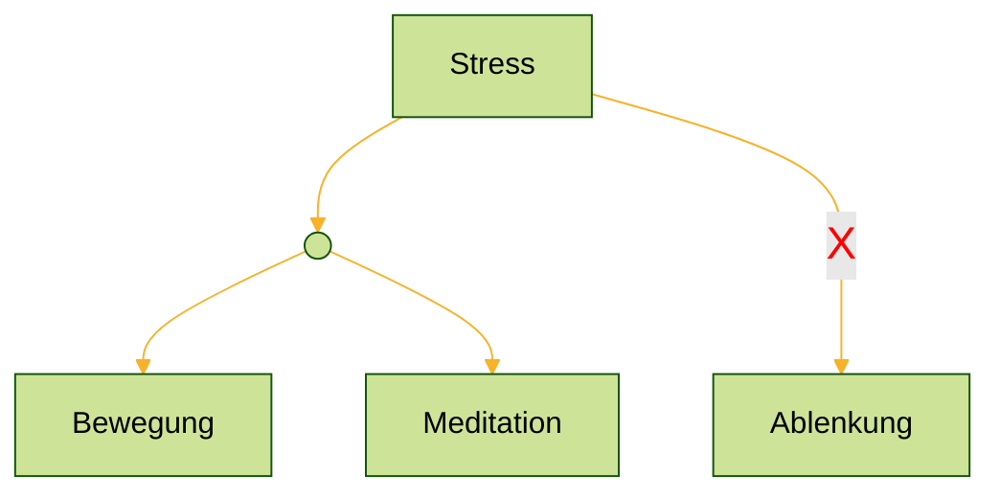

# Tägliches Mantra
- Lao Tzu - The Art of not Trying
	- Gehe mit der Entropie
- Dienst <u>an</u> der Sache
- Bewege Dich!
- Stress?
   ⟹ Bewegung und Meditation 
    =❌⟹ Ablenkung

- Weniger Kommunikation ⟹ Dafür besser und klarer
- Die Aufmerksamkeitslenkung und die Macht über die Deutung des eigenen Lebens sind die zentralen Faktoren meiner Freiheit.
- Defy Depression fuelling micro habits
- Ordnung im Gehirn herstellen
- Pause 3 s before you response ⟹ regain your emotional control
- Ich möchte im Hier und Jetzt sein und an den konkreten Aufgaben arbeiten, die bei mir anstehen!
- Am Du zum ich werden.
- Tugenden: Klugheit, Gerechtigkeit, Tapferkeit, Maß.
- Tu was du sollst und sei ganz in dem was du tust!
- Versuche die Notwendigkeit/Pflicht des Augenblicks erkennen!
- Selbsttranszendenz: das Wahre, das Gute und das Schöne
- Sagen was <u>ist</u> und nicht sagen, was sein sollte.
-  We are adults and we can learn and build up the skills to not avoid, but to face and solve our problems!
- Follow your ADHD! - It's a super power!
- Sei dankbar! Erinnere dich täglich an die Dinge für die du dankbar bist!
- Denke an deine langfristigen Ziele: 
	- eingebunden sein in eine Gemeinschaft
	- eine tolle Partnerschaft und Familie!
	- Kinder
	- Die Welt zu einem besseren Ort machen!
	- Dienst an der Gesellschaft
- Nicht an der Vergangenheit festhalten.
- Sachverhalte nicht mehr übererklären. Weniger ist mehr. Lass deine Worte wirken. Kommuniziere klar, präzise und selbstbewusst.

# Issues
- Vom "Butterfly effect Denken" wegkommen.
- 

Das ist  seit Jahren ein großes Problem von mir
# Kommunikation 
- use elicitation: make statements instead of questions ⟹if the person needs to correct you, it gives you more information than by a question and more willingly/without any pressure 
	- need to correct a record 
	- making a statement afterwards: feels like they volunteering information 
	- no questions no security alarms 
	- reacting with disbelief: you getting even more information out
	- bracketing : giving a series like between march and may or between 39 and 59
	- how to start or continue a conversation on elicitation:
		- "so..." And start a little recap: "so you have been doing this for three years ", "so this are not the best job of getting things done for you "
		- "I bet..": "i bet that was interesting ", "i bet there were still some challenges there", " I bet you overcame a whole a lot to get at this point"
	- the more sensitive the information is that you need, the less questions you need to be asking 
- 3s Pause before Response to regain your emotional control 
- don't over explain. Be sure that your message is clear 
## Friedemann schulz von Thun 
https://www.youtube.com/watch?v=jPAjmlkXf48&t=33m00s

Aussage des Vaters von Friedemann:
> [!Aussage ]
> "Ich halte es für bedenklich, dass du jeden Abend versackst!"
### Sachohr
Es steckt ja eine Behauptung darin: Dass ich abends versacke.
#### Mögliche Antworten/Reaktionen:
- "Vater, was verstehst du unter Versacken?"
	- "Meinst du Alkohol?" "Oder was meinst du da?"
- "Ich könnte dir mal erklären, wie ich die Abende verbringe"
rein sachlich
### Selbstkundgabe Ohr
Damit höre ich, was der Sender von sich selbst preisgibt. 
- Ausgesprochen oder unausgesprochen.
- zwischen den Zeilen
- Vielleicht ist das das emphatische Ohr
#### Mögliche Antworten/Reaktionen:
- "Mensch Papa, machst du dir Sorgen über mich, oder bist du sauer auf mich?"
- "Erzähl mir mal, was in dir vorgeht!"

### Beziehungsohr
Das ist das empfindliche Ohr, was immer mitkriegt:
- Wie steht der Andere zu mir ?
- Was hält er von mir?
- Ist da ein Vorwurf drin?
- Eine Kränkung, eine Beleidigung?
- Finde ich mich wertgeschätzt, geachtet oder niederträchtig behandelt?
#### Mögliche Antworten/Reaktionen:
- "Ne Papa, so nicht mit mir! Ich bin zwar noch nicht volljährig, aber du kommst hier rein, ohne anzuklopfen, ohne guten Morgen, gleich mit einem Vorhalt, so nicht mit mir!"
### Appellohr
Der andere möchte einen nicht nur erreichen, sondern auch bei <u>einem</u> etwas erreichen. 
- Welcher Appell steckt denn darin?
#### Mögliche Antworten/Reaktionen:
- "Hallo Papa, was ist deine Idee?"
- "Wie sollte ich diese Zeit sinnvoll nutzen?"
- "offenbar engagierst du dich für mich!"
- "Was ist der Appell?"
	- "Dass ich früher ins Bett gehe?"
	- ↳ "Ja, aber das muss ja für etwas gut sein?"
	- ↳"Erzähl mal, was hast du da im Sinn?"

# Ich
- habe mich gerne und ich bin wertvoll ganz egal was Arooj denkt und sagt
- Ich habe meinen Wert und were mich nicht mehr unterwürfig zeigen
- Ich werde anderen nicht mehr hinterher laufen
- Ich wahre meine Grenzen
- Ich lebe im hier und jetzt und genieße das Leben in vollen Zügen, ich bin voll da
- Ich gehe raus unter Leute und bin gelassen
- ich kann meine Ängste überwinden, wenn ich im Hier und Jetzt bin
- Ich bin stolz, aufrecht, stark, selbstbewusst, strahle und sehe gut aus. Es gibt keinen Grund gebückt zu gehen
- Ich weiß sehr viel und kann mit meinem Wissen glänzen, wenn ich in mir Ruhe, mich nicht stresse und auf mich vertraue
- Ich kann darauf vertrauen, dass die Worte und das Wissen kommt, wenn ich es brauche und will.
  Ich muss auch nicht zu allem etwas sagen. Mein Wert hängt nicht davon ab!
- Ich habe es verdient gut behandelt zu werden und mich selbst gut zu behandeln.
- Ich habe es verdient tolle Menschen um mich und ein tolles Leben zu haben, so wie einen Abschluss zu machen.
- Ich habe ein Recht darauf ein sorgenfreies Leben leben zu dürfen.
- Es gibt keinen Grund mich provozieren zu lassen.
- Ich mache mich unabhängig von meinen Eltern, ich kann das.
- Es gibt allen Grund geliebt zu werden.
- Ich habe es verdient tollen Sex zu haben, denn ich sehe sehr gut aus und bin ein toller Type.
  ⟹ Ich kann stolz auf meinen Körper sein und muss mich für nichts schämen.
  ⟹Ich muss meinen Körper nur besser pflegen, mich selbst mehr lieben, selbst sicherer auftreten und das ausstrahlen.
- Ich werde geliebt, ich werde von mir selbst so sehr geliebt, ich muss nicht um Liebe betteln.
  Wer mich nicht respektiert und mich nicht gut und auf Augenhöhe behandelt, hat meine Zeit und meine Gedanken nicht verdient!
- Ich bin dankbar dafür, was ich habe, dass mich meine Eltern immer unterstützt haben, auch wenn sie massiv soziale und emotionale Defizite haben
- Ich bin dankbar, dass ich einen so tollen Freund wie den Mischa habe und will meinen Job sehr gut machen.
- Ich bin dankbar, dass ich so tolle Freunde wie Fredin habe, die mir soooo viel zugehört haben. 😍❤️
- Ich bin dankbar, dass ich einen so tollen Prof. wie Benno habe, der Wissen nicht hierarchisch sieht und immer lösungsorientiert ist. Ebenso bin ich froh, dass ich einen so tollen Betreuer wie Aritra habe.
# Schlaf
- kann ich mittlerweile ganz <u>gut</u> ⟹ Naja sei ehrlich! da hast du noch viel Arbeit vor dir

# ADHD

# Achtsamkeit und Meditation 
## Meditation 
- ich liebe Meditation 
### Erkenntnisse
#### 25-11-26
Hallo Maria,
ich habe deine Worte "manchmal hat man auch keine Lust [zu meditieren]" von gestern Abend etwas erforscht.

Das hatte ich ja vereint, dass es das nicht war.

Jetzt würde ich der Aussage schon zu stimmen, und sie mit etwas Kontext ergänzen bzw. das Wort "Lust" zu spezifizieren.

Wenn es mir gut geht und ich eben unter Tatendrang bin, dann wollte ich das gute Gefühl, dass mich selbstwirksam fühlen nicht "abdämpfen".
Mir sozusagen das zu "nehmen", in dem ich mich reguliere und mir damit etwas auferlege, nachdem Motto "ist mir doch lange genug nicht gut gegangen, ich muss jetzt die Zeit nutzen in der es mir gut geht und dabei produktiv sein, warum soll ich mir jetzt wieder etwas 'missgönnen', das habe ich ja mein Lebenlang gemacht" bzw. "ich kann mir das gerade nicht leisten, ich weiß nicht wie es mir in ein paar stunden oder morgen geht, jetzt muss ich die Zeit nutzen, um mir was gutes (langfristig oder auch kurzfristig) zu tun.

Obwohl ich gleichzeitig sehr lust hatte zu meditieren und ich weiß dass es mir gut tut.

Und mir insbesondere die Regulation der Hochs extrem hilft / helfen würde, eben weniger bis keine Tiefs mehr zu haben.
Das ist ja gerade das Hauptproblem bei ADHS / Borderline.
Dass man immer auch gerade bei den Hochs auf die Bremse treten muss, damit es einem dauerhaft besser geht.

und gegen diesen Drang und auch die innere stimme, die zum einen etwas gutes für einen will, aber auch noch anteile hat "du musst die zeit für etwas produktives nutzen, du hast genug zeit 'verschwendet' / warst lange genug nicht in der Lage etwas zu tun / krank, du kannst es dir nicht leisten 'müsiggang' zuüben".

Ich weiß das genau eben der Müsiggang (nicht negativ gemeint), wieder langsam und Achtsamkeit hineinzubringen sehr wichtig ist, um eben den Überblick zu behalten, dass es mir dauerhaft besser geht und ich mich die Gesundheit spüre.
Und gerade da ist die Meditation wichtig.

Und diesen Schalter umzulegen, braucht noch Zeit. Prinzipiell weiß ich es, hab ich es verstanden.
Es ist aber genau diese Schwierigkeit auch dem guten Tatendrang erstmal zu widerstehen.
## Achtsamkeit
### why you can't finish simple tasks
https://youtu.be/kQtV5IycoEo?si=qeQa8RoThrwcRFXN
#### Reason
- ADHD or stress and distraction ⟹ the finishing process falls through the cracks
- the brain never fully encoded the act of finishing
	- start and finishing a task involve different brain processes 
	- brain is quite good at initiating activities
	- maintaining attention long enough to complete them, here the things get complicated
- working memory can only so much at once
	- if something interrupts and the attention gets pulled to something else, your're working memory drops the original task before you finished it
	- it thinks you finished it, because you started the sequence but the follow through never happend
	- the task was abandoned mid stream
- the prefrontal cortex is like your project manager.
	- ↳it helps you focus, sequence steps and even see tasks through.
	- ↳ but when it gets overloaded, by mental health issues or too many distractions, its ability to track where you are in the sequence breaks down.
- the basal ganglia deep inside your brain is like your autopilot system. 
	- ↳It's excellent at helping you initiate routine actions
	- ↳ but autopilot isn't wired to guarantee that you'll finish the action
- Without enough attention from your prefrontal cortex the sequence get cut short. Your brain logs the start, but the completion never happens.
	- ↳ that creates an open loop. The task is hanging in the background incomplete
	- ↳ later on you feel unsettled or second guess yourself, because you never marked it off as done.
- We are in a task switching culture. Our brains weren't designed for constant interruptions of phones, emails and notifications.
	- ↳ each switch drains focus from the task at hand
- there is attention fragmentation, even when nothing urgent is happening we carry background noise in our heads. The mental load of daily life.
- stress and overload when stress hormones stay high the brains ability to encode and complete tasks weakens.
#### Paradox

> [!Paradox]
> The more routine a task becomes the less conscious attention you give it.

You are not standing there focused on turning off the stove. You're already planing your next move. And that's exactly when the final step can get dropped.

#### How do you train your brain to actually finish what you start?

> [!Solution]
> Give your brain better instructions. Layering cues and rituals that lock in completion.

Five strategies that are simple, practical and rooted in how your brain works:
1. Anchor tasks to your senses.
	- Narrate the action as you do it!
	- <u>Example:</u>
		- When you turn off the stove: 
		  "I am turning off the stove!"
	- By speaking while your body is moving, You're engaging both sound and motion.
	- Your body feels the action, your ears hear the words and your brain links them together.
	- This dual input is called ==***sensorimotor attention***==, makes it much harder for the action to slip away unnoticed.
		- ↳ Instead of drifting into autopilot you're holding the task in conscious awareness to finish the task.
2. Point and confirm: This one takes sensory anchoring a step further by adding an intentional gesture
	- <u>Examples:</u>
		- After you turn something off:
			- ↳physically point at it and ==say "***off***"==
		- Close a cabinet door: 
			- ↳Touch the door and ==say "closed"==
	- The active pointing or touching creates a closure signal, a moment that tells your brain: This is done!
3. Use Anchor Objects: Use your environment as a memory aid.
	- <u>Examples:</u>
		- After turning of the stove you might place a dish towel across the knobs.
		- After locking the door you can put a sticky note on the frame that you only remove once the lock is checked.
	- These props works as visual anchors, physical cues that confirm that the task is complete.
	- Instead of relying only on your working memory you've externalised the reminder in your surroundings
	- Anchor objects reduce mental load and give you a visible receipt that the job was finished.
4. Building a shutdown ritual: Turn them into a part of a fixed sequence.
	- <u>Example:</u>
		- Every time you leave the house, you might follow the same order:
			1. keys
			2. lights
			3. stove
			4. lock the door
		-  If you repeat a routine in the same way your brains habit system located in your  basal ganglia starts to automate the sequence for you.
		- ↳ you don't have to rely as heavily on working memory or willpower to remember each step. Instead the habit loop itself carries you through to completion. And over time thiskind of ritual turns follow-through into something that you do automatically even when you're stressed or distracted.
5. Insert a Pause Buffer:
	- Take just 10 seconds to stop and scan.
	- <u>Example:</u>
		- In the kitchen look around:
		- Are the cabinets shut?
		- Is the stove off?
		- Is the sink still running?
	- That brief pause acts like a consolidation moment for your working memory.
	- It interrupts the rush from one task to the next, and gives your brain time to register what's been completed.
	- Without that pause your mind may jump ahead too quickly leaving steps unfinished.
	- ↳ with the buffer you create space for your brain to lock in the closure before you move on.

#### Why does this works?
They reduce the reliance on the working memory, which is short lived and easily distracted.
Instead these actions recruit stronger encoding systems that hold on to the task more securely:
- Narration uses language.
- Gestures use motor and sensory networks
- Anchor objects externalize memory into your environment
- Shutdown rituals turn completion into a habit
- Pause buffers give your brain time to register closure.
These don't just cover up distraction, they retrain your brain to complete the loop more consistently. 

### Bodyscan 
#### 1. Befriending your body
ADHD symptoms worsen by stress ⟹ connect with your body
#### 2. Self-compassion
Taking a <u>perspective</u> where you <u>care</u> for yourself, <u>not</u> being <u>hard</u> 
⟹self-forgiveness
#### 3. Remind yourself
- Intention
- feel of ugency
- interest, urgency, degree of challenge, novelty
- values
- goals
- better life for me and my beloved ones
- Pflicht des Augenblicks: Das Wahre, das Schöne und das Gute
#### 4. Refocus
1. Body connection
2. Imagine Accomplishment
3. <u>Just</u> the next smallest step

## Wolkenflieger
### 25-
# Beziehung 
- ich möchte eine ehrliche offene Partnerschaft auf Augenhöhe, ich wünsche mir dass man für einander da ist, sich versteht, sich vergibt und für die Träume des anderen einsteht. Ich möchte eine Familie und Kinder. Dafür möchte ich alles tun.
- Ja so sehe ich es ja auch.🙏

Es kamen da nur diese Gedanken/Gefühl 😢 gestern als ich drüber nachgedacht.

Es sind halt die zwei Seiten der Medaille und ich kann das manchmal nicht auseinander halten😢.

Es ist auch meistens eher noch "ich bin nicht gut genug"
Habe nicht 100% meine Gefühle unter Kontrolle wenn sie mir Vorwürfe macht oder zurückweisend ist. 

Ich dann eben nicht so stark über mir stehe wie ich das die meiste Zeit bin wenn ich versöhnlich und im großen und ganzen denke.
Da habe ich den Überblick über alles was war. 
Bin in mir ruhend, beruhigend und habe das Gefühl das ich alles was kommt ertragen und auf mich nehmen kann.
Da ich nicht bei meinem Schmerz bin, sondern bei ihr, ich hab so großes Mitgefühl für sie, ich spüre dann wie sie sich gefühlt haben muss bei diesen und jenen Momenten.
Ich fühle das alles gleichzeitig.

Ich kenn sie ja sehr gut.

Es tut mir auch so leid dass ich nicht so sein konnte wie ich es ja selbst wollte.
Ich hätte auch gerne gewisse Dinge getan.
Es war halt so schwer herauszufinden was mit mir ist und wie ich funktioniere. 
Mir ging es körperlich auch richtig schlecht.
Es geht mir auch immer noch ab und zu körperlich schlecht.
Da habe ich es aber geschafft es auf sehr selten zu reduzieren.

Ist halt auch nicht ganz so einfach mit den Medikamenten.

Ich fühle mich aber so schuldig, dass es mir nicht gut genug ging.
Ich nicht so gut an unseren und ihren Träumen arbeiten konnte.

Aber manchmal ist sie auch so unglaublich stur und interpretiert alles als nein...
Auch wenn es nur ein Realismus check ist oder ich erst Mal überlegen, planen und mir mit etwas Zeit lassen will, denn manchmal kommen die besseren Ideen erst mit der Zeit. 

Das ist für sie dann aber bremsen, geizig oder ein nein...

Und ich fühle mich dann auch schlecht und denke ich bin jetzt nicht schnell genug...

Dabei lässt sie sich mit manchen Entscheidungen auch Zeit...

Ich hab's echt nicht verstanden warum ich dafür dann diese Unzufriedenheit und Verachtung erfahren habe. 

Ich hab mir beim aussuchen der Teller die sie dann plötzlich wollte auch viel Zeit gelassen und mir voll viel Mühe gegeben...

Die teller meiner Oma sind mit der Zeit mehr und mehr kaputt gegangen, ich wollte neue und ähnliche.

Dann hab ich mich über zwei Wochen damit beschäftigt. Hab dann an nem Tag noch Läden abgeklappert. 
Hab Arooj diese Teller gezeigt auch wenn die nicht so sind wie die von meiner Oma. Dann sind wir nochmal zusammen hin, haben noch nach den kleinen Tellern geschaut, ner Lampe für die Küche, und nach nem Klo Deckel (Arooj have hätte am liebsten den einen klo Deckel gekauft der war recht teuer glaube fast 60€ und hatte eine Funktion weniger als einer der ein ganzes Stück günstiger war, ich wollte halt die Funktion verstehen - ich fand die wichtig - und hab mir bei so ner Entscheidung lieber Zeit gelassen... Ist bei der Toilette auch nicht so einfach einen anzubringen.. sie muss es dann ja nicht machen und kann das nicht absehen, aber ich spüre dann diese Ungeduld und als würde es mir um das Geld gehen... Und ja warum sollte man es nicht optimieren...)

Auch mit dem Bett...
Aber auch mit den Wäsche Körben..

Ich kam mir dann vor als wäre ich kein "Macher"... Ja ich fang halt nicht draus los an...
Und rede halt vorher gerne drüber und plane...
Als wäre das was schlechtes...

Ich hab nach Neujahr auch den Staubsauger repariert...
Wir hatten uns vorher gemeinsam um den Kabeleinzug gekümmert.
Und dann ist Arooj beim saugen, da war sie auch etwas aggro.. ich war halt krank an Silvester und sie ist halt am 1.1 zu ihrer Familie gefahren und wollte dann aufräumen... Sie macht das manchmal in so einer Art 🥴, da kommt man sich dann vor als wollte man es selbst nicht sauber haben.
Sie räumt dann rum und ist dann noch sauer. 

Ich hab den Schlauch gekürzt als sie weg war und hab den wieder angeklebt.

Hält bis heute. 
Und ich hab noch nen neuen Staubsauger in der Zeit im Aldi gekauft.
Obwohl ich krank war. Eigentlich bis sie wieder kam.

Ich wollte dann ja auch mit ihr sprechen, das hat auch geklappt, war aber voll aufgezwungen so hat sich das angefühlt und das Thema Bilder hab ich mir dann auch nicht getraut anzusprechen wie angespannt sie da wirkte...
Hat schon auch was gemacht dass sie da 4 Tage bei ihrer Familie war. 

Ich weiß gar nicht warum ich mich eigentlich so schlecht und Schuldig fühle...

Ich bin nicht schlecht.
Ich hab echt alles probiert und gemacht und mich immer wieder nicht genug gefühlt.
Und sie hat auch für diese Atmosphäre gesorgt...

Ich hab regelmäßig über Themen sprechen wollen...
War ihr aber dann so als wäre ich schwierig und bräuchte das.

Ich glaube sie hat einfach gar keine Ahnung wie schätzenswert ich bin. 

Ist ja auch total wirr bei ihr...

So sehr wie sie mich dann gerne hat und allen sagt wie toll ich bin und bzgl ihrer Freundinnen sagt, was die alles falsch machen und sie froh ist das wir uns haben und das so unkompliziert ist. 

Zack kurz darauf ist es anders...😵‍💫
Was stimmt denn nun...

Und ich vergesse dann immer was ich alles Gutes tue und bin. 

Und bin nur am mich erklären und rechtfertigen statt dass ich gerade zu mir stehe...

Und dann werde ich für das erklären noch gehasst.
Dass ich ja manipuliere und mich gerne reden höre 😭😵‍💫.
Ich immer Ausreden habe. 

Und was sollte eigentlich all ihr Verhalten wegen ihren Sachen.

Ich dachte am Ende wirklich ich hätte was falsch gemacht, wäre anstrengend und das Problem.

Nur weil ich halt mal Grenzen gesetzt habe und auch mal wütend war. 

Dann auch nicht verstanden habe was das Foto von ihrem Regenschirm sollte...
Ich komplett verwirrt war in der Woche.
Sie zwingt mir den Termin auf.
Ist dann noch sauer "weil ich mich angeblich gar nicht mehr melde". Geht dann einfach in die Wohnung und stellt es dann noch da als wäre ich selbst Schuld und noch daran Schuld dass ihre Freundin mit Kind warten musste... Warum auch immer die wegen dem Kram überhaupt du 3. Kamen 😵‍💫....
Im Endeffekt war es das Beste das ich nicht da war...
Ich wäre gestorben...
Als bräuchte sie Schutz vor mir gefährlichem Mensch.
Und dann habe ich noch narrative über die Nachbarin erzählt...
Ne habe ich nicht.
Dazu habe ich mich dann aber nicht mehr gerechtfertigt.

Und dann will ich mich am liebsten umbringen...
Das war echt keine schöne Zeit. 

Und ich bin so krank und vermisse sie so sehr und fühle mich noch schuldig.

Ich denke mir dass ich sie aufgehalten und behindert habe. 
Sie jetzt endlich frei ist und ihr Leben genießen kann. 
Ich sie nur belastet habe. 

Kein aktives Leben leben zu können.😵‍💫

Sie jetzt bestimmt jemanden anderes hat. 
Total glücklich ist und ne Familie gründet.
Wo ich ja auch das Problem war ...

Wenn ich ihr ne Mail schreibe...
Ne...
Bringt doch nix. Jedes Wort ist zu viel.

Jedes Wort ist falsch und wird als Vorwurf gesehen egal wie. 

Und dann werde ich eh wieder unterwürfig, schwach, bettle und habe schuldgefühle.

Daher werde ich nie bereit sein.🤷‍♂️
Danke 🥰🙏
Danke dass ihr für mich da seid.

Und ich nicht an allem schuld und schlecht bin.😭
Ich muss einfach einsehen dass ich zu lange zu nett war, meine Grenzen nicht gewahrt habe, nicht klar genug geblieben bin bzgl Aroojs Fehlverhalten und meinen Wert nicht gesehen habe
Sie ist doch nicht Frau genug, um dauerhaft dazu zu stehen dass sie was falsch gemacht hat und mich dann doch vermisst.

Zwei Mal hatte sie jetzt so nen wenige Tage andauernden Moment.
Aber muss ich dafür immer sauer sein und bestimmt...
Gibt's nix dazwischen...?
Ich weiß ja eh nicht was in und bei ihr abgeht.

Ich kann jedenfalls nicht auf sie zu gehen.
Mail schreiben mache ich nicht.

Keine Ahnung ob sie auf der Adventsfeier vom bot. Garten ist. 
Egal 🤷‍♂️ ich gehe trotzdem hin und halte halt Abstand
Mit mir zusammen Musik machen wollte sie und dann auch wieder nicht...
- Arooj ist mir zum Glück mittlerweile echt pups egal
## Umgang mit weiblichem Partner 
- https://youtu.be/M89JdPgsgwg?si=Z2nvtOUVKNpVSWIH
	- emotionale Sicherheit 
	- nicht tun:
		- sofort Lösung anbieten 
		- minimieren: Problem nicht klein reden.
		- ablenken: Gefühle wollen gefühlt werden. Ignorierte Gefühle schreien, gefühlte Gefühle flüstern. Raum geben. Was bereitet dir Sorgen? Aussprechen lassen was sie beschäftigt. Ihre Echten Gefühle verstehen. Körperliche Berührung hilft. (Wenn sie sie zulässt) Aktiviert parasympathicus, insbesondere wenn man selbst Ruhe ausstrahlt. Gelassenheit wirkt ansteckend und Beruhigend. Hat ja funktioniert (mit sehr schwer schwerer Anstrengung meinerseits) an dem Sonntag nach dem Konflikt mit dem Label. Eigene Anspannung verstärkt den Stress. (Ist eine große Last die auf Männern lastet...). Dann lieber sagen "ich merke dass ich selbst gerade gestresst bin, bitte gib mir 15 min, dann bin ich richtig für dich da.". Konflikte werden weniger persönlich, wenn man die emotionale Sensibilität von Frauen versteht.
		- emotionale Sicherheit ist erlernbar 
# Familie 
- 
# Psychiater
- körperlich sehr häufig gestresst 
	- ein Gefühl im ganzen Körper
	- fahrig
	- kann nicht lange auf den Bildschirm schauen 
	- komisches Körpergefühl 
	- hakelige und laggige Bewegungen
- bin in manchen Situationen wie in einem Film
- meine Filter sind echt schnell down
	- mich Stressen Geräusche 
		- insbesondere Gespräche, die kommen mir dann super laut vor
		- höre anderen Leuten bei deren Gesprächen zu wenn die am anderen Ende des Raumes sind
	- Gerüche 
	- Licht
	- Verhalten von Leuten, wenn die dann im Weg herum laufen 
	- Kurzzeitgedächtnis unter Stress ist wie ein Sieb 
	- Wortfindungsstörungen 
	- Bewegungen in der Peripherie, notifications
	- die Intensität von Geräuschen 
- bin ansich schnell gestresst, wenn viele Infos gleichzeitig kommen 
- bei Input habe ich häufig extrem viele verschiedene Assoziationen 
	- muss dann auch manchmal etwas zu häufig nachfragen in welcher Perspektive das jetzt gemeint ist
	- gerade bei Worten die verschiedene Bedeutungen haben
	- komme dadurch schnell von Gedanke zu Gedanke
		- ↳ Gedankenkreis und Emotionskreise
		- habe ich aber sehr sehr gut in den Griff bekommen 
	- Nebel im Kopf ⟹so viele Gedanken, weiß nicht wie ich die sortieren soll und wo ich anfangen soll⟹ Überforderung ⟹keine Energie ⟹früher  Ängste und Verzaghtheit Bedürfnis nach Ablenkung und Aufmunterung 
- Emotionen 
	- positiv 
	- negativ 
- Süchte: Medien und Ablenkungssüchtig, so hätte ich es damals beschrieben. Immer etwas nebenbei schauen oder hören müssen. Ruhe und Konzentration waren kaum zu ertragen.
-  Gleichgewichtsprobleme
- Zeitblindheit 
- muss Gedanken sofort notieren aus Angst/dem Wissen das sofort wieder zu vergessen 
- mehrfach checken ob ich auch wirklich alles dabei habe
- ich fange einfach Tätigkeiten an da sie mir ins Auge fallen, obwohl ich die letzte noch nicht ansatzweise abgeschlossen habe.   ⟹das führte dazu dass ich mehrere Tätigkeiten angefangen aber nicht beendet habe und dann vor einem Berg an unerledigten Sachen stand und vom Chaos in meinem Kopf überfordert war  ⟹depressiv und Energie los
	- Beispiel: heute morgen komme ich aus der Dusche und fange fast an die Spülmaschine auszuräumen und die Nudeln in den Kühlschrank zu packen obwohl ich noch nicht angezogen war.⟹ habe ich dann mit nem Schmunzeln registriert und mich erstmal angezogen 
- ich hab's auch nicht so mit ⁉️ vergessen was ich schreiben wollte 😂 ⟹Reihenfolgen

# "relativ früh harte Musik gehört "

Auch aus nostalgischen Gründen ist das immer noch mein lieblings Song.

Das war einfach mein Lieblingslied mit 12/13 🫣🤭.

Ich mag die bassline die kommt sehr gut raus.

Und die tolle Einlage von Marco.
Der Song passte auch so verdammt gut zum Buch "die Elfen", was ich damals gelesen habe.
Find's faszinierend, dass du so früh schon relativ "harte" Musik gerne gehört hast 😅
Klar, das ist noch relativ melodisch, aber weit entfernt  von "Hey Ho, spann den Wagen an" oder  von beliebigen Kinderserienintros, was Kinder ein paar Jahre vorher halt so mögen 😂
Relativ "harte" Musik?🤭

Ich hab zu der Zeit noch ganz andere Sachen gehört 🫣
Da war das eher soft 🍦.
Ich glaube es war auch eher 13/14.

Ich bin mir da mit dem Alter nicht immer so ganz sicher...

Ja nightwish war etwas später.

Das Album once ist ja von 2004.
Das macht mehr Sinn.
Ich war halt immer 2 Jahre jünger als die anderen.

Und in der Zeit ist so viel passiert/ging es so schnell.
Ich hab damals ja schon Slipknot gehört.

Deren erstes Album kam '98 raus. 

Iowa '01
Und ich hab mit 
subliminal verses '04 
damit anfangen
Limp bizkit deren album 
Chocolate starfish and the hot dog flavored water '00 raus kam kannte ich da definitiv schon.

Die kannte ich seit der 6. Klasse.
Ja hmm. 

Also Freunde aus meiner Klasse hatten ältere Geschwister.

Und die Leute aus meinem Dorf mit denen ich mehr zu tun hatte ab der 5./6. Klasse waren 1-2 Jahre älter als ich und hatten zum Teil nochmal ältere Geschwister.

Durch die habe ich in der 5. Klasse dann halt "böhse Onkelz" gehört
"hey ho spann den Wagen an" ist ja so was was man in der grund/vorgrundschulzeit gehört hat.
Mit 12 war ich ja in der 6. Klasse
Ich hab mit 12 ja auch das erste Mal von Alkohol gekotzt 🤣
Nightwish ist ja sprachlich gesehen eher sehr sehr sehr soft.

Da kommt ja nicht einmal fuck for.

Da stand ja nicht mal

"Parental 
Advisory
Explicit Content"

Auf den Album Covers, also "weich".

Wir haben uns beim Song "Hot Dog" von limp bizkit immer den Spaß gemacht die "fuck's" mit zu zählen.
Naja durch die Kirche ist man von klein auf mit Mord und Totschlag konfrontiert.
Meine Schwester die 7 Jahre älter ist hat ja immer Backstreet boys und David Hasselhoff gehört.

In den Ferienlagern waren immer die Schlager und FFH Musik angesagt.

Davon musste man sich ja irgendwie emanzipieren/abgrenzen.
Ich glaub ich hab das aber auch gebraucht.

Ich hatte eine sehr schlechte Beziehung zu meiner Mutter. 
Sie hat mir ja immer die Schuld gegeben wenn es mal Probleme in der Schule oder auf dem Schulweg gab.
"Ich war ne schwere Geburt" hat sie mir immer gesagt.
Ich hab sie gehasst.

Ich hab mit 15/16 angefangen ihr zu vergeben und hab versucht drüber zu stehen.

Was meine Schwester angeht.

Da dachte ich ja bis '21 noch ich war als Kind böse und an allem schuld. 

Kam mir schon etwas verarscht vor als mir dann mein Vater gesagt hat, dass sie immer die aggressive und eifersüchtig war die auf mich los ist.
Warum wurde ich dann immer als der Böse dargestellt.
Ich hab mich ja anscheinend nur gewehrt.

War auf dem Schulweg und sonst auch immer so... Ich hab eigentlich selbst nie Stress angefangen.
Es war aber ne Zeit lang jeden Tag etwas. 

Wenn ich mir überlege wie meine Mutter heute noch ist...
Die war früher ja schlimmer und ich hab es als Kind nicht mehr ausgehalten ihr extremes gejammert und Katastrophisieren...
Ich bin auch schon Recht früh "abgehauen".
Das war aber nicht so ganz aus nicht aufgehoben sein in der Familie.
Gut das war ich auch nicht.

Es war eher so ein süßer Gedanke nach heiler Welt.
Da bin ich mit meiner Watschelente los gegangen und wollte zu dem laufen nachdem ich meinen Kuschelhase benannt habe.
Da bin ich dann auch einfach über die Hauptstraße gelaufen bei uns.

Die war damals noch sehr stark befahren.
Erst ende '94 ist die Kinzigtalbrücke (A66) freigegeben worden.
Daran kann ich mich noch erinnern 😵‍💫.
Das war ein riesen Spektakel.
Da war ich 4,5
Ich hab halt auch früh als Kind sexuelle "Übergriffe" erlebt.
Das kam mir damals "normal" vor. 

Von gleichaltrigen und älteren. Insbesondere auch weiblichen.

Ich hab das alles als nicht so schlimm wahrgenommen. Bis heute. 
Es hat definitiv was mit mir gemacht.

Viel ertragen, Klappe halten, keine Grenzen für sich kennen, selbst Erniedrigung um Anerkennung zu bekommen und nicht ausgeschlossen zu werden, Teil von etwas zu sein. 
Auch durch extreme Dinge Anerkennung zu bekommen.
Schmerzen zu ertragen und Gewalt zu erfahren um Anerkennung zu bekommen.
Lieblingslied von nightwish möchte ich betonen.

Ich hatte damals kein einzelnes Lieblingslied.

Von jeder Band aber schon
Die Tage an denen ich keine Gewalt auf dem Schulweg erlebt habe, waren die Ausnahme.

Die körperliche Gewalt war gar nicht das Problem.

Eher die psychische.

Dass ich schon als Grundschüler auf mich alleine gestellt war. 

Ich hatte ja keinen Rückhalt meiner Eltern wenn es zu Problemen mit anderen kam.

Ich hab das von mir aus nie erzählt, da meine Mutter auf Probleme immer mit noch mehr Problemen reagiert hat. 
Das war überhaupt keine Hilfe.

Mein Vater "stell dich nicht so an, du musst dich halt schlauer verhalten"
Also musste ich irgendwie meine Dinge alleine regeln.
Ich wusste immer wenn was passiert bin ich alleine und niemand glaubt mir.
Ich hab ja auch im Bubenturnen Erniedrigung und Gewalt erfahren.

Das war für mich normal.

Ich hab das als normal empfunden erniedrigt zu werden wenn man sich ungelenk/behindert anstellt.

Ich war halt da immer die Oma.

Ich hab meine Namen aber immer mit "stolz" getragen und mich nicht dagegen gewehrt.

Ich habe auch strafen immer sehr pflichtbewusst angenommen.

Ich konnte da durch sehr früh 50 Liegestütze 🤣
Ich merke halt schon wie klar eigentlich auch damals war dass ich ADHS hatte.

Daher hab ich auch häufig Gewalt und Strafen erfahren.

Ich hatte es halt auch "verdient". So habe ich es zumindest gesehen und hab das immer so mit "Ergebenheit" angenommen.

Hat man so ja auch in der Kirche gelernt 🤷‍♂️🤣.
Also so hatte ich es verstanden.
Ich hab mich aber auch schon früh nicht wohl in meinem Körper und mich hässlich gefühlt.
(Ich weiß heute dass es mit dem ADHS zusammenhängt, meiner Familiensituation und vielleicht auch durch die frühkindlichen sexuellen "Erfahrungen")

Ich denke das körperliche hat mir nicht geschadet.
Eher dieses Gefühl durch mein Körpergefühl und das immer wieder hören dass ich ja behindert sei - wegen meiner motorischen Probleme - hat bei mir das Gefühl ausgelöst eh nix zu können.
Da habe ich mich dann schon sehr in Natur und Wissenschaftsbegeisterung zurück gezogen und ins Tagträumen.

Ich weiß aber heute auch dass meine motorischen Probleme die ich erst so langsam richtig auflösen kann viel mit dem ADHS zusammen hängen.
Das ist aber auch der Grund warum Chor nix mehr für mich ist...

Das ist psychisch und körperlich zu viel für mich.
Zu viel in Reaktionen anderer als Urteil über mich rein interpretieren.
Meine Körperwahrnehmung die ich jeden Tag und in jeder Situation aufs neue finden und sammeln muss. 

Auch keine gute Beziehung zu meiner Stimme.

Die im Chor einfach nicht so matched und das schwierige Feedback bei gefühlt 1000 anderen stimmen.
Da bin ich dann zu verspannt.
Da pass ich nicht so hin
Ich finde es halt echt nicht ganz so fair und nett von Arooj dass sie  obwohl sie zum Teil weiß wie es mir ergangen ist, diese Behauptungen über mich aufstellt/aufgestellt hat.

Sie weiß doch eigentlich wie sehr ich dann doch in diese Rechtfertigungen rein rutsche und meine Schuld sehe, obwohl ich das nicht so gemacht habe. 

Und wie viel harte Anstrengung es für mich ist es durchzustehen nicht people zu pleasen, zu erklären und rechtfertigen.
Es dann so als etwas böses dargestellt wird...
Mit dem ich manipuliere...

Und es dann auch so in ein licht rückt als hätte ich psychische oder physische Gewalt begangen...
Die einzige psychische "Gewalt" die ich begangen habe, war dass ich selbst so traurig, depressiv, ängstlich, leicht umzustoßen und zukunftsängstlich war.

Das ist aber auch erst im studium immer mehr geworden und auch in der Beziehung mit Arooj.
Ich war früher nicht so. 

Es sind aber schon ein paar Sachen hängen geblieben.

Gerade im Zivildienst und am Anfang des Studiums die gesagt wurden.
Das habe ich dann irgendwann geglaubt.

Ich hab mich schon immer Schuldig gefühlt wenn ich ein Geschenk von meinem Vater bekommen habe...
Einfach so. - meistens als Belohnung dafür dass ich irgendwas gemacht habe oder geholfen habe. 
Das war also eigentlich nicht einfach so...

Auch wenn ich ne OP im Krankenhaus hatte...

Das waren eigentlich Dinge die OK waren...
Dass ich da was bekommen habe...
Den hass meiner Schwester und das gejammere meiner Mutter das mein Vater Geld ausgegeben hat. 
Hätte ich mir dann aber echt lieber erspart und dann nix bekommen.
Es waren ja häufig so kleine Lego-Bausätze 🤷‍♂️.

Ich habe halt meinem Vater schon immer bei allem geholfen...

Holz machen, mauern, bohren, Reparaturen, Apfelernte, Kartoffelernte...

Andere haben fürs Rasenmähen etc immer Geld bekommen.

Habe ich nie und wollte ich auch nicht.
Hab das als selbstverständlich angesehen und gerne gemacht.

Wenn ich dann mal was geschenkt bekommen habe🤷‍♂️.

Musste ich mich für rechtfertigten...
Und hab mich auch noch schuldig gefühlt dass mein Vater "Ärger" bekommen hat. 
Den hat das natürlich nicht interessiert.
Warum auch.. ist ja sein Geld und ich hab ja auch immer etwas getan gehabt..

