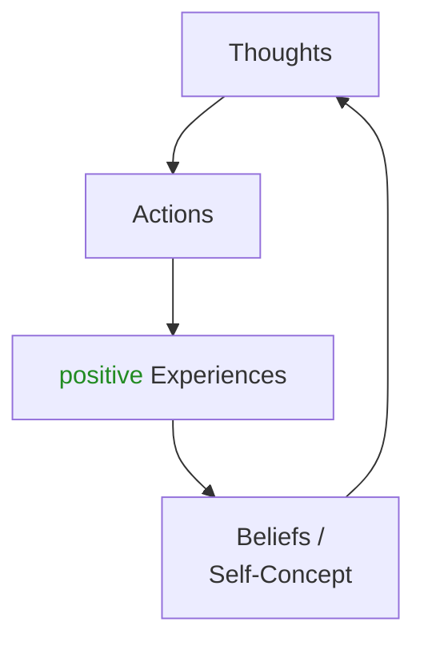
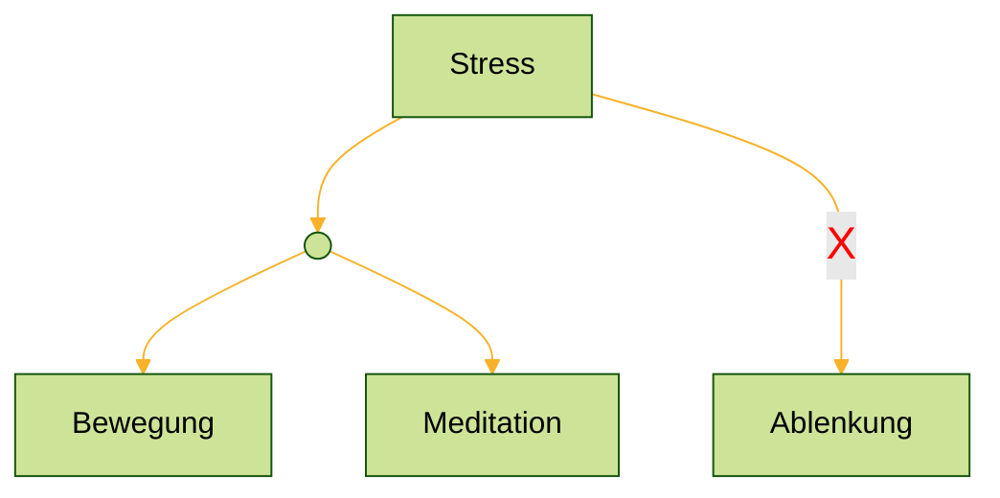
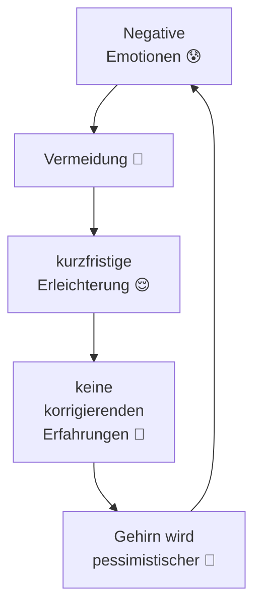

# Tägliches Mantra
- You can only ~={red}change=~ ~={LawnGreen}gradually=~
	- ~={DeepPink}push your comfort zone=~ only so far ~={LightBlue}you are capable of=~
	- ~={blue}do it this step=~ so often until it becomes ~={LimeGreen}easy=~ and ~={LimeGreen}normal=~
	- only then move on to the next step and don't push it to far
	- you will be ~={yellow}surprised=~ how~={LawnGreen} quickly=~ you ~={DeepSkyBlue}get used to=~ these ~={red}difficult things=~
	- often it's that ~={Crimson}initial fear=~
	- if you do anything ~={Teal}10 times=~ it ~={RedRed}no longer feel scary=~
	- this works because it gives you ~={LimeGreen}positive experiences=~ ⟹ ~={DeepSkyBlue}I can do this thing that used to be scary or difficult=~
		- ~={LawnGreen}you absorb this belief=~ that something that felt scary before feels normal and not scary anymore
		- over time your ~={Magenta}comfort zone expands=~ ![[Images/Therapie/Self-concept/comfort-zone.png]]
		- you ~={Tomato}no longer=~ have this ~={Tomato}fear=~ that was ~={red}holding you back=~
		- you ~={RedRed}don't=~ want to ~={yellow}set you up for failure=~! ~={RedRed}Don't=~ set a ~={orange}goal=~ that is ~={orange}too high=~! That you will likely fail
			- creates ~={RedRed}negative=~ experiences
			- this feeds in your ~={Crimson}limiting beliefs=~ and ~={red}insecurities=~ 
	- stretch your comfort zone, ~={green}growing=~ it ~={blue}like a muscle=~:
		- push the boat enough that it feels ~={pink}challenging=~
		- but ~={Crimson}not=~ impossible
		- also ~={DeepSkyBlue}continuity=~ is important
		- if you keep setting the same goals for yourself and repeatedly failing at them then that is to high 
			- ⟹ you're hurting yourself by doing this, because you are creating all these bad experiences
			- developing even more insecurities around it
	- its ~={LawnGreen}perfectly fine=~ to ~={blue}start small=~ ⟹ start with the smallest possible step, for where you at now
	- keep in mind that it takes more effort at first, but gradually becomes easier 
		- think of it like a ~={DeepPink}computer game=~, where you start small and gain experience in small steps and level by level
		- ⤷ so ~={Gold}break=~ ~={ForestGreen}your goals=~ ~={DeepSkyBlue}into levels=~ 

```mermaid
flowchart TB
%% flowchart LR
A[Thoughts]
B[Actions]
C[<span style="font-size:100%;color:ForestGreen;">positive</span> Experiences]
D[Beliefs /<br> Self-Concept]

A-->B-->C-->D-->A
%% D-->A %%
%% A-->B %%
%% C-->B %%
%% D-->C %%
%% <-->C<-->D<-->A %%


%% A~~~C %%
%% A~~~D %%
```
-  ~={underline}Example:=~ you want to create a ~={Gold}confident self-concept=~
	- starting with ~={Teal}thoughts=~:
		- you can use affirmations for confidence
			- I am confident and capable
			- I am happy with my life and living it the way I want
			- I am okay no matter what other people think of me
		- ~={blue}⤷ consistently=~ repeat them to yourself
		- ~={LightBlue}**most** of our thoughts run *automatically*=~ over and over, they become a habit, it's through this ~={purple}constant repetition=~ and that's exactly what you want to do as well, but ~={LawnGreen}in a positive way=~
		- you want to do it ~={Tomato}intentionally=~ ⟹ you are ~={MediumSpringGreen}feeding yourself=~ the ~={Gold}thoughts=~ ~={blue}that you want=~
		- use these affirmations and ~={Gold}say them out loud=~ ⟹ so that they become a part of your ~={LimeGreen}mantra=~
		- This give you the ~={Gold}temporary mindset=~ ~={RedRed}to take action=~
		- ⤷ this ~={RedRed}isn't about=~ ~={orange}changing=~ your personality
		- ⤷ it's about ~={LimeGreen}developing=~ your personality
		- <u>C.G. Jung:</u> "The qualities that you admire in other people indicate the untapped talents and potentials within yourself"
			- ⤷if you didn't have these things within you, that want to be integrated, that want to be developed in yourself, then it wouldn't resonate, you wouldn't care
			- ⤷there is a part of you that wants that as well, by ~={LawnGreen}using that as inspiration=~ it can help you develop parts of your personality that maybe up until now ~={Crimson}you've neglected=~
			- ⤷ There is some ~={LimeGreen}suppressed desire=~ within yourself that wants this and ~={red}if you don't let it out=~ then it's going to ~={Tomato}live in the back of your mind=~ and it's going to~={RedRed} make you resentful=~, it's going to make you ~={RedRed}self-sabotage=~ 
			- ⤷ really try to pay attention to these kind of things 
			- ⤷ create your dream life / your ~={LawnGreen}dream vision=~ ⟹ thinking of it as a dream allows you to create a vision that ~={green}isn't bound or restricted=~ by your current insecurities and limiting beliefs
				- ⤷ it's your current fears and limiting beliefs that keep you in the life you're living right now!
				- the person who lives this dream life their qualities that you currently lack is how you develop this version of yourself
	- you want to ~={DeepSkyBlue}tap into=~ this ~={LawnGreen}subconscious feedback loop=~ and develop these qualities in yourself through affirmations and ~={LimeGreen}collecting positive experiences=~ 
		- ⤷ repeat this again and again
		- ⤷ over time this will feed back into the beliefs you have and into your self-concept
		- ⤷ you then will be someone who is disciplined because they have all these experiences to prove it or someone who is resilient because the have overcome all these challenges 
		- ⤷ it will be a part of who you are
	- Ask yourself ~={RedRed}honestly=~: ~={LawnGreen}What is your dream?=~
		- all your fears and insecurities aside 
		- if you gave this your all your absolute focus unwavering dedication 
		- could you achieve this?
		- ⤷ probably! ~={RedRed}so why don't you?=~
		- ⤷ that's where you will find the work you need to do
	- Having a dream self-concept can help you ~={LimeGreen}develop=~ more into the person that will bring you closer to your unique potential in life who you are underneath that doesn't change. 
	- ⤷ It still expressed through these facets of your personality which are all developed differently 
		- if you are currently lacking in discipline and confidence then developing these qualities in yourself will only ~={DeepPink}bring you closer to=~ ~={LawnGreen}your true self=~ 
		- because you won't be holding yourself back because of fears and insecurities
	- you are not stuck as anyone self you can change at any time
- Sachlich sein aber heißt : Der Ichhaftigkeit des anderen niemals dienstbar sein.
- ~={Crimson}Don't=~ let your insecurities and fears make all your decisions
- <u>Affirmations:</u>
	- I have ~={ForestGreen}discipline=~ 
	- I can exercise ~={Tomato}continuity=~ 
	- I have ~={DeepSkyBlue}self trust=~
	- I have ~={Gold}confidence=~ 
	- I have ~={LightBlue}determination=~ - Entschlossenheit und Zielstrebigkeit 
	- I have ~={DeepPink}courage=~ 
- ich ~={Crimson}will=~ mein Abschluss schaffen!
- ich ~={LawnGreen}kann=~ meinen Abschluss schaffen 
- ich ~={ForestGreen}werde=~ meinen Abschluss schaffen 
- geh ~={purple}raus unter Leute=~
- sei im hier und jetzt und vergammele keine Zeit allein zu Hause 
- Deine ~={MediumSpringGreen}Zeit ist wertvoll=~, nutze sie auch dementsprechend und verschwende sie nicht. ~={Tomato}Zeit kommt nicht wieder zurück=~, sie kann nur einmal verbracht werden. 
	- das bedeutet auch dass Schlaf kostbar und wundervoll ist
	- respektiere dich selbst in dem du deine Zeit sinnvoll nutzt und dir etwas gutes tust
	- stell dir immer die Frage "~={pink}Tut dir das gut und ist das hilfreich?=~"
- morgens erstmal ~={DeepSkyBlue}Tale of House Hoslow=~ hören
	- bzw ein ganzes Album von ~={purple}Bloody Valkyria=~
- Arooj hat mich behandelt wie Dreck, als wäre ich böse und manipulativ 
- ~={Crimson}Limerenz=~ zu Arooj beenden 
- negative Gedanken:
	- ~={LawnGreen}anschauen=~ um sie loszuwerden 
		- anschauen und wahrnehmen 
		- nicht darin verlieren 
	- ~={DeepSkyBlue}Frage=~: ~={red}ist dieser Gedanke hilfreich?=~
		- sich selbst wieder das Steuer an deiner Gedanken bringen
		- wenn du dich wegen deiner Gedanken schlecht fühlst, dann hast du ihnen schon längst das Steuer überlassen 
		- mit dem Stellen der Frage macht man automatisch ~={Gold}einen Schritt zurück=~ und schaust dir diesen Gedanken objektiv an
		- ⟹bewegt sich automatisch vom ~={Tomato}Bereich des Gehirns=~ mit dem man mit den Gedanken ~={Tomato}fest steckt=~
		- ⤷hin zu dem ~={MediumSpringGreen}Bereich der bestimmt=~, was als ~={MediumSpringGreen}nächstes gedacht=~ wird
		- Erlaubnis diese Gedanken gehen zu lassen
	- Gedanken wie laufende DVD
		- hat sie Kratzer oder nicht? 
		- ⤷dazu muss man sie anhalten und aus dem DVD Laufwerk herausholen und sich anschauen 
		- dann ist er angehalten, die dvd draußen 
		- dann bist du im hier und jetzt 
		- dann kannst du dich entscheiden welchen Gedanken / welche DVD du als nächstes einlegen möchtest
		- ⤷nützlichen und bestärkenden Gedanken 
		- ins Handeln kommen und etwas an deiner Situation verbessern 
	- ständiges Wiederholen und Trainieren, jedesmal wenn ein solcher Gedanke kommt 
		- ernsthaft die Frage mit ~={Crimson}nein=~ beantworten 
		- dadurch werden diese Gedanken verschwinden 
		- wenn du das oft genug gemacht hast, dann wird das ganz leicht 
		- ⤷Aussortieren der Gedanken wird etwas ganz automatisches
	- ich ~={Crimson}bin nicht=~ meine negativen Gedanken 
	- nicht dazu verpflichtet diese Gedanken zu denken
		- ich habe ihnen nur irgendwann mal das Steuer überlassen
		- Steuer über meine Gedanken und über mein Leben zurück holen 
- <u>Arthur</u> 
	- keine zwei Nachrichten auf einmal
	- Logistik klären und Stimmung
	- gib mir Raum an der Unterhaltung teilzunehmen 
	- was ist deine Intention an mich (Arthur). Was willst du mit der Nachricht von mir?
- ich kann ein sehr guter Lehrer und Betreuer sein, 
	- da ich sehr gut auf die individuellen Persönlichkeiten eingehen kann. 
	- Ich bin gut darin Perspektiven zu wechseln 
	- ich habe ein sehr breites Allgemeinwissen 
	- ich habe viel zu geben
	- ich habe ein breites psychologisches Wissen 
	- habe selbst sehr viel durchgemacht und damit eine gute Expertise um Leute zu motivieren 
- erobere deine größte Angst und du wirst nicht glauben was für Türen für dich aufgehen.
- Prokrastination ist keine Faulheit, sondern ein emotionales Problem 
- meine Ängste sind ganz selbstverständlich und hängen stark mit dem ADHS zusammen. Sei deshalb nicht so hart zu dir!
- ich habe mich gegenüber Arooj immer klar ausgedrückt was meinen Zustand angeht, was unsere Beziehung angeht war ich auch klar. 
	- ich lag immer vollkommen richtig bzgl meiner Sorge wegen ihrem impulsiven Scheuklappenverhalten, mit dem sie immer alles einreißt
	- Beispiele habe ich genug, ebenso genauso viele die nicht mich betreffen sondern mit anderen waren. Ich muss diese aber auch nicht mehr auflisten, habe ich viel zu häufig gemacht 
	- sie ist dadurch unberechenbar 
	- auf ihre Familie kann man sich nicht verlassen 
	- Kinder mit ihr wären aufgrund ihres unberechenbaren Verhaltens und ihrem bestehenden Kontakt mit ihrer Familie unmöglich.
	- das geht nur wenn sie verlässlich dazu bereit gewesen wäre, so wie das auch die meiste Zeit klar zwischen uns war, die Kinder von ihrer Familie fernhält. Da sie aber immer wieder von ihrer Familie bearbeitet wurde und sich in die Angelegenheiten hat mit rein ziehen lassen und diese immer wieder Probleme gemacht haben, ist sie nicht verlässlich. Dafür gab es auch '24 wieder genug Beispiele 
	- ihre Unfähigkeit einen gesunden Gesamtüberblick auf unser Zusammenleben zu haben und nachsichtig zu sein. Sie ging immer in die extreme
- Fritz Künkel §17 der sinn des Lebens. Wichtigstes Kapitel 
- **Julia:** Ich kann nur wiedergeben, was ich in Therapien und Büchern gelernt habe:
	- Dass man, wenn es Richtung Burnout geht, durchaus alles runterfahren sollte. Jede Routine, jeden Reiz, jede Aktivität. Und ganz langsam wieder hochfahren und sich neu ordnen. 
	- Und wenn es eher Richtung Depression geht, dann gibt's nichts Wichtigeres als neue Reize. Rausgehen und lernen, dass neue Eindrücke gut tun und es das schädlichste ist, daheim zu versauern und dem Hirn keine neuen Anreize zu bieten innerhalb der eigenen vier Wände als den eigenen rasenden Verstand, der eine reine Abwärtsspirale ist. Das müssen nicht immer Menschen sein. Oder eben doch eine Aktivität wie Fotografieren. Mit jemandem reden. Und merken, dass man davor mehr Angst hatte als nötig und man sich besser fühlt als gedacht.  
- Man mache sich klar, daß die Bedrohung des Ich-Ideals für uns  alle unerträglicher ist, als die Bedrohung unseres Lebens . Wer sich  in seinem Ich-Ideal bedroht fühlt, benimmt sich wie ein Mensch in  Notwehr . Er fragt nicht nach den späteren Folgen, sondern er  schlägt blindlings um sich. Wer nur ein einziges Mittel kennt, das  ihn im Augenblick der Ich-gefahr retten kann, der wendet dieses  Mittel an, wenn es ihn auch später mit den denkbar schwersten Folgen belastet.
- ich kämpfe jetzt erst Recht und lass mich nicht mehr runter ziehen. Ich will kämpfen und jetzt erst Recht um meinem Vater, meiner Schwester und der verräterischen, vertrauensunwürdigen und untreuen Arooj zu zeigen. Ich kann was, ich bin nicht schwach!
- sie hat weaponized victim hood gegen mich benutzt 
- Arooj, mein Vater und meine Schwester haben mich genug schlecht gemacht 
- Benno hat lange genug in mich vertraut. Ich will liefern!
- Lao Tzu - The Art of not Trying
	- Gehe mit der Entropie
- Dienst <u>an</u> der Sache
- Motivation ⟸ Handlung   Motivation ↛ Handlung
- sei ganz in dem was du tust ⤷nur eine Sache gleichzeitig 
- ~={RedRed}keine Pornos=~ schauen 
	- es macht Unordnung in deinem Kopf
	- widerspricht deinen Werten
	- deinem Frauenbild ⟸ keine Objektivierung 
	- ist eine riesige Zeitverschwendung 
	- du verlierst dich 
	- es geht dir danach schlecht
	- du machst dein Testosteron Level kaputt
	- du reagierst dann schneller erregt wenn du schöne Frauen siehst
	- du über stimulierst dich
	- du blickst danach auf dich herab
	- du hast so viele schöne andere Sachen die du tun kannst. 
	- es widerspricht der Regel, dass du nur eine Sache gleichzeitig machen möchtest
	- du bist dann nicht voll bei dir
	- du willst echten Sex haben, und dabei voll bei der anderen Person und im Moment sein
	- es zerstört dein Bild von dem was dich erregt
	- mache lieber mehr sport, um dein Testosteron Level anzuheben 
	- so hast du auch weniger Drang dich bei innerer Unruhe anzufassen und zu stimulieren 
- Bewege Dich!
- Stress?
   ⟹ Bewegung und Meditation 
    =❌⟹ Ablenkung

```mermaid
--- 
config:
 theme: 'forest'
 themeVariables: 
  primaryColor: '#BB2528'   
  primaryTextColor: '#fff' 
  primaryBorderColor: '#7C0000' 
  lineColor: '#F8B229' 
  secondaryColor: '#006100' 
  tertiaryColor: '#fff'
---
flowchart TB
%% Nodes %%
	a[Stress]
	b[Bewegung] 
	c[Meditation]
	d[Ablenkung]
	e@{ shape: sm-circ, label: "Small start" }
%% Edges %%
	a --> e
	e --> b
	e --> c
	a -- <span style="font-size:150%;color:red;">X</span> ---> d
%% With extra "-" the edges are getting longer and the node is shifting to another node level%%
	
	%% a-->SubRoles %%
	
	%% subgraph SubRoles [Sub Roles] %%
		%% direction LR %%
		%% b[Playbook admins] %%
		%% c[Playbook managers] %%
		%% d[Playbook global viewers] %%
		%% b-->c %%
		%% c-->d %%
	%% end %%
```
- Weniger Kommunikation ⟹ Dafür besser und klarer
- Die Aufmerksamkeitslenkung und die Macht über die Deutung des eigenen Lebens sind die zentralen Faktoren meiner Freiheit.
- Defy Depression fuelling micro habits
- Ordnung im Gehirn herstellen
- Pause 3 s before you response ⟹ regain your emotional control
- Ich möchte im Hier und Jetzt sein und an den konkreten Aufgaben arbeiten, die bei mir anstehen!
- Am Du zum ich werden.
- Tugenden: Klugheit, Gerechtigkeit, Tapferkeit, Maß.
- Tu was du sollst und sei ganz in dem was du tust!
- Versuche die Notwendigkeit/Pflicht des Augenblicks erkennen!
- Selbsttranszendenz: das Wahre, das Gute und das Schöne
- Sagen was <u>ist</u> und nicht sagen, was sein sollte.
-  We are adults and we can learn and build up the skills to not avoid, but to face and solve our problems!
- Follow your ADHD! - It's a super power!
- Sei dankbar! Erinnere dich täglich an die Dinge für die du dankbar bist!
- Denke an deine langfristigen Ziele: 
	- eingebunden sein in eine Gemeinschaft
	- eine tolle Partnerschaft und Familie!
	- Kinder
	- Die Welt zu einem besseren Ort machen!
	- Dienst an der Gesellschaft
- Nicht an der Vergangenheit festhalten.
- Sachverhalte nicht mehr übererklären. Weniger ist mehr. Lass deine Worte wirken. Kommuniziere klar, präzise und selbstbewusst.
- Wenn Arooj der Ansicht ist, ich bin nur eine Option und sie könnte mich immer wieder weg werfen da ich eh wieder zurück komme, dann kann das nicht funktionieren.
	- So wie sie mich zu letzt behandelt hat, lasse ich mich nicht mehr behandeln.
	- Da gibt's auch nix zu rechtfertigen und Mitgefühl/Mitleid mit ihr zu haben. 
	- Sie hat ja auch keines mit mir und auch keinerlei Nachsicht.
- Ich ändere nichts an meinem Charakter und meiner Art.

- Ich bin Brückenbauer und ich bin froh ein solcher zu sein. 

- Ist mir egal was andere über mich denken und meine Handlungen bewerten.
- Ich habe jedenfalls keine Lust auf die Art von Menschen die so voller Verbitterung und spalterischem handeln sind. 
- Das zeigt mir auch wieder einen Punkt warum ich mich mich doch lieber fern von Arooj, ihrer Familie und dieser Kultur des Zwietrachts halten möchte.

- Es ist aber auch mal genug dass ich Aroojs Fehlverhalten und mein Leid darunter klein rede und sie in Schutz nehme.

Sie nimmt mich nicht in Schutz 

# Issues
- Vom "Butterfly effect Denken" wegkommen.
- 

Das ist  seit Jahren ein großes Problem von mir
# Kommunikation
- use elicitation: make statements instead of questions ⟹if the person needs to correct you, it gives you more information than by a question and more willingly/without any pressure 
	- need to correct a record 
	- making a statement afterwards: feels like they volunteering information 
	- no questions no security alarms 
	- reacting with disbelief: you getting even more information out
	- bracketing : giving a series like between march and may or between 39 and 59
	- how to start or continue a conversation on elicitation:
		- "so..." And start a little recap: "so you have been doing this for three years ", "so this are not the best job of getting things done for you "
		- "I bet..": "i bet that was interesting ", "i bet there were still some challenges there", " I bet you overcame a whole a lot to get at this point"
	- the more sensitive the information is that you need, the less questions you need to be asking 
- 3s Pause before Response to regain your emotional control 
- don't over explain. Be sure that your message is clear 
- Ich musste meinen Wert kennen lernen und lernen Grenzen aufzuzeigen. Dass ich Jahre lang zu viel mit gemacht habe. 
Ich hatte viele Barrieren in mir zu überwinden, um wieder zu heilen. Zu merken dass ich mir viel zu lange meine Deutungshoheit über mich, meine Taten und Identität habe nehmen lassen.
Wie es sein konnte dass ich jedesmal nach einem ihrer Phasen an meiner Integrität und meinen guten Absichten gezweifelt hatte.
Ich habe tatsächlich immer wieder gedacht, dass irgendwas an mir böse sein muss. 
Das hat mich total krank gemacht.

Es ist ein wunder dass ich noch lebe. 

Und trotzdem habe ich diese starke emotionale Bindung zu ihr. Es ist wie eine Sucht/Abhängigkeit. 

Ich war dieses Jahr so häufig ziemlich kaputt und kurz davor mir das Leben zu nehmen.

So gut wie jetzt ging es mir seit Jahren nicht mehr. 

Ich bin endlich mal fast dauerhaft klar im Kopf und komme innerlich zur Ruhe. 

Ich bin nicht böse und bin kein Täter oder gefährlich, auch wenn sie mich das hat glauben lassen wollen.

Ich habe sie so unglaublich gerne, insbesondere deshalb weil wir uns beide im Alltag so super verstanden haben, so viel gemeinsam haben uns in vielen Dingen so ähnlich sind, uns auch blind und schweigend verstanden haben, immer über all die Jahre unsere alltägliche Freude bewahrt haben.

Die Beziehung zu ihrer Familie ist aber nicht gesund und schadet ihr so häufig und wenn es mal die falsche Dosis Kritik, ein falsches Wort oder gar nur  eine falsche Formulierung oder einfach ihr innerer Glaubenssatz meine Worte negativ verstehen zu wollen und sie ist in eine langanhaltende Wut verfallen die innerlich schlummerte und dann nicht mehr aufzuhalten war.

Daran bin ich einfach verbrannt und hatte irgendwann all meine Energie und meinen Lebensmut verloren.

Ich habe mir immer Kinder mit ihr gewünscht, aber dafür hätte sie diese Phasen in den Griff bekommen und dafür in Therapie gehen müssen, darüberhinaus hätte die Hierarchie klar sein müssen, dass wir uns nicht durch übergriffiges Verhalten ihrer Familie hätten beeinflussen lassen und die keinerlei Zugriff auf unsere Kinder hätten haben dürfen, so lange wir nicht dabei sind. 
1. Schlechter Einfluss 
2. Kann man denen einfach nicht vertrauen, wie die Vergangenheit gezeigt hat. Ich hätte nicht gewollt dass die einfach in einem unbeobachteten Moment die Haare vom Kind abrasiern, weil die aus dem Mutterleib kommen und unrein sind. Arooj hat immer gesagt ja auf keinen Fall, aber dann hat sich das Gift ihrer Familie doch immer wieder eingeschlichen und sie hat Aussagen übernommen und wurde weich geklopft. Geht nicht...
## Friedemann schulz von Thun
https://www.youtube.com/watch?v=jPAjmlkXf48&t=33m00s

Aussage des Vaters von Friedemann:
> [!Aussage ]
> "Ich halte es für bedenklich, dass du jeden Abend versackst!"
### Sachohr
Es steckt ja eine Behauptung darin: Dass ich abends versacke.
#### Mögliche Antworten/Reaktionen:
- "Vater, was verstehst du unter Versacken?"
	- "Meinst du Alkohol?" "Oder was meinst du da?"
- "Ich könnte dir mal erklären, wie ich die Abende verbringe"
rein sachlich
### Selbstkundgabe Ohr
Damit höre ich, was der Sender von sich selbst preisgibt. 
- Ausgesprochen oder unausgesprochen.
- zwischen den Zeilen
- Vielleicht ist das das emphatische Ohr
#### Mögliche Antworten/Reaktionen:
- "Mensch Papa, machst du dir Sorgen über mich, oder bist du sauer auf mich?"
- "Erzähl mir mal, was in dir vorgeht!"

### Beziehungsohr
Das ist das empfindliche Ohr, was immer mitkriegt:
- Wie steht der Andere zu mir ?
- Was hält er von mir?
- Ist da ein Vorwurf drin?
- Eine Kränkung, eine Beleidigung?
- Finde ich mich wertgeschätzt, geachtet oder niederträchtig behandelt?
#### Mögliche Antworten/Reaktionen:
- "Ne Papa, so nicht mit mir! Ich bin zwar noch nicht volljährig, aber du kommst hier rein, ohne anzuklopfen, ohne guten Morgen, gleich mit einem Vorhalt, so nicht mit mir!"
### Appellohr
Der andere möchte einen nicht nur erreichen, sondern auch bei <u>einem</u> etwas erreichen. 
- Welcher Appell steckt denn darin?
#### Mögliche Antworten/Reaktionen:
- "Hallo Papa, was ist deine Idee?"
- "Wie sollte ich diese Zeit sinnvoll nutzen?"
- "offenbar engagierst du dich für mich!"
- "Was ist der Appell?"
	- "Dass ich früher ins Bett gehe?"
	- ↳ "Ja, aber das muss ja für etwas gut sein?"
	- ↳"Erzähl mal, was hast du da im Sinn?"

# Ich
- habe mich gerne und ich bin wertvoll ganz egal was Arooj denkt und sagt
- Ich habe meinen Wert und were mich nicht mehr unterwürfig zeigen
- Ich werde anderen nicht mehr hinterher laufen
- Ich wahre meine Grenzen
- Ich lebe im hier und jetzt und genieße das Leben in vollen Zügen, ich bin voll da
- Ich gehe raus unter Leute und bin gelassen
- ich kann meine Ängste überwinden, wenn ich im Hier und Jetzt bin
- Ich bin stolz, aufrecht, stark, selbstbewusst, strahle und sehe gut aus. Es gibt keinen Grund gebückt zu gehen
- Ich weiß sehr viel und kann mit meinem Wissen glänzen, wenn ich in mir Ruhe, mich nicht stresse und auf mich vertraue
- Ich kann darauf vertrauen, dass die Worte und das Wissen kommt, wenn ich es brauche und will.
  Ich muss auch nicht zu allem etwas sagen. Mein Wert hängt nicht davon ab!
- Ich habe es verdient gut behandelt zu werden und mich selbst gut zu behandeln.
- Ich habe es verdient tolle Menschen um mich und ein tolles Leben zu haben, so wie einen Abschluss zu machen.
- Ich habe ein Recht darauf ein sorgenfreies Leben leben zu dürfen.
- Es gibt keinen Grund mich provozieren zu lassen.
- Ich mache mich unabhängig von meinen Eltern, ich kann das.
- Es gibt allen Grund geliebt zu werden.
- Ich habe es verdient tollen Sex zu haben, denn ich sehe sehr gut aus und bin ein toller Type.
  ⟹ Ich kann stolz auf meinen Körper sein und muss mich für nichts schämen.
  ⟹Ich muss meinen Körper nur besser pflegen, mich selbst mehr lieben, selbst sicherer auftreten und das ausstrahlen.
- Ich werde geliebt, ich werde von mir selbst so sehr geliebt, ich muss nicht um Liebe betteln.
  Wer mich nicht respektiert und mich nicht gut und auf Augenhöhe behandelt, hat meine Zeit und meine Gedanken nicht verdient!
- Ich bin dankbar dafür, was ich habe, dass mich meine Eltern immer unterstützt haben, auch wenn sie massiv soziale und emotionale Defizite haben
- Ich bin dankbar, dass ich einen so tollen Freund wie den Mischa habe und will meinen Job sehr gut machen.
- Ich bin dankbar, dass ich so tolle Freunde wie Fredin habe, die mir soooo viel zugehört haben. 😍❤️
- Ich bin dankbar, dass ich einen so tollen Prof. wie Benno habe, der Wissen nicht hierarchisch sieht und immer lösungsorientiert ist. Ebenso bin ich froh, dass ich einen so tollen Betreuer wie Aritra habe.
## Meine Probleme mit dem Schreiben / Arbeiten an der Thesis
- Ich habe mich extrem schuldig gefühlt in jedem Moment in dem ich etwas getan habe / versucht habe etwas zu tun. Für so vieles...
- Diese Schuld hat mich so unruhig gemacht und nahezu dissoziieren lassen.
- Ich habe mich in jedem Moment runter gemacht und das Gefühl gehabt ich kann es eh nicht machen.
- ich konnte mich nicht konzentrieren auch nur einen Satz zu schreiben.
	- dabei habe ich immer wieder vergessen was am anfang war
	- wusste nicht wie ich ihn formulieren sollte
	- der satz wurde immer länger
	- mir sind die passenden worte nicht eingefallen
	- ich habe über gestern und später nach gedacht, ob dieser Satz so überhaupt stimmt
	- dann etwas gelesen, ob der Inhalt so richtig ist
	- mich beim lesen verloren
	- habe mich abgelenkt.
	- habe angst bekommen und mich runter gemacht
- habe an meine Schuld und verfehlungen gedacht.
- konnte nicht schlafen
- ich habe Ängste gehabt, dass mich arooj ja eh wieder verlassen wird und ich dann auf der Straße landen werde
- man mich ja eh nicht gebrauchen kann
- meine Extreme innere Anspannung durch Masturbation versucht herunter zu regulieren.
	- ⤷ dafür habe ich mich dann wieder schlecht gefühlt und mich vor mir selbst geekelt
	- ⤷ hatte angst, dass Arooj mich dafür hasst und es wieder streit gibt
- All die Belastungen und Fehlentscheidungen.
- Meine Mut- und Energielosigkeit
- Den Ärger mit Arooj auch schon '23
- nicht zu wissen was ich mit mir und meinem inneren machen soll.
- Angst vor der Kommunikation, da ich mich nicht richtig ausdrücken konnte
	- währen ich mich versucht habe auszudrücken, hat man mich nicht verstanden
	- und dann habe ich mich nur noch mehr verloren
	- am ende war ich total ausgelaugt und demotiviert
- Ich konnte vor lauter Druck und Anspannung keinen Satz lesen ohne ihn 5 mal lesen zu müssen.
	- ob ich ihn dann wirklich verstanden hatte war dann auch nicht sicher
	- insbesondere hatte ich dann den gesamten Sinnzusammenhang des Absatzes vergessen
	- um so einen ganzen Text zu lesen hat das Tage oder Wochen gedauert, da ich nach nem Abschnitt schon Pause für mehrere Stunden brauchte
	- oder irgendwas mit dem ich dachte wieder Energie zu schöpfen, mir irgendwie Dopamin und Ablenkung zu holen
- Von jedem Geräusch und Gedanken abgelenkt zu werden.
- Die Orientierung zu verlieren, da ich direkt vergessen hatte, was ich eben noch gedacht habe oder vor hatte, wenn ich nur das Fenster gewechselt habe.

## Attribution und mich fertig machen
mit den anderen Nadeln vergleichen Öse und Länge der Nadel ⟹ eventuell Länge abschleifen   ⟹hat geklappt hab sie dann aber mit dem hammer zerstört als ich beim zweiten mal probiert habe die Öse mit einem Nagel etwas zu vergrößern. Sie ist dadurch gebrochen an der Öse. ich wusste es habe, es aber trotzdem gemacht, konnte es nicht lassen ist aber nicht schlimm, ich habe daraus etwas gelernt ich hatte dabei das erste Mal wieder das Gefühl "oh mein Gott ich habe etwas falsch gemacht und war kurz davor mich da weiter fertig und runter zu machen siehe PC etc." ⟹ der Fehler war nicht 100% bei mir und achtsam zu sein

⟹ sei ganz bei dir und ganz in dem was du machst.
⟹  lenke dich nicht ab und mache die Dinge die du eigentlich tun sollst/willst 

Ich bin wertvoll und habe ja trotzdem etwas sinnvolles gemacht.
Außerdem wusste ich es ja vorher, ich habe das absehen können. Ich hätte mich nur stoppen müssen. 
Und das hätte ich mit Achtsamkeit hinbekommen.🤷
Ich habe also die Fähigkeit etwas zu ändern und die Kontrolle über mich. 
Im Gegensatz dazu was ich in diesen Momenten immer gefühlt und daher auch gedacht habe. 

Außerdem habe ich daraus wieder etwas gelernt. Über mich, da ich dieses Gefühl seit langem nicht mehr hatte und ich konnte daran wachsen.🥳❤️

Darüber hinaus habe ich es geschafft die singer nadel die dabei war wieder zurichten und dann mit dem Feuerzeug zu härten.
Und es hat geklappt 🎆🥳❤️

## Myers–Briggs Persönlichkeitstest
- ich hatte mal diesen hier gemacht:
	  https://www.16personalities.com/de/kostenloser-personlichkeitstest
	  Der scheint darauf aufzubauen.
	- Es kam Aktivist, also ENFP heraus
	- [ ] mal etwas genauer damit beschäftigen, was das bedeutet
	- [ ] https://en.wikipedia.org/wiki/Myers%E2%80%93Briggs_Type_Indicator#/media/File:MyersBriggsTypes.svg
	      lesen
	- Bei dem E am Anfang kann ich mich nicht so entscheiden. Eigentlich habe ich von mir immer das Bild, dass ich I wäre. Aber da habe ich wohl die Realität verleugnen wollen und auch gegen mich gearbeitet.
	  Da ich ein paar dieser Eigenschaften als “negativ” wahrnehme. Also ich möchte eigentlich nicht im “center of attention” stehen. Vielleicht empfand ich das immer als Makel, egozentrisch, narzisstisch und es wurde mir als Makel angelastet. Ich habe das aber auch nicht mit Absicht getan und tue es heute auch nicht mit Absicht, ärgere mich eher darüber. 
		- **steht aber auch hier:**
		- Menschen mit dem Persönlichkeitstyp ENFP (Aktivisten) sind richtige Freigeister – aufgeschlossen, offenherzig und weltoffen. Dank ihrer lebhaften, optimistischen Einstellung zum Leben fallen ENFPs in jeder Menge auf. *Aber obwohl sie der Mittelpunkt jeder Party sein können, geht es ihnen nicht nur darum, sich zu amüsieren. Solche Persönlichkeiten sind sehr tiefgründig und haben ein starkes Verlangen nach sinnvollen, emotionalen Beziehungen zu anderen*.
	- nach wikipedia wäre ich auch eher J
	- Ich mag auch keine “fast-paced environment”, das überfordert mich eher. Ist aber auch von der Situation abhängig und ich weiß nicht, ob man ein Festival als eine solche Umgebung bezeichnen kann, denn da ist man eigentlich vom “fast-paced” ausgenommen und kann alles um sich herum fließen lassen und mitschwimmen.
### Primary **ENFPs** Cognitive functions
#### Extraverted Intuition (Ne):  trifft zu 💯% zu
- **abstract thinking** over concrete thinking. It also makes them focus more on the future than the present moment.
		- see the world as a place filled with boundless opportunities. Besides making them curious and energetic, _Ne_ also pushes ENFPs to explore things **outside of their comfort zones**
		- **excellent brainstormers** and **natural-born idea generators**: They take great pleasure in bouncing off ideas, daydreaming, and discussing theoretical concepts, even if they have no real-world application.
		- This ability to think creatively also makes ENFPs open-minded and non-judgmental, as they’re able to see **multiple points of view at once**. They also naturally see the ways in which everything in life is interconnected.
		- supportive and empathetic
		- Instead of intuitively feeling other people’s emotions, ENFPs tend to show [cognitive empathy](https://www.inc.com/justin-bariso/there-are-actually-3-types-of-empathy-heres-how-they-differ-and-how-you-can-develop-them-all.html). They take time to hear others out and see things from their perspective.
			- **Cognitive empathy** is the ability to understand how a person feels and what they might be thinking. Cognitive empathy makes us better communicators, because it helps us relay information in a way that best reaches the other person. 
			- **Emotional empathy** (also known as affective empathy) is the ability to share the feelings of another person. Some have described it as “your pain in my heart.” This type of empathy helps you build emotional connections with others. 
			- **Compassionate empathy** (also known as empathic concern) goes beyond simply understanding others and sharing their feelings; it moves us to take action, to help however we can.
			- würde eher sagen ich hätte **Compassionate empathy**
#### Introverted Feeling (Fi)
- Thanks to the auxiliary ENFP function, _introverted feeling (Fi)_, they are **authentic people with strong moral values**
- tend to **trust their feelings and follow their moral beliefs** when making decisions
- highly individualistic, and with each decision they make, their goal remains the same—**staying true to themselves**. hmm 🤔
- refine their opinions and make thought-out decisions after exploring all the possibilities. 
- anything but pushovers: they simply take time to make informed judgments.
- non-conformist attitude: They prefer marching to the beat of their own drums instead of acting based on their family’s expectations or social norms.
- Because of their tolerance and focus on authenticity, ENFPs are true **free spirits who avoid putting themselves (and others!) in boxes.**
#### Extraverted Thinking (Te)
- tertiary ENFP cognitive function, meaning that ENFPs don’t have access to it until they mature, whether by aging or through self-development.
- Through _Ne_, ENFPs gain dozens of insights and ideas every day. Because of this, ENFPs are often **inspired to try something new**, whether it’s a dish, a business project, or a musical instrument. ja definitiv
- Yet, there’s one issue that many ENFPs will relate to: no matter how driven they are, their plans and dreams don’t always become a reality. In fact, even when they have the resources, some ENFPs leave their ideas unrealized.
	- The **answer is simple**: their minds are always bustling with ideas, and ENFPs are prone to quickly abandoning their plans for something new.
	- It is for this reason that _Te_, which ~={green}focuses on <b>organization</b>, <b>structure</b>, and <b>efficiency</b>,is crucial for ENFPs.=~ As ENFPs develop their Te, they finally learn to follow through with their plans, leading them to a much happier, more fulfilling life.
#### Introverted Sensing (Si)
- ~={cyan}**abstract thinkers with a visionary mindset**=~—they don’t see the world for what it is but instead see what it _could_ be. ~={orange}Den Nebensatz bezweifle ich allerdings!=~
- _introverted sensing (Si)_, the function ~={red}mostly associated with the past and recalling details=~, is the~={red} inferior=~ ENFP cognitive function. 💯
- it primarily works in the background, which makes it difficult to spot this cognitive function in ENFPs
- _Si_ ~={red}limits=~ the possibilities that _Ne_ generates. Essentially, _Si_ helps ENFPs ~={green}realize which options are worth pursuing=~ and which aren’t by allowing them to tap into their past experiences
- while ENFPs are big-picture thinkers, _Si_ enables them to focus on details, giving them a ~={pink}**perfectionist streak**=~
	- This is especially prominent when they’re learning something new or working on a project.
### Shadow ENFP Cognitive Functions
#### Introverted Intuition (Ni)
- ~={orange}takes over=~ their primary function, _Ne_, ~={red}under extreme stress.=~
- open-minded, easy-going individuals. However, when their shadow kicks in, ENFPs can become rather **close-minded**, **skeptical**, and **judgmental**.
- ~={red}aren’t used to following their intuition=~, as they typically trust their feelings and morals.
- However, in their shadow, ENFPs ~={red}make false connections between events=~ and get hunches that **aren’t always correct**.
	- In such states, many ENFPs~={red} struggle with the feeling that something bad is going to happen,=~ which makes them lose their optimistic attitude.
		- So true!!!
	- ENFPs often become distrustful of other people. They can also become ~={orange}quite self-righteous,=~ as they **trust their intuition blindly** and ~={yellow}disregard other people’s opinions.=~
		- hmm kann sein.... 
	- with an activated shadow often behave similarly to [unhealthy INFJs](https://mypersonality.net/blog/article/unhealthy-infj). That’s because their shadow functions are the same as the primary [INFJ cognitive functions](https://mypersonality.net/blog/article/infj-cognitive-functions), leading them to display many of the unhealthy traits seen in INFJs.
#### Extraverted Feeling (Fe)
- independent thinkers who trust their own judgments. However, their second shadow function, _extraverted feeling (Fe)_, ~={orange}can make them **doubt themselves and turn to others for validation**.=~
-  _Fe_ makes ENFPs insecure about their ability to make decisions. This leads them to adopt a [mob mentality](https://www.webmd.com/mental-health/what-is-a-mob-mentality). This isn’t comfortable for ENFPs, who are naturally used to going against the flow.
- lose confidence in themselves and become self-critical. Although they’re caring individuals, _Fe_ can also make them _too_ ~={pink}concerned with other people’s feelings.=~
- make decisions **based on other people’s needs and expectations**. 💯
- catering to other people and seeking their approval ~={red}creates an inner conflict=~ in ENFPs.
- They ~={red}can’t stand =~being ~={red}inauthentic=~, yet their shadow _Fe_ ~={orange}pushes them to please others=~.
- Ultimately, this can lead them to become ~={Gold}disappointed in themselves.=~
#### Introverted Thinking (Ti)
- Besides helping ENFPs turn their dreams into reality, ~={Tomato}_Te_=~ also helps them **organize their thoughts and ideas**. To do so, they share them with other people or otherwise express them, as _Te_ is an extraverted function.
- when ENFPs use their shadow _Ti_, they ~={red}tend to withdraw from other people=~.
   Instead, they turn inwards in an attempt to organize their thoughts. This often leads them~={Tomato} to sink into self-isolation=~ and become overly focused on facts.
-  may also~={orange} act =~completely ~={Gold}out of character=~ with those around them. They ~={pink}can become **cold**, **calculated**, and **reserved**.=~
- 
# Schlaf
- kann ich mittlerweile ganz <u>gut</u> ⟹ Naja sei ehrlich! da hast du noch viel Arbeit vor dir

# ADHD
## [Wie ADHS Ängste auslöst](https://youtu.be/H7elTgbLE1g?is=3E0sjKJN_6yesU8e)

## Wolkenflieger
### 26-01-09
- Ich 
	- 35  
	- Diagnose Julie '24
	- regelmäßig hier
	- 20 mg ritalin adult 1 mal täglich
	- hab 2 wochen Medikationspause gemacht ⟹ war super
	- hab gemerkt, wie sehr schlaf hilft
	- mein Problem momentan nachts nach 1h wach zu werden 
- Simon:
	- wie motivation?
- Nadine:
	- autismus / Hochsensibel
	- richtige dosierung Medikament?
- Kian:
	- wann merkt man es ist die richtige dosis? unterschied?
	- länger als 30 min konzentration
- ruth:
	- was sie beschreibt ist ADHS "typisch frau"
- songül:
	- Achtsamkeit und Meditation
- Autismus Diagnose:
	- ist mNn etwas schwieriges, der Autismusbegriff wurde über die Jahrzehnte immer mehr aufgeweicht.
	- Ebenso Hochsensibilität und Hochbegabung
	- meiner Meinung nachlässt sich das alles recht gut mit ADHS beschreiben/erklären 
- Kein Bock Themen
	- geht allen so
	- Festen Zeitpunkt
	- ne feste Zeitdauer ich mach jetzt einfach 1h 
	- und dann wird das einfach gemacht
	- echte Pausen machen 
	- kein muss
- kian hat da doch schon einen guten maßnahmen katalog
- Kati:
	- leider keine kinder, daher kann ich nicht zu 100% mitreden
	- wie alt ist der älteste?
	- Wie genau war die rosenkohl situation? ⟹ auf der Arbeit wird man ja auch so häufig unterbrochen ⟹ zb. büro
- Beim Nachschießen nimmst du dann aber etwas unretardiertes?
### 25-12-05
- Lukas:
	- Diagnose seit juli 24
	- 35 jahre alte
	- ich bin regelmäßig bei den Treffen dabei und darüber sehr dankbar
	  ⟹ ich habe dadurch sehr viel gelernt 
	- Medikament: Ritalin Adult 
		- vorher 2x20 mg genommen 
		  ⟹jetzt nur noch 1x20mg morgens ⟹ reicht mir vollkommen und klappt auch mit dem Schlafen ganz gut
		- ⟹kann ich gut nachvollziehen, was Andreas bzgl medikation sagt
		  ⟹hängt auch stark mit dem Schlaf zusammen
		- ⟹ musste mir kurzfristig einen neuen Psychiater suchen und das hat gut geklappt.
	- Erik bzgl. soziale Interaktion:
		- bei mir geht die Konzentration nicht runter
		- ich kann eher nicht immer so gaaanz kontrollieren, was ich sage und bin etwas zu aufgedreht
	- Christian (später auch Tina) Stimmlage:
		- Verteidigungssatz macht etwas nur schlimmer
		- kenne ich sehr gut ⟹ problem ist dabei, dass man sich zusehr von der Aussage / Frage / Vorwurf einfangen/fesseln lässt und da man die perfektionistische neigung hat (ängstliches kreisen um sich selbst), ist man sofort in der Verteidigungshaltung
		  gibt der aussage des anderen gar keinen Raum lässt diese nicht wirken
		  das gegenüber fühlt sich nicht so wahrgenom
		- lautstärke kann ansteigen
		- im nachhinein so viel arbeit die scherben wieder aufzukehren... 
		  ⟹ich hab es ja nicht so gemeint
	- mein Them Kommunikation:
		- Überkommunikation
		- bin sehr kompetent und habe viel wissen, allerdings durch meine Kommunikation geht das leider etwas verloren und kommt anders rüber
		- klarer
		- prägnanter
	- Ronja 
		- 35 
		- medikinet
			- auch probleme damit
		- AuDHD:
			- würde ich nicht drauf gehen ⟹ habe ich mich schon selbst intensiv beschäftigt. Das ADHD füllt das alles schon ganz gut aus
	- Jakob:
		- folge die Paartherapie ⟹ irgendwas mit ADHS
		- irgendwas mit Loch
		- fühlt die Aussagen von seiner Frau als angriff in seine Autonomie
- Thema Kommunikation
	- ich möchte lernen klarer zu kommunizieren
- Christian:
	-  Tipp: Negativer Hyperfokus!
	-  3s Zeit nehmen
	- kein Mann frau ding
	- akkumulation von problemen über die Zeit und dann wird es einem so als großer Berg dargestellt,⟹ tinas lösung ist gut
	- geht nicht um den Schwamm und um die Lösungen
	- Tonlage: 
		- niemals mit ADHS entschuldigen, das funktioniert nicht, dann wird das einem auf dauer zur last gelegt
		- Zeit für sich selbst nehmen. 
		- die sache von sich selbst trennen.
		- da ist ja auch vieles bei deiner partnerin und das hat nichts mit deinem wert zu tun
	- Wie clemens es sagt: 
		- ADHS ist häufig verknüpft mit Perfektionismus
	- Benina:
		- klarer sagen was man wirklich sagen wollte, es kommt nicht immer das an obwohl man es dachte das man das doch klar gesagt hat.
## Improve Focus: Attentional blinks
[Huberman attentional blinks ](https://youtu.be/LAwBdRR4wQk?t=19m40s)  
- searching waldo ⟹ when you find him your brain celebrates a little bit, you pause ⟹ in this moment your attention is drawn away ⟹ you are not able to see another waldo sitting right next to it ⟹because you are over focusing on something
	- ↳attentional blink
	- ADHD
		- ⟹can focus on things they care much about 
		- ↳ so maybe they have these attentional blinks more often 
		- They need this property we call open monitoring.
			- Can be accessed through Panoramic vision 
			- ↳Can recognise multiple targets
			- ↳can be trained 
- Right after a blink we reset our perception of time
- The rate of blinking is controlled by dopamine
	- ⟹dopamine is controlling attention
	- ↳blinks are related to attention and focus
	- ↳you constantly modulating and updating your perception of time
	- ↳ fortunately it is something you can control 
	- blinking and dopamine are inextricably linked, they are working together to control your attention
- ⟹ improve the ability of focus by training/learning how often to blink and when and how to keep their visual focus on a given target 
- a short period of ***focusing on a visual target*** 
	- allowed this school children to ***focus on other types of information***
	- <u>significant component:</u> controlling the shutters on their eyes
	- <u>method: </u>
		- focus for a minute on an object very close to their eyes, they where allowed to blink.
		- then on something further away
		- before they did some sort of physical movements with the kids
	- eyelids are there 
		- to regulate the amount of information going into your nervous system
		- to regulate how long you are bringing in information
		- in what bins
			- ↳ how widely or finely you are bining time is set by how often you blink
			- ↳ how widely or specific grabbing attention from the world is set by wether you are seeing things very specificly (squinting) like a cross hair or you are in this panoramic whole environment, fish eye lence or wide angle mode
- omega 3 fatty acids
- Phosphatidylserine
	- PS has been studied for its potential in improving memory, learning, and concentration. Supplementation with PS has been shown to have no effect in enhancing cognitive performance in the elderly and individuals with cognitive decline

# Prokrastination
## [Warum dein Gehirn Prokrastination liebt?](https://youtu.be/hFTxgHzFKqw?is=5vjPjqSLz6xeMs6C)
- Die eigentliche Aufgabe des Gehirns: Dein Überleben sichern. Es stellt sich im Hintergrund die Fragen.
	- 🛡️Bin ich sicher?
	- ⚡Habe ich genug Energie?
	- ⚠️Droht Gefahr?
- Dafür macht es durchgehend Vorhersagen
	- Dabei ist das oberste Gebot Energiesparsamkeit 
	- Ein Organismus der verschwenderisch mit Energie umgeht, der überlebt nicht lange
	- Lohnt sich diese Handlung? je nachdem wie die Antwort ausfällt, sendet es 
		- ✅Belohnungssignale 
		- oder ❌ Bestrafungssignale aus
	- Das ist dein Motivationssystem
> [!NOTE] Temporal Motivation Theory 
> %% <b>Motivation</b> = Erwartung ⨉ Wert  %%
> $$\text{Motivation}=\frac{\text{\textcolor{green}{Erwartung}}\times \text{\textcolor{green}{Wert}}}{\text{\textcolor{red}{Impulsivität}}  \times \text{\textcolor{red}{Verzögerung}}}$$
- ⤷ Temporal Motivation Theory
	- ⟹Welche Faktoren bestimmen, wie motiviert wir sind?
	- Signalisiert eine Handlung, dass sie etwas überlebensrelevantes bringt:
		- 🤝soziale Zugehörigkeit
		- 🍎Nahrung
		- ♥️Fortpflanzung
		- 💡Neue Infos
		- 🛡️Sicherheit
	- Dann markiert dein Gehirn diese Handlungen als lohnenswert/wertvoll und belohnt dich dafür mich Motivation, Vorfreude und Antrieb
	- ⤷ nach dem Motto gute Investition, mach das öfter
	- Damit sich die Investition aber richtig lohnt, muss nicht nur der Wert von dieser Handlung hoch sein, das Gehirn muss auch eine positive Prognose haben.
		- Wird das klappen?
		- Bin ich dem gewachsen?
		- Ist das realistisch?
	- ⤷ das ist die Erwartung, die Vorhersage des Gehirns, ob die wertvolle Belohnung auch tatsächlich erreicht wird und ob es sich daher lohnt unsere kostbare Energie hier zu investieren.
	- Je mehr beides gegeben ist, ein wertvolles Resultat und die Erwartung, dieses Resultat auch wirklich kommen wird, desto stärker ist das Belohnungssignal, das dein Gehirn sendet.
	- Kippt aber auch nur einer der beiden Faktoren, wehrt sich dein Gehirn
		- Erscheint der Wert zu niedrig, entzieht es Energie:
			- Unlust
			- Desinteresse
			- Langeweile
			- Müdigkeit
		- Ist die Erwartung pessimistisch, du fühlst dich der Herausforderung nicht gewachsen, mobilisiert dein Körper zwar oft zusätzliche Energie, aber diese Energie fließt dann nicht in die Aufgabe, sondern in den Impuls ihr auszuweichen.
			- Stress
			- Angst
			- Überforderung
	- Der dritte Faktor ist die Verzögerung also wie weit die Belohnung in der Zukunft liegt. 
		- Unser Belohnungssystem regiert deutlich stärker auf unmittelbare Belohnungen als auf entfernte
		- Es ist neurobiologisch belegt, dass das Gehirn verliert massiv an Motivation, je weiter die Belohnung in der Zukunft liegt.
	- Das Gehirn bewertet jede Handlung anhand von:
		- Erwartung 
		- Wert 
		- und Verzögerung
-  Wenn wir die Temporal Motivation Theory auf Prokrastination anwenden, dann wird klar, warum dein Gehirn sie so sehr liebt.
	- ⤷ eine schwierige Aufgabe sendet genau die falschen Signale
	- der **<u>Wert</u>** ist of sehr abstrakt oder indirekt
	- die **<u>Erwartung</u>** unsicher oder negativ, weißt nicht wo du anfangen sollst, bist nicht sicher ob du dem gewachsen bist und die Aufgaben erfordern extrem viel Energie
	- die <u>Verzögerung</u> bis zum Ergebnis ist riesig
	- ⤷ Hirn bewertet, das ist eine falsche Investition / lohnt sich nicht und sendet Bestrafungssignale aus. 
	- ⤷ f-MRT Studie ⟹ zwei separate Pfade
		- Amygdala & Insula ⟹ Wie unangenehm ist die Aufgabe? Prokrastination
		- Hippocampus & Caudate ⟹ Wie wertvoll ist das Ergebnis? Motivation
- Negative Gefühle ⟹ Ersatzhandlung
	- Prokrastination ⟹ zwei Dinge gleichzeitig
	- ⤷ Aversionspfad beruhigt sich, das Unbehagen fällt weg ⟹ Schmerz ↓
	- ⤷ Ersatzhandlung fühlt sich gut an ⟹Belohnung ↑
	- In einer Handlung die doppelte Belohnung
- Prokrastination ist keine Faulheit, sondern ein emotionales Problem 
	- Die meisten Leute glauben sie prokrastinieren, weil sie 
		- zu faul 
		- zu undiszipliniert sind
		- oder sich einfach nicht genug zusammen reißen
	- nichts davon trifft den Kern
	- Der Kern von Prokrastination ist ein emotionaler Prozess.
		- Es ist der Versuch deines Gehirns ein unangenehmes Gefühl los zu werden.
		- nicht die Aufgabe wird vermieden, die Gefühle werden vermieden.
		- primär ein emotionales Selbstregulationsproblem 
- Warum Prokrastination so universell ist, jeder Mensch kennt es:
  ⟹Aversion vermeiden ⟹ Belohnung ansteuern ⟹Energie sparen
- <u>Warum prokrastinieren manche mehr als andere?</u>
	- Wenn Prokrastination im Kern bedeutet unangenehme Gefühle zu vermeiden
	- Dann sind Menschen die ohnehin stärker mit negativen Emotionen zu kämpfen haben besonders gefährdet. 
	- Prokrastination korreliert moderat mit Depression, Angst und Stress
	- Depressionen können dazu führen, dass nichts mehr lohnend wirkt, das Gehirn registriert kaum noch etwas, als erstrebenswertes Ziel. $$\underset{\text{\textcolor{orange}{Motivation sinkt }\downarrow}}{\text{Motivation}}=\frac{\textcolor{green}{\text{Erwartung}}\times \overset{\text{\textcolor{orange}{Depression}}}{\textcolor{green}{\text{Wert}} \textcolor{red}{ \downarrow}}}{\text{\textcolor{red}{Verzögerung}}}$$
	- Angst könnte die Erwartung nach unten ziehen. Dein Gehirn prognostiziert, ich werde scheitern, ich bin dem nicht gewachsen. 
	  $$\underset{\text{\textcolor{orange}{Motivation sinkt }\downarrow}}{\text{Motivation}}=\frac{\overset{\text{\textcolor{orange}{Angst}}}{\text{\textcolor{green}{Erwartung}\textcolor{red}{\downarrow}}}\times {\textcolor{green}{Wert}}}{\text{\textcolor{red}{Verzögerung}}}$$
	- Der Aversionspfad dominiert sowohl bei Angst als auch bei Depression. Das Gehirn bewertet Handlungen häufiger als eine schlechte Investition und wählt Vermeidung stattdessen.
	- Der Zusammenhang geht in beide Richtungen:
	  Aversion / negative Emotionen ⇔ Prokrastination
	- Negative Emotionen erhöhen nicht nur Prokrastination, sondern auch Prokrastination sagt langfristig stärkere negative Emotionen voraus
	- Was paradox ist, denn kurzfristig fühlt sich Prokrastination erleichternd an.
	- Prokrastination folgt damit einer Logik die man auch aus der Angstforschung kennt.

```mermaid
flowchart TB
%% flowchart LR
A[Negative <br> Emotionen 😰]
B[Vermeidung 🏃]
C[kurzfristige <br> Erleichterung 😌]
D[keine <br> korrigierenden <br> Erfahrungen 🚫]
E[Gehirn wird <br> pessimistischer 🧠]

A-->B-->C-->D-->E-->A

%% B~~~E %%
%% A~~~C %%
%% A~~~D %%
```
> [!NOTE] Zusammenhang geht in beide Richtungen
> Aversion ⇔ Prokrastination

- Wir müssen noch einen weiter Faktor im Nenner der Gleichung zur temporal motivation theory ergänzen. Der erklärt, warum manche Menschen zu mehr Prokrastination neigen, die Impulsivität .
  Wie leicht lässt du dich vom unmittelbaren Reiz umlenken.
-  $$\text{Motivation}=\frac{\textcolor{green}{Erwartung}\times \textcolor{green}{Wert}}{\text{\textcolor{red}{Impulsivität}}  \times \text{\textcolor{red}{Verzögerung}}}$$
- Manche Menschen haben ein Nerven System, dass mehr auf das Jetzt ausgerichtet ist. Andere können den unmittelbaren Impulsen leichter widerstehen und sich auf das fernere fokussieren. Menschen mit ADHS fällt genau das besonders schwer.
	1. Höhere Neigung zu negativen Emotionen
	2. Höhere Neigung zur Impulsivität 
- Beide Faktoren multiplizieren sich gegenseitig:
  je weiter weg die Belohnung und je stärker der Sog des unmittelbaren, je stärker die Impulsivität desto weniger Chancen hat die Aufgabe
- Impulsivität ist zum Teil 
	- Genetisch 🧬 veranlagt: mache Menschen sind von Natur aus impulsiver als andere
	- Sie wird auch durch die Umwelt 🌍geprägt, wer in einem chaotischen Umfeld aufwächst in dem Belohnungen unzuverlässig sind, lernt Belohnungen stärker abzuwerten, je weiter sie in der Zukunft liegen.
	- Als auch von Moment zu Moment. Ist von der Tagesform 📊 und Zeit 🕑 abhängig. 
		- Schlafmangel
		- Stress
		- Erschöpfung
- Das Betrifft nicht nur Impulsivität, sondern auch unsere Beziehungsmuster unseren Bindungsstil, wird durch frühe Erfahrungen und unser Umfeld geprägt.

### Was können wir tun?
1. Deinen Körper stärken:
	1. Schlaf
	2. Bewegung
	3. Ernährung
	⟹ All die Bewertungen deines Gehirns basieren auf dem Energiehaushalt deines Körpers. Je leerer dein Energiehaushalt, desto mehr Aufgaben werden als zu teuer und nicht lohnend bewertet. Dein Körper ist das Fundament auf dem die gesamte Gleichung steht
2. Anfangen mit absurd kleinen Schritten:
	- Prokrastination ist Vermeidungsverhalten, genau wie bei Angststörungen und mit die wirksamste Intervention gegen Vermeidungsverhalten ist Exposition. Sich dem was man vermeidet in kleinen machbaren Schritten immer mehr auszusetzen.
	- Was wäre so klein, dass du es machen kannst, ohne gelähmt zu sein?
	- So den Teufelskreis durchbrechen und dann ganz langsam immer etwas größer werden in deinem Vorhaben, je mehr Erfolgserlebnisse du gesammelt hast.
3. Dir das Ergebnis konkret vorstellen
	- Episodic future thinking
	- Du stellst dir möglichst lebendig und detailliert vor wie es sich anfühlt die Aufgabe abgeschlossen zu haben.
	- Das reduziert Prokrastination wahrscheinlich, weil die Ergebnis greifbarer wirkt und die Belohnung psychologisch näher rückt.
4. Zwischenfristen setzen
	- eine Deadline in drei Monaten ist für dein Gehirn fast nicht existent.
	- Aber eine Deadline morgen, da reagiert es.
	- Deshalb zerlege große Projekte in kleine Etappen mit eigenen Fristen 
	- jeder Zwischenschritt reduziert den Verzögerungsfaktor
5. Ablenkungsquellen entfernen
	- das adressiert direkt die Impulsivität, denn die Anziehungskraft des Jetzt ist umso stärker je mehr verlockende Alternativen im Jetzt verfügbar sind
	- je weniger Ablenkungen es in der Umgebung gibt desto weniger muss dein Gehirn überhaupt gegen Impulse ankämpfen
	- handy in einen anderen Raum und Benachrichtigungen aus
6. Routinen aufbauen
	- jeden Tag zur gleichen Zeit am gleichen Ort mit der gleichen Aufgabe anfangen
	- Routinen reduzieren Impulsivität, weil sie Entscheidungen automatisieren
	- dein Gehirn muss nicht jedes mal neu bewerten
		- **Lohnt sich das?** 
		- Es folgt einfach dem bewerten Muster
7. Implementation Intentions
	- Wenn dann Pläne
	- statt ich sollte morgen daran arbeiten, setzt du dir eine klare Intention.
	- Wenn es neun Uhr ist, dann öffne ich das Dokument und schreibe den ersten Absatz
	- **Warum funktioniert das?** Weil du die Entscheidung vorweg nimmst
	- Was keine offene Entscheidung mehr ist, bietet weniger offene Angriffspunkte für Impulse.
8. Emotional stabilisieren
	- das ist vielleicht der wichtigste Punkt
	- grundsätzlich dafür sorgen, dass es dir emotional gut geht
		- Stress reduzieren
		- Wohlbefinden stärken
	- Denn wenn Prokrastination ein emotionales Selbstregulationsproblem ist, dann ist die nachhaltigste Lösung für viele ein besserer Umgang mit deinen Emotionen
# Perfektionismus

## 25-12-22
### pre und post rechtfertigende Gedankengänge am Beispiel Fabi

Ich hatte ihr davor mal geschrieben als ich dieses Buch gekauft habe, da ich weiß wie sehr sie Pinguine mag. 

Sie ist halt ne Freundin von Arooj.
Aber wir kennen uns ja genauso lange und haben uns immer gut verstanden.
Sie war hier auch häufiger zum Nähen und basteln.

Ich hatte jetzt auch überhaupt nicht im Gedanken über Arooj zu reden. 

Ich hab bei den Pinguinen einfach an sie gedacht und mehr nicht. 

Das mit der Nähmaschine hatte ich erwähnt da ich weiß dass sie auch eine neuere hat. 

Nadine zb hat eine von ihrer Oma, die hat die ganzen stichmuster gar nicht.

Ich kenne sonst auch keinen anderen Menschen der näht.

Ich muss es nicht rechtfertigen, warum ich ihr geschrieben habe. 
Ich weiß es ging mir um die Sache und es wäre auch dabei geblieben.

Im Sommer hatte ich kurz mit ihr über ihren Status geschrieben, da sie im Urlaub war.

Sie schaut sich auch regelmäßig meinen Status an. 
Da ist es eigentlich auch irgendwie zu rechtfertigen, dass man Kontakt haben darf🤷‍♂️.

Ich laber sie ja nicht mit Arooj zu. 

Würde auch nicht kommen.

Ich wollte es mal ausgesprochen haben. 

Auch um dir zu zeigen:

Ich hab auch so Gedanken (eine Zusammenfassung mehrerer Tage), die sind normal, ich gehe damit möglichst realistisch um und versuche mich in guter Attribution.

Es ist wichtig die Gedanken: was der andere denken könnte und sich dann selbst zu rechtfertigen, dabei in Frage zu stellen und sich dann wohlmöglich dabei zu ertappen "oh ich hab ja doch andere Absichten".

Zu reflektieren und da ein anderes Handlungsmuster zu entwickeln.

Die Gedanken sind per se auch nicht schlimm.
Man bereitet sich damit ja nur auf eventuelle "Angriffe" (Aussagen und Fragen) vor und versucht sich dabei selbst zu überprüfen "stimmt das eigentlich?" Und sich einen möglichen Dialog zu überlegen und die Gefühle zu erproben.

Ich mache das schon seit ich ein Kind bin. 
Das war immer einer guter und sicherer Umgang, denn so konnte ich meine Gefühle verarbeiten und hab die dann in den Situationen nicht raus lassen müssen. 

Außerdem hatte ich mir damit ja schon Szenarien überlegt und mich entschieden, was ich will oder was ich nicht will. 

Wichtig ist dass man nicht in die falle läuft, sich selbst zu zweifeln.

Es ist ja auch kein Beweis dafür nur weil man denkt was der andere denken könnte dass man dadurch die eigentlichen eigenen Absichten offenbart.

Ich finde man darf es denken.

Man sollte es nur nicht aussprechen in einer Situation, insbesondere nicht als vorherige Entschuldigung und als strip tease der eigenen Gedanken nach dem Motto "siehe her ich hab schon für dich drüber nach gedacht, hier ist die Logik, es kann also nicht sein wie du eventuell denkst, was ich denke, ich denke so nicht, das sind meine eigentlichen Absichten, glaub mir und übernehme meine Absichten"
🤣😅🤣 Ist echt crazy.
Aber so ist das tatsächlich...
Und ich hab so was aber auch schon gemacht.
Also vorher schon mit geliefert bevor jemand reagiert, was überhaupt meine Absichten sind und anderen quasi vorgelegt was sie denken "sollten" - so war das natürlich nie gemeint oder gedacht, aber es ist exakt die Wirkung.

In abgeschwächter Version ist das auch die Wirkung von so entschuldigenden und erklärenden Nachschüben.
Wie sie zu letzt von dir gefallen sind. (Wie gesagt ich hab das auch immer gemacht und versuche das abzulegen)

Und die sind so krass es klingt auch eine "Denkanweisung" an jemand anderen.
Man liefert mit "denk bitte so über mich". 
Dabei liefert man eigentlich seine eigene Unsicherheit.

Mir ist das über dieses Jahr hinweg so klar geworden 😅😵‍💫🤯.

Ist echt krass wie der Perfektionismus wirkt und wie nahe der mit dem Narzissmus verwandt ist. 

Ist das ängstliche Kreisen um sich selbst vs. Das selbsterhöhende kreisen um sich selbst.

### an LinaNarzisse
@LinaNarzisse hast du dich mal mit der Gegenüberstellung Perfektionismus vs. Narzissmus auseinander gesetzt?

Ich habe seit/durch meine/r Kindheit eindeutig einen Perfektionismus entwickelt und mich im Zuge meiner ADHS Diagnose damit auseinander gesetzt.

Damit meine ich die pathologische Form und nicht den Perfektionismus an der Sache und am Werk, der ist ja je nach Sachverhalt ausschließlich gut und erstrebenswert.

Über diese Auseinandersetzung (juni/July  '24) bin ich auf Raphael Bonelli gestoßen da er sich damit intensiv beschäftigt und den Vergleich sehr gut herausgearbeitet hat. 

Die Erkenntnisse waren für mich erschreckend und dadurch schmerzhaft, haben aber umso mehr Einsichten gebracht und geholfen.

Es ist phänomenal wie er das so einfach und gut auf den Punkt gebracht hat. 

Es zeigt auch auf, mit welchen doppelten Standards gesellschaftlich auf Narzissten vs. Perfektionisten geblickt wird, dabei sind sie sich unglaublich nahe und auch beide nicht im ähnlichen Maße in der Wirkung auf sich und ihr Umfeld.

Der Perfektionismus wird nahe zu als ausschließlich positiv betrachtet und mit perfektionisten wird so nachsichtig und liebevoll umgegangen.
"Mach doch mal weniger, sei nicht zu hart zu dir, sei nicht so ein people pleaser, 80% ist auch gut genug, du denkst zu viel an andere"

Dabei ist die Kontrollwirkung bzw. Das Bedürfnis nach Kontrolle auf das soziale Umfeld ebenso hoch. 
Und manipuliert wird auch, man nimmt es genauso wenig war und kann es immer noch als was gutes verkaufen.

Und in die Opferrolle begibt man sich auch noch😂.

Es dreht sich dann auch alles nur um einen selbst.
Und dabei will man genau das VERMEIDEN!

Es ist faszinierend.

Nem Perfektionisten würde aber kaum jemand vorwerfen "du bist so egoistisch und denkst nur an dich".
Eher "du denkst zu viel an andere".

Es ist viel versteckter und subtiler, was es so perfide macht. 

Die Erkenntnis hat mir echt extrem viel mentale Arbeit beschert, aber so viel gebracht, das hätte keine Psychotherapie.

Ich bin so viel feier dadurch geworden.

Meine Perspektive auf den "Narzissmus" hat sich so sehr gewandelt.

Es ist eher erschreckend wie die Gesellschaft und auch leider die Psychotherapie damit umgeht, also mit zweierlei Maß misst.

Raphael Bonelli ist einer der wenigen die das klar und realistisch betrachten.

# Achtsamkeit und Meditation
## Lao Tzu | 5 lessons 
https://youtu.be/GJBotFAbxDk?is=cWNX1cUWkRjb1BpC
- live more effortlessly with less stress and anxiety 
- live a rich life, enjoy it to the fullest with minimum interference of the natural course 
### 1) Don't force anything 
- *The master does not force virtue on others, thus she is able to accomplish her task. The ordinary person who uses force, will find that they accomplish nothing.* 
- when we force we go against the natural flow of things, which most likely gets us in trouble.
- often times a fallacy we make is thinking we can force the unenforceable, believing that when we will push hard enough, we'll get where we want to go
- 
- working smart instead of working hard
## Meditation
- ich liebe Meditation 
### Erkenntnisse
#### 25-11-26
Hallo Maria,
ich habe deine Worte "manchmal hat man auch keine Lust [zu meditieren]" von gestern Abend etwas erforscht.

Das hatte ich ja vereint, dass es das nicht war.

Jetzt würde ich der Aussage schon zu stimmen, und sie mit etwas Kontext ergänzen bzw. das Wort "Lust" zu spezifizieren.

Wenn es mir gut geht und ich eben unter Tatendrang bin, dann wollte ich das gute Gefühl, dass mich selbstwirksam fühlen nicht "abdämpfen".
Mir sozusagen das zu "nehmen", in dem ich mich reguliere und mir damit etwas auferlege, nachdem Motto "ist mir doch lange genug nicht gut gegangen, ich muss jetzt die Zeit nutzen in der es mir gut geht und dabei produktiv sein, warum soll ich mir jetzt wieder etwas 'missgönnen', das habe ich ja mein Lebenlang gemacht" bzw. "ich kann mir das gerade nicht leisten, ich weiß nicht wie es mir in ein paar stunden oder morgen geht, jetzt muss ich die Zeit nutzen, um mir was gutes (langfristig oder auch kurzfristig) zu tun.

Obwohl ich gleichzeitig sehr lust hatte zu meditieren und ich weiß dass es mir gut tut.

Und mir insbesondere die Regulation der Hochs extrem hilft / helfen würde, eben weniger bis keine Tiefs mehr zu haben.
Das ist ja gerade das Hauptproblem bei ADHS / Borderline.
Dass man immer auch gerade bei den Hochs auf die Bremse treten muss, damit es einem dauerhaft besser geht.

und gegen diesen Drang und auch die innere stimme, die zum einen etwas gutes für einen will, aber auch noch anteile hat "du musst die zeit für etwas produktives nutzen, du hast genug zeit 'verschwendet' / warst lange genug nicht in der Lage etwas zu tun / krank, du kannst es dir nicht leisten 'müsiggang' zuüben".

Ich weiß das genau eben der Müsiggang (nicht negativ gemeint), wieder langsam und Achtsamkeit hineinzubringen sehr wichtig ist, um eben den Überblick zu behalten, dass es mir dauerhaft besser geht und ich mich die Gesundheit spüre.
Und gerade da ist die Meditation wichtig.

Und diesen Schalter umzulegen, braucht noch Zeit. Prinzipiell weiß ich es, hab ich es verstanden.
Es ist aber genau diese Schwierigkeit auch dem guten Tatendrang erstmal zu widerstehen.
## Achtsamkeit
### why you can't finish simple tasks
https://youtu.be/kQtV5IycoEo?si=qeQa8RoThrwcRFXN
#### Reason
- ADHD or stress and distraction ⟹ the finishing process falls through the cracks
- the brain never fully encoded the act of finishing
	- start and finishing a task involve different brain processes 
	- brain is quite good at initiating activities
	- maintaining attention long enough to complete them, here the things get complicated
- working memory can only so much at once
	- if something interrupts and the attention gets pulled to something else, your're working memory drops the original task before you finished it
	- it thinks you finished it, because you started the sequence but the follow through never happend
	- the task was abandoned mid stream
- the prefrontal cortex is like your project manager.
	- ↳it helps you focus, sequence steps and even see tasks through.
	- ↳ but when it gets overloaded, by mental health issues or too many distractions, its ability to track where you are in the sequence breaks down.
- the basal ganglia deep inside your brain is like your autopilot system. 
	- ↳It's excellent at helping you initiate routine actions
	- ↳ but autopilot isn't wired to guarantee that you'll finish the action
- Without enough attention from your prefrontal cortex the sequence get cut short. Your brain logs the start, but the completion never happens.
	- ↳ that creates an open loop. The task is hanging in the background incomplete
	- ↳ later on you feel unsettled or second guess yourself, because you never marked it off as done.
- We are in a task switching culture. Our brains weren't designed for constant interruptions of phones, emails and notifications.
	- ↳ each switch drains focus from the task at hand
- there is attention fragmentation, even when nothing urgent is happening we carry background noise in our heads. The mental load of daily life.
- stress and overload when stress hormones stay high the brains ability to encode and complete tasks weakens.
#### Paradox

> [!Paradox]
> The more routine a task becomes the less conscious attention you give it.

You are not standing there focused on turning off the stove. You're already planing your next move. And that's exactly when the final step can get dropped.

#### How do you train your brain to actually finish what you start?

> [!Solution]
> Give your brain better instructions. Layering cues and rituals that lock in completion.

Five strategies that are simple, practical and rooted in how your brain works:
1. Anchor tasks to your senses.
	- Narrate the action as you do it!
	- <u>Example:</u>
		- When you turn off the stove: 
		  "I am turning off the stove!"
	- By speaking while your body is moving, You're engaging both sound and motion.
	- Your body feels the action, your ears hear the words and your brain links them together.
	- This dual input is called ==***sensorimotor attention***==, makes it much harder for the action to slip away unnoticed.
		- ↳ Instead of drifting into autopilot you're holding the task in conscious awareness to finish the task.
2. Point and confirm: This one takes sensory anchoring a step further by adding an intentional gesture
	- <u>Examples:</u>
		- After you turn something off:
			- ↳physically point at it and ==say "***off***"==
		- Close a cabinet door: 
			- ↳Touch the door and ==say "closed"==
	- The active pointing or touching creates a closure signal, a moment that tells your brain: This is done!
3. Use Anchor Objects: Use your environment as a memory aid.
	- <u>Examples:</u>
		- After turning of the stove you might place a dish towel across the knobs.
		- After locking the door you can put a sticky note on the frame that you only remove once the lock is checked.
	- These props works as visual anchors, physical cues that confirm that the task is complete.
	- Instead of relying only on your working memory you've externalised the reminder in your surroundings
	- Anchor objects reduce mental load and give you a visible receipt that the job was finished.
4. Building a shutdown ritual: Turn them into a part of a fixed sequence.
	- <u>Example:</u>
		- Every time you leave the house, you might follow the same order:
			1. keys
			2. lights
			3. stove
			4. lock the door
		-  If you repeat a routine in the same way your brains habit system located in your  basal ganglia starts to automate the sequence for you.
		- ↳ you don't have to rely as heavily on working memory or willpower to remember each step. Instead the habit loop itself carries you through to completion. And over time thiskind of ritual turns follow-through into something that you do automatically even when you're stressed or distracted.
5. Insert a Pause Buffer:
	- Take just 10 seconds to stop and scan.
	- <u>Example:</u>
		- In the kitchen look around:
		- Are the cabinets shut?
		- Is the stove off?
		- Is the sink still running?
	- That brief pause acts like a consolidation moment for your working memory.
	- It interrupts the rush from one task to the next, and gives your brain time to register what's been completed.
	- Without that pause your mind may jump ahead too quickly leaving steps unfinished.
	- ↳ with the buffer you create space for your brain to lock in the closure before you move on.

#### Why does this works?
They reduce the reliance on the working memory, which is short lived and easily distracted.
Instead these actions recruit stronger encoding systems that hold on to the task more securely:
- Narration uses language.
- Gestures use motor and sensory networks
- Anchor objects externalize memory into your environment
- Shutdown rituals turn completion into a habit
- Pause buffers give your brain time to register closure.
These don't just cover up distraction, they retrain your brain to complete the loop more consistently. 

### Bodyscan
#### 1. Befriending your body
ADHD symptoms worsen by stress ⟹ connect with your body
#### 2. Self-compassion
Taking a <u>perspective</u> where you <u>care</u> for yourself, <u>not</u> being <u>hard</u> 
⟹self-forgiveness
#### 3. Remind yourself
- Intention
- feel of ugency
- interest, urgency, degree of challenge, novelty
- values
- goals
- better life for me and my beloved ones
- Pflicht des Augenblicks: Das Wahre, das Schöne und das Gute
#### 4. Refocus
1. Body connection
2. Imagine Accomplishment
3. <u>Just</u> the next smallest step

# Beziehung

[Bonelli Inneres Kind, der Narzisst im anderen](https://youtu.be/srNXcvQlDaU?si=5QZNF1Xy4umic2Ur)
Arooj hat genau das wieder gemacht worüber ich mich ‘24 bzgl des Verhaltens des Vaters als Momo gestorben ist aufgeregt habe. Die Fremdbeschuldigung um von den eigenen Fehlern abzulenken. Mich zum Täter/Narzissten erklären und 0% Schuld bei sich zu sehen, das zeigt den wahren Narzissten. Du hast mich fertig gemacht. Ich war am Ende. Du bist was das angeht 1:1 wie dein Vater. Und da an dieser Stelle bist du einfach böse. Statt das zu erkennen und zu ändern, verkehrst und verdrehst du alles und ich bin der 100% Narzisst, damit du 0% Verantwortung trägst. Wie dein Vater. Und genau darüber habe ich mich '24, als das schmutzige Verhalten deiner Familie wieder geschehen ist und sich wieder das Übel des Verhaltens deiner in die offenbart hat. 
Das hast du nie eingestehen können und das hat mich total fertig gemacht. Am Ende war ich immer der Böse.
Das ist das krankhafte an deiner Familie.
Dir und deiner Familie kann man nicht vertrauen. Ihr werdet narzisstisch gekränkt, so wie das häufig bei Muslimen ist, und ihr zerstört alles um euch herum. Viel Spaß dabei!
Das habe ich klar gesagt ist untragbar mit Kindern und einer gemeinsamen finanziellen Zukunft. Aber das wolltest du nicht sehen! Stattdessen mich zum bösen gemacht und es auf die Pornographie geschoben. Du bist so ein spast.

Dieses ganze assoziale Verhalten. Immer und immer wieder. 
Nachdem ich deine Sachen zusammen gepackt hatte, hab ich dir genau das wieder gesagt dass du dich so verhalten hast und was machst du, verhältst dich wieder genauso 😂. Du bestätigst das immer und immer wieder. 
Danke dass du mich blockiert hast und mich damit vor dir geschützt hast

[Bonelli: Beziehungsanleitung](https://youtu.be/-z5bdX7DOxQ?si=ULYuX_eM5V5Yu0XX)

[Bonelli: Kopf Herz und Bauch - kurz](https://youtu.be/_8aKhwJzTTM?si=8olx0XTKGQmNcbdZ)

## 26-04-02
Es wird aber deutlich weniger, dass ich diese Momente habe, in denen ich an diese Momente und das Gefühl von "ich bin schuld/ich war nicht gut genug", Trauer darüber dass ich nicht konnte wie ich wollte. 

Es wird aber noch Millionen Momente geben in denen ich sie vermisse und mir denke, dass sie hier her gehört und ich diese mit ihr teilen möchte.

Ich weiß ja dass es ihr immer genau so ging wenn sie irgendwo war und ich nicht dabei sein konnte. 

Sie wollte mich ja eigentlich überall mit hinnehmen.

Ich hätte gerne immer die Energie gehabt und mich nicht so social awkward gefühlt.

Sie wusste doch warum ich mich so gefühlt habe und war doch daran dass zu ergründen.

Ja es war quälend langsam.
Das weiß ich.

Ihre Entwicklung war ja auch quälend langsam in bestimmten Bereichen
## 26-03-13
- Ich muss mich nicht rechtfertigen wenn ich nicht ans telefon gehe/gehen kann.
	- ob mein handy lautlos ist
	- ob ich gerade auf der Toilette bin
	- ob ich gerade koche
	- esse 
	- die hände schmutzig sind
	- etwas trage
	- im straßenverkehr
	- im Gespräch mit Leuten bin
		- oder etwas zu tun habe bei dem ich mich konzentrieren muss
- dann muss ich am wochende auch nicht verfügbar sein, wo auch immer ich bin und was ich zu tun habe. Ich bin nicht verfügbar.
- Ich habe momentan mein handy nicht so viel in Benutzung, auch nicht mehr ständig bei mir und gerade da ich versuche meine Gesundheit in den Griff zu bekommen.
- Mir hier Vorwürfe und dann auf Wohltäter zu machen und mir ein schlechtes Gewissen einreden zu wollen, ist extrem unangebracht.
- Insbesondere unter den Umständen wie das jetzt hier ablief und welche Behauptungen du gemacht und auch Dinge in Aussicht gestellt hast und meine Positionen dazu nicht mal angehört hast.
- Selbstverständlich bekommst du den Laptop, den key und das Headset wieder.... Ich muss aber auch nicht springen, wenn es dir gerade passt, insbesondere wenn ich gar nicht kann.
- Ich verstehe überhaupt nicht, warum du dich jetzt in der Opferrolle empfindest. 
- Ich habe die Kündigung doch akzeptiert und bin dabei gewesen mit der Situation die letzte Zeit umzugehen. 
- Ich hatte und habe da viele Schwierigkeiten zu meistern und muss mit meiner Energie haushalten und auch schauen, dass ich nicht abdrifte und es mir schlechter geht. 
- Das ich meine Ängste reguliere und bei mir bleibe und eben nicht in extreme Angstparalyse, Depression und Selbstmordgedanken rutsche. Ist nicht so einfach. ich bin noch lange nicht gesund. Mir geht es ja schon viel besser. Es bedarf aber viel Achtsamkeit.
- Ich habe gerade nicht die Kapazitäten mich weiter von dir herunter machen zu lassen. Dass ich nur koste und du in mich Geld und Zeit investiert hast. Das ist absolut nicht der Umgang der sich hier gehört. Und gibt auch nicht die Tatsachen wieder. Du vergisst sehr sehr gerne deine Anteile an gewissen Situationen und Ereignissen. Dass es nichts hilft dir das zu sagen habe ich verstanden.
- Ich habe mich doch ruhig verhalten und alles mit mir ausgemacht. 
- ich habe mich nicht jähzornig oder ähnlich verhalten.
- ich brauche gerade etwas Distanz und meine Zeit. Insbesondere wenn du dich dann doch wieder so gibst und dann auch noch diese übergriffe dominante Art an den Tag legst. Das muss ich mir gerade nicht geben.
- Ich habe mich genug entwerten lassen und deinen Launen ausgesetzt. 
- Was auch die Sachen angeht. Ich hätte dir Mittwoch schon antworten können, dass ich am Wochenende nicht kann. Ich habe deshalb erstmal gefragt, worum es denn geht.
	- laut unserem letzten Gespräch hieß es auch noch, dass du dich wieder meldest, wenn support bedarf im nächsten Monat besteht.
	- für mich hat sich das erstmal angehört, als ging es nur um eine kurzfristige Sache und wenn wieder bedarf ist, dann kommst du wieder auf mich zu.
	- das wollte ich am mittwoch/dienstag schreiben, da sich mir die frage aufgetan hat. Ich hatte aber keine Kapazitäten und wusste nicht wie ich es formulieren soll.
	- es ging auch erstmal um das fehlende Geld.
	- ich hatte mich auch gefragt, warum ich denn nicht die tätigkeit für robert hätte erledigen können. 🤷‍♂️
	  Aber gut in dir schien da eh etwas zu arbeiten und zu kochen, was ich nicht in Erfahrung bringen konnte.
	- da war sehr vieles unklar.
	- meine Entgegnungen auf deine Aussagen von unserem ersten Gespräch, hast du ja nicht mal wirklich in Betracht gezogen.
	- mir ist zur situation mit herrn pauer dann auch noch etwas eingefallen, was du hast hinten herunterfallen lassen.
	- ich habs dann aber auf mich beruhen lassen.
	- die ganze Erzählung die du mir abgeliefert hast, musste ich auch erstmal verarbeiten und einordnen.
	- ich hätte gerne auch noch ein paar sachen aufgeräumt und abgeschlossen. wofür mir die erste zeit noch die energie gefehlt hat. ich musste mich ja erstmal um meine situation kümmern und wie es weiter geht. da hatte ich wirklich genug zu tun.
## 25-12-27
### Familie
Hab mal meine Eltern angerufen.

Wollte ich eigentlich schon gestern/vorgestern mal machen.

Ich denke es war sehr gut dass ich nicht da war. 

Dass es mir dann doch so gut geht, hätte ich mir die Tage noch nicht denken können.

Und das Telefonat hat schon gereicht eben. 

In dem Zustand in dem ich selbst Donnerstag noch war, wäre es mir wohl richtig schlecht gegangen.

So war ich die letzten Tage recht produktiv.
Und habe mir auch selbst gut getan

[27.12., 17:21] Bilge Ulusoy: Gute Erkenntnis!

Wieso hat es „gereicht“? Vorwürfe?

[27.12., 17:35] Lukas Walter: Ja in der Stimmung meiner Mutter alleine wie sie am Telefon war.
So ein depressives Seufzen und mit mir hat sie nicht geredet, direkt das Telefon meinem Vater gegeben und er hat mir indirekt auch Vorhalte gemacht, dass die den Kartoffelsalat alleine essen "mussten" /gegessen haben. 

Ich hab mich aber auch bewusst dazu entschieden, die Situation zu erklären. Gar nicht um mich zu rechtfertigen, sondern damit sie sich nicht schlecht fühlen.

Sie hatten dann Verständnis dafür gezeigt, hatten sie davor auch Und waren froh dass es mir besser geht. Aber so ganz glaube natürlich nicht.

Da ist schon tiefes Verständnis für überhaupt die Situation und auch wieder Druck.

Ich hab auch gerade letzteres dafür genannt dass ich nicht gekommen bin. 

Ich konnte gestern und heute immerhin arbeiten.

Ich hätte gar nix geschafft wenn ich da gewesen wäre, mir wäre es schlechter gegangen alleine durch die Atmosphäre mit meinen Eltern und deren Aussagen, das fehlen von Arooj ganz zu schweigen.

Und vielleicht wäre ich dann noch gar nicht wieder zurück....

Ne hätte mich total raus gerissen.

Und wenn ich Donnerstag zum Mittagessen gekommen wäre, so kurz nachdem meine Schwester und deren Familie weg gewesen wäre...
Erstmal wäre ich dann körperlich nicht fit gewesen da ich zu wenig geschlafen hätte und dann noch die Situation...

Ich bin da auch nicht gerne ohne Arooj 🤷‍♂️.

[27.12., 17:43] Bilge Ulusoy: Danke für die Nachricht. 

Kann ich voll- und ganz nachvollziehen.

Mir ging es ähnlich (Bezugnehmend auf bei meinen Eltern sein ohne Tayyba). Zum Glück haben sie das Haus verkauft und ich muss nicht mehr dort hin zurück. Nun haben sie eine andere Wohnung wo Tayyba nie drin war. Weder alleine. Noch mit mir. 

Ich mag diesen Druck nicht. „Wir mussten alleine essen“. Ja. Pech?! Halt weniger machen oder einfach essen und dankbar sein für das Essen. Meine Güte. 🤬
[27.12., 18:03] Lukas Walter: Ja danke.

Ich finde auch das unterschwellige schlechte Gewissen machen dumm. 

Daher bin ich froh nicht da gewesen zu sein. 

Hat echt Zeit gebraucht das so in Worten zu realisieren was das mit mir gemacht hat. 

Ich hab das ja schon früher wahrgenommen daher war ich nicht gerne da vor Arooj.
[27.12., 18:04] Lukas Walter: Ich hab auch gesagt "ist doch gut dann hattet ihr mehr für euch und genug zu essen und musstet nix neues kochen"

Ich mag auch die Ambivalenz nicht zwischen zur last fallen und einem etwas aufzwingen.
[27.12., 18:11] Lukas Walter: Ich würde jetzt nicht sagen zum Glück haben sie das Haus verkauft - weil jemand da war den ich sehr gut kenne und mit dem was verbinde.

Das ist nicht so schön, wie du das empfindest. Kommt mir zumindest wie ein Makel vor (anhand deiner Ausdrucksweise).

Ich verbinde damit ja nichts negatives dass Arooj da war. 

Ich hätte sie eher zu Tode vermisst und wäre in einer total abhängigen und mich schuldig fühlenden Haltung gewesen.

Gestern Abend hatte ich auch kurz dieses Gefühl, aber zum Glück geschafft mit etwas Wut und anderer Perspektive umzukehren.

Hätte ich bei meinen Eltern nicht geschafft.

Da mein Vater mir ja lange die Schuld daran gegeben hat das Arooj weg ist. 

Gar keine Lust mehr darauf. 

Das Gefühl das jetzt fast ein Jahr anhielt, dass ich schuldig und anstrengend bin, kommt nicht von ungefähr.

Die verstehen gar nicht wie mich deren Worte am aus dem Loch kommen gehindert haben.

### Arooj
Ich habe Anna-Sophia auch geantwortet.

Ganz ohne weiter etwas zu Arooj zu sagen.
Hab auf ihre Aussage nur mit Herz ❤️ reagiert.

Ich sehe das ja genauso wie du Nadine.
Und es war gut dass ich meine Emotionen und Gedanken anders verarbeitet habe. 

Ich möchte ja auch echt nicht schlecht über Arooj reden. 

Ich sehe ja auch ihren Kontrollverlust in ihrem Handeln und den Wunsch sich zu schützen auf ihre Art.
Aber es bedeutet nicht dass ich mich deshalb selbstaufgebe vor lauter Mitgefühl
## 25-12-26
- Arooj hat überhaupt nicht berücksichtigt dass ich erst '24 ADHS diagnostiziert bekommen habe und dann logischerweise erstmal in eine Identitätskrise gekommen bin. 
- und ihr problematisches Verhalten hat sie überhaupt nicht berücksichtigt 
## 25-12-25
### Eltern
Meine Eltern haben mich eben angerufen.

Ein bisschen traurig und "vorwurfsvoll" bzw eher lockend mit Dingen die es ja zu essen gibt/was noch da ist. 🤷‍♂️

Was nicht geht, geht nicht 

Die haben wirklich nix davon wenn ich da bin und denen alles versaue.

Und mir geht's auch nur schlechter.

Hier geht's mir momentan einfach besser. 
Muss nach dem gehen was ich weiß und auf Sicht fahren.🤷‍♂️

.
Ich denke dabei ja auch an meine Eltern.

Hätte niemandem etwas gebracht wenn ich mich heute morgen gezwungen hätte, dann übermüdet und dadurch geistig angeschlagen mit dem Schatten auf mir dort hingefahren wäre und total empfänglich für die Emotionen gewesen wäre. 

Da wäre ich nur total zerstört wieder nach Hause oder gar nicht mehr nach Hause gefahren und hätte dort nur Schaden angerichtet.

Damit hätte ich meinen Eltern nur Kummer bereitet.
Helfen können sie mir eh nicht. Als Hilfe möglich war und ich diese gebraucht hätte, haben sie sich dieser verweigert bzw es schlimmer gemacht.

Jetzt geht's nicht anders, ich muss darauf hören was geht und was nicht geht.
Habe mich zu lange verbogen.

Ich habe versucht meinen Eltern zu verdeutlichen, wie wichtig mir Arooj und die Beziehung zu Arooj ist. Ebenso wie sehr ich und wir als ganze Familie unter der Situation mit und der Barriere mit meiner Schwester Julia leiden. 
Ich habe versucht (bei letzterem schon länger) das Problem aufzuklären, herauszuarbeiten und anzugehen, mir wurden dabei aber immer Steine in den Weg gelegt, ich wurde nicht ernst genommen, herunter und lächerlich gemacht oder gar als das Problem heraus gestellt.

Das gilt ja auch für die Beziehung mit Arooj. Da haben sie sich heraus halten wollen, mein Vater hat aber immer wieder Partei für Arooj ergriffen und mir auch noch die Schuld gegeben. Mich lächerlich gemacht, ich sollte mich nicht so anstellen und sie könnten ja nichts machen, mir Druck gemacht und mich runter gemacht.
So richtig nehmen sie mich und die Situation immer noch nicht ernst. 
Das ist an ihrer Betroffenheit, dem fehlenden Einfühlungsvermögen, mir vorzuwerfen ich würde mich ja "anstellen", sollte mich nicht so haben oder "nicht so sein".
Mir auch zum Vorwurf/Vorhalt zu machen, dass ja so viel Essen da sei und sie mich ja eigentlich erwartet hätten etc.
Mein Wohlergehen ist egal und es wird als etwas egoistisches dargestellt, dabei denke ich ja auch an mein Umfeld, darüberhinaus und versuche weiter zu denken.
Bis in den März, April und Mai hinein habe ich echt noch sehr fiese Aussagen von meinem Vater hören müssen.
Bzgl. Julia hat es auch erst rund um den Geburtstag meiner Mutter klick gemacht, als sie so wirklich selbst betroffen waren. Im Endeffekt wurde mir indirekt für Weihnachten die Verantwortung gegeben "ihr seid erwachsen und müsst das unter euch klären", härter hätten sie mir wirklich nicht noch schaden können und weiter hineintreiben.
Ich bin echt am Ende und auch dafür das auszusprechen wurde ich noch fertig gemacht und verantwortlich für deren befinden, ich sollte so etwas lassen, da ich denen damit nicht gut tue.
Darauf kann ich dann halt auch verzichten.
Für was lebe ich eigentlich und wie soll ich dann irgendwie Motivation für meine Aufgaben finden.

Ich muss überleben. Das haben sie mir ja auch auferlegt, also tue ich es und das geht nur in dem ich auf mich höre und mich schütze.

Ich kann es mir wirklich nicht leisten noch mehr runter gemacht zu werden. 
Ich darf da nicht traurig sein, ich darf nicht Arooj vermissen, ich werde als schwach und unmännlich bezeichnet, weil ich Arooj vermisse und traurig bin und dann auch noch dafür verantwortlich gemacht, dass ich eine schlechte Stimmung verbreite.
Dann bin ich lieber für mich alleine und darf ab und zu traurig sein und Arooj vermissen. Daran ist nix schwaches und nix böses und nicht schlechtes zu vermissen und gerne zu haben, was man wirklich schätz und traurig darüber sein, wie es gelaufen ist und nichts tun konnte. Alles was ich versucht habe, mich zu verstehen und alles besser zu machen, hatte nicht geholfen. Und es hat so weh getan für die Versuche um Arooj zu kämpfen noch als böse und manipulativ dargestellt zu werden und dann von meinen Eltern dafür noch die gesamte schuld daran zu bekommen, dass sie weg ist. 
Und dann noch für die Situation mit meiner Schwester verantwortlich gemacht zu werden. Ich versuche ja nur zu überleben. 
Ich weiß, dass ich dafür kein verständnis bekomme, aber ich will dafür nicht auch noch Schuldzuweisungen.

### Bilge/tayyba/ Pakis
Hat mir bilge geschickt:
[25.12., 16:44] Bilge Ulusoy: Ich schick Dir einfach was ich Gustav geschickt habe. Ist gerade einfacher.
[25.12., 16:44] Bilge Ulusoy: Sie hatte vorhin nochmal angerufen und gestraft ob ich eher kommen möchte. Sie hat Essen gemacht und wir könnten zusammen essen sagte sie.

Hab gesagt dass ich mich gleich auf den Weg mache. 

Bin dann gegen 14:00 Uhr angekommen. Sie war gerade auf dem Weg nach draußen mit den Kindern. Wollte ein Spaziergang machen mit den Kids.

Auf der Hälfte des Weges hatte Leyla keine Lust mehr und wurde quengelig. Sie ist dann mit Leyla nach Hause. Ich habe die Runde mit İleyna noch zu Ende gemacht (ca 20min).

Wieder bei ihr angekommen wartete ich in der Türschwelle. Als sie dann da war fragte ich ob ich reinkommen darf. Sie sagte „ja klar“.

Sie sagte zu İleyna „zeig Baba mal die Wohnung“. İleyna hat mich durch jedes Zimmer geführt.

Zwischendurch sagte sie auch etwas (sinngemäß), dass es gut sei, dass ich gerade da bin. Dann könnte sie nämlich etwas ins Auto bringen.

Ich griff es später wieder auf und sagte ihr ich könne ihr helfen bei den Dingen. Sie lehnte es ab und meinte sie macht es einfach morgen.

Danach haben wir uns alle aufs Sofa gesetzt und die Kinder haben in einem „Kritzel Kratzel“ Buch gemalt. Leyla war sehr anhänglich und Tayyba sagte mindestens zwei mal wie müde und kaputt sie sei und sie auf jeden Fall erstmal einen Kaffee trinken möchte. Sie fragte sie ob ich auch einen Kaffee nehmen würde. Habe gesagt ja gerne. Bitte schwarz. Sie zeigte mir eine Pflanzen basierte high Protein Milch und fragte ob ich diese dazu möchte. Ich lehnte dankend ab.

Tayyba sagte dann „Wegen Deiner Diät? Die Kinder meinten die wäre vorbei“ und lächelte. Ich erklärte ihr, dass ich jetzt über Weihnachten pausieren würde, mir aber ohnehin angewöhnt habe, Kaffee schwarz zu trinken.

Wir setzten uns an den Tisch und sie bot mir etwas von der Pizza an die sie mit den Kindern gebacken hatte. Ich aß ein wenig und danach holte ich die Kuchen aus der Tasche und sagte ich habe die beiden gebacken. Marmor und Käsekuchen. Sie schien zufrieden. Die Kinder haben sich gefreut und haben gefragt ob ich den heute gebacken habe. Ich erklärte den beiden, dass ich die Kuchen gestern zusammen mit Lukas [ein Freund von mir] gebacken hätte.

So aßen wir alle ein bisschen Kuchen. Und genossen unsere Getränke.

Tayyba knüpfte an das Thema an und sagte mir, ich solle Lukas bitte mitteilen, dass er ihr keine Fotos von irgendwelchen Blumen schicken braucht. Das interessiert sie nicht. Ich habe ihr daraufhin gesagt, dass er zeigen wollte, dass er sie aufgepäppelte hat. Sie blieb standhaft und sagte „ja trotzdem. Sag ihm das bitte“. Ich sagte ihr, dass ich das tun werde.

Nach dem Essen fingen die Kinder an zu spielen und bezogen mich ein. Ich machte mit und hab zwischendurch den Tisch etwas abgeräumt und die Sachen in die Küche gebracht.

Wir spielten ein wenig verstecken. War lustig. Tayyba schien auch zufrieden zu sein. Ich fragte sie ob sie etwas Kuchen bei sich behalten möchte für die morgige Fahrt [sie fährt mit den Kindern über das Wochenende weg, Fr-So]. Sie sagte ja. Aber nur ein bisschen. Im Gegenzug bot sie mir auch Pizza und Salat an den ich mitnehmen könnte. Ich bedankte mich und sagte ja. Nur bisschen.

Ich sagte den Kindern, dass ich gleich gehen müsse und so packte sie die Sachen ein.

Ich ging zu Tür und bat die Kinder zu kommen, damit ich mich verabschieden könne. Das taten sie auch. Ich verabschiedete mich per Handzeichen und lächeln von Tayyba und ging.

Bedauerlicherweise musste ich erneut klopfen weil ich mein Handy vergessen habe. Sie öffnete die Tür und ich bat İleyna mir mein Handy zu holen, was sie auch tat. Ich verabschiedete mich erneut und zog die Tür hinter mir zu ohne mich nochmal umzudrehen.

Das ganze „Treffen“ hat gute zwei Stunden gedauert. Es war sehr schmerzhaft für mich sie zu sehen und zu wissen sie ist nicht mehr emotional verbunden.
Mich verletzt diese Aussagen, ich habe ihr nur ein Foto von der kalanchoe geschickt, die wieder mal blüht, die sie mal Arooj geschenkt hat🤷‍♂️.
Da habe ich halt an sie gedacht.

Sie hat darauf mit 👍 reagiert.

Das hätte sie mir auch selbst schreiben können.

Und ich finde es nicht in Ordnung dass sie ihren Groll mit Arooj an mir auslässt, was auch immer da los ist. 
Ich hab ihr nix getan.🤷‍♂️
Sie will wahrscheinlich nicht an Arooj erinnert werden 🤷‍♂️.

Gut kann ich nicht wissen. 

Dieses Botschafter spielen, ist typisch Paki 🤷‍♂️.
Hat nichts mit mir zu tun. 

Ist ihre Welt des Grolls und ihre eigenartigen negativen Gedankenwelten.

"Irgendwelche Bilder von irgendwelchen Pflanzen"

Spricht ja sehr stark für ihre Problematik und ihre Verbitterung 🤷‍♂️.
Oder wie seht ihr das? 

Ich ändere nichts an meinem Charakter und meiner Art.

Ich bin Brückenbauer und ich bin froh ein solcher zu sein. 

Ist mir egal was andere über mich denken und meine Handlungen bewerten.
Ich habe jedenfalls keine Lust auf diese Art von Menschen die so voller Verbitterung und spalterischem handeln sind. 

Das zeigt mir auch wieder einen Punkt warum ich mich mich doch lieber fern von Arooj, ihrer Familie und dieser Kultur des Zwietrachts halten möchte.

<u>Freddie</u> Ich finde bei so nem Foto von ner Pflanze (die sie geschenkt hat) ist doch nix dabei 💁‍♂️ Könnte das etwas kulturelles sein, dass man das nicht direkt sagt, wenn man das nicht möchte?

<u>wieder ich</u> Ich denke es ist gerade die Verletzung wegen der Freundschaftsaufkündigung letztes Jahr. 

Ich gehe davon aus dass es nichts mit mir zu tun hat.

Sie denkt vielleicht eher "pakistanisch", dass ich etwas damit zu tun gehabt haben könnte, denn wir haben ja über alles geredet und bei denen entscheiden Frauen ja nicht frei, ist ja alles durch die Familie gesteuert und Intrigen 🤷‍♂️.
(Wirklich kein Rassismus oder irgendwelche Annahme. Tatsachenbeschreibung die Arooj auch so bestätigen würde) 

Dabei hat Arooj ganz alleine und im Affekt gehandelt.

Ich hätte sie versucht von so einem Schritt abzuhalten.

Mit mir hat sie "relativ" wenig kommuniziert dies bezüglich.

Sie hat schon viel dazu gesagt, aber viel von ihren "starken“/strickten Handlungen hat sie im Hintergrund gemacht.

Auch all ihre Rückforderungen 🤷‍♂️.

Davon habe ich zum Teil erst später erfahren.

Ist ja so ähnlich überzogen wie sie sich bei mir verhalten hat. (Kränkungsgetrieben eben)

Ich hätte versucht dass alles etwas zu glätten.
Und sie aufzufangen.

Ich denke sie wollte nicht daran erinnert werden und hat die Pflanze zu "irgendeiner" degradiert.
## 25-12-22
### Trennung
Die war unbedingt notwendig:
- für mich:
	- da ich aus dem Schutzumschlag der beziehung raus musste
	- selbstständig und erwachsen werden musste
	- meine Probleme und Störungen mal für mich allein klären und sortieren musste
	- das ging halt nur durch schmerz und auf mich alleine gestellt sein
	- mal unabhängig von arooj sein
	- die last von ihren problemen und issues los zu sein, nicht immer die psychische belastung und druck ihrer famile mit anhören zu müssen
- für arooj:
	- sie wollte eh immer mal ganz alleine für sich leben
	- sie musste auch mal ihre glaubenssätze sortieren
	- ihren schmerz wegen der bilder verarbeiten
	- und auch mal die last los werden, die ich mit meiner perspektivlosigkeit für sie war
### Bilge, Reflexion über Herzschmerz/Vermissen
[22.12.25, 12:38:51] Bilge Ulusoy: Allegemein. Herzschmerz.

[22.12.25, 13:29:50] Lukas Walter: habe ich da ja schon.

das ist ja die essenz.

alles weitere musst du ja mit dir ausmachen.

es sind ja deine Gedanken und gefühle die du erforschen musst.

kann ich für dich nicht übernehmen und du sollst auch nicht meine Gedanken übernehmen.

Es sind Denkanstöße.

Mir ist beim “Vermissen” nur immer aufgefallen:
- wann passiert es
- ⁠was sind die Gedanken dabei
- ⁠wie fühle ich mich
- ⁠und ich habe für mich versucht meine Zuneigung zu arooj klar realistisch zu trennen von Gefühlen der Leere, Einsamkeit und depressivität. Meine Zugneigung zu “stealman’en”. 
- ⁠um mich in den momenten der traurigkeit eben unabhängig von arooj zu machen

das ist total befreiend.
dadurch übernimmt man verantwortung für sich selbst und lernt vom gedanken und den gefühlen jemandem anderen die Verantwortung für seine Gefühle zugeben abstand zunehmen

## 25-12-19 Mutter, Arooj
Ziemlich lustig...

Meine Mutter rufte mich gerade an. 
Das letzte Mal als sie mich angerufen hat, war als mein Vater unter dem Traktor lag. 
Also sie ruft mich eigentlich nie an, insbesondere nicht zu so einer Zeit 😅.

Wenn dann schreibt sie aus "diesem Grund" (den Grund erkläre ich gleich)...

Ich dachte natürlich erstmal "oh nein, es ist etwas passiert" (war aber jetzt nicht überdramatisiert, eher "OK gut dann ist es halt so, ich höre mal was sie zu sagen hat und habe selbst aber keine emotionale Reaktion")

Es war zum Glück nix.

Sie wollte nur wissen ob es mir gut geht. 
Da hatte sie wohl wieder mal ein schlechtes Gefühl oder vielleicht schlecht geträumt.
Das meine ich mit Grund aus dem sie schreibt, sie hat dann irgendwie eine Angst und dann fragt sie, es geht ihr dabei aber nur um ihre Angst. Naja ich nehme es nicht persönlich.

Ich hab halt gefragt ob alles bei ihr gut ist und gesagt dass der Anruf sehr ungewöhnlich ist und ob denn etwas passiert sei. 

Sie meinte dann "nein, wir haben nur die Hühner geschlachtet" 🤣.

Ich: "naja dann ist ja doch etwas passiert. Je nach Perspektive schlimm oder weniger schlimm"

Das süße ist. Ich meinte dann "oh jetzt vermisst der Papa aber die Hühner"
Sie dann "jaaa" in so einer ganz gerührten kindlichen Stimme die ich nicht von ihr kenne 🤭. So hat eher Arooj gesprochen wenn sie diese Art von Mitgefühl oder Emotion bzgl gerührtheit (positiv aber etwas melancholisch) gezeigt hat.

Sie meinte er ist jetzt etwas aus der Ordnung, denn jetzt fehlt ihm der tägliche Routine Gang.

Er hat halt immer nach dem Mittagessen ganz fröhlich die Essensreste hingebracht. Auch mit so ner Komponente, dass er dazu neigte was für die Hühner aufzuheben🥰.
So Aussagen wie "oh ihr solltet mal sehen wie sich die Hühner darauf stürzen werden". Er hat halt immer so die Reste in die Salatsoße rein getan. (Bei meinen Eltern gibt's immer Salat dazu. Klar kommt ja aus dem Garten) 

Ich mag seine Freude darüber. Arooj hat das auch immer sehr gemocht.

 Der älteste Sohn meiner Schwester hat dann auch immer gesagt, wenn er keinen Hunger mehr hatte. "Das ist für die Hühnern [sic!]" (das n ist Absicht).

Schon sehr süß. 

Ja jetzt wird ihm das fehlen, auch mit den Hühnern zu singen.🥲🥹

Ich hab ihn gerne. 
Jetzt hat er aber eine Last weniger und kann dann mehr spazieren gehen. Ich hoffe es jedenfalls.
Hätte ich gerne Arooj erzählt.

Sie hätte es gefreut 🤷‍♂️.

Sie mag meinen Papa genauso wie ich.🤷‍♂️
Ich kann aber nix dafür dass sie ihr Herz so verschließt.

Eigentlich weiß sie was sie an mir hat und wie sehr sie das alles liebt.

Umso mehr taten ihre Worte und Verachtung weh.

Ich denke daher dass es nicht die Wahrheit war, sondern ihr Schmerz.

Kindlicher trotz.

Typisch 🤷‍♂️
Aber passt halt zum Bild ihrer Störung.

Und zu meiner Aussage dass es dann eben häufig so war als würde man ein Kind erziehen
Letztes Jahr hat sie ja auch meine Eltern zum sommer Kaffeekränzchen des bot. Gartens eingeladen und nicht ihre Familie 🤷‍♂️.

Aber gut ich bin ja wieder Schuld gewesen dass wir nicht so häufig bei ihrer Familie waren, wie bei meiner....

Alles klar.
Hat ja nix damit zu tun, wie Arooj selbst zu ihrer Familie und deren tägliche/s Aussagen/ Verhalten steht und was ihre Familie für einschneidende Aktionen/Aussagen gebracht haben.
Ich kann nicht mehr immer und immer wieder Energie da rein stecken die Realität und das Ist möglichst getreu darzustellen. 

Ich kann nix dafür dass bei ihr immer wieder ein Shift im narrativ entsteht.

Ich hab keine Kraft mehr für ihre Unbeständigkeit.

Auch wenn das sehr sehr sehr schmerzt und ich weiß wie sehr es ihr schmerzt, weshalb es ja noch mehr schmerzt.

Es ist ihre Entscheidung. Ich muss damit (über)leben.
## 25-12-18 Arooj
Als Arooj ‘23 durch das eingerede ihrer Mutter und Schwester so einen Druck wegen Nachwuchs verspürt hat, habe ich ihr auch nochmal gesagt dass sie was Konflikte angeht erstmal selbst erwachsen werden muss, ich kann keine zwei Kinder erziehen. (Wortlaut war anders, eher indirekter und nicht in einer Botschaft)

Das war ja der Grund für die Trennung auch wenn sie das nie zugeben würde. Sie hat ja stattdessen eine andere Geschichte gespinnt.
Abwertung und mich als Manipulator dargestellt.

Typische narzisstische Krise.
Dass das der Grund war, kann ich mir auch vorstellen 😅 "kann keine zwei Kinder erziehen" - da fühlt sie sich natürlich nicht auf Augenhöhe 🙈
Wenn das wirklich deine Meinung ist, hättest du dich nicht längst trennen müssen? 😅
Ne.... Hätte ich nicht.

Denn ich weiß ja was ich an ihr habe. 

Ich habe auch nicht gesagt zwei Kinder erziehen...

Im Endeffekt bedeutet es aber das. 

Das war ja eine viel breitere Argumentationskette...

Habe ich euch aber auch schon gesagt. 

1. Lassen wir uns nicht unter Druck setzen, Arooj war zu dem Zeitpunkt noch jung genug, ist sie auch immer noch. Wir müssen keinen Vorstellungen von ihrer Mutter und Schwester genügen, sie ist ja nicht umsonst ausgezogen.

2. Wollten wir beide ganz sicher nicht dass unsere Kinder zusammen mit denen ihrer Schwester aufwachsen. Nur weil sie so eine Abgrenzung zur Außenwelt und daher keine Freunde hat, muss ihre Schwester her halten. Das sind auch so Vorstellungen ihrer Familie. Alles schön zusammen, nur nix nach draußen, denn draußen ist böse. Am besten sollten wir noch bei denen einziehen und deren Haus mit abbezahlen.
Hätte Arooj keine 3 Monate ausgehalten - wie dieses Jahr auch...

3. Ich wollte meinen Abschluss machen und sie auch. Ich hab ihr gesagt "arbeite mal ne Weile Vollzeit und dann weißt du wie und ob das geht, lass uns an einem gescheiten Rhythmus arbeiten. 

4. So wie Arooj noch immer nicht kritikfähig ist und dann bei kleinen Problemen Zeug in sich rein frisst. Das auf akkumuliert und dann auf einmal die Bombe platzt, sich eventuell mit Leuten an legt, das geht nicht wenn man so viele Aufgaben zu erfüllen hat. Man muss funktionieren und sich aufeinander verlassen können.

5. Da haben wir noch massiv aneinander zu arbeiten. 

6. Außerdem musste ich ja herausfinden was mit mir nicht stimmt.

Also... Ich hab das nicht so gesagt.

Ja ich habe zu der Zeit auch ein paar Dinge etwas unsensibel gesagt, aber da gehören auch zwei dazu. 

Sie muss sich halt schon auch etwas ändern und fähig sein nachzugeben.

Das war ja das Problem
Habe ich lange genug gemacht, dass ich auf sie zu gegangen bin, um ihre Mauern abzubauen. 

Sie braucht das halt leider auch🤷‍♂️.
Zumindest wenn es in angemessener Zeit geschehen soll.

Aber vielleicht war ich da auch zu schnell, ungeduldig, bedürftig und emotional abhängig.
Definitiv.

Daher lasse ich ihr jetzt einfach die Zeit🤷‍♂️.

Aber ich schaue mich nach anderen Menschen um, um ein gesundes Umfeld aufzubauen.

Und selbst gesund zu werden. 

Ich hab da ja eh keine Absichten zb was da jetzt Ronja angeht.
Aber mal schauen.

Ewig warten kann ich auf Arooj nicht.

Ich glaube auch nicht so ganz daran dass sie wirklich in der Lage ist so tiefe Erkenntnis zu erlangen.

Zumindest nicht wenn ich immer wieder auf sie zu gehe
Bevor ich an Arooj etwas zu kritisieren habe, habe ich an mir genug Baustellen....

Ich stehe da in nichts nach
Prinzipiell kann und muss ich Arooj ja schon ein bisschen entgegen kommen.
In dem ich ein paar Dinge klar stelle.

- meine Position zu den Bildern, dass ich verstehe was es mit ihr gemacht hat, dass mir das wirklich leid tut. Ich das bereue. Ich das schon immer nicht wollte, wie ich das in Vergangenheit schon gesagt habe.
Dass ich damit aber Probleme hatte und nicht so ganz wusste wo ich stehe und wie ich das schaffe. 

Ich das aber jetzt seit einer ganzen Weile und dauerhaft geschafft habe. 
Da ich da sehr stark am zusammen Spiel Kopf, Herz und Bauch gearbeitet habe. 

Nicht nur deshalb. 

Überhaupt wegen meinem Durcheinander.

Und das mein Umgang damit auch Teil meines allgemeinen durcheinanders ist. 

- ich jetzt besser verstanden habe, was ihre Bedürfnisse sind bei Gesprächen 

- ich so viel ruhiger geworden bin, mehr in mir Ruhe 

- klarer im Kopf bin, meinen Kompass ausgerichtet habe, in vielen Situationen viel ruhiger und gelassener bin. 

- meine Sachen auf die Reihe bekomme. 

---
Wobei alles ab Punkt 4 etwas ist, was ich eher zeigen möchte/kann, statt zu reden. 
Ja jedenfalls den ersten Punkt, sowie den zweiten gemischt mit dem 3. Punkt könnte ich ihr knapp ausformuliert zu sammen mit.

Dass sie sich Zeit lassen kann um sich zu sortieren, ich da bin, die Tür offen steht und ich keinen Groll hege.
Bei dieser Formulierung bräuchte ich Hilfe. 

Da wäre es schon wichtig, jedes Wort mit bedacht zu wählen und ja keine Kritik an ihr zu äußern. (Wobei ich mir da auch wieder denke, warum ich immer so vorsichtig sein muss, wenn sie sich alles leisten kann und sie ihr Verhalten eh wieder vergisst und alles zurecht legt. Darauf habe ich eigentlich auch gar keine Lust mehr) 

Ich kann was die Formulierung angeht, aber auch Mal Chat gpt oder le chat fragen. ^^

Und mir überlegen wie viel Zeit ich noch verstreichen lasse.

Aber am besten mache ich einfach gar nix. 

Kümmere mich um mich.

Versuche meine emotionale Abhängigkeit komplett anzubauen.
Denn die hat in einer Beziehung, ganz unabhängig mit wem nix verloren.

Ich brauche ja auch noch Zeit 🤷‍♂️.

Die habe ich mir in Vergangenheit nie gegeben.
## 25-12-17 Ronja
1. Weiß gerade gar nicht was ich schreiben soll
2. Will niemanden überfordern 
3. Bin ja jemand der offen ist und gerne alles erzählt, kein Blatt vor den Mund nimmt und dem auch nicht so wirklich was peinlich ist, aber eigentlich will ich Arooj ausklammern. Möchte nicht dass es um sie geht, das ist weird. Auf der anderen Seite hat sie ein Drittel meines Lebens bestimmt und "sie" bestimmt es bis heute besser sie macht es aus und macht mich aus.
4. Ich will auch nicht dependent sein ganz unabhängig davon dass ich gar nicht weiß wie der Kontakt sein wird und was ich davon erwarte / möchte. Kognitiv möchte ich einfach mal jemanden neues kennen lernen, mich austauschen, Freundschaft schließen und mich an neuem bereichern. Ich weiß aber gar nicht ob ich das kann und was mein Körper/mein Unterbewusstsein will. Ich hoffe ich kann mich genug bremsen. Ich will nicht zu viel sein und will herauszufinden was ich will, was ich für ein Mensch bin. Ich möchte achtsamer sein. Daher bin ich froh dass sie sich so zeit lässt. Vielleicht ist sie da weiser als ich oder sie handelt einfach nach ihrem Gefühl. Es ist jedenfalls gut. Ich brauche das. Und irgendwie glaube ich es ist besser wenn sie gar nicht schreibt oder erst viel später 🫣. Ich glaube ich brauche noch Zeit und muss noch ein ganzes Stück erwachsener werden.

### Arooj:
- ihre Behauptungen dass meine Vorwürfe und Erklärungen ihr Gegenüber, zb dass ihre Familie einen keil zwischen uns getrieben hat nur ist weil ich es angeblich nicht wahr haben kann verlassen zu werden, ist eine Lüge und Projektion.
- ziemlichicher Quatsch das ganze auf etwas egoistisches/ narzisstisches meinerseits zu projizieren obwohl ich ja nur die Wahrheit beleuchten wollte.
- sie muss es halt selbst auf die Reihe bekommen zu wissen was sie möchte und das klar kommunizieren lernen. Jo am Ende hab ich sie ja von Anfang an immer nur manipuliert 
## 25-12-16
Wenn Arooj der Ansicht ist, ich bin nur eine Option und sie könnte mich immer wieder weg werfen da ich eh wieder zurück komme, dann kann das nicht funktionieren.
So wie sie mich zu letzt behandelt hat, lasse ich mich nicht mehr behandeln.
Da gibt's auch nix zu rechtfertigen und Mitgefühl/Mitleid mit ihr zu haben. 
Sie hat ja auch keines mit mir und auch keinerlei Nachsicht.

Ich würde niemals wollen dass meine Kinder in den Kontakt mit diesem ideologischen Gift kommt.

Ich hätte niemals zugelassen dass unseren Kindern die Haare abgeschnitten werden wegen dieser widerlichen Ideologie.

Man kann diesen Menschen nicht trauen, sie haben uns ständig etwas vor gelogen.

## 25-12-14 erneuter Versuch Email an Arooj
Meint ihr es wäre vielleicht ein Anfang, wenn ich Arooj eine Mail schreibe mit:

Hallo liebe Arooj,

Ich habe dich immer noch genauso gerne wie eh und je. 

Ich bin sehr dankbar für die gemeinsame Zeit.
Insbesondere dafür dass ich durch dich ein anderer Mensch geworden bin, mehr über mich gelernt und zu mir gefunden habe.

Durch deine Ehrlichkeit bzgl deiner Gefühle und Störfaktoren ich zu mir hart und ehrlich sein musste.
Mich mit meinen Glaubenssätzen, Verletzungen und Abgründen auseinander setzen und mit diesen in den Konflikt treten musste. 

Es tut mir leid dass ich in ein paar  Dingen nicht ehrlich zu dir war, ich war es auch nicht zu mir. Ich war selten ehrlich zu mir. Ich habe mir durch Glaubenssätze Anderer mein Leben und meine Person bestimmen lassen.
Da waren auch welche von dir dabei. Wobei du in dem du diese ausgesprochen hast, eigentlich nur aus Selbstschutz und Angst meine Schwächen angesprochen hast.

...(Hier breche ich ab, da ich wieder abschweife)

Meine Durcheinander hat sich gelegt, ich hoffe auch du bist etwas zu dir gekommen und hast etwas Ordnung in dir schaffen können.

Ich schätze dich sehr, ganz egal was war und würde mich sehr über ein Gespräch mit dir freuen. Zuletzt warst du dazu ja wie auch im Mai bereit.

Liebe Grüße dein Luk
Vielleicht noch etwas in der Art hinzuzufügen.

Ich habe dir immer zu gehört und deine Worte ernst genommen, es hat manchmal etwas gebraucht diese in mir wiederhallen zu lassen, um sie umzusetzen.

Ich bin sehr dankbar für die Zeit mit dir und dass du mir immer den Spiegel vor gehalten hast.

Wärst du nicht gewesen, hätte ich mich doch nie diesem Kampf gegen meine innerlichen Geister gestellt.

Ich habe so sehr mit und an mir gelitten da ich uns genügen wollte, umso mehr hat es mich verletzt dass das alles nicht genug war und nicht gewürdigt wurde.

Ich bin doch für uns ins Krankenhaus gegangen.
Ich hab mich doch intensiv mit Persönlichkeitsstörungen auseinander gesetzt, habe herausgefunden dass ich ADHS habe, habe mich intensiv damit beschäftigt, um uns ein gemeinsames Leben und eine Familie zu ermöglichen.

Ich habe deinen Frust '24 und Anfang '25 sehr verstanden. Ich war doch selbst so frustriert. Es hat mich aber auch sehr verletzt, immer noch nicht genug zu sein/genug zu tun. 
Am Ende war ich dann auch immer für alles und jeden Konflikt verantwortlich. Mir hat bei eine Portion Selbstkritik gefehlt.
Gut wie auch, ich hab ja immer geredet, mich für alles entschuldigt und erklärt, du hattest gar nicht die Chance zu reden.🤷‍♂️

+im Mai hast du gesagt du brauchst viel Zeit.

Das habe ich besser verstanden.
Ich habe dir und auch mir die Zeit gegeben und gebe sie dir weiterhin.

Ich habe dir auch wirklich kaum Luft gelassen deine Gedanken und Emotionen zu beruhigen.

*Naja... Gut mir hast du diese Luft auch nicht gelassen, mir manchmal ganz schön viel Druck gemacht und dabei überhaupt nicht hingehört was ich sage, stattdessen das gehört was du hören wolltes*
⟹ Laut Freddie weglassen

 +es tut mir sehr leid dich verletzt zu haben. 
Daran was ich getan habe ist nichts "normal" oder zu rechtfertigen. Ich kann es nun vollständig nachvollziehen, wie sehr es dich verletzt hat. 
Ich habe mir damit ja selbst geschadet, mich vor mir selbst geschämt und mich verachtet.

Ich musste es auch körperlich und emotional begreifen wie sehr ich mir und dir damit geschadet habe. 
Mir wurde es als etwas normales suggeriert und vom Umfeld vorgelebt. Als etwas befreiendes. Was es nicht ist.
Angekämpft habe ich dagegen kognitiv immer.
In emotional und körperlich schwachen Momenten oder aus trotz gegenüber deinem ungerechten Verhalten ist meine kognitive Schutzmauer dünner geworden.

Aber ja ich weiß eh nicht ob ich überhaupt schreiben sollte.

Ich bekomme eh nur ne Zurückweisung. In Vergangenheit kam ich damit sehr gut klar und hab mich davon nicht beirren lassen.

Ich habs dann ja seit Mai/Juni sein gelassen.  

Ich hab auch einfach zu viel Mitgefühl.

sie schämt sich ja für ihr Mitgefühl.

auch wenn sie immer mal wieder welches hat heraus blitzen lassen.

Ich hatte ihr Montag über Spotify mal die Pumuckl Folge mit dem Pudding geschickt.
Die hat sie immer so geliebt.
Da ich die gehört hatte, habe ich halt an sie gedacht.

Donnerstag habe ich dann gesehen, dass sie mich auf spotify blockiert hat.🤷‍♀️

Ich weiß nicht, was ich getan habe, dass sie überhaupt diese Wut entwickelt hat.
Dieses Schwanken zwischen Zuneigung, Kontakt Suche und Mitgefühl zu Wut und Abwertung.
Das war ja im September/Oktober so ein Hin-undHer bei ihr.

ich bin mittlerweile auch recht gut davon überzeugt, dass Arooj eine narzisstische Persönlichkeitsstörung hat, das passt sehr gut gerade zu ihrem Gesamtverhalten.
Ich habe lange genug versucht sie "zu heilen", "ihr zu helfen".

Es ist immer eine kräftezehrende Arbeit durch ihre Mauer zu ihr hervor zu dringen.
Ne... das mache ich nicht mehr. Ich hab auch nicht mehr die Energie.

Sie muss etwas tun, das wird sie nicht.

Sie hat im Mai und am Sonntag bevor sie die Sachen abgeholt hat, nachdem ich sie mal richtig angekackt habe, hart und klar zu ihr war, den Moment gehabt, dass sie gemerkt hat "ich brauche Hilfe, ich muss was ändern", da sie dann mal nen Moment kapiert, dass es vielleicht angemessen wäre, sich zu entschuldigen hat für ihre Eskapaden.
Das habe ich ihr dann nur schwer abgekauft.

Ich bin das aber nicht... ich bin kein wütender Mensch. Ich hasse es wütend zu sein und "auf die Kacke zu hauen".
Ich bin auch der Meinung, dass es das überhaupt nicht braucht.

Aber wenn man ihr mit Logik und Empathie kommt... kannste vergessen.

Als die Nachbarin zu ihr geschrieben hat, dass sie es nicht cool fand, dass sie einfach in die wohnung ist, hat sie sich auch erstmal für ihre ehrliche Meinung bedankt und dann nach ner weile bestimmt gesagt, dass es ihr recht sei.

Sie ist fähig normal zu kommunizieren und herzlich zu sein, wenn diese Mauer durchbrochen ist.
Aber dazu muss man diese erstmal durchdringen und dabei allen Minen ausweichen, um ja nix kaputt zu machen.
Gutes zureden und die schuld auf sich nehmen...
bloß keine kritik.
jo... das ist natürlich irgendwie manipulativ.
Aber sie braucht das wohl. Denn sie verträgt die Wahrheit so als ganzes nicht.
Außer mit Wut und Angriff gepaart...

Wütend werde ich nicht mehr sein. bin ich nicht und wozu auch.
Das war ich zwecks ihres verwirrendem Verhalten genug. 

Ich würde es ja wirklich gerne mit offener ruhiger und vorsichtiger Kommunikation versuchen.
Ich kann mittlerweile auch wieder sehr gut Vorwürfe aushalten. Ich würde sie mir anhören, ihr raum geben und ruhig dazu etwas sagen.
Denn ich weiß ja mittlerweile, dass Vorwürfe nur ihr Mittel sind, um ihre unsicherheiten zu überdecken.
Ich muss also gar nicht selbst angreifen, sondern diese einfach nur hinnehmen.

Wenn ich das richtig verstanden habe, ist sie davon verletzt gewesen, dass ich ihr Spiel nicht mitgespielt habe...

Ich habe mich nicht von ihr provozieren lassen.
Ich bin nicht auf Angriff gegangen bei ihren letzten Drohungen und Verdrehungen.

Ich habe nicht um sie gebettelt um sie gekämpft.
Das hat sie erwartet.

stattdessen bin ich ihr aus dem weg gegangen und hab versucht dem Ganzen nachzukommen und zu überleben.

ich muss meine Abhängigkeit ihr gegenüber in den Griff bekommen.

Ich muss auch einfach noch leiden. Lernen durch Schmerz. Das ist meine Schule.

Sie muss halt auch lernen...

Wenn sie der Ansicht ist, dass ich gefährlich bin und dass eine Folge Pumuckl für sie gefährlich ist.🤷‍♀️
Dann muss sie halt weiterhin in ihrer narzisstischen Schutzumschlagwelt leben.
In dieser Welt bin ich böse und gefährlich, sonst hat sie ja etwas falsch gemacht oder irgendwelches Fehlverhalten gezeigt.
Das geht bei ihr aber nur in kurzen Momenten. Dann schämt sie sich und das kompensiert sie mit Wut. 🤷‍♀️

Ich hab sie zu häufig versucht zu beschützen in dem ich der Kühler ihres Motors war. 
Das hat sie aber alles vergessen und diese Momente am besten noch abgespeichert, dass ich ihr da was schlechtes eingeredet habe...
und ansonsten alle schlechten Momente gespeichert.

Jetzt muss sie vielleicht einfach heiß laufen und mal die Konsequenzen spüren.
Ich würde es ja gerne anders machen...
Ich würde ihr gerne schreiben...
Aber ich hatte genug Hass und Verachtung in meinem Leben zu spüren bekommen.
Dessen bin ich überdrüssig.

Ich muss meine Sucht/Vermissen/Abhängigkeit bzgl Arooj in den Griff bekommen nur so kann ich beziehungsfähig werden und eine Familie haben.

Arooj wollte doch plötzlich alles nicht mehr und hat alles verachtet, was ihr zwei Wochen davor noch total wichtig war...

Sie hat mich noch gefragt, ob ich nicht mal mit ihr nach Japan will.😵‍💫😵‍💫
Da hat sie zu viel Studio Ghibli geschaut...

Das mit der NPS ist auch überhaupt nicht böse und dämonisierend gemeint.

Das ist halt ihre Traumafolgestörung.
So geht sie damit um.

Es ist halt so dass sie die Dinge verdreht und sich die Welt zurecht dreht, damit sie in ihren Augen passt, da sie es nicht anders erträgt.

Nur mit genug Leidensdruck, kommt sie drauf, dass sie ein Problem hat und macht vielleicht ne Therapie oder ist ehrlich zu sich.

Deshalb schrieb ich ja "ich lass dir Zeit"... denn das braucht sie anscheinend, - habe ich jetzt so gelernt - aber ob ich ihr das schreiben sollte...
puuh

Ach wenn ich ehrlich mit mir bin... 
ich kann es eh nicht lassen....
das quält mich zu sehr...

ich schreib das und wenn sie dann die emails blockiert oder die polizei bei mir vorbei kommt...
hmm ja ok... ne ich lass es lieber xD

keine lust am ende als krank und gefährlich dargestellt zu werden... ne... reicht mir.
ich hab schon genug das gefühl dass die leute denken ich bin total gestört xD
und ein Täter der schlecht zu frauen ist...😵‍💫

Man kann sie emotional wohl nur erreichen wenn man sie in eine emotionale Situation aus der Kindheit bringt die sie kennt. 

Da die Person mit NPS dann Mitgefühl haben kann.

Ja exakt das habe ich bei ihr erlebt.
Ich habe da in Vergangenheit immer im trüben gestochert, irgendwann hat es klick gemacht. Ich wusste aber nicht dass es damit zu tun hat.

Ich würde sie gerne emotional erreichen.

Ich glaube nicht dass ich das mit einer Mail erreichen kann. 

Wenn ich sie sehen würde ja. Da ist sie ganz anders. 

Das ist aber jetzt das letzte Mal auf dem MMA gewesen.

Aber ja... Es tut mir auch irgendwie leid dass ich im September keine Kapazitäten und Energie hatte um die Emotionen die Arooj ja plötzlich wieder hatte und ihre verletztlichkeit wieder irgendwie auffangen zu können, zu ordnen und für sie da zu sein. 

Ich war zu sehr am Ende, als dass ich auf ihr Verhalten mit "ich bin da, lass es raus, es ist OK, ich verurteile dich nicht, hier ist dein schutz Raum" reagieren hätte können.🤷‍♂️

Kann auch nicht über allem drüber stehen. Wusste auch nicht ob ich richtig liege mit meinen Einschätzungen.

Ist auch einfach mal Zeit dass sie lernt ihre Mauer selbst herunterzulassen und zu kommunizieren was sie fühlt. 

Ich muss nicht immer alles mit gutem Willen erraten..

### 25-12-15
Ich werde Arooj schreiben.

Ich finde sie hat es verdient.

Sie hat Mitgefühl verdient und verdient verstanden zu werden.

Ich hätte gerne vorher noch mehr Verständnis für sie gehabt und hätte das ganze verhindert.

Auch früher klarer kommunizieren sollen dass ich sie verstehe.

Auch wenn ich das habe...

Sie hat es mir ja eh nicht geglaubt.

Ich vergesse schon wieder dass sie mir stattdessen alles mögliche unterstellt hat, was ja eigentlich mein Grund wäre warum ich rede...

Aber gut...
Das ist nunmal ihre Persönlichkeitsstörung.

So habe ich das ja immer wieder erlebt.

Da habe ich auch einfach zu viel Druck gemacht mit meinen Klarstellungen.
Statt dass ich ihr Raum gebe und ihr für eine Zeit ihre Welt lasse.

Ihr die Möglichkeit mit Ruhe und Raum gebe das selbst zu hinterfragen.

Da habe ich zu wenig ihre Herkunft und Erfahrungen berücksichtigt.

## 25-12-10/11: Arooj hat mich auf Spotify blockiert
## Narzissmus
https://www.ardaudiothek.de/episode/urn:ard:episode:6a15c06b35e2aff6/

Joa also schon ziemlich Arooj.
Joa 🤷‍♂️ dazu sag ich mal nix🤭.

Ich denke es spricht sehr für sich selbst.

### Beziehung mit einem Narzissten
https://youtu.be/fSQcxS6re_s?si=3XryOperKEyY2tls

---
- ich hätte arooj auf Händen tragen müssen und auch wollen
- ich war zu sehr in meinen gestörten Vorstellungen und hab mich davon beeinflussen lassen. Da ist zu viel zerstörerisches. Ein falsches Bild von Sexualität an mich ran getragen worden 
- ich war da leider an manchen Stellen nicht respektvoll genug
- das hat nicht meinen Werten entsprochen 
- aber genau dafür habe ich mich auch verachtet 
- die Normalisierung von gewisser Sexualität die an mich heran getragen wurde, ist nicht normal und entspricht nicht meinen Werten 
- ich dachte aber es wäre normal 
- so wurde halt mit mir umgegangen und so habe ich es erfahren 

- ich möchte eine ehrliche offene Partnerschaft auf Augenhöhe, ich wünsche mir dass man für einander da ist, sich versteht, sich vergibt und für die Träume des anderen einsteht. Ich möchte eine Familie und Kinder. Dafür möchte ich alles tun.
- Ja so sehe ich es ja auch.🙏

Es kamen da nur diese Gedanken/Gefühl 😢 gestern als ich drüber nachgedacht.

Es sind halt die zwei Seiten der Medaille und ich kann das manchmal nicht auseinander halten😢.

Es ist auch meistens eher noch "ich bin nicht gut genug"
Habe nicht 100% meine Gefühle unter Kontrolle wenn sie mir Vorwürfe macht oder zurückweisend ist. 

Ich dann eben nicht so stark über mir stehe wie ich das die meiste Zeit bin wenn ich versöhnlich und im großen und ganzen denke.
Da habe ich den Überblick über alles was war. 
Bin in mir ruhend, beruhigend und habe das Gefühl das ich alles was kommt ertragen und auf mich nehmen kann.
Da ich nicht bei meinem Schmerz bin, sondern bei ihr, ich hab so großes Mitgefühl für sie, ich spüre dann wie sie sich gefühlt haben muss bei diesen und jenen Momenten.
Ich fühle das alles gleichzeitig.

Ich kenn sie ja sehr gut.

Es tut mir auch so leid dass ich nicht so sein konnte wie ich es ja selbst wollte.
Ich hätte auch gerne gewisse Dinge getan.
Es war halt so schwer herauszufinden was mit mir ist und wie ich funktioniere. 
Mir ging es körperlich auch richtig schlecht.
Es geht mir auch immer noch ab und zu körperlich schlecht.
Da habe ich es aber geschafft es auf sehr selten zu reduzieren.

Ist halt auch nicht ganz so einfach mit den Medikamenten.

Ich fühle mich aber so schuldig, dass es mir nicht gut genug ging.
Ich nicht so gut an unseren und ihren Träumen arbeiten konnte.

Aber manchmal ist sie auch so unglaublich stur und interpretiert alles als nein...
Auch wenn es nur ein Realismus check ist oder ich erst Mal überlegen, planen und mir mit etwas Zeit lassen will, denn manchmal kommen die besseren Ideen erst mit der Zeit. 

Das ist für sie dann aber bremsen, geizig oder ein nein...

Und ich fühle mich dann auch schlecht und denke ich bin jetzt nicht schnell genug...

Dabei lässt sie sich mit manchen Entscheidungen auch Zeit...

Ich hab's echt nicht verstanden warum ich dafür dann diese Unzufriedenheit und Verachtung erfahren habe. 

Ich hab mir beim aussuchen der Teller die sie dann plötzlich wollte auch viel Zeit gelassen und mir voll viel Mühe gegeben...

Die teller meiner Oma sind mit der Zeit mehr und mehr kaputt gegangen, ich wollte neue und ähnliche.

Dann hab ich mich über zwei Wochen damit beschäftigt. Hab dann an nem Tag noch Läden abgeklappert. 
Hab Arooj diese Teller gezeigt auch wenn die nicht so sind wie die von meiner Oma. Dann sind wir nochmal zusammen hin, haben noch nach den kleinen Tellern geschaut, ner Lampe für die Küche, und nach nem Klo Deckel (Arooj have hätte am liebsten den einen klo Deckel gekauft der war recht teuer glaube fast 60€ und hatte eine Funktion weniger als einer der ein ganzes Stück günstiger war, ich wollte halt die Funktion verstehen - ich fand die wichtig - und hab mir bei so ner Entscheidung lieber Zeit gelassen... Ist bei der Toilette auch nicht so einfach einen anzubringen.. sie muss es dann ja nicht machen und kann das nicht absehen, aber ich spüre dann diese Ungeduld und als würde es mir um das Geld gehen... Und ja warum sollte man es nicht optimieren...)

Auch mit dem Bett...
Aber auch mit den Wäsche Körben..

Ich kam mir dann vor als wäre ich kein "Macher"... Ja ich fang halt nicht draus los an...
Und rede halt vorher gerne drüber und plane...
Als wäre das was schlechtes...

Ich hab nach Neujahr auch den Staubsauger repariert...
Wir hatten uns vorher gemeinsam um den Kabeleinzug gekümmert.
Und dann ist Arooj beim saugen, da war sie auch etwas aggro.. ich war halt krank an Silvester und sie ist halt am 1.1 zu ihrer Familie gefahren und wollte dann aufräumen... Sie macht das manchmal in so einer Art 🥴, da kommt man sich dann vor als wollte man es selbst nicht sauber haben.
Sie räumt dann rum und ist dann noch sauer. 

Ich hab den Schlauch gekürzt als sie weg war und hab den wieder angeklebt.

Hält bis heute. 
Und ich hab noch nen neuen Staubsauger in der Zeit im Aldi gekauft.
Obwohl ich krank war. Eigentlich bis sie wieder kam.

Ich wollte dann ja auch mit ihr sprechen, das hat auch geklappt, war aber voll aufgezwungen so hat sich das angefühlt und das Thema Bilder hab ich mir dann auch nicht getraut anzusprechen wie angespannt sie da wirkte...
Hat schon auch was gemacht dass sie da 4 Tage bei ihrer Familie war. 

Ich weiß gar nicht warum ich mich eigentlich so schlecht und Schuldig fühle...

Ich bin nicht schlecht.
Ich hab echt alles probiert und gemacht und mich immer wieder nicht genug gefühlt.
Und sie hat auch für diese Atmosphäre gesorgt...

Ich hab regelmäßig über Themen sprechen wollen...
War ihr aber dann so als wäre ich schwierig und bräuchte das.

Ich glaube sie hat einfach gar keine Ahnung wie schätzenswert ich bin. 

Ist ja auch total wirr bei ihr...

So sehr wie sie mich dann gerne hat und allen sagt wie toll ich bin und bzgl ihrer Freundinnen sagt, was die alles falsch machen und sie froh ist das wir uns haben und das so unkompliziert ist. 

Zack kurz darauf ist es anders...😵‍💫
Was stimmt denn nun...

Und ich vergesse dann immer was ich alles Gutes tue und bin. 

Und bin nur am mich erklären und rechtfertigen statt dass ich gerade zu mir stehe...

Und dann werde ich für das erklären noch gehasst.
Dass ich ja manipuliere und mich gerne reden höre 😭😵‍💫.
Ich immer Ausreden habe. 

Und was sollte eigentlich all ihr Verhalten wegen ihren Sachen.

Ich dachte am Ende wirklich ich hätte was falsch gemacht, wäre anstrengend und das Problem.

Nur weil ich halt mal Grenzen gesetzt habe und auch mal wütend war. 

Dann auch nicht verstanden habe was das Foto von ihrem Regenschirm sollte...
Ich komplett verwirrt war in der Woche.
Sie zwingt mir den Termin auf.
Ist dann noch sauer "weil ich mich angeblich gar nicht mehr melde". Geht dann einfach in die Wohnung und stellt es dann noch da als wäre ich selbst Schuld und noch daran Schuld dass ihre Freundin mit Kind warten musste... Warum auch immer die wegen dem Kram überhaupt du 3. Kamen 😵‍💫....
Im Endeffekt war es das Beste das ich nicht da war...
Ich wäre gestorben...
Als bräuchte sie Schutz vor mir gefährlichem Mensch.
Und dann habe ich noch narrative über die Nachbarin erzählt...
Ne habe ich nicht.
Dazu habe ich mich dann aber nicht mehr gerechtfertigt.

Und dann will ich mich am liebsten umbringen...
Das war echt keine schöne Zeit. 

Und ich bin so krank und vermisse sie so sehr und fühle mich noch schuldig.

Ich denke mir dass ich sie aufgehalten und behindert habe. 
Sie jetzt endlich frei ist und ihr Leben genießen kann. 
Ich sie nur belastet habe. 

Kein aktives Leben leben zu können.😵‍💫

Sie jetzt bestimmt jemanden anderes hat. 
Total glücklich ist und ne Familie gründet.
Wo ich ja auch das Problem war ...

Wenn ich ihr ne Mail schreibe...
Ne...
Bringt doch nix. Jedes Wort ist zu viel.

Jedes Wort ist falsch und wird als Vorwurf gesehen egal wie. 

Und dann werde ich eh wieder unterwürfig, schwach, bettle und habe schuldgefühle.

Daher werde ich nie bereit sein.🤷‍♂️
Danke 🥰🙏
Danke dass ihr für mich da seid.

Und ich nicht an allem schuld und schlecht bin.😭
Ich muss einfach einsehen dass ich zu lange zu nett war, meine Grenzen nicht gewahrt habe, nicht klar genug geblieben bin bzgl Aroojs Fehlverhalten und meinen Wert nicht gesehen habe
Sie ist doch nicht Frau genug, um dauerhaft dazu zu stehen dass sie was falsch gemacht hat und mich dann doch vermisst.

Zwei Mal hatte sie jetzt so nen wenige Tage andauernden Moment.
Aber muss ich dafür immer sauer sein und bestimmt...
Gibt's nix dazwischen...?
Ich weiß ja eh nicht was in und bei ihr abgeht.

Ich kann jedenfalls nicht auf sie zu gehen.
Mail schreiben mache ich nicht.

Keine Ahnung ob sie auf der Adventsfeier vom bot. Garten ist. 
Egal 🤷‍♂️ ich gehe trotzdem hin und halte halt Abstand
Mit mir zusammen Musik machen wollte sie und dann auch wieder nicht...
- Arooj ist mir zum Glück mittlerweile echt pups egal
## Umgang mit weiblichem Partner
- https://youtu.be/M89JdPgsgwg?si=Z2nvtOUVKNpVSWIH
	- emotionale Sicherheit 
	- nicht tun:
		- sofort Lösung anbieten 
		- minimieren: Problem nicht klein reden.
		- ablenken: Gefühle wollen gefühlt werden. Ignorierte Gefühle schreien, gefühlte Gefühle flüstern. Raum geben. Was bereitet dir Sorgen? Aussprechen lassen was sie beschäftigt. Ihre Echten Gefühle verstehen. Körperliche Berührung hilft. (Wenn sie sie zulässt) Aktiviert parasympathicus, insbesondere wenn man selbst Ruhe ausstrahlt. Gelassenheit wirkt ansteckend und Beruhigend. Hat ja funktioniert (mit sehr schwer schwerer Anstrengung meinerseits) an dem Sonntag nach dem Konflikt mit dem Label. Eigene Anspannung verstärkt den Stress. (Ist eine große Last die auf Männern lastet...). Dann lieber sagen "ich merke dass ich selbst gerade gestresst bin, bitte gib mir 15 min, dann bin ich richtig für dich da.". Konflikte werden weniger persönlich, wenn man die emotionale Sensibilität von Frauen versteht.
		- emotionale Sicherheit ist erlernbar 
## 25-12-07
### chat mit bilge zu Angi

Ist nicht nur ein Gefühl 😉.

Ich sage das ja schon obwohl ich nur Bruchteile mitbekommen habe. 

Es geht gar nicht gegen sie.

Es ist halt nicht was du willst.

Und im Prinzip war dir das auch die ganze Zeit klar. 

Du musstest dich halt selbst finden.

Und Tayybas Aussage bzgl.
Du machst wieder den gleichen Fehler.
War halt Gold richtig. 
Und naja manchmal muss man seiner Frau halt auch zu hören und glauben.

Das versuche ich bei Arooj ja auch.

Ist hart. Aber man sollte immer überprüfen was an den Aussagen wahr ist. 

Und Arooj kennt mich ja auch gut.

Ich musste leider auch viel Schmutz von ihren Aussagen weg filtern.

Und das war leider nicht wenig.

Darf ich nicht vergessen.

Da muss ich weiter an meinem stolz arbeiten

## zu meinen Analysen
💯
Ich weiß dass du das nicht böse nimmst.
Ich hab ja auch nix böses gesagt und erst Recht nicht gemeint.😉

Und Check einfach für dich was davon wahr ist. 

Ich will dich ja hier auch nicht erklären.
Insbesondere mich damit nicht über dich stellen 

Arooj hat auf meine Erklärungen/Analysen/Hilfestellungen ja so extrem allergisch reagiert.
Sie hat ja da immer behauptet ich wollte sie kontrollieren oder mich über sie stellen.
BS!
Ich wollte in erster Linie verstehen, mir helfen und damit uns. Auch wenn es nach hinten los ging. 

Dass sie darauf so reagiert hat, sagt eher dass ich Recht hatte.
Denn die Wahrheit ist die größte Beleidigung.

War im Hinblick auf sie vielleicht nicht schlau.
Aber 🤷‍♂️, so bin ich halt, warum sollte ich irgendwie Drumherum reden

# Familie
- 
# Psychiater
## Medikamente
### 26-03-16
Bekomme 20mg große Packung. 
Mit der Option die Kapsel zu öffnen und zu halbieren, um 30mg zu nehmen.

habe auf das Rezept geschaut
Mein Arzt hat wohl nen Fehler gemacht.

Oder sich doch umentschieden 🤣.

Ich bekomme jetzt doch ne höhere Dosis 😅
Die Dosiserhöhung war seine Initiative.
Und Eigentlich war abgesprochen dass ich weiter 20 mg nehme und mal ne Woche teste eine weitere Kapsel zu öffnen und die Hälfte zusätzlich zu nehmen. 

Als Test. 
Ich aber standard auf 20 mg bleibe.

Vielleicht dachte er dass ich dann nicht hinkomme, wenn ich dann doch dauerhaft 30 nehme bzw. Nicht hinkomme mit der Zeit wenn ich häufiger 20 mg anbreche. Also halbiere.

Jetzt habe ich mit 30 mg natürlich nen noch größeren Vorrat.

Aber um wieder auf 20 mg zu kommen, muss ich ja jetzt tatsächlich mit der Feinwaage herumhantieren 😅.

Ne Tablette zu dritteln ist schwerer.🤷‍♂️

Das ist auch morgens voll kompliziert 🫣

Ohje ich sehe mich schon wie ein kokser zu werden und morgens ne Line durch die Nase zu ziehen 🤣.

Und eigentlich wollte ich gar keine Dosiserhöhung.

Ich bin eigentlich Recht zu frieden auch wenn ich finde dass es etwas stärker sein könnte.

Wollte das aber erstmal nicht anrühren 🤷‍♂️.

Egal🤣. Irgendwie lustig
In der Kapsel ist wohl ein pulver.

Man kann die aufschrauben.

Das ist anders als bei den beiden medis davor.

Bei denen waren zwei verschiedene Sorten Kügelchen drin. Die zeitlich versetzt wirken.

Das konnte man daher nicht aufteilen.
### älter
- Elvanse ist etwas sanft. Gerade morgens fehlt mir der Push die Paralyse zu überwinden. Ich denke aber dass das im Prinzip ganz gut ist. Denn körperlich vertrage ich es wirklich sehr gut, auch wenn ich jetzt einige niedergeschlagene, energielose und depressive Momente hatte. Gerade morgens bin erstaunlich müde und tendiere dazu mehrfach wegzudösen, obwohl ich wirklich sehr gut geschlafen habe. Im Vergleich zu vorher. Ich fühle mich wirklich ausgeruht, auch geistig. Bin morgens aber dennoch benebelt und depressiv, auch noch nach 2h nachdem ich das Medikament genommen habe. 🤷 Das mag aber vielleicht auch an den aktuellen Ereignissen liegen die etwas Unordnung in mir hervorgerufen haben.
- Gestern war ein Traum und auch heute Vertrage ich es super.
	Nebenwirkungen nicht vorhanden Gegenüber dem mph.
	Und den Tag über konstant Energie.

	Abends war ich auch zum perfekten Zeitpunkt müde.

	Interferiert auch nicht mit dem Sport.

	Mit mph ist mein Herzschlag beim Sport deutlicher zu spüren gewesen.

Gestern null.
- erster Tag elvanse war ein Traum
-  26-02-18: war erfolgreich den Arzt zu überzeugen. Ab morgen nehme ich Elvanse 😱
- Probleme mit dem sehen. 
	- verschwommen 
	- schwindel
	- festgefahrener Blick / Fokus 
- ich würde gerne mal elvanse ausprobieren oder concerta
	- warum ich bin halt doch schon ziemlich fertig manchmal 
	- würde einfach gerne wissen ob ich es besser vertrage/wie der Effekt ist. 
	- ich hab schon viel geschafft durch selbstherapie: 
		- lese momentan Fritz Künkel 
		- Raphael Bonelli so oder so
		- Sport 
		- Achtsamkeit 
		- Meditation 
		- journaling 
	- ich merke aber das mein Körper schon noch eine echt große Hürde ist. Ich merke wie sehr mir dann das Medikament einerseits hilft andererseits aber auch wieder Probleme macht
- zwei wöchige Medikationspause hat gut getan ⟹ Leute in der SHG machen das gar nicht ⟹ einmal jährlich absetzen wohl noch alte "doktrin"
- wäre es möglich 
- Methylphenidat macht nicht abhängig wäre wohl so, dass wenn es jetzt zu gelassen würde kein btm mehr sein
- Keine Charakterveränderung
- mph ist langzeitwirkung
- mir ging es ganz gut und ich kam gut klar. Ich war aber auch die meiste Zeit alleine
- wenn ich dann unter Leuten war, war ging meine Aufmerksamkeit echt in den Keller, da habe ich dann echt Schwierigkeiten gehabt meine executive Funktionen aufrecht zu erhalten 
- extrem schlechtes kurzzeit Gedächtnis gehabt 
- da hat das Medikament dann echt gezeigt wie sehr es mir solche Situationen erleichtert hat und ich mich dann einfach normal fühlen konnte. Nicht extrem viel Energie darauf verwenden musste die außenwelt Geräusche auszublenden.
- ist ja alles durch die Achtsamkeit und das achten auf schlaf extrem viel besser geworden, auch wenn ich nachts extrem unzuverlässig und schlecht schlafe 
- ne zweite Dosis zu nehmen habe ich festgestellt hilft mir besser zu schlafen und nicht in so ein Moment zu fallen in dem ich total gefroren habe
- mir hat auch geholfen mich endlich von der Trennung meiner langjährigen Partnerin zu erholen. Ich OK und gut bin. Und so vieles was sie mir vorgeworfen hat einfach nicht stimmt
- meine Identität ist jetzt wieder sehr gefestigt. 
- ich kann wunderbar an mir arbeiten und habe auch wieder richtig Lust am Leben und an den Dingen. 
- ich bin echt froh dass ich das Medikament habe
## Erst Vorstellung
- körperlich sehr häufig gestresst 
	- ein Gefühl im ganzen Körper
	- fahrig
	- kann nicht lange auf den Bildschirm schauen 
	- komisches Körpergefühl 
	- hakelige und laggige Bewegungen
- bin in manchen Situationen wie in einem Film
- meine Filter sind echt schnell down
	- mich Stressen Geräusche 
		- insbesondere Gespräche, die kommen mir dann super laut vor
		- höre anderen Leuten bei deren Gesprächen zu wenn die am anderen Ende des Raumes sind
	- Gerüche 
	- Licht
	- Verhalten von Leuten, wenn die dann im Weg herum laufen 
	- Kurzzeitgedächtnis unter Stress ist wie ein Sieb 
	- Wortfindungsstörungen 
	- Bewegungen in der Peripherie, notifications
	- die Intensität von Geräuschen 
- bin ansich schnell gestresst, wenn viele Infos gleichzeitig kommen 
- bei Input habe ich häufig extrem viele verschiedene Assoziationen 
	- muss dann auch manchmal etwas zu häufig nachfragen in welcher Perspektive das jetzt gemeint ist
	- gerade bei Worten die verschiedene Bedeutungen haben
	- komme dadurch schnell von Gedanke zu Gedanke
		- ↳ Gedankenkreis und Emotionskreise
		- habe ich aber sehr sehr gut in den Griff bekommen 
	- Nebel im Kopf ⟹so viele Gedanken, weiß nicht wie ich die sortieren soll und wo ich anfangen soll⟹ Überforderung ⟹keine Energie ⟹früher  Ängste und Verzaghtheit Bedürfnis nach Ablenkung und Aufmunterung 
- Emotionen 
	- positiv 
	- negativ 
- Süchte: Medien und Ablenkungssüchtig, so hätte ich es damals beschrieben. Immer etwas nebenbei schauen oder hören müssen. Ruhe und Konzentration waren kaum zu ertragen.
-  Gleichgewichtsprobleme
- Zeitblindheit 
- muss Gedanken sofort notieren aus Angst/dem Wissen das sofort wieder zu vergessen 
- mehrfach checken ob ich auch wirklich alles dabei habe
- ich fange einfach Tätigkeiten an da sie mir ins Auge fallen, obwohl ich die letzte noch nicht ansatzweise abgeschlossen habe.   ⟹das führte dazu dass ich mehrere Tätigkeiten angefangen aber nicht beendet habe und dann vor einem Berg an unerledigten Sachen stand und vom Chaos in meinem Kopf überfordert war  ⟹depressiv und Energie los
	- Beispiel: heute morgen komme ich aus der Dusche und fange fast an die Spülmaschine auszuräumen und die Nudeln in den Kühlschrank zu packen obwohl ich noch nicht angezogen war.⟹ habe ich dann mit nem Schmunzeln registriert und mich erstmal angezogen 
- ich hab's auch nicht so mit ⁉️ vergessen was ich schreiben wollte 😂 ⟹Reihenfolgen

# "relativ früh harte Musik gehört "

Auch aus nostalgischen Gründen ist das immer noch mein lieblings Song.

Das war einfach mein Lieblingslied mit 12/13 🫣🤭.

Ich mag die bassline die kommt sehr gut raus.

Und die tolle Einlage von Marco.
Der Song passte auch so verdammt gut zum Buch "die Elfen", was ich damals gelesen habe.
Find's faszinierend, dass du so früh schon relativ "harte" Musik gerne gehört hast 😅
Klar, das ist noch relativ melodisch, aber weit entfernt  von "Hey Ho, spann den Wagen an" oder  von beliebigen Kinderserienintros, was Kinder ein paar Jahre vorher halt so mögen 😂
Relativ "harte" Musik?🤭

Ich hab zu der Zeit noch ganz andere Sachen gehört 🫣
Da war das eher soft 🍦.
Ich glaube es war auch eher 13/14.

Ich bin mir da mit dem Alter nicht immer so ganz sicher...

Ja nightwish war etwas später.

Das Album once ist ja von 2004.
Das macht mehr Sinn.
Ich war halt immer 2 Jahre jünger als die anderen.

Und in der Zeit ist so viel passiert/ging es so schnell.
Ich hab damals ja schon Slipknot gehört.

Deren erstes Album kam '98 raus. 

Iowa '01
Und ich hab mit 
subliminal verses '04 
damit anfangen
Limp bizkit deren album 
Chocolate starfish and the hot dog flavored water '00 raus kam kannte ich da definitiv schon.

Die kannte ich seit der 6. Klasse.
Ja hmm. 

Also Freunde aus meiner Klasse hatten ältere Geschwister.

Und die Leute aus meinem Dorf mit denen ich mehr zu tun hatte ab der 5./6. Klasse waren 1-2 Jahre älter als ich und hatten zum Teil nochmal ältere Geschwister.

Durch die habe ich in der 5. Klasse dann halt "böhse Onkelz" gehört
"hey ho spann den Wagen an" ist ja so was was man in der grund/vorgrundschulzeit gehört hat.
Mit 12 war ich ja in der 6. Klasse
Ich hab mit 12 ja auch das erste Mal von Alkohol gekotzt 🤣
Nightwish ist ja sprachlich gesehen eher sehr sehr sehr soft.

Da kommt ja nicht einmal fuck for.

Da stand ja nicht mal

"Parental 
Advisory
Explicit Content"

Auf den Album Covers, also "weich".

Wir haben uns beim Song "Hot Dog" von limp bizkit immer den Spaß gemacht die "fuck's" mit zu zählen.
Naja durch die Kirche ist man von klein auf mit Mord und Totschlag konfrontiert.
Meine Schwester die 7 Jahre älter ist hat ja immer Backstreet boys und David Hasselhoff gehört.

In den Ferienlagern waren immer die Schlager und FFH Musik angesagt.

Davon musste man sich ja irgendwie emanzipieren/abgrenzen.
Ich glaub ich hab das aber auch gebraucht.

Ich hatte eine sehr schlechte Beziehung zu meiner Mutter. 
Sie hat mir ja immer die Schuld gegeben wenn es mal Probleme in der Schule oder auf dem Schulweg gab.
"Ich war ne schwere Geburt" hat sie mir immer gesagt.
Ich hab sie gehasst.

Ich hab mit 15/16 angefangen ihr zu vergeben und hab versucht drüber zu stehen.

Was meine Schwester angeht.

Da dachte ich ja bis '21 noch ich war als Kind böse und an allem schuld. 

Kam mir schon etwas verarscht vor als mir dann mein Vater gesagt hat, dass sie immer die aggressive und eifersüchtig war die auf mich los ist.
Warum wurde ich dann immer als der Böse dargestellt.
Ich hab mich ja anscheinend nur gewehrt.

War auf dem Schulweg und sonst auch immer so... Ich hab eigentlich selbst nie Stress angefangen.
Es war aber ne Zeit lang jeden Tag etwas. 

Wenn ich mir überlege wie meine Mutter heute noch ist...
Die war früher ja schlimmer und ich hab es als Kind nicht mehr ausgehalten ihr extremes gejammert und Katastrophisieren...
Ich bin auch schon Recht früh "abgehauen".
Das war aber nicht so ganz aus nicht aufgehoben sein in der Familie.
Gut das war ich auch nicht.

Es war eher so ein süßer Gedanke nach heiler Welt.
Da bin ich mit meiner Watschelente los gegangen und wollte zu dem laufen nachdem ich meinen Kuschelhase benannt habe.
Da bin ich dann auch einfach über die Hauptstraße gelaufen bei uns.

Die war damals noch sehr stark befahren.
Erst ende '94 ist die Kinzigtalbrücke (A66) freigegeben worden.
Daran kann ich mich noch erinnern 😵‍💫.
Das war ein riesen Spektakel.
Da war ich 4,5
Ich hab halt auch früh als Kind sexuelle "Übergriffe" erlebt.
Das kam mir damals "normal" vor. 

Von gleichaltrigen und älteren. Insbesondere auch weiblichen.

Ich hab das alles als nicht so schlimm wahrgenommen. Bis heute. 
Es hat definitiv was mit mir gemacht.

Viel ertragen, Klappe halten, keine Grenzen für sich kennen, selbst Erniedrigung um Anerkennung zu bekommen und nicht ausgeschlossen zu werden, Teil von etwas zu sein. 
Auch durch extreme Dinge Anerkennung zu bekommen.
Schmerzen zu ertragen und Gewalt zu erfahren um Anerkennung zu bekommen.
Lieblingslied von nightwish möchte ich betonen.

Ich hatte damals kein einzelnes Lieblingslied.

Von jeder Band aber schon
Die Tage an denen ich keine Gewalt auf dem Schulweg erlebt habe, waren die Ausnahme.

Die körperliche Gewalt war gar nicht das Problem.

Eher die psychische.

Dass ich schon als Grundschüler auf mich alleine gestellt war. 

Ich hatte ja keinen Rückhalt meiner Eltern wenn es zu Problemen mit anderen kam.

Ich hab das von mir aus nie erzählt, da meine Mutter auf Probleme immer mit noch mehr Problemen reagiert hat. 
Das war überhaupt keine Hilfe.

Mein Vater "stell dich nicht so an, du musst dich halt schlauer verhalten"
Also musste ich irgendwie meine Dinge alleine regeln.
Ich wusste immer wenn was passiert bin ich alleine und niemand glaubt mir.
Ich hab ja auch im Bubenturnen Erniedrigung und Gewalt erfahren.

Das war für mich normal.

Ich hab das als normal empfunden erniedrigt zu werden wenn man sich ungelenk/behindert anstellt.

Ich war halt da immer die Oma.

Ich hab meine Namen aber immer mit "stolz" getragen und mich nicht dagegen gewehrt.

Ich habe auch strafen immer sehr pflichtbewusst angenommen.

Ich konnte da durch sehr früh 50 Liegestütze 🤣
Ich merke halt schon wie klar eigentlich auch damals war dass ich ADHS hatte.

Daher hab ich auch häufig Gewalt und Strafen erfahren.

Ich hatte es halt auch "verdient". So habe ich es zumindest gesehen und hab das immer so mit "Ergebenheit" angenommen.

Hat man so ja auch in der Kirche gelernt 🤷‍♂️🤣.
Also so hatte ich es verstanden.
Ich hab mich aber auch schon früh nicht wohl in meinem Körper und mich hässlich gefühlt.
(Ich weiß heute dass es mit dem ADHS zusammenhängt, meiner Familiensituation und vielleicht auch durch die frühkindlichen sexuellen "Erfahrungen")

Ich denke das körperliche hat mir nicht geschadet.
Eher dieses Gefühl durch mein Körpergefühl und das immer wieder hören dass ich ja behindert sei - wegen meiner motorischen Probleme - hat bei mir das Gefühl ausgelöst eh nix zu können.
Da habe ich mich dann schon sehr in Natur und Wissenschaftsbegeisterung zurück gezogen und ins Tagträumen.

Ich weiß aber heute auch dass meine motorischen Probleme die ich erst so langsam richtig auflösen kann viel mit dem ADHS zusammen hängen.
Das ist aber auch der Grund warum Chor nix mehr für mich ist...

Das ist psychisch und körperlich zu viel für mich.
Zu viel in Reaktionen anderer als Urteil über mich rein interpretieren.
Meine Körperwahrnehmung die ich jeden Tag und in jeder Situation aufs neue finden und sammeln muss. 

Auch keine gute Beziehung zu meiner Stimme.

Die im Chor einfach nicht so matched und das schwierige Feedback bei gefühlt 1000 anderen stimmen.
Da bin ich dann zu verspannt.
Da pass ich nicht so hin
Ich finde es halt echt nicht ganz so fair und nett von Arooj dass sie  obwohl sie zum Teil weiß wie es mir ergangen ist, diese Behauptungen über mich aufstellt/aufgestellt hat.

Sie weiß doch eigentlich wie sehr ich dann doch in diese Rechtfertigungen rein rutsche und meine Schuld sehe, obwohl ich das nicht so gemacht habe. 

Und wie viel harte Anstrengung es für mich ist es durchzustehen nicht people zu pleasen, zu erklären und rechtfertigen.
Es dann so als etwas böses dargestellt wird...
Mit dem ich manipuliere...

Und es dann auch so in ein licht rückt als hätte ich psychische oder physische Gewalt begangen...
Die einzige psychische "Gewalt" die ich begangen habe, war dass ich selbst so traurig, depressiv, ängstlich, leicht umzustoßen und zukunftsängstlich war.

Das ist aber auch erst im studium immer mehr geworden und auch in der Beziehung mit Arooj.
Ich war früher nicht so. 

Es sind aber schon ein paar Sachen hängen geblieben.

Gerade im Zivildienst und am Anfang des Studiums die gesagt wurden.
Das habe ich dann irgendwann geglaubt.

Ich hab mich schon immer Schuldig gefühlt wenn ich ein Geschenk von meinem Vater bekommen habe...
Einfach so. - meistens als Belohnung dafür dass ich irgendwas gemacht habe oder geholfen habe. 
Das war also eigentlich nicht einfach so...

Auch wenn ich ne OP im Krankenhaus hatte...

Das waren eigentlich Dinge die OK waren...
Dass ich da was bekommen habe...
Den hass meiner Schwester und das gejammere meiner Mutter das mein Vater Geld ausgegeben hat. 
Hätte ich mir dann aber echt lieber erspart und dann nix bekommen.
Es waren ja häufig so kleine Lego-Bausätze 🤷‍♂️.

Ich habe halt meinem Vater schon immer bei allem geholfen...

Holz machen, mauern, bohren, Reparaturen, Apfelernte, Kartoffelernte...

Andere haben fürs Rasenmähen etc immer Geld bekommen.

Habe ich nie und wollte ich auch nicht.
Hab das als selbstverständlich angesehen und gerne gemacht.

Wenn ich dann mal was geschenkt bekommen habe🤷‍♂️.

Musste ich mich für rechtfertigten...
Und hab mich auch noch schuldig gefühlt dass mein Vater "Ärger" bekommen hat. 
Den hat das natürlich nicht interessiert.
Warum auch.. ist ja sein Geld und ich hab ja auch immer etwas getan gehabt..

# Bonelli
## YT Kommentar 25-12-7
https://www.youtube.com/watch?v=gOr9PYTv2P4&t=1908s
Ich kann das Dilemma sehr nachvollziehen, auch aus eigener Erfahrung in mehrfacher Hinsicht. Daher finde ich unser jetziges System einfach immer noch das BESTE, nach Stand der Wissenschaft, der Trendentwicklung in der Psychologie und Psychiatrie und auch der gesellschaftlichen Entwicklung. Ich weiß aus meinen eigenen Psychiatrieaufenthalten - zum Glück nur kurz - wie schwierig die Gradwanderung zwischen förderlichen und unförderlichen Zwangsentscheidungen/Handlungen ist. Da Böswilligkeit oder dem system etwas negatives und makelbehaftetes unterstellen zu wollen, liegt mir fern. Es arbeiten da halt auch nur Menschen, die auch nur studiert und etwas gelernt haben und auch mit den vielen äußeren Zwängen des Systems und ihren eigenen Limits zu kämpfen haben. Ich weiß dass mir gewisse Zwangsmaßnahmen - Zeit auf der Geschlossenen, auch mit den vielen Einschränkungen drumherum und dem Gefühl jetzt irgendwie als "Täter" behandelt zu werden, dabei war es nur Eigenschutz - sehr gut getan haben und mir das auch durch Demut und durch diese für mich als "strafe" (die keine war) empfundene Maßnahme, schon währenddessen klar wurde. Ich weiß allerdings auch wie unschön es ist Antipsychotika / Neuroleptika zu bekommen, wenn es kontraindiziert ist - war einfach "nur" eine stress und durch schwere depressionen induzierte depersonalisations/derealisations/dissoziations erfahrung. Ich bin ja auf eigenen Wunsch ins Krankenhaus gegangen, - beim ersten mal ganz klar und bewusst und beim zweiten mal war ich in der Rückschau schon in der Notaufnahme im dissoziierten Zustand. Ich habe dort auch Patienten mit Psychose erlebt, die aufgrund von Zwangsmaßnahmen dann eine Zeit "verschwunden" waren, da sie fixiert werden mussten. Ich habe auch sehr junge Leute erlebt, die durch das angesprochene Cannabis psychotisch wurden und bei denen die Zwangsmaßnahmen extrem wichtig waren und geholfen haben. Das Cannabis ist heutzutage ja so stark, dass es überhaupt nicht mehr zu vergleichen ist, mit dem was in den 60igern und 70igern konsumiert wurde und auch nicht mit dem was ich in meinem frühen Erwachsenenalter mal probiert habe. Dann habe ich Straftäter in der eigenen Nachbarschaft - ich war auch Leidtragender - erlebt, bei denen die Zwangsmaßnahmen zu gering ausfielen. Das erlebt man ja auch immer wieder in den Medien durch Fälle die zb. (abgelehnte) Asylbewerber betreffen - Aschaffenburg, Brokstedt, uvm. Und dann gibt es wieder Einzelfälle bei denen Menschen viel zu lange und trotz der Bemühungen der Familien "zu Unrecht" auf Jahre in der Forensik gehalten werden. Ich habe auch Stigmatisierung durch erhaltene Fehldiagnosen - vorläufige Entlassbriefe - erlebt, die auch trotz der Revidierungen in mir lange nachgehallt und auch so nie ganz getilgt werden können. Es ist und bleibt dennoch das beste System was wir haben! Und ich bin dankbar dafür. Es tut sich ja auch etwas. Wir irren uns empor, wie Harald Lesch zu sagen pflegt. Wir Menschen sind nunmal fehlbar, also auch unsere Systeme. Das ist aber auch ok. Das gehört zur Demut dazu. Danke für Ihre Arbeit. - Bitte verzeiht mir meine Rechtschreibfehler, ich achte nicht so gerne auf Groß/Kleinschreibung. Und für korrekte Zeichensetzung bin ich bei YT auch etwas zu faul xD, ich weiß ich trage damit zur Unkultur bei, ich gelobe Besserung -

# Einzel Themen/Ereignisse

## 26-04-07 Normans Geburtstag 
Mein Neffe der Normen (der jüngste) hat heute Geburtstag.

Ich habe gerade mit meinen Eltern, etwas länger telefoniert.

Ich hab ihnen auch von der Situation mit der Grundschule erzählt.

Fanden sie auch gut wie ich die Situation "gelöst" habe. 
Also dass ich dann nochmal hin bin und die Sache klar gestellt habe, nachdem ich mich wieder erinnert habe.

Ich habe hauptsächlich angerufen um zu fragen, was ich machen soll wegen dem Geburtstag von Norman.

Meine Eltern hatten kurz bevor ich angerufen habe, dort angerufen und mit ihm gesprochen.

Ich habe mich jetzt dazu entschieden, meine Schwester anzurufen und zu probieren mit Norman zu fragen, ob ich ihn sprechen kann und ihm gratulieren kann. 

Ich hab mir echt schwer getan. Da ich nicht absehen kann, ob ich der Situation gewachsen bin.

 Aber ich denke dass ich es jetzt einfach tun werde, da ich ja wegen Norman anrufe und wegen nichts anderem.

Meine Mutter hatte kurz vor Ende des Telefonats gesagt "ruf doch an, dann brauchst du kein schlechtes Gewissen haben".

Das habe ich korrigiert.
Denn ein schlechtes Gewissen haben brauche ich in keinem Fall.
Schlechtes Gewissen sollte niemals der Grund sein, um anzurufen.

Ich rufe nicht wegen mir an oder weil ich mir Gedanken mache, was Julia denken könnte.
Ich rufe ausschließlich wegen Norman an.

## Folienerstellen, Versuch konzentriert im hier und jetzt zu arbeiten, Suche nach Aroojs Thesis Folien

gerade versuche ich mich von allen emotionen zu trennen/ zu distanzieren. mal schauen ob das morgen auch noch funktioniert. ich bezweifle es

Eben beim Suchen nach dem defense talk von arooj (wollte wissen wie ich das mit den quellen schön/sinnvoll mache, so ohne latex -> sie hat gar keine drin😅) habe ich mich nur wieder so verdammt schuldig dafür gefühlt, dass es mir so ging und ich es nicht geschafft habe mich zu sortieren und gesund zu sein.
nicht verstanden habe, was mit mir los ist...
zu wollen aber nicht zu können.
zu viel zu wollen.

mich schuldig gefühlt, dass ich immer das Bedürfnis hatte irgendwie meine innere Unruhe zu dämpfen, und mit so vielem anderen nicht klar gekommen zu sein.
schuldig keine Kontrolle über meine Energie gehabt zu haben.
Keine Kontrolle darüber gehabt zu haben, was ich sage, was ich tue und wo mich meine Gedanken und meine Energie hinführt oder auch nicht hinführt.

Ich konnte mich ja auf gar nix verlassen bei mir. 
Nicht auf den Schlaf, nicht darauf wie mein Körper und mein Gehirn drauf sind und meine Handlungsfähigkeit beeinflussen.

Das Energie Management, ist immer noch kompliziert. Aber immerhin klappt das jetzt so halbwegs.

Hätte ich vor ein paar Monaten oder noch ein paar Wochen nach etwas gesucht bzgl orientierung nach dingen die Arooj gemacht hat, oder auch nur unsere Ordner durchstöbert, da wäre ich emotional und mit einer kompletten identität vielleicht für tage von der Bahn abgekommen und zumindest für einige Stunden in ein Energieloch gefallen.

Ich hätte mich in tausend Gedanken und Gefühlen verloren.

Jetzt ist mir das gar nicht bzw. so für ein halbe Minute bis maximal 2 min passiert.

Dabei nehme ich seit fast 2 Wochen kein Medikament. 🤯🥳

## Nähmaschine

### 25-12-08 Chat mit Bilge
[8.12., 10:53] Lukas Walter: Ich hab mir auch heute morgen auch die Nähmaschine gekauft
[8.12., 10:53] Lukas Walter: Jetzt hab ich nen Grund unter dem Bett aufzuräumen und mir da ne neue Näh/Bastelecke einzurichten 🥲
[8.12., 11:23] Lukas Walter: Ich glaube das hätte ich sonst wahrscheinlich ewig nicht gemacht.

So werde ich den letzten Schmutz von Arooj der auf mir lastet los.
[8.12., 11:23] Lukas Walter: Mit der Nähmaschine habe ich mich auch von dieser Wunde befreit.
[8.12., 11:31] Lukas Walter: Daran hab ich aber gar nicht gedacht...

War nochmal mehr gut dass ich die gekauft habe. 

Ich wollte mir die ganze Zeit schon den hirnfurz ausreden.

Hab dann gewartet und gedacht na also entweder ist sie weg oder der Preis wird gesenkt.
Wenn der Preis gesenkt wird kaufe ich sie mir. 🤷‍♂️ (Ist auch irgendwie in mir, sonst darf ich es mir nicht gönnen, aber ist auch schlau, da ich 20€ gespart habe und genuuug Zeit hatte mir zu überlegen ob ich die wirklich "brauche" oder nur eine Lücke füllen will...)

Ich hab ja eh vor mehr achtsam/bewusst zu tun und fern von Ablenkungen sowie wieder etwas schaffendes und da ist das ein Schritt. 

Ein Schritt in die Freiheit.

Und historische Kleidung machen wollte ich schon die letzten Jahre. 

Aber da war zu viel Chaos in mir und ich wäre das wohl eh nur angegangen wenn ich Arooj 1000 mal um Hilfe angebettelt hätte.
Dann hätte ich es aber wahrscheinlich gar nicht gemacht sondern sie ka

[8.12., 12:08] Bilge Ulusoy: Wieso Ausreden? Ist doch super dass Du sie jetzt hast!
[8.12., 12:26] Lukas Walter: Ja warum wohl wollte ich es mir "ausreden"?

Nur ein weiteres Gerät rum stehen?
Brauche ich es wirklich?
Also benutze ich es dann? 
Hab ich nicht eigentlich anders zu tun? 
Geld Verschwendung, ich sollte lieber auf mein Geld achten, ich hab mir das jetzt nicht verdient - und dafür gibt's gute Gründe, ist nix depressives.

Ich lenke mich nur von den wichtigen Dingen ab.

Ist es nur um dann etwas zu haben weswegen ich mit Arooj Kontakt haben kann. 

Mache ich das nur um eine Lücke zu füllen - Nähmaschine meiner Mutter und die von Arooj.

Will ich mir wirklich was nähen oder sind auch das nur hirn furze.

Versuche ich mich mit dem Kauf von Dingen kurzfristig glücklich zu machen.

Alles berechtigte Fragen.
Um ehrlich zu mir zu sein und mich nicht zu belügen!

Ich bin damit schwanger gegangen.

Und der Gedanke ist dann mehr und mehr in mir gewachsen, insbesondere als Nadine mir ihr genahtes gezeigt hat und die Nähmaschine ihrer Oma.

Das ist aber auch alles Dinge die ich reflektieren MUSSTE.

Mein Vater wollte mir als die Nähmaschine gerade im Aldi war und ich das Wochenende kam um für die Holz zu holen 100€ dazu geben.

Das hab ich direkt abgelehnt.

Und das war gut.

Ich hab mich vorhin als ich die gekauft hatte aber echt kurz leer und depressiv gefühlt.

"War das jetzt wieder nur ein Kauf um Leere zu füllen"

Und das war es nicht. 

Ich hab mir das gut überlegt.

Hatte aber ein Energietief in das ich mich nicht habe rein ziehen lassen.

Das Ausreden wollen war gut!

# Shadow Work
![[Pasted image 20260410181148.png]]
- ~={RoyalBlue}Persona:=~ 
	- your social ~={RoyalBlue}mask=~
	- you show to the people around you
	- it reflects how you ~={RoyalBlue}want to be perceived =~
	- the image you ~={RoyalBlue}project outwards=~
	- It allows to adept and fit into society
	- it is ~={RoyalBlue}formed=~ by:
		- what you learned is ~={RoyalBlue}acceptable=~ 
		- what it means to be a ~={RoyalBlue}good person=~
		- can ~={RoyalBlue}hide=~ the less desirable parts of you
	- it ***~={RoyalBlue}isn't=~*** your true self ⟹ but still an important part of you
	- it is who you ~={RoyalBlue}wish to be=~
- ~={ForestGreen}Shadow:=~
	- your ~={ForestGreen}repressed self=~
	- everything you ~={ForestGreen}don't want to be=~
	- contains all the ~={ForestGreen}unconscious and repressed parts of your personality=~
	- all the thing *~={ForestGreen}you deem=~* are ~={ForestGreen}bad=~
	- everything that is ~={ForestGreen}in conflict=~ with your persona falls into your shadow 
	- traits, thoughts, qualities and emotions that you ~={ForestGreen}try to hide from the world=~  or ~={ForestGreen}feel ashamed of=~  
	- These shadow traits ~={ForestGreen}*aren't actually bad*=~ they're just **~={ForestGreen}undeveloped=~** 
	- <u>Example:</u>
		- naturally a cautious person
		- it shows up differently depending on how much you've nurtured it
		- <u>very best</u> this means 
			- you're ***very careful and analytical***
			- you can make plans that help you reach your goals
		- <u>worst</u>:
			- you're <u>overly</u> fearful and risk averse 
			- you ~={Magenta}avoid responsibilities=~
			- even when it's important for your growth
			- ⤷ ~={Gold}This totally describes me / is my problem=~ 😥
		- ⤷ these are just ~={ForestGreen}two sides=~ of the same trait, depending on how much you've developed it
		- ⤷ it shows how ~={Gold}authentic personality traits=~  become ~={ForestGreen}*destructive* shadow traits=~
			- if they are prevented from maturing
			- never have the chance to live them
			- and learn how to control them
	- ~={ForestGreen}sum total of all the negative qualities you try to hide from yourself and others=~
		- ⤷ ~={DeepPink}whether or not it's good or bad=~
- ~={Crimson}Ego:=~
	- is the ~={Crimson}conscious part of your psyche=~ 
	- which ~={Crimson}mediates=~ between all other parts conscious or unconscious
	- makes ~={Crimson}executive decisions=~
	- the ~={Crimson}voice in your head=~ that holds all your values, beliefs and your life experiences
	- your ego can develop a ~={Crimson}certain thinking style=~ 
		- ⟹ *~={underline}conscious attitude=~* 
		- breaks down the way that your ego selects and makes decisions into ~={Crimson}four psychological functions=~ and each one is like a spectrum
			- introversion ⇔ extraversion
			- thinking ⇔ feeling
			- sensation ⇔ intuition
			- ⤷ ***Myers-Briggs-type indicators***
	- 
- Integrating the suppressed part of yourself and make it a conscious part of yourself
- if you haven't integrated your shadow yet
	- ⤷ ~={RoyalBlue}Persona=~ ⟹ ~={Crimson}Ego=~: Ego is identifying with your Persona.
	- By becoming ~={orange}too attached=~ to  who you ~={purple}want to be=~, or who you think you ~={pink}should be=~ ~={red}⟹=~ ~={red}rejecting who you really are=~ 😥
	- ~={Teal}Carl Jung:=~ In order to discover and realize your unique potential in life, you have to ~={red}get rid of=~ your ~={RoyalBlue}persona=~.
		- Seems strange, since if your persona is everything that is good and right and everything that you want to be in life, ~={Gold}Why would you reject that? Why would you "fight" that?=~
		- ⤷ it would ~={red}never=~ be ~={red}natural=~ to maintain that ~={RoyalBlue}mask=~
		- ⤷ If you are living a life as your persona you are already fighting yourself all the time by trying to wear this mask.
	- ~={Teal}Carl Jung:=~ I am to have a dark side if I am to be whole. - Ich muss eine dunkle Seite haben, um vollständig zu sein.
	- ~={LawnGreen}Happiness=~ does not come from being good the whole time, but it ~={LawnGreen}comes from embracing your whole self.=~ Even the parts of you, you don't like.
- When you deny the existence of your shadow it tends to become more powerful and can start to take control of your life

# new self concept 

```mermaid
flowchart TB
%% flowchart LR
A[Thoughts]
B[Actions]
C[<span style="font-size:100%;color:ForestGreen;">positive</span> Experiences]
D[Beliefs /<br> Self-Concept]

A-->B-->C-->D-->A
%% D-->A %%
%% A-->B %%
%% C-->B %%
%% D-->C %%
%% <-->C<-->D<-->A %%


%% A~~~C %%
%% A~~~D %%
```

## what I am
- I have ~={ForestGreen}discipline=~ 
- I can exercise ~={Tomato}continuity=~ 
- I have ~={DeepSkyBlue}self trust=~
- I have ~={Gold}confidence=~ 
- I have ~={LightBlue}determination=~ - Entschlossenheit und Zielstrebigkeit 
- I have ~={DeepPink}courage=~
- I am resilient 
## Thoughts

> [!Hint]
> affirmations ⟹ act as *temporary* thoughts 
> 
> Can ~={LawnGreen}shift mindset=~ to seek out new experiences 
> MUST  be ~={red}followed by action=~
> 
> Give you the push to step out of your comfort zone
> ⤷ Confront your fears

- it's your ~={Crimson}Navigation=~ 
	- lead you to seek out certain experiences
	- while avoiding others 
	- ⤷give you directions to steer towards 
- subconsciousness 
	- has it's patterns 
	- wants to avoid changes
	- habits that tend to repeat 
	- ⤷hard to break out of
- Affirmations are very popular, when it comes to Manifestations and self-concept
	- frequently misunderstood
	- you can not sustain yourself on affirmations alone 
	- ⤷ It must be followed by action
- If you affirm yourself that you are
	- you are comfortable and capable
	- yet you live your life avoiding uncomfortable situations and let your insecurities and fears make all your decisions
	- ⤷ you are ~={red}not going to believe=~ it, if you are ~={green}not going to change=~
- ~={Gold}Tools that accompanying actions=~
	- affirmations can temporarily shift your mindset
	- Aid you seek out these experiences
	- That will actually contribute to a new belief
	- That will lead to change
	- ⤷ If you affirm to yourself that you are capable and confident, than go out to an event, film a video or take an opportunity
	- ⤷ Do something that ~={red}requires that mind set=~ and you ~={LawnGreen}will gave a positive experience=~ from it
	- ⤷ which than proves to yourself that you are confident and that you are capable, this is how the loop works
	- 
## Actions
- Actions are what ~={red}determine=~ whether you collect ~={orange}positive or negative experiences=~
- ⤷ feeds back to your self-concept
- Actions that lead to 
	- ⤷positive experiences
		- ⤷lead to positive beliefs
			- ⤷positive self-image
	- ⤷negative experiences
		- ⤷lead to negative beliefs
			- ⤷negative self-image
- ⤷ If you affirm to yourself that you are capable and confident, than go out to an event, film a video or take an opportunity
	- ⤷ Do something that ~={red}requires that mind set=~ and you ~={LawnGreen}will gave a positive experience=~ from it
	- ⤷ which than proves to yourself that you are confident and that you are capable, this is how the loop works
- ~={Crimson}not as simple:=~ 
	- just ~={orange}making you=~ do everything that you want 
	- as ~={orange}knowing=~ what you want and just going after that
	- ⤷ often ~={red}can backfire=~ 
		- ⤷you will fail  
			- ⤷you will worse after that than before
	- <u>Example:</u>
		- anxiety, barely left the house
		- ⤷~={red}force=~ yourself
		- ⤷~={red}big=~ events for come out
		- ⤷every single time ~={green}without fail=~ ⟹ end up having a ~={red}bad time=~
		- ⤷to much 
		- ⤷~={red}overwhelming thoughts=~
		- ⤷come home all these thoughts going through my head 
			- I just cannot do this
			- I tried and I failed
			- I can't do this and I will never be able to do this
		- I get stuck in this cycle where I start ~={red}feeding myself=~ so many of these
			- thoughts
			- and limiting beliefs
		- because it was a bad experience 
## What you can do differently?
- collect ~={LawnGreen}positive experiences=~
	- ⤷positive beliefs
		- positive self-image
- Whats the ~={blue}difference=~ between positive and negative experiences?
### comfort Zone
![[Images/Therapie/Self-concept/comfort-zone.png]]
- Life what ~={Gold}you live=~, is what is ~={Gold}within=~ this comfort zone/circle
- Life what you ~={LawnGreen}want=~ to live is ~={LawnGreen}outside=~ of this comfort zone/circle
- Your comfort zone is ~={blue}adapted=~ to the ~={LightBlue}life you are living=~ 
	- thing that you are ~={blue}regularly do=~, are ~={Gold}within=~ your comfort zone
		- ⤷ feel easy and natural to you 
	- things that you ~={red}don't do=~ or you have ~={red}difficult=~ time doing, are ~={LawnGreen}outside=~ of it
- Think of your comfort zone ~={DeepPink}like a muscle=~ 
	- If you don't exercise it
	- if you don't push it
	- ⤷ it's not going to grow
	- But it's important to ~={yellow}match=~ the exercise to your ~={RedRed}fitness level=~
	- ⤷ if it is way ~={orange}beyond=~ the fitness level you are at you ~={Tomato}fail=~ and you ~={Magenta}give up=~
	- ⤷ ~={DeepPink}decide=~ exercises ~={Orchid}isn't=~ for me
- Same is happening with our ~={red}comfort zone=~. If your ~={pink}push yourself=~ too far, than you can end up
	- ~={DeepPink}having a set back=~, 
	- you can end up ~={Orchid}hurting=~ yourself 
	- and be ~={Gold}worse off=~ than before
- It is something you want to do ~={LawnGreen}gradually=~ ~={orange}⟹=~ ~={red}⟹=~ ~={RedRed}⟹=~ ~={LimeGreen}⟹=~ 
	- push yourself ~={LightBlue}enough=~ that it's ~={LimeGreen}challenging=~ 
	- but ~={red}not=~ so much that it ~={red}hurt's=~
	- If you do this ~={MediumSpringGreen}over time=~, if you ~={DeepSkyBlue}continuously challenge=~ yourself 
	- ~={ForestGreen}⤷=~ than your ~={ForestGreen}comfort zone will grow=~
	- ~={LimeGreen}⤷=~ things will than ~={LimeGreen}fall into your comfort zone=~ that used to be outside of it
	- ~={RedRed}⤷ =~things that used to ~={RedRed}seem impossible=~ you can actually do ~={red}with a bit of a push=~
- write down a ~={Tomato}list of all the thing that I am scared to do=~, that feel like that they are ~={Gold}outside of my comfort zone=~, arrange this list from ~={LawnGreen}easiest\smallest=~ ⟹ ~={Crimson}hardest=~and started at the very top of it.
- ~={Teal}do it until=~ it becomes ~={LawnGreen}easy=~ until it becomes ~={LawnGreen}normal=~
	- ⤷ then and ~={RedRed}only then=~ do the ~={green}next step / thing=~ on the list
- grew the comfort zone gradually over time in this way
- This may take time but it's the only way you can change!
- you will be ~={yellow}surprised=~ how~={LawnGreen} quickly=~ you ~={DeepSkyBlue}get used to=~ these ~={red}difficult things=~
- often it's that ~={RedRed}initial fear=~
- if you do anything ~={Teal}10 times=~ it ~={Crimson}no longer feel scary=~
- this works because it gives you ~={LimeGreen}positive experiences=~ ⟹ ~={DeepSkyBlue}I can do this thing that used to be scary or difficult=~
	- ~={LawnGreen}you absorb this belief=~ that something that felt scary before feels normal and not scary anymore
	- over time your ~={Magenta}comfort zone expands=~ 
	- you ~={Tomato}no longer=~ have this ~={Tomato}fear=~ that was ~={red}holding you back=~
	- you ~={RedRed}don't=~ want to ~={yellow}set you up for failure=~! ~={RedRed}Don't=~ set a ~={orange}goal=~ that is ~={orange}too high=~! That you will likely fail
		- creates ~={RedRed}negative=~ experiences
		- this feeds in your ~={Crimson}limiting beliefs=~ and ~={red}insecurities=~ 
	- stretch your comfort zone, ~={green}growing=~ it ~={blue}like a muscle=~:
		- push the boat enough that it feels challenging
		- but not impossible
		- also ~={DeepSkyBlue}continuity=~ is important
		- if you keep setting the same goals for yourself and repeatedly failing at them then that is to high 
			- ⟹ you're hurting yourself by doing this, because you are creating all these bad experiences
			- developing even more insecurities around it
	- its ~={LawnGreen}perfectly fine=~ to ~={blue}start small=~ 
		- ⟹ start with the smallest possible step, for where you at now 
		- ⟹ path to change / the path to grow
		- eventually realizing your full potential as a person
		- no competition 
		- no timeline 
		- you can take one step at a time
- keep in mind that it takes more effort at first, but gradually becomes easier 
	- think of it like a ~={DeepPink}computer game=~, where you start small and gain experience in small steps and level by level
	- ⤷ so ~={Gold}break=~ ~={ForestGreen}your goals=~ ~={DeepSkyBlue}into levels=~

## thoughts & actions summary
- you have your ~={LawnGreen}vision=~
- you have your ~={blue}qualities=~
- you also have the ~={MediumSpringGreen}list of qualities=~ ~={Orchid}you want to develop=~ in yourself

```mermaid
flowchart TB
%% flowchart LR
A[Thoughts]
B[Actions]
C[<span style="font-size:100%;color:ForestGreen;">positive</span> Experiences]
D[Beliefs /<br> Self-Concept]

A-->B-->C-->D-->A
%% D-->A %%
%% A-->B %%
%% C-->B %%
%% D-->C %%
%% <-->C<-->D<-->A %%


%% A~~~C %%
%% A~~~D %%
```
- ~={underline}Example:=~ you want to create a ~={Gold}confident self-concept=~
	- starting with ~={Teal}thoughts=~:
		- you can use affirmations for confidence
			- I am confident and capable
			- I am happy with my life and living it the way I want
			- I am okay no matter what other people think of me
		- ~={blue}⤷ consistently=~ repeat them to yourself
		- ~={LightBlue}**most** of our thoughts run *automatically*=~ over and over, they become a habit, it's through this ~={purple}constant repetition=~ and that's exactly what you want to do as well, but ~={LawnGreen}in a positive way=~
		- you want to do it ~={Tomato}intentionally=~ ⟹ you are ~={MediumSpringGreen}feeding yourself=~ the ~={Gold}thoughts=~ ~={blue}that you want=~
		- use these affirmations and  ~={Gold}say them out loud=~ ⟹ so that they become a part of your ~={LimeGreen}mantra=~ 
		- This give you the ~={Gold}temporary mindset=~ ~={RedRed}to take action=~ 
		- <u>Example: </u>Place yourself into the mindset of a fictional character and almost pretend to be this character ⟹ encourage you to seek out those experiences that someone who has these qualities would do
		- remember the feedback loop especially when you don't like yourself concept that you're currently stuck in.
		- ⤷ this ~={RedRed}isn't about=~ ~={orange}changing=~ your personality
		- ⤷ it's about ~={LimeGreen}developing=~ your personality
		- <u>C.G. Jung: </u>"The qualities that you admire in other people indicate the untapped talents and potentials within yourself"
			- ⤷if you didn't have these things within you, that want to be integrated, that want to be developed in yourself, then it wouldn't resonate, you wouldn't care
			- ⤷there is a part of you that wants that as well, by ~={LawnGreen}using that as inspiration=~ it can help you develop parts of your personality that maybe up until now ~={Crimson}you've neglected=~
			- ⤷ There is some ~={LimeGreen}suppressed desire=~ within yourself that wants this and ~={red}if you don't let it out=~ then it's going to ~={Tomato}live in the back of your mind=~ and it's going to~={RedRed} make you resentful=~, it's going to make you ~={RedRed}self-sabotage=~ 
			- ⤷ really try to pay attention to these kind of things 
			- ⤷ create your dream life / your ~={LawnGreen}dream vision=~ ⟹ thinking of it as a dream allows you to create a vision that ~={green}isn't bound or restricted=~ by your current insecurities and limiting beliefs
				- ⤷ it's your current fears and limiting beliefs that keep you in the life you're living right now!
				- the person who lives this dream life their qualities that you currently lack is how you develop this version of yourself
		- create your new self-concept:
			- start with your vision, your dream life and then compare it to your life now 
			- where are you holding yourself back?
			- if you were dropped now into your dream life: where would you fail?
			- ⤷ this will show you what qualities you need to develop in yourself in order to live that in order to reach those things and then write down one to three of these qualities that you need in order to achieve these goals
				- consistency 
				- discipline
				- resilience
			- whatever seems most important to you and your vision
	- you want to ~={DeepSkyBlue}tap into=~ this ~={LawnGreen}subconscious feedback loop=~ and develop these qualities in yourself through affirmations and ~={LimeGreen}collecting positive experiences=~ 
	- ⤷ repeat this again and again
	- ⤷ over time this will feed back into the beliefs you have and into your self-concept
	- ⤷ you then will be someone who is disciplined because they have all these experiences to prove it or someone who is resilient because the have overcome all these challenges 
	- ⤷ it will be a part of who you are
- Ask yourself ~={RedRed}honestly=~: ~={LawnGreen}What is your dream?=~
	- all your fears and insecurities aside 
	- if you gave this your all your absolute focus unwavering dedication 
	- could you achieve this?
	- ⤷ probably! ~={RedRed}so why don't you?=~
	- ⤷ that's where you will find the work you need to do
- Creating a bit of a character around it. 
	- Who you are now is habit
	- ⤷ a habit is something you can change! at any time!
	- ⤷ask yourself this dream version of you: ~={DeepSkyBlue}What do they do?=~
		- Do they wake up early?
		- do they wear their hair in a certain way? 
		- do they have different handwriting?
	- ⤷these things can help you change into a different head space, because it's a break from your current routine 
	- ⤷ it brings this image of who you want to be closer to the foreground of your mind 
- Having a dream self-concept can help you ~={LimeGreen}develop=~ more into the person that will bring you closer to your unique potential in life who you are underneath that doesn't change. 
- ⤷ It still expressed through these facets of your personality which are all developed differently 
	- if you are currently lacking in discipline and confidence then developing these qualities in yourself will only ~={DeepPink}bring you closer to=~ ~={LawnGreen}your true self=~ 
	- because you won't be holding yourself back because of fears and insecurities
- you are not stuck as anyone self you can change at any time
## my vision and my list of qualities that I want to develop to reach this vision
- ich will ruhig und besonnen sein
- ich will erfolgreich sein
- ich möchte meine Abschlussarbeit schaffen
- ich möchte eine Familie gründen
- ich möchte wertschätzung in meiner Arbeit haben
- ich möchte sozial eingebunden sein
- ich möchte meine zeit zu 95% sinnvoll nutzen
- ich möchte mich nicht mehr fertig machen
- ich möchte nicht mehr gammeln und herum eiern
- ich möchte mich klar und präzise ausdrücken
- ich möchte mich nicht mehr ablenken
- im hier und jetzt sein
- ich möchte gut schlafen können
- ich möchte sportlich sein
- ich möchte tolle zeit mit tollen menschen verbringen
- menschen die mich mögen und lieben
- ich möchte lieben
- ich möchte keine verwirrten gedanken haben
- sondern ganz klar wissen was ich will und dem hinterher sein
- ich möchte gut zu mir sein und auf meinen körper achten
- ich möchte meine Gefühle und Gedanken im Griff haben
- ich möchte möglichst viel Zeit draußen in der Natur und unter Leuten verbringen und nicht vor dem Rechner und in der Bude
- ich bin es wert und bin wertvoll
- ich habe gutes Essen, sauberes Wasser, gute frische Luft, angenehme Temperaturen, ein sauberes Umfeld, gute und passende Kleidung, liebende Menschen und Körperpflege (rechtzeitig auf Toilette gehen, zähne putzen, rasieren und Duschen) verdient
- ich will gut aussehen gepflegte haare und eine gepflegte und gesunde haut
- ich will mein Leben und meine Aufgaben im griff haben
- ich will mich klar und deutlich ausdrücken können
- ich möchte keine Wortfindungsstörungen mehr haben
- ich möchte gut Englisch, Französisch und Türkisch sprechen können
- ich will mich klar und prägnant ausdrücken können
- ich will nichts mehr aufschieben
- ich mache mich nicht mehr fertig und stresse mich, wenn mein Kopf hängt und mir Worte nicht ein fallen. Ich beruhige mich dann, atme tief ein und aus und fokussiere mich auf das Wesentliche und nur eine Sache 
- ich kann alles schaffen
- ich will Lehrer werden, denn das kann ich gut und es erfüllt mich
- ich will sicherer werden 
	- in meinem Auftreten 
	- meinem Handeln 
	- meinen Bewegungen 
	- in meinen nächsten Schritten
	- über meine Identität 
	- meine Wirkung nach außen
	- mein gutes Aussehen 

- ~={ForestGreen}Wie schaffe ich das?=~
	- Meditation
	- Bewegung
	- Ohrenstöpsel
	- keinen unnötigen Medienkonsum, ich verpasse nichts und vermisse nichts, denn das ist Zeitverschwendung
	- mich in den ~={LawnGreen}aroused state=~ bringen
		- ~={red}Angst=~ offenbar brauche ich das
		- Bewegung
- ~={RedRed}Was steht mir im Wege?=~
	- meine emotionale situation
	- mein Durcheinander im kopf
	- meine Ablenkungen
	- die mentale Paralyse
	- meine Exekutivfunktionen
	- mein fehlender Schlaf
	- nicht ausreichend auf meinen Körper und meine Bedürfnisse hören
	- meine Ängste
	- mein mentales abdriften und doom scrollen
	- meine negativen Glaubenssätze und habits
	- zu leichtes Absacken und versacken, wenn ich "Pausen mache", ich mache keine echten Pausen, sondern mentale Fluchten und Zerstreuung, statt voll im hier und jetzt zu sein und meinem Kopf und Körper wirklich Pause, Ordnung und Heilung zu geben
	- Ich schaffe es nicht in einem gesunden ~={RedRed}aroused=~ state zu sein, entweder zu viel oder zu wenig
- dabei habe ich das in Vergangenheit schon sehr sehr gut geschafft! 
	- Siehe Schwerpunktsprüfung.
	- Das ging aber auch nur durch Angst und Druck und sehr viel selbst Geiselung
	- danach bin ich wieder in ein krasses emotionales Loch gefallen
- ⤷ ich vermisse Arooj, sie hat mir schon wirklich sehr gut getan und sehr gut zu mir gepasst, ich habe leider nur nicht auf sie hören können
	- das ist vollkommen okay, aber ich akzeptiere die Situation wie sie ist
	- entweder werde ich sie bald wieder treffen und wir können dann reden und sie kommt auf mich zu. 
		- Irgendwann wird das eh passieren 
		- und wenn es passiert, unter welchen Umständen auch immer, dann will und werde ich ganz bei mir sein
		- das wäre natürlich schön und vielleicht können wir uns dann ja aussprechen 
	- oder aber ich finde jemanden anderes
	- momentan ist das aber unwichtig
	- ich brauche keinen anderen Menschen, ich muss auf eigenen Beinen stehen und das kann ich auch. 
	- ⤷ ganz egal was passiert, ob mit oder ohne Arooj 
	- wichtig ist, dass 
		- es mir gut geht
		- ich meine Abschlussarbeit schaffe
		- ich immer im Kopf habe, was wichtig ist
		- ich auf Kontinuität achte
		- ich noch stabiler werde 
		- immer meine Ziele verfolge
		- achtsam auf meinen Körper höre
		- ich gut zu mir bin
		- sicherer werde in allem
	- wenn das alles passt, dann wird sich schon alles richten.
		- Gehe mit dem Fluss der Dinge und der Entropie ⟹ Stelle dich nicht dagegen 
		- hab Vertrauen 
	

