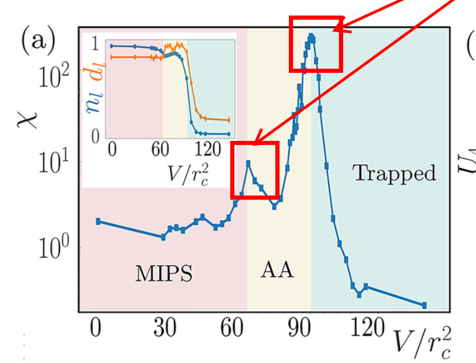
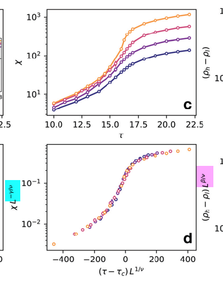

# unsorted tasks
- [x] copy general plot to the non plot script
- [ ] wiki eintrag für jupyter on cluster verbessern
- [ ] set up visual studio code for amep auch am uni rechner
	- [ ] fix all branching 
	- [ ] and sort git hub
	- [ ] use llm to get the code sorted
	- [ ] and plan the coding
	- [ ] re-evaluating the concept with the std-dev around the peak
- [ ] wiki eintrag für create simulation programm
- [ ] fork von AMEP erstellen
- [ ] box algo code parallelize
- [ ] finish / reinvestigate approach of july 2025 where 
	- [ ] the peaks are filtered after the one-sided standard deviation of the  height of the highest peak inside the rectangle box (the center of the standard deviation isn't the average height but the peak or the second moment with $c=\text{peak}$)
	- [ ] and afterwards after the standard deviation of the x-position around the highest peak
	- [ ] and than the average of these peaks are calculated
	- [ ] this approach is independent of the size of the outer rectangle box
	- [ ] if the threshold for the peaks and pits are high, the total number of eval boxes are reduced, but not the quality of the placement is affected
	- [ ] but there must be still a filter for 
		- [ ] if the the eval square box is intersecting with the outer rectangle
		- [ ] if dense and dilute boxes are overlapping, the threshold value for the width of the outer rectangle box is reduced
			- [ ] or we are going back to the oldest approach that the rectangle box for the dilute phase is depending on the rectangle box of the dense phase. This avoids always the overlapping of the dilute and dense square boxes and also the overlapping of dense and dense and dilute and dilute boxes
			1. here the best approach is to use the stdv for the threshold for peak/pit
			2. the threshold is raised if the rectangle boxes are too narrow so that the square boxes aren't able fit in
			3. the threshold is lowered if there are to few square boxes. (which shouldn't be the case)
			- here is no quality management or overlapping / collision management necessary
- [ ] reset to the old algo from 1.1 or 2.2. and compare the behavior of the placement of 28k (snapshots)
- [x] 28k with new algo and stdHalf as start value from .07 to .09. compare the bindercumulant results
- [x] 3.5 k with stdhalf reevaluate 
	- looked quite good or?
- [x] check how the 3.5 k data looks like
- [ ] what can I change with the inner filter to get better results?
- [ ] auf alten algo zurück setzen 🤷
- [ ] if stddev is smaller than a certain value don't restrict to two pits 
	- [ ] found another solution
- [ ] migrate scripts on the cluster 
- [x] add a "post filter" for the pits and peaks
	- it should throw out all values within the standard dev
	- <span style="font-size:100%;color:red;">⟹seems to have nice results</span>
- [ ] To solve the problem that there are boxes in too narrow areas
	- [x] it must be necessary that there are at least two peaks / pits 
	- This filter I already have for the pits
	- [x] The actual square box must be inside the outer box
- [ ] For better results I switched from pit/peak height multiplier of stdDev/stdHalf to peakheightmul = 1.05 and pitheightmul = .95
      Comparisson:
	- stdHalf:
	  
	  
	  you see the magenta (dilute) square in the second row from above, which shouldn't be there
	- peakheightmul = 1.05 and pitheightmul = .95
	  
	  
	  here it is replaced by a green (dense) one
	  This is caused be the splitting of the horizontal density distribution with a lower threshold for the deviation from the mean value for the pit height and peak height.
	  
	  In comparison to a higher threshold (here the half of the standard deviation):
	  
- [x] create-sim auf general modifizieren 
- [ ] traj time step setzen mit `traj.dt=<dt>`
- [ ] create sim so modifizieren, dass restart etc mit -ow klar kommt
- [ ] Folien autor titel oben entfernen
- [ ] lammps skript anpassen
- [ ] simulationen für 
	- [ ] 14k
		- [ ] Pe=5,10,15,20,25,30,35
	- [ ] 28k
		- [ ] Pe=5,10,15,20,25,30,35
	- [ ] 56k
		- [ ] Pe=5,10,15,20,25,30,35
- [x] suvendu schreiben
- [x] Kayro nach ABP Daten fragen
- [x] Leif nach Lammps skript fragen
- [ ] Auswertung von $\nu$ überprüfen, eventuell Aritra fragen, ob ich nen fehler gemacht haben könnte.
	- [ ] ob er ideen im allgemeinen hat
- [ ] Proposal schreiben!
- [ ] Slides Numbering!
- [ ] Darstellungs/Auflösungsproblem bei plot mit den kleineren Kästchen klären
- [ ] use the model of hecht2021 
	- $$m  \frac{d\vec{v}_{i}}{dt} = -\gamma_{t}\vec{v}_{i}+\gamma_{t}v_{0}\hat{p}_{i}-\sum \limits^{N}_{\begin{matrix}j=1\\ j\ne i\end{matrix}}\nabla_{\vec{r}_{i}}u(r_{ij})+\sqrt{ 2k_{B}T_{b}\gamma_{t} }\vec{\xi_{i}}$$ 
	- $$
I \frac{d\omega_{i}}{dt} = - \gamma_{r}\omega_{i} + \sqrt{ 2k_{B}T_{b}\gamma_{r} }\eta_{i}
$$
- [x] understand the **time scales**
	- [x] three different regimes
- [ ] folie mit Suvendus Phasendiagramm vor den Binder cumulant Interpolations ⟹ werte raus schreiben 
- [x] what is my peclet number for my current simulations?
	 - [x] $Pe=\frac{v_{0}}{D_{r}\sigma}\propto \frac{\tau_{p}}{\tau_{c}\varphi}$ 
- [ ] Exponenten neu auswerten -> neu/getrennt abspeichern / backup der alten 
	- [ ] ⟹und gescheit in die Folien packen
- [ ] Quellen für Folien
- [ ] müsste noch den data collapse machen 😒
	- [ ] Folie für die Verteilung von $\rho$ um die Kurtigkeit zu meiner Verteilung zu zeigen, dass $0<\mathcal{B}<1$ für meine Verteilung ist.
	- [x] Verteilung aus alten skripten heraus gekramt und geplottet
	- [ ] es läuft noch eine ld auswertung für m0.05 s05000, 
- [x] Tu Design für Folien 
- [ ] Gescheiten Titel für die Thesis
- [ ] Thesis aufräumen/ neu erstellen
- [ ] Die Benennung "max" und "half" stört mich immer noch...
      ⟹ Aber das konsequent zu ändern 😵‍💫
	- [ ] $▢_{max}$ $\square_{max}$ 
	- [ ]  $▢_{half}$ $\square_{half}$ 
	- [ ] passe abgespeicherten dateinamen an für die plots, muss extra parameter werden
- [ ] Binder cumulant plots bzw überhaupt die x Achsenbeschriftung ... m ist ja falsch. das muss ja $M=\frac{\tau_{M}}{\tau_{R}}$ sein
- [ ] Feng2025 - Critical Motility-Induced Phase Separation in Three Dimensions is Consistent with Ising Universality
- [ ] Schreibe den Order parameter ab sofort als:
      $\mathcal{O}\equiv \left< \rho_{dense} \right>_{L} - \left< \rho_{dilute} \right>_{L}$ 

# old unsorted tasks
- [x] algo changes function and performance test
      ⟹little bugs: Naming of `peakPits` was wrong and the parameter `mainbox` was missing
      ⟹<span style="font-size:100%;color:red;">time reduction by almost a half</span>
      from:
      
      to:
      
      with the <span style="font-size:100%;color:red;">same result</span>!
	- [ ] longterm test for 112k 0.0680 "06000" max and half
		- [ ] <u>max:</u>
	      before:
	      
	      now: value slightly changed ⟹change at 5th digit.
	      
		- [ ] <u>half:</u>
		    before:
		    
		    now: value also slightly changed ⟹change at 5th digit.
		    here it actually took only the half of time
		    
	- [x] remove distData_evalbox before the while loop ⟹ not necessary since new_ysb_Dist is True before the while loop
	      ⟹function test valid! 
- [ ] Why are the values increasing for 112k and 224k for higher inertia? do I need to change something with the values? maybe test with smaller initial height ⟹halfstdDev
	  
- [ ] plot binder cumulant with the new evaluated data
- [ ] continue with slides
- [ ] reeval the exponents
- [ ] changed that `nbins` is dependend on the width of the simulation box factor `nbins=boxwidth*0.5` before 0.3 derived from 600 bins for 224k particles with width ~ 2000  

# Thesis

## to do
- [ ] ~={Magenta}explain the meaning of the binder cumulant as the deviation of the gaussian shape=~
- [ ] liste die paper bzgl. der universality class auf <span style="font-size:100%;color: limegreen;">einiges in Dittrich aufgelistet</span>
- [ ] vom siebert den einstieg in den box algo schreiben. bzw. unter <span style="font-size:100%;color: cyan;">Evaluation methods to determine critical points in non-equilibrium systems</span>
- [ ] Folien durch gehen und damit den groben fahrplan / struktur machen
- [ ] Den Weg vom der ursprünglichen Box eval methode zum Box algo beschreiben.
	- [ ] Erstes paper
		- [ ] warum haben die diesen eingeführt
		- [ ] was war die Idee 
		- [ ] was das Vorgehen 
		- [ ] was ist zu beachten und wichtig
	- [ ] box-algo
		- [ ] Warum waren die Veränderungen nötig
		- [ ] was war die problemstellung bei der ursprünglichen Methode? Also was hat nicht funktioniert?
		- [ ] Was ist die idee und wie funktioniert er?
			- [ ] im report schauen
			- [ ] in den Folien schauen
- [ ] Damit meine Arbeit beschreiben. strickt anhand der Folien
- [ ] Probleme des Algorithms beschreiben 
- [ ] Dann meine Introduction passend dazu schreiben
- [ ] Dann den theoretical background
- [ ] dann das create simulation program
- [ ] create simulation program auf dem cluster hochladen und beschreiben

## toc
- [ ] Motivation / Introduction
- [ ] basics / Phasetransition
- [ ] Recent challenges (current papers / researches)
	- [ ] what are the recent discoveries concerting the universality class
		- [ ] siebert
		- [ ] dittrich
		- [ ] maggi
		- [ ] Feng
	- [ ] inertia
		- [ ] mandal
		- [ ] hecht
		- [ ] Su2021
		- [ ] Feng2025
## general
- [ ] gescheiten Titel überlegen ⟹ criticality/universality of underdamped brownian particles non equilibrium 
- [x] Unterschrift und Datum ändern
- [ ] Date of submission
## outlook
- [ ] evaluating 112k and 224k with different box sizes
	- [ ] max
	- [ ] half
	- [ ] third
	- [ ] forth
	- [ ] fifth
	and compare the Binder cumulants since this is also a change of the probing system size.
- [ ] change the algo in ~={DeepPink}need to eliminate the phase contributions=~ to:
	- [ ] finish / reinvestigate approach of july 2025 where 
		- [ ] the peaks are filtered after the one-sided standard deviation of the  height of the highest peak inside the rectangle box (the center of the standard deviation isn't the average height but the peak or the second moment with $c=\text{peak}$)
		- [ ] and afterwards after the standard deviation of the x-position around the highest peak
		- [ ] and than the average of these peaks are calculated
		- [ ] this approach is independent of the size of the outer rectangle box
		- [ ] if the threshold for the peaks and pits are high, the total number of eval boxes are reduced, but not the quality of the placement is affected
		- [ ] but there must be still a filter for 
			- [ ] if the the eval square box is intersecting with the outer rectangle
			- [ ] if dense and dilute boxes are overlapping, the threshold value for the width of the outer rectangle box is reduced
				- [ ] or we are going back to the oldest approach that the rectangle box for the dilute phase is depending on the rectangle box of the dense phase. This avoids always the overlapping of the dilute and dense square boxes and also the overlapping of dense and dense and dilute and dilute boxes
				1. here the best approach is to use the stdv for the threshold for peak/pit
				2. the threshold is raised if the rectangle boxes are too narrow so that the square boxes aren't able fit in
				3. the threshold is lowered if there are to few square boxes. (which shouldn't be the case)
				- here is no quality management or overlapping / collision management necessary


## latex

# Masterplot
multiply the data of the observable (binder cumulant, order parameter,  susceptibility) with the scaling factors of the observable. $L^{\zeta_{\mathcal{O}}/\nu}$ 

> [!NOTE] Maggi21
> Using the finite-size scaling ansatz, we assume that a generic observable $\mathcal{O}$ near the critical point behaves as $$
\mathcal{O}=L^{\zeta_{\mathcal{O}}/\nu}\left[ F_{\mathcal{O}}\left( L \xi^{-1} \right) + O \left( L^{-\omega},\xi^{-\omega} \right)  \right] 
$$, where $\zeta_{\mathcal{O}}$ is the critical exponent associated with the observable $\mathcal{O}$, $F_{\mathcal{O}}$ is a universal finite-size scaling function and $\omega$ is the power of the (subleading) correction-to-scaling exponent.


- use the correct $M_{C}$ and correct exponents
- [x] automate show exponent value in masterplot 
	- [x] adjust masterplot template so that it reads the header from the csv file
	- [x] add the values used for the masterplots into the slides
- [x] masterplot below the general plots
- [ ] replot $\mathcal{B}$ of the "ABP" with the general plot template
- plot the orderparameter
	- [x] max
	- [x] half
- [x] add L to the ledgend
- plot bindercumulant
	- [x] max
	- [x] half
- plot $\chi$
	- [x] max
	- [x] half
# Important guidline to fokus on
- <span style="font-size:120%;color:red">Don't touch the box algo anymore!</span>
- <span style="font-size:120%;color:red">determine the Phase transition point</span>
	- use the latest data I have ⟹ of half avg and max avg
- <span style="font-size:120%;color:red">determine $\nu$ with the derivative of $\mathcal{B}$</span>
- [ ] Browser Uni aufräumen
- clean the proposal
- sort the introduction and theorie
- explain the algorithm at it's current state and it's flaws and also the ways to refine it
- [ ] clean the folder **sqaureboxEvaluation**
- [ ] renaming max to half and half to forth...
- make / clear snapshots with plots with the latest algo. ==am Windows PC==
	- **new folder**
	- **clear naming**
	- **neat** / **oversee-able**
	- 112k
		- [x] avg max
			<!-- - [ ] 0.06 -->
			- [x] 0.065
			<!-- - [ ] 0.067 -->
			<!-- - [ ] 0.0675 -->
			- [x] 0.068
			<!-- - [ ] 0.069 -->
			- [x] 0.07
		- [x] avg half
			<!-- - [ ] 0.06 -->
			- [ ] 0.065
			<!-- - [ ] 0.067 -->
			<!-- - [ ] 0.0675 -->
			- [ ] 0.068
			<!-- - [ ] 0.069 -->
			- [ ] 0.07
	- 28k
		- [x] avg max
			<!-- - [ ] 0.06 -->
			- [ ] 0.065
			<!-- - [ ] 0.067 -->
			<!-- - [ ] 0.0675 -->
			- [ ] 0.068
			<!-- - [ ] 0.069 -->
			- [ ] 0.07
		- [x] avg half
			<!-- - [ ] 0.06 -->
			- [ ] 0.065
			<!-- - [ ] 0.067 -->
			<!-- - [ ] 0.0675 -->
			- [ ] 0.068
			<!-- - [ ] 0.069 -->
			- [ ] 0.07
	- 7k
		- [x] avg max
			<!-- - [ ] 0.06 -->
			- [ ]  0.065 
			<!-- - [ ] 0.067 -->
			<!-- - [ ] 0.0675 -->
			- [ ] 0.068
			<!-- - [ ] 0.069 -->
			- [ ] 0.07
		- [x] avg half
			<!-- - [ ] 0.06 -->
			- [ ] 0.065
			<!-- - [ ] 0.067 -->
			<!-- - [ ] 0.0675 -->
			- [ ] 0.068
			<!-- - [ ] 0.069 -->
			- [ ] 0.07
	- Density distribution **exemplarisch** anhand von 112k für 
		- [ ] 0.065
		- [ ] 0.068
		- [ ] 0.07
- [x]  <span style="font-size:120%;color:orange">write down the scaling formula for the order parameter</span>
	- <span style="font-size:120%;color:orange">determine $\beta$</span>
- [x] git checkout to the ***last*** **phase-peak-pit-height-tune-algo**
- [ ] compare the box placement for stdDev and halfstdDev
- [ ] evaluate binder for 28k particles with halfstddev and compare the plot with stdDev
	
# Box Algo
- [ ] ich muss definitiv die peaks filtern um die mitte des größten peaks. das würde die ergebnisse definitiv verbessern
- [ ] make an exception handling for the case if there are no dense/dilute boxes
- [ ] put the box evaluation on the cluster and evaluate the data there
- [ ] ask kayro for rights to push to upstream
- [x] kann den prozess beschleunigen, in dem ich das überprüfen der phase width aus filter new peak pit auslagere und distdata-evalbox, get_peak_pit, sowie filter peak_pit nur laufen lasse, wenn height_mul geändert wurde. 
      Hat geklappt und ist viel schneller / doppelt so schnell
## peak pit width tuning
- [x] did a new strange branch... from phase-peak tune...
- [x] need to branch it...
- did a combination of height and width mul variation in combination with an alternation in varying this value. Also increased the reduction of the width to get less loop breaks / faster results
- changed bins from 500 ⟹ 600 ⟹ $\text{nbins} = \text{boxwidth} \cdot 0.5$ (so it depends on the system size)
- atm the pit/peak height isn't altered (at least it has no direct effect) for overlapping boxes only if there are no dense/dilute boxes left, since the pit/peak height was altered indeed but the density distribution is not reevaluated because the boolean `new_ysb_Dist` isn't toggled True again. 
- [ ] the best result for placing the squares would be to average only over the peaks in the standard deviation range of the highest peak (part of the other branch)
## Evaluate
- [x] reeval at 224k seed 05000 m 0.067
- [x] Save the box size of the evaluated boxes

## finite-size-scaling_phase-peak-pit-height-tune-algo
new branch ⟹ fss_ppphta_ebox-fit-in-pp
- [ ] ==clean the code from old unused stuff== delete old code
	- [x] ==make a backup before cleaning==
	- [ ] filter_same_pits
	- [x] remove commented code in finite_size_scaling
	- [ ] remove keep_pbc in the middle
	- [ ] remove dist_pbc
	- [ ] substitute pbc everywhere
	- [ ] remove commented code from  `evaluate`
	- [ ] move the auxiliary functions out of the main code...
- [x] quality management with correct distance measurement
- [ ] filter_same_pits
	- [ ] check if distance between pits is wide enough that the evaluation box fits in
	      ![[Pasted image 20251024224645.png]]
	    It should lead to that in too "narrow" phases no evaluation squares are placed. But it does not provide that the box is complete inside the phase and also does not prevent overlapping with evaluation boxes in dilute phases, if they are placed at the boarder of a rectangle box.
	    Overlapping is only prevented, when the square is placed in the middle of a rectangle box.
- [ ] ==problem:== evaluating the particle number of split eval boxes ( those which overlap over the mainbox border)  ⟹ particles at vertical border between the left and the right split box are counted twice atm!
	- [x]  ⤷ Don't split squares in `subbox_to_square_withpeak_dilute_dense_new` split only, when  creating the plotting rectangles.
	- [ ] adjust `box_to_rectangle` / `box_to_rectangle_list` <span style="color:red"> needs another name ==not== rectangle</span>
	- [ ] adjust sorboxes ⟸ because there are no lists of squareboxes anymore
- [ ] add a dilute vs dense eval boxes counter to quality management

# Jupyter
- [ ] test new code / cleaned code, after square_box split was moved to  box_to_rectangle
- [ ] compare the densities / particle numbers of squarebox split and not split
- [ ] **Dict to csv**
    ```python
    import csv  
    
    cars = [     {"Brand": "Toyota", "Model": "Corolla", "Year": 2020},     {"Brand": "Honda", "Model": "Civic", "Year": 2019},     {"Brand": "Ford", "Model": "Focus", "Year": 2018} ]  
    
    # CSV file name 
    csv_filename = "cars.csv" 
    
     # Define the field names (headers) 
     fieldnames = ["Brand", "Model", "Year"]  
     
     # Writing to CSV 
     with open(csv_filename, mode='w', newline='') as file:   
			     writer = csv.DictWriter(file, fieldnames=fieldnames)
			     writer.writeheader()  # Write header row    
			     writer.writerows(cars)  # Write data rows   
    ``` 

- [ ] https://pandas.pydata.org/docs/reference/api/pandas.read_csv.html
	- [ ] https://pandas.pydata.org/docs/reference/api/pandas.unique.html
- [x] sort determine CP
## Juypter on cluster
the reason why it didn't find amep was that I choose the <span style="font-size:100%;color:red;">wrong folder depth</span>.
I choose `amep/amep`instead of `amep/`

### sbatch script
```bash
#!/bin/bash -l

#SBATCH --chdir /home/lwalter
#SBATCH --partition=standard
##SBATCH --partition=gpu
##SBATCH --nodelist=cpu11
#SBATCH --nodes=1
#SBATCH --ntasks=1
#SBATCH --cpus-per-task=1
#SBATCH --job-name="amep"

module load anaconda3

/home/lwalter/.conda/envs/phasetransition/bin/jupyter-notebook --no-browser --port=8081
```

![[Pasted image 20260303143705.png]]
![[Pasted image 20260303172550.png]]
![[Pasted image 20260303172607.png]]
`jupyter-lab --no-browser --port=portOut`
```bash
ssh -v -L portIn:cpuXX:portOut 192.168.211.2 -N
```
- `portIn` is the port received by the browser with `localhost:portIn` or `127.0.0.1:portIn`
- `portOut` is the port used to forward from the sending host 
```bash
ssh -v -L 8891:cpu11:8081 192.168.211.2 -N
```

`-v`is only for debugging, you can omit it.
## Connect to CPU2
You have to be logged-in to the cluster first.
```bash
ssh cpu02
```
Connect to Jupyter-lab via:
```bash
ssh -L 3733:127.0.0.1:8082 192.168.211.2 -N
```
The current working python environment is <span style="font-size:100%;color:red;">venv</span>
```bash 
source venv/bin/activate
```
Start juypter -lab
```bash
 jupyter-lab --no-browser --port=8082
```
# Evaluate
## Determine CP
linear approximation optimization with aritras interpolation method
- [x] Read Aritras Code and ask if something isn't clear
	- [x] "data_phase_transition_with_errors.csv" ⟹ how did he get the errors
	- [x] what are **unique L values** ⟹ a designated system size 
	      With the method `.unique()`you can filter rows for certain values.
	- [ ] Udl ⟹ is the Bindercumlant of mean largest cluster length $d_l$: $\mathcal{B}(d_l)$
	      In my case $d_l$ is $\rho$ of the evaluation boxes: $\mathcal{B}(\rho_\text{box})$
	- [ ] Udl_se means? ⟹ I guess it is the error
	- [x] What does `from scipy.interpolate import splrep, splev`?
		- [ ] splrep(_x_, _y_, _w=None_, _xb=None_, _xe=None_, _k=3_, _task=0_, _s=None_, _t=None_, _full_output=0_, _per=0_, _quiet=1_)[[source]](https://github.com/scipy/scipy/blob/v1.16.2/scipy/interpolate/_fitpack_py.py#L164-L305)
		      Find the B-spline representation of a 1-D curve.
		- [ ] splev(_x_, _tck_, _der=0_, _ext=0_)[[source]](https://github.com/scipy/scipy/blob/v1.16.2/scipy/interpolate/_fitpack_py.py#L308-L395)
		      Evaluate a B-spline or its derivatives.
	- [x] why `{py} subset_df = data_frame[data_frame['L'] == L_value]`
	      `{py} subset_df['Udl']` picks a column of a csv file
	- [ ] `{py} result = minimize(lambda params: objective(params, curves_data, curves_se_data), initial_guess, method='BFGS')` 
		- [ ] <u>BFGS</u> Minimization of scalar function of one or more variables using the BFGS algorithm.
		       https://docs.scipy.org/doc/scipy/reference/optimize.minimize-bfgs.html#optimize-minimize-bfgs
		       
		    n numerical optimization, the Broyden–Fletcher–Goldfarb–Shanno (BFGS) algorithm is **an iterative method for solving unconstrained nonlinear optimization problems**. Like the related Davidon–Fletcher–Powell method, BFGS determines the descent direction by preconditioning the gradient with curvature information.
		       https://en.wikipedia.org/wiki/Broyden%E2%80%93Fletcher%E2%80%93Goldfarb%E2%80%93Shanno_algorithm
Evaluate a B-spline or its derivatives.
`{cpp} printf("\nHello World!")`
Find the B-spline representation of a 1-D curve.
- [x] how do I export dicts to csv files
- [x] Export the data from
	- [x] binder_max_avg_dicts
	- [x]  binder_half_avg_dicts
	      `omit 3.5k and 7k `
- [ ] apply the optimization⟹decide by the optimization error which box size to choose
- [x] evaluate the derivative of the binder cumulant
## order parameter
- [x] determine order parameter $\Braket{\rho_\text{dense}}_{L}-\Braket{\rho_\text{dilute}}_{L}$ ==Feng2025==
      ![[Pasted image 20251103233523.png]]
- [ ] plot it
- [ ] write down the scaling function for the orderparameter
- [ ] determine $\beta$
## susceptibility
- [ ] determine the susceptibility $\chi$ ![[Pasted image 20251103233452.png]] $\chi \equiv \left( \frac{L^{3}}{v_{D}} \right) \frac{\Braket{\Delta \phi^{2}}_{L}}{\Braket{\phi}_{L}}$  <br> With $v_{D}\equiv\frac{\pi d^{3}_{hs}}{6}$ the volume of a single particle. With $d_{hs}=2^{1/6}\sigma$ $v_{\text{sphere}}=\frac{4}{3}\pi r^{3}=\frac{4}{3}\pi \left( \frac{d_{hs}}{2} \right)^{3}=\frac{4}{3 \cdot 8} \pi d_{hs}^{3}=\frac{\pi}{6}d_{hs}^{3}$   The susceptibility $\chi$ is maximal at the CP
      ![[Pasted image 20251103235225.png]]
- [ ] translate $\chi$ in $2D$ <br> $\chi \equiv \left( \frac{L^{2}}{v_{D}} \right) \frac{\Braket{\Delta \phi^{2}}_{L}}{\Braket{\phi}_{L}}$   With $v_{D}\equiv\frac{\pi d^{2}_{hs}}{4}$  the volume of a single particle. With $d_{hs}=2^{1/6}\sigma$  <span style="color:red;font-size:100%;">valid?</span> in 2D?<br>
- [ ] get $L$: in my case it is the length of the evaluation box.
	- [ ] need to retrieve it from calculate binder from sub box 
	- [ ] ==take care== $L$ is ==different== for *max* and *half*
	- [ ] create a column $L_{\text{evalbox}}$  
- [ ] plot $\chi$
- [ ] determine $\gamma$ 
- [ ] 
$\text{boxRatio}=R=10$
$\text{fillRatio}=\phi=0.5$
$L_{yHalf} = \sqrt{\left( \frac{N\cdot\pi\cdot\sigma^2}{(4\cdot R \cdot \phi)} \right)}/2$
$L_{xHalf} = R\cdot L_{yHalf}$
$\phi = \frac{N \cdot \pi \cdot \sigma^2}{4\cdot R\cdot2\cdot L_{yHalf}^2}$
### box boundaries xlo,xhi,ylo,yhi,zlo,zhi L_y=sqrt(N Pi sigma²/(20 phi))
region 	box block -${LxHalf} ${LxHalf} -${LyHalf} ${LyHalf} -0.5 0.5	
# Simulate

<span style="font-size:120%;color:green"> Atm there is enough simulation data</span>
- [ ] 224k
	- [ ] .04 
		- [x] 5 eq
		- [x] 5 pr
		- [x] 4 eq
		- [x] 4 pr
	- [ ] .045
		- [x] 5 eq
		- [x] 5 pr
		- [x] 4 eq
		- [x] 4 pr
	- [ ] .05 
		- [x] 5 eq
		- [x] 5 pr
		- [x] 4 eq
		- [x] 4 pr
	- [ ] .055 
		- [x] 5 eq
		- [x] 5 pr
		- [x] 4 eq
		- [x] 4 pr
	- [ ] .06 
		- [x] 3 eq
		- [x] 3 pr
	- [ ] .062 
		- [x] 3 eq
		- [x] 3 pr
	- [ ] .064 
		- [x] 3 eq
		- [ ] 3 pr
	- [ ] .065 
		- [x] 3 eq
		- [ ] 3 pr
	- [ ] .0676 
		- [x] 4 eq
		- [ ] 4 pr
		- [x] 5 eq
		- [ ] 5 pr
	- [ ] .0677 
		- [x] 4 eq
		- [ ] 4 pr
		- [x] 5 eq
		- [ ] 5 pr
	- [ ] .0678 
		- [x] 4 eq
		- [ ] 4 pr
		- [x] 5 eq
		- [ ] 5 pr
	- [ ] .0679 
		- [x] 4 eq
		- [ ] 4 pr
		- [x] 5 eq
		- [ ] 5 pr
## Create-sim
- [ ] add some something like a progress bar / time estimation
- [ ] a checker which simulations are finished 
- [ ] a little GUI, where you can see all the data you already have
- [ ] modify it that it does not run on the cluster... it need to connect via sftp to do the stuff... would be better...
- [x] add dependency to create-simulation - dependency of production run to equilibration run
	-  Hier ein Beispiel: 
```{SLURM}
#!/bin/bash
jid1=$(sbatch --parsable impact_sol_${NUM}1.sh)
jid2=$(sbatch --parsable --dependency=afterok:$jid1 impact_sol${NUM}2.sh)
jid3=$(sbatch --parsable --dependency=afterok:$jid2 impact_sol${NUM}_3.sh)
echo "Stage 3 jobs submitted: $jid1 → $jid2 → $jid3"
```

-  Jeder Job wird zugewiesen, z.B. jid1, jid2, ... und der folgende Job muss auf das OK des vorherigen warten, d. h. dass er abgeschlossen ist. Das wird gemacht mit `--dependency=afterok`.
	- There has to be the possibility to set up equilibration and production at the same time where the number of cores for the equilibration run will be divided by 8 (make sure that its an integer)
	- <span style="font-size:200%;color:gold;"> soooo geil dependency funktioniert</span>
- [ ] ask why the equilibration run is still so slow in comparison to the production run by $ts=1^{-4}$ 

# Read
- [ ] Feng2025~Theory for the anomalous phase behavior of inertial active Brownian particles
	- [ ] + Supplement

# Report
<span style="color:red" > finish the Slides today </span>
- L corresponds to the particle number $\#N$ through: 
- $L_{yHalf} = \sqrt{\left( \frac{N\cdot\pi\cdot\sigma^2}{(4\cdot R \cdot \phi)} \right)}/2$
- $L_{xHalf} = R\cdot L_{yHalf}$
- $\phi = \frac{N \cdot \pi \cdot \sigma^2}{4\cdot R\cdot2\cdot L_{yHalf}^2}$
- describe $M=\frac{\tau_{M}}{\tau_{R}}$ which resembles our mass "m"
## Slides
### Vertical Split
- Why is the resolution of the snapshots of the half sized boxes worse
- $\left< \text{NP} \right> - \left< \text{NP}^{2} \right>$ 
- [ ] Slides:
	- [ ] 112k different m: .06, .065, .067, .068, ~~.069~~ ⟹.07
		- [ ] pictures of Δy Density Distribution 
		- [ ] pictures for avg 
		- [x] pictures for peak 
		      <span style="color:gold;font-size:100%;">⟹ the peak evaluation is depreciated for now!</span>
		- [ ] square size max
		- [ ] square size half
- [ ] add the current results for CP and $\nu$ 
- [x] Fitting $\mathcal{B}$ ⟹ CP:
	- [ ] show CP in ledgend
	- [ ] max evalbox size
		- [ ] replot the non cut out plot with legend and higher smoothing
	- [ ] half evalbox size
		- [x] replot non cut out with legend
		- [x] replot cut out with legend
- [x] Fitting $\nu$ 
- [x] Fitting $\beta$
- [x] Fitting $\gamma$ 
- [ ] $\mathbb{M}=\frac{\tau_{d}}{\tau_{p}}$

# Test note
- [ ] this is a test note $\sqrt{x}$ 
$$\frac{ \partial f }{ \partial x }
$$
$\partial \Delta$
$\frac{ \partial f }{ \partial 2}$

$x^{2}\frac{ \partial g(x) }{ \partial x }$


# New Note
1. First 
2. Second 
3. $\frac{ \partial y }{ \partial x }$ 
4. $t_{7}$ ❃☩⚔☠✠⤭✼⛥꙳

# MIPS
- competition between the time scale of reorientation and collision
- overdamped ⟹ no reason for bouncing back
- underdamped ⟹ the bounce back
- Reentrance effekt for higher Pe with higher masses 
  ![[Pasted image 20251118121845.png]] (Hecht2021)
- Something (Weaks-chanderler potential) is hard to parallelize 
# JC / group meeting
## 26-04-07
- <u>intention:</u> exchange about the own usage
	- I didn't use it that much in past, but try to be more open
		- but I'am always careful and skeptical 
		- since it made me insecure, because of it seams in the form and from the formulations quiet sensible, but in the details were so many flaws.
			- this created a great insecurity in me, since I cannot trust in it and have to check twice
			- and also have to check what I have already written and thought trough, since I do not know and cannot check every particular change and makes it more vague why it works or why not, its so much trust and guessing in some points
		- in some chases it produces errors in texts or code that weren't there before
		- and I had no brain capacity to check it, and made me insecure about mistakes
	- checking for translations and formulations
	- learning language
	- In past to find out how to do/solve things.
		- I had to use it for work a lot, since my employer/principal expected it from me
		- give an overview for a new field I have to explore. simple step by step guides
	- if you use google as a search engine than you always stumble about the small summaries
		- I read them always but I found so often mistakes
	- I recognized extrem sycophancy 
		- when friends use them and try to argue with it
		- if you ask for "if something is true", it tends to say "yes"
		- it finds arguments for it, so some people may think that their opinion is true
	- I have a friend who use it frequently for psychological advises
		- analyse conversations with people and what happend today
		- I can say in total that these psychological advises are quite good. studies show that its much better than have no advise and it tends to be 
		- but here it also tends to sychophancy
	- summarize a video
### Benno
- check if calculations are right
### leif
- stopped using chatgpt, since it is to agreeable
- especially for coding
	- how to make code more efficient
	- debugging
### kayro
- you need to know how to code, since you need to check it quite thoroughly 
### Blackboard
- <u>analytical:</u>
	- check analytical calculations
	- get ideas of analytical derivations
- <u>write papers:</u>
	- spell & language checking
	- rewriting language style & coherence
	- quickly write bullet points
- <u>Coding:</u>

## 26-03-31 LLM Discussion
- take over so much work which was work for a week before
- we cannot avoid it
- certain obvious tasks
	- shorten a text
	- proof it for language
	- we have to proof it always
	- ask llm to look for coherence
	- there are many non obvious hallucination 
		- especially if you are not familiar with the subject you can be tricked
- Dennis:
	- llm are much better for coding, were it is really reliable
	- doing simulations
	- but for text production there is an order of magnitude in quality
	- doesn't read documentation by his own any more
- Benno:
	- if you dont use it for text quality / content
	- but if you use it for the form, writing errors, translation and shortening only
	- check your calculations
	- doing analytical stuff
	- checked an old paper of him if everything is correct:
		- this didnt work for the whole paper, because it didnt understand some approximations
		- but if you use it for sections step by step and check it, it works quite well
	- there is no way to fighting it away
	- it feels very uncomfortable if you did this for years and the llms do it much better in much shorter time
	- human like counter part who you can ask
- kayro:
	- quite good for analytics if you have some insight what is the outcome of it
- aritra:
	- gemini Nano bana pro:
		- good for image generation
		  ![[Pasted image 20260331120941.png]]
		- better than chat gpt
		- you can upload an image you already have and it can manipulates it quite well
		- but the out come is much better if you give it good context
	- click the button - that they don't use your data for training
		- but don't trust it
	- agentic planning/programming
		- codex open AI
		- anthropic claude code
		- antigravity google
		- github copilot - you can upgrade it with TU account
	- claude is much better for analytic stuff like stability analysis
	- visual studio code (installable on ubuntu)
		- codex plugin
		- showed how use it and it produced the whole code for plotting and fitting
		- you only have to check it
		- ![[Pasted image 20260331123047.png]]
		- he uploaded a handwritten note ~={LightBlue}he did it with antigravity=~
		  ![[Pasted image 20260331123310.png]]
		- and it translated it into latex code 
		  ![[Pasted image 20260331123341.png]]
		- it also did the stability analysis and the coding for him
		  ![[Pasted image 20260331123450.png]]
		- 
- me:
	- if you want it more confidential
		- use the european ones like mistral, which are more confidential with the data
		- or the TU 
	- if something is already in the internet it doesn't matter, because it was already scraped by the american and they don't care on the creative commons

## 25-11-28: Feng(25-04) Theory from the anomalous phase behavior of inertial active Brownian particles
- $\mathcal{S}=\frac{\varepsilon}{\zeta U_{0}\sigma}$ gives us a measure for how much can particles overlap?
- Coexisting phases in non equilibrium systems are the binodals ⟹ when you start in a uniformal regime you don't see the binodal
- in equilibrium you don't have a free energy
- reentrance disappears, when the stiffness $\mathcal{S}$ ? Question from Benno
	- you need both stiffness and inertia?
	- if you dont have inertia
	- They didnt rule out the influence of inertia?
- mechanical balance of the interface - modeled by the *dynamic stress tensor* $\mathbb{\Sigma}$ 
- My questions
	- no contradiction to the groups work?⟹yes
	- where is a parallelization problem?
		- ⟹only for strictly hard spheres 
		- WCA isn't about strict hard spheres than I understood it correct
		- what exactly the identify as the binodal?
			- ⟹ When there are two separated phases
			- but since you don't have a free energy this is speculative / not accurate
- $\text{St}\equiv \frac{\tau_{M}}{\tau_{R}}$, $\tau_{M}\equiv \frac{m}{\zeta}$, $\zeta=\gamma_{t}$, $[\tau_{M}]=s=\frac{kg}{\frac{kg}{s}}$ ⟹$[\gamma_{t}]=\frac{kg}{s}$ <span style="font-size:80%;color:orange;">(assumption that </span>$\tau_M$ <span style="font-size:80%;color:orange;">is a time)</span>
	- $\zeta$ translational drag coefficient  $[\gamma]=1$
	- $\tau_{R}$ represents characteristic reorientation/persistence time (or inverse rotational diffusion) $\tau_{R}=\frac{1}{D_{R}}$, $D_{R}=\frac{k_{B}T_{b}}{\gamma_{r}}$, $[D_{t}]=\frac{m^{2}}{s}$ $[D_{R}]=\frac{1}{s}$ $\gamma_{r,\text{sphere}}=8 \pi \eta R^{3}$, $\eta$ is the dynamic viscosity, $[\eta]=\frac{kg}{m s}$, $[k_{B}]=\frac{J}{K}$ 
	- $St \equiv \tau_{M} \cdot \frac{1}{\tau_{R}} =\frac{m}{\gamma_{t}} \cdot D_{R}= \frac{m}{\gamma_{t}} \cdot \frac{k_{B}T_{b}}{\gamma_{r}}$ , $[St]=kg \cdot \frac{1}{s}$ 
	- What are $\gamma_{t}$ , $\gamma_{r}$ and $T_{b}$ in my case? <span style="color:orange;font-size:100%;">lammps script</span>  
```python
# use:: fix ID group-ID langevin/lh Tstart Tstop gamma_t seed alpha(=10*gamma_r/sigma^2/gamma_t) omega <yes/no> zero <yes/no> 
fix 	noise all langevin/lh 1.0 1.0 1.0 §seed 10 omega yes zero yes	# add Langevin thermostat (noise+friction)
``` 
```python
compute	erot all erotate/sphere
thermo_style	custom step temp epair c_erot etotal press
thermo		5000
```
![[Pasted image 20251118151512.png]]
- $\gamma_{t}=1$
- $\gamma_{r}$ 
	- Since $\alpha=\frac{10 \gamma_{r}}{\sigma^{2}\gamma_{t}}=10$
	- $\gamma_{r}=1 \cdot \sigma^{2}\gamma_{t}=1$  

## 25-12-2: Marcos2009~Separation of Microscale Chiral Objects by Shear Flow
DOI: 10.1103/PhysRevLett.102.158103
This is old from 2009

- chiral molecules
- switched the gene off of the bacteria for motility (Dennis asked if a ethic commission approved this🤭), the bacteria was also mutated that it does not split, but in stead grow and get a spiral structure (all controled by protein)
- microfluidic channel 
- shear two opposite planes against each other ⟹ shear on microscale chiral objects in between
- bacterias drift perpendicular to the shear plane
- Net drift results from the preferential alignment of helices with streamlines, with a direction that depends on the chirality of the helix and the sign of the shear rate. 
- separation efficiency $\eta = \frac{|N_{L}-N_{R}|}{N_{L}+N_{R}}$  
- The flow around the particle is approximated linear $u(y)=\frac{vy}{H}$ 

# AMEP
## 25-12-04 Introduction meeting
- color coding is recommended because it is generalized 
	- ⟹for example: If you use AMEP with FFMPG to generate animations you can see from the color of the particle, see the structure factor
-  with the <span style="font-size:100%;color:red;">API Reference</span> you can search the documentary of all used/integrated packages
- hdf5:
	- Used for really huge files
	- AMEP uses a hdf5 file based format: **H5AMEP** 
	  
	- infos are in **User Guide** on the AMEP Page
	  
# Papers
## M.Rovere1993~Simulation studies of gas-liquid transitions in two dimensions via a subsystem-block-density distribution analysis
### 4. low temperature limit of the cumulants in the 2D-Ising model
- 2D-Ising model on a square lattice in the groundstate at constant magnetization $\left< m \right> = -1 + 2 \left< \rho \right>$
- The groundstate (or configuration of minimum free energy, respectively) is easily identified by the property of minimal interface energy of the states with spins pointing in opposite directions.
- Let us denote the linear extension perpendicular to the interface of the area with positive spins by A. $$
A= \frac{S\left( \left< m \right> +1  \right)}{2}
$$
- probability $P_{L}(m)$ for having the magnetization $m$ in subsystems of size $L \times L$ is for case
	- **(I)** $L \le S - A = \frac{S}{2} \left( 1-\left< m \right> \right)$
	  $$
P_{L}(m)=
\begin{cases}
\frac{2}{S}  &m=-1+\frac{2i}{L}; \quad \{i=1,2,\dots,L-1\}\\  
\left( A-L+1 \right)/S  &m=+1 \\
(S-A-L+1) /S &m=-1
\end{cases}
$$
	- **(II)** $L>S-A$ $$
P_{L}(m)=
\begin{cases}
\frac{2}{S} &m=-1+\frac{2i}{L};  \{i=S-A+1,\dots,L-1\}   \\
 \left( L-S+A+1 \right) /S &  m=1-\frac{2(S-A)}{L}\\
 (A-L+1) /S & m=1\\
\end{cases}
$$
- $M:=\frac{S}{L}$ and $A= \frac{S\left( \left< m \right> +1  \right)}{2}$ we get
	- **(I)**  $L \le S - A = \frac{S}{2} \left( 1-\left< m \right> \right)$ ⟹ $L \le S - \frac{S\left( \left< m \right>+1 \right)}{2} =\frac{2S-S\left< m \right>-S}{2}=\frac{S\left( 1-\left< m \right> \right)}{2}$ 
	  ⤷$\frac{S}{L}=M \ge \frac{2}{\left( \left< m \right>-1 \right)}$
	- **(II)** $L>S-A$ 
	  ⤷$\frac{S}{L}=M < \frac{2}{\left( \left< m \right>-1 \right)}$

## [Mukhopadhyay2025](https://doi.org/10.1038/s42005-025-02265-0) - Active adaptolates featuring motilityinduced percolating structures with an adaptive packing geometry


## Mandal2019~Motility-Induced Temperature Difference in Coexisting Phases

### Supplement
diffusion coefficients ($D_r$ and $D_t$) and friction coefficients ($γ_r$ and $γ_t$) are not related by the Stokes-Einstein relation. Thus, for simplicity, we choose $γ_t = γ_r/σ^2$ .

Stokes-Einstein relation $D=\frac{k_BT}{6 \pi \eta r}$ with $\tau=\frac{\gamma}{m}$ the relaxation or persistence time. For spherical particles of radius $r$ Stokes' law gives $\gamma = 6 \pi \eta r$. 
- $\gamma_{t}=1$
- $\gamma_{r}$ 
	- Since $\alpha=\frac{10 \gamma_{r}}{\sigma^{2}\gamma_{t}}=10$
	- $\gamma_{r}=1 \cdot \sigma^{2}\gamma_{t}=1$  
-  $\tau_{p} = \frac{1}{D_{r}}$ 
- $Pe=$

### [Scholz2018 | Inertial delay of self-propelled particles | Nature Communications](https://www.nature.com/articles/s41467-018-07596-x)
- P.2; **Underdamped Langevin model.**:
   Owing to the strong non-equilibrium nature of the system, the <span style="font-size:100%;color:green;">diffusion and damping constants</span> are <span style="font-size:100%;color:red;">not related</span> by the Stokes-Einstein relation
  
- P.5-6 **Discussion:**
   The long-time diffusion coefficient of passive particles is independent of inertia and is related to the friction coefficient via the Stokes−Einstein relation. However, for actively moving particles we find an explicit dependence on the moment of inertia (with no explicit dependence on the total mass M) 

### [Lei2020|]()
- P.2 Result ⟹ **Model**:
	 For simplicity, we set $\gamma_{t}=\frac{\gamma_{r}}{\sigma^2}$ 
- E44D0A

# What is my $Pe$ ?

- $Pe=\frac{v_{0}}{D_{r}\sigma}\propto \frac{\tau_{p}}{\tau_{c}\varphi}$ [Mandal2019](https://doi.org/10.1103/physrevlett.123.228001) with the persistence time $\tau_{p}=\frac{1}{D_{r}}$, the packing fraction $\varphi$ and the Mean time between collisions $\tau_{c}=\frac{\pi \sigma}{4v_{0}\varphi}$ 
Stokes-Einstein relation $D=\frac{k_BT}{6 \pi \eta r}$ with $\tau=\frac{\gamma}{m}$ the relaxation or persistence time. For spherical particles of radius $r$ Stokes' law gives $\gamma = 6 \pi \eta r$. 
- $\gamma_{t}=1$
- $\gamma_{r}$ 
	- Since $\alpha=\frac{10 \gamma_{r}}{\sigma^{2}\gamma_{t}}=10$
	- $\gamma_{r}=1 \cdot \sigma^{2}\gamma_{t}=1$  
-  $\tau_{p} = \frac{1}{D_{r}}$ 

⟹ $Pe \propto \frac{\tau_{p}}{\tau}$
$Pe = \frac{v_{0}}{\sqrt{ 2D_{r}D_{t} }}$, $D_{t}=\frac{k_{B}T}{\gamma_{t}}$, $D_{r}=\frac{k_{B}T}{\gamma_{r}}$ 
LAMMPS: 

Where this defines the selfpropulsion force $F_{i}=f_{p}e_{i}$ with the Magnitude $f_{p}=42.4264$ 
$f_{p}=\gamma_{t}v_{0}$ 
$\frac{\sigma}{\sqrt{ D_{r}D_{t} }}=1$ 
$\frac{\varepsilon}{k_{B}T}=10$ 
$Pe=\frac{42.4264}{\sqrt{ 2 }}\sim 30$
Laut Mandal2019 P. 2 ist die kritische $Pe \ge 20$ 
<span style="font-size:100%;color:red;">Simulationen mit einer deutlich höheren Pe versuchen</span>

## Buchkapitel [book:BookChapter](https://doi.org/10.48550/arXiv.2102.13007)
### The different time scales
1. The motion of  ABP is initially diffusive with a diffusion coefficient $D$ for $t\ll \frac{D}{v_{0}^2}$. 
2. For $\frac{D}{v_{0}^2}\ll t\ll \tau_{p}$ a ballistic regime comes about which represents directed motion due to activity of the particle. 
3. Finally for $t\gg \tau_{p}$, the motion is again diffusive with an "active Diffusion coefficient" $D_{A}=D+\frac{l_{p}^2}{2\tau_{p}}$ 

- The initial directed motion takes place over a distance $l_{p}=\frac{v_{0}}{D}$ for a persistence time $\tau_{p}=\frac{1}{D_{R}}$ 
- $\Braket{\vec{r}_{i}(t)-\vec{r}_{i}(0)}=l_{p}\left( 1-e^{-t / \tau_{p}} \right)$ the average displacement of a ABP
- An ABP moves on average over a distance $l_{p}$ along its initial orientation $\vec{p}(0)$ before it's orientation is randomized, which rationalizes the term "persistence length" for $l_{p}$ 
- $\Braket{\left( \vec{r}_{i}(t)-\vec{r}_{i}(0) \right)^{2}}=2l_{p}^{2}\left( \frac{t}{\tau_{p}}-1+e^{-t / \tau_{p}} \right) +4Dt$ the mean square displacement of a ABP

### The Péclet number

- The relative importance of activity in comparison with diffusion can be characterized by the **Péclet number**:
- $Pe=v_{0}\sqrt{ 2DD_{R} }$ ,$D=\frac{4}{3}R^2D_{R}$, $Pe=\frac{\sqrt{ \frac{3}{2} }v_{0}}{\sigma D_{R}}$ or $Pe=\frac{v_{0}\sigma}{\sqrt{ 6 }D}$


# Critical Exponents
## Correlations Length $\xi$
is the overall driving factor for the behavior at a continuous phase transition (2. Order). At the phase transition fluctuations grow large until no distinction between two phases is possible.  
⟹The correlation goes to infinity. In the vicinity of the phase transition point it exhibits a power law,  
⟹$ξ(X)∼|X-X_C |^{-ν},ν=1$ for 2D Ising model

## Scaling relations and Universality 
Critical Exponents aren't independent, the six critical exponents are connected by four scaling relations. [Herrmann_CompPhys_2021](https://doi.org/10.1017/9781108882316)
- $\alpha + 2\beta + \gamma =2$ (Rushbrooke)
- $\gamma = \beta(\delta-1)$ (Widom)
- $\gamma=(2-\eta)\nu$ (Fisher)
- $2-\alpha=d\nu$ (Josephson)
### Hyperscaling relation
Rushbrooke and Josphson ⟹ $2-(2-2\beta-\gamma)=d\nu$ with $d=2$  ⟹ $2\nu= 2\beta+\gamma$ 
# Reports

## Bennos Answer to my report slides 26-01-22
Hi Lukas, 

Thanks a lot for preparing the report! This is quite useful to see where you are. 

- Slide 5, bottom right; inside the green frames, the particle distribution looks patterned. Is this true? 
	- [ ] Send Ovito pictures from ⟹ isn't necessary, this is the exact snapshot like in the picture above. This comes from the resolution of the particles, which is somehow different when depicting them with a smaller evaluation box size. I recognised this earlier and was confused by, but didn't investigated this depiction problem, since there were more important tasks and I am affected enough by such distractions


- Slide 11: The different curves seem to meet in one point (roughly), which is nice! The results on slides 13 and 14 are probably useless, right? 
	- Maybe it looks this way, because the Binder cumulant curves for the two smallest system sizes were shift so far away from the others.


- Slides 19, 20: The susceptibilities do not show any peaks. Why is that? Aren't you crossing a phase transition line? What is the idea here? What are the values of the fixed parameters? 
	- That's true an Explanation is found in [Maggi2021](https://doi.org/10.1039/d0sm02162h) . 
	  *⟹Due to the fact that it is obtained by averaging over the evaluation boxes in the dense and dilute phase.*
		- Fig 2 c) of [Maggi2021](https://doi.org/10.1039/d0sm02162h) 
		  
		  Here it was discussed:  
		  *Note also that the $\chi$ in Fig. 2(c) does not show the typical peak as in the Ising model. This is due to the fact that the $\chi$ is obtained here by averaging the values of Nb in both the dense and dilute phases. In the ESI† we show that the $\chi$ (computed in the same way) for the lattice gas displays a similar s-shaped curve a  way) for the lattice gas displays a similar s-shaped curve as a function of the inverse temperature and scales with $\gamma= 7/4$.* 
	- I compared them with the Fig 1. b) of [Feng2025, P.2](https://doi.org/10.48550/ARXIV.2502.09069) , where I took also the expression for susceptibility. My plots are looking quite similar and I didn't find a further discussion about the missing peak in the paper and it's supplement material. They discussed the value for it's exponent $\gamma$ only. 
		- Fig2 b) of Feng2025 


- Slide 28: This is nice; the results for the critical point seem to be similar in all cases. 
	- Thanks

- Slide 30: I am not sure I understand the difference between the left and the right plot. In either case, the determined exponent for correlation length (\nu) looks unusually large! (For overdamped ABPs \nu ~ 1.5 I think and for the 2D Ising model it is 1). 
	- Yes this is something I worried about and we have to investigate. I guess there is some mistake.

- Slides 32. 33: Why is \beta negative? How do you interpret this? Can this be correct? (It is 1/8 for the 2D Ising case; and ~1/2 for ABPs perhaps) 
	- No it isn't negative. This was a mistake. I forgot to take into account that. 
	  $m=-\frac{\beta}{\nu}$ So if m is negative, than $\beta$ is positive. Sorry for that.

- Slide 35: The obtained coefficient for \gamma is quite small. Why is that? Why is it that small (<1/4) compared to the Ising case (7/4) and the case of overdamped ABPs (2.2)? 
	- My answer for that was:
	  ⟹because I wasn't able to transform a simple equation as I see... so shameful. I wasn't present in this moment. The same issue for $\beta$

The obtained results would mean that the scaling relation (\gamma + 2\beta = 2\nu ) is very strongly violated. It could be violated, perhaps, but probably not that strong. 

In view of the obtained very unusual results for the critical exponents, it would probably be good to check results for the overdamped case too and compare with known literature results. 

  

@Aritra and Suvendu: What is your take on the report and obtained results? I am somewhat sceptical if this is all correct, I must say, but I guess you have discussed this with Lukas. 

Best wishes

Benno

# Glossar
## renormalization group (RG)
The renormalization group is intimately related to scale invariance and conformal invariance, symmetries in which a system appears the same at all scales (~={LightBlue}self-similarity=~), where under the fixed point of the renormalization group flow the field theory is conformally invariant.

To be more concrete, consider a magnetic system (e.g., the Ising model), in which the J coupling denotes the trend of neighbor spins to be aligned. The configuration of the system is the result of the tradeoff between the ordering J term and the disordering effect of temperature.
For many models of this kind there are three fixed points:

1. T = 0 and J → ∞. This means that, at the largest size, temperature becomes unimportant, i.e., the disordering factor vanishes. Thus, in large scales, the system appears to be ordered. We are in a ferromagnetic phase.
2. T → ∞ and J → 0. Exactly the opposite; here, temperature dominates, and the system is disordered at large scales.
3. A nontrivial point between them, **T = Tc and J = Jc.** In this point, changing the scale does not change the physics, because the ~={Gold}system is in a fractal state=~. It corresponds to the Curie phase transition, and is also called a ~={Tomato}critical point=~.
### Elementary theory
In more technical terms, let us assume that we have a theory described by a certain function Z of the state variables {$s_{i}$} and a certain set of coupling constants {$J_{k}$}. 
This function may be a partition function, an action, a Hamiltonian, etc. It must contain the whole description of the physics of the system.

Now we consider a certain blocking transformation of the state variables $\{s_{i}\}\rightarrow\{\tilde{s}_{i}\}$. The number of $\tilde{s}_{i}$ must be less than the number of $s_{i}$ . Now let us try to rewrite the Z function _only_ in terms of the $\tilde{s}_{i}$. If this is achievable by a certain change in the parameters, $\{J_{k}\}\rightarrow\{\tilde{J}_{k}\}$, then the theory is said to be **renormalizable**.

The change in the parameters is implemented by a certain beta function: $\{\tilde{J}_{k}\}=\beta(\{J_{k}\})$, which is said to induce a **renormalization group flow** (or **RG flow**) on the J-space. The values of J under the flow are called **running couplings**.

The most important information in the RG flow are its **fixed points**.

### Relevant and irrelevant operators and universality classes
Consider a certain observable A of a physical system undergoing an RG transformation. The magnitude of the observable as the length scale of the system goes from small to large determines the importance of the observable(s) for the scaling law:

| _**If its magnitude**_ ... | _**then the observable is**_ ... |
| -------------------------- | -------------------------------- |
| always increases           | **relevant**                     |
| always decreases           | **irrelevant**                   |
| other                      | **marginal**                     |
A _relevant_ observable is needed to describe the macroscopic behaviour of the system. _Irrelevant_ observables are not needed. _Marginal_ observables may or may not need to be taken into account. A remarkable broad fact is that _most observables are irrelevant_, i.e., _the macroscopic physics is dominated by only a few observables in most systems_.

The coincidence of the critical exponents (i.e., the exponents of the reduced-temperature dependence of several quantities near a second order phase transition) in very disparate phenomena, such as magnetic systems, superfluid transition (Lambda transition), alloy physics, etc. So in general, thermodynamic features of a system near a phase transition depend *only on a small number of variables*, such as the **dimensionality** and **symmetry**, but are *insensitive to details of the underlying microscopic properties of the system.*

This coincidence of critical exponents for ostensibly (angeblich) quite different physical systems, called universality, is easily explained using the renormalization group, by demonstrating that the differences in phenomena among the individual fine-scale components are determined by irrelevant observables, while the relevant observables are shared in common. Hence *many macroscopic phenomena* may be grouped into a **small set of universality classes**, specified by the shared sets of relevant observables.
## Vicsek model
- collective motion and swarming 
- ~={DeepPink}minimal=~ and describes a kind of universality
- point-like self-propelled particles
	- evolve at ~={DeepSkyBlue}constant speed=~
	- ~={purple}align their velocity=~ with their neighbours' one in presence of noise
- ~={MediumSpringGreen}collective motion=~
	- at ~={orange}high density=~ 
	- or ~={yellow}low noise on the alignment=~
- it assumes that ~={Teal}flocking=~ is due to the combination
	- any kind of self propulsion
	- and effective alignment
- Velocity of each particle is constant ~={Crimson}⟹=~ net momentum of the system is not conserved during collisions
- individual $i$ described by
	- position $\mathbf{r}_{i}(t)$
	- the angle direction of its velocity $\mathbf{\Theta}_{i}(t)$ at time $t$
- Discrete time evolution of one particle
	- At each time step $\Delta t$ each agent aligns with its neighbors within a given distance $\mathbf{r}$ with an uncertainty due to a noise $\eta_{i}(t)$ 
	  $$
\mathbf{\Theta}_{i}(t+\Delta t)  = \langle \mathbf{\Theta}_{i} \rangle _{\left| r_{i}-r_{j} \right| <r} + \eta_{i}(t)
$$
	- the particle then moves at constant speed $v$ in the new direction
	  $$
\mathbf{r}_{i} (t+\Delta t) = \mathbf{r}_{i}(t)+ v \Delta t \begin{pmatrix}
\cos \mathbf{\Theta}_{i}(t) \\
\sin \mathbf{\Theta}_{i}(t)
\end{pmatrix}
$$
- $\langle \mathbf{\Theta}_{i} \rangle _{\left| r_{i}-r_{j} \right| <r}$ denotes the average direction of the velocities of particles (including particle $i$) within a circle of radius $r$ surrounding particle $i$. 
- The average normalized velocity acts as the order parameter for this system and is given by $$v_{a} = \frac{1}{Nv} \left| \sum_{i=1}^{N} v_{i}\right|$$
- The whole model is controlled by ~={DarkViolet}three parameters=~:
	- the density of particles
	- the amplitude of the noise on the alignment
	- the ratio of the travel distance $v\Delta t$ to the interaction range $r$ 
# LLM
## TUDaGPT
![[Pasted image 20260407132230.png]]
![[Pasted image 20260407132257.png]]
![[Pasted image 20260407132320.png]]![[Pasted image 20260407132336.png]]


