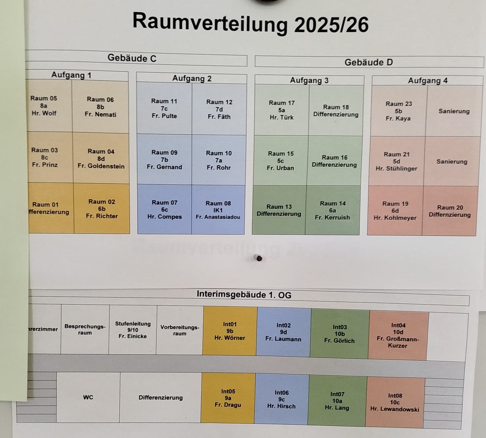
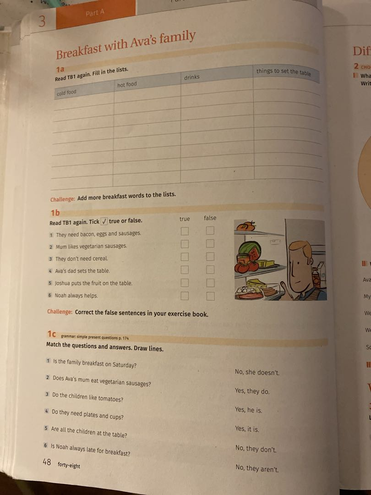
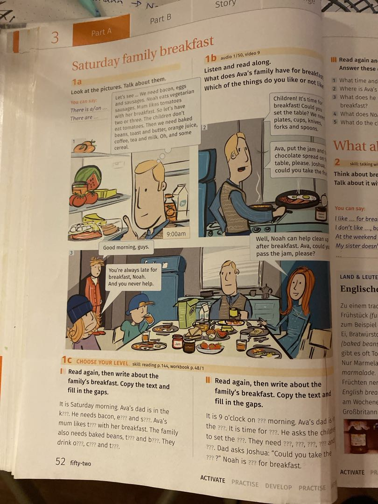
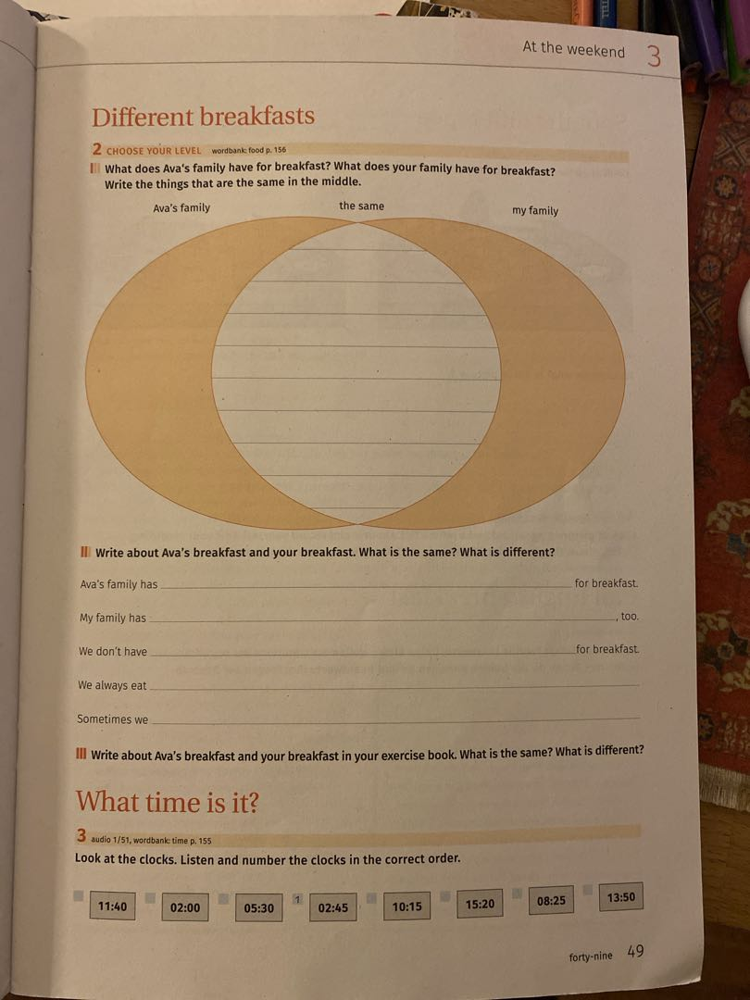
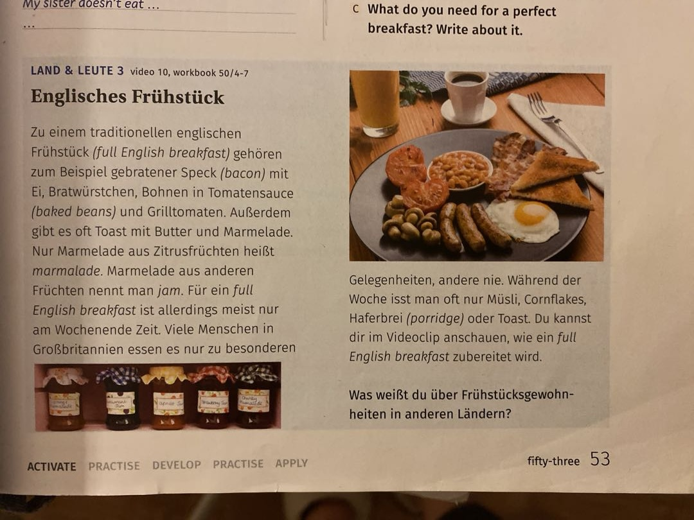
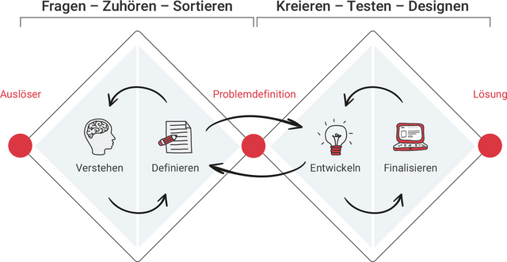

# ENS
Eintragung der Noten, es gibt ein Video zur Erklärung wie das geht.
# To-Do 
- [ ] Versmaß verstehen (Videos auf yt)
	- [ ] jambus
	- [ ] trochäus 
	- [ ] Reimschema 
- [ ] Stundenplan in den Kalender eintragen
	- [ ] kann man den exportieren?
- [ ] mir nen planer für die Notengebung anlegen
- [ ] Excel-Tabelle für noten, Anwesenheit, Anmerkungen, mündliche Mitarbeit 
	- [ ] notenverwaltung mit excel überlegen ob ich mir das kaufe oder ob ich mir das selbst erstelle
- [ ] googlen wie man die klassen Führung organisiert 
## Maßregeln
- konsequent das mit den Karten durchziehen 
- bei rot Brief an die Eltern/anrufen 
- [ ] Gegenstand/Kuscheltier/Stab, der der ihn in der Hand hat, ist mit reden dran?
	- Probier es einfach aus. Klasse 7?
	 An meiner vorherigen Schule (bin erst seit knapp 2 Jahren an der BAS) habe ich das immer gemacht in Klasse 5-8 ungefähr.
	 Hier habe ich es noch nicht ausprobiert, da ich bis auf eine kleine Französisch-Gruppe in der 7, nur 9 und 10 unterrichte und da mache ich das nicht mehr.
	 Ich würde es ausprobieren, könnte mir vorstellen, dass es gut klappt und für die Schüler sich damit gut fühlen, wenn klar ist, wer gerade dran ist.
	 Und falls es nicht gut klappt, dann eben nicht. Es kommt auch auf die Klasse an.

## Orga:
- [ ] Anwesenheit immer im Schulportal eintragen?
	- [ ] geht momentan wohl nicht, wenn es mein Unterricht ist, vielleicht weil ich wohl noch nicht umgestellt bin von VSS auf TVH
- [ ] Schul-ID und Dienst-Email einrichten
	- [ ] Sie haben ihr persönliches Einrichtungsschreiben* vorliegen
- [ ] Mein Unterricht bei ***nicht*** Vertretungsunterricht:
	- [ ] 4. Mai, Klasse 5c Deutsch. Konnte meinen Unterricht nicht eintragen, da keine Lerngruppe eingetragen ist.
- [ ] Wie muss die Dokumentation für die Klassen/ den Unterricht geführt werden?
	- [ ] Noten - wie setzen die sich genau zusammen? Was darf ich?
	- [ ] Kopfnoten
- [x] Hausmeister Schlüssel für Kunstschrank 
- [x] Sekretariat Mailingliste eintragen lassen
- [x] jamil nach kopierercode fragen 
- [ ] Wo ist das Bücherregal für Ethik?
- [ ] Browser profil für Schule anlegen
- Schlüssel für Lehrerparkplatz geben lassen da dieser für die Gartenag passt 
	- [ ] hab im Sekretariat nachgefragt, gab keinen mehr, muss auf Hausmeister warten
## Deutsch:
- [ ] haben wir einen L Schüler (Förderschwerpunkt Lernen) in der 5c?
- [ ] wie sieht es mit den Bewertungen der Rechtschreibung aus? 
- [ ] Was hat sich da entwickelt?
- [ ] ~={DeepSkyBlue}Klassenarbeit=~ Deutsch zu ~={MediumTurquoise}Zeitformen von Verben=~
- [ ] buch durch arbeiten
- [ ] Deutsch Schulbuch Material anschauen
	- [ ] hab ich wieder in den Schrank getan 🫣
- [x] eventuell Jugendbuch mit 5c in Deutsch 
	- ⟹ ist verworfen, da wir nicht so viel Zeit haben, wir machen Grammatik
	- "Herr der Diebe" hat 400 Seiten, ist zu lang

## Allgemein Fragen zum Unterricht:
- [ ] Wie organisiert ihr die Noten: Anita fragen, die mich in Deutsch unterstützt
- [ ] Wo werden die Noten eingetragen?
- [ ] was sind Maßnahmen?
- [ ] wie funktioniert das mit der Strichliste? rote, orange und gelbe karte

## Perspektive / Fortbildung
- Unterrichtsmaterialien 5 und 6 Klasse Englisch und deutsch suchen 
	- ⟹gibt nen Bücherschrank, dort sind jede Menge Materialien 
- lernen schneller und kleiner an der Tafel zu schreiben

- ~={Crimson}Schulsozialarbeit=~ fragen ob ich mal bei deren Aktivitäten teilhaben kann
- Quereinstieg:
	- Lehrkräfte Akademie
	- Studienseminar
- Scheine machen:
	- [ ] Kletterschein
	- [ ] Sportschein
	- [ ] Trampolinschein

Lina Tongue
# Bernhard Adelung Schule (BAS)
**Sekretariat:**
06151-13 480 700
**Code für den iPad Koffer** 
008 150 
**Kopiercode**
1803
**First login teacher pc**:
lukas.walter
Start123
**Telefon Lehrerzimmer**
Vorwahl zum raus telefonieren: 01
(13)-480713
**W-lan:**
- Schüler:
	- AdE1Ung!
- Lehrer:
	- B3Rnh@Rd
### Zeiten
- 1. 7:55 - 8:40
- 2. 8:40 - 9:25
- 3. 9:45 - 10:30
- 4. 10:30 - 11:15
- 5. 11:35 - 12:20
- 6. 12:20 - 13:05
## Raumplan 

## Stundenplan

Arbeitsstunden KW 19:
- 4.5.:
	- deu 5/6
- 5.5.:
	- deu 1/2
	- span 3/4 7b lea
	- eth 5/6
- 6.5: 
	- kunst 3/4 rot
	- kunst 5/6 rot
- 7.5.
	- deu 5a 2.
	- deut 5c 4
	- kunst 5b 5/6
- 8.5.
	- deu 1/2 5a
- 11.5
	- phy 3./4. 8d
	- phy 5/6 7c
---
- KW 19: 
	- Mo:
		- vermutlich übernehme ich die 3./4. am Montag 5a
		- eventuell montag klassenrat 5b
	- Di: 
		- 3./4. 5b (R23)
	- Fr: 
		- 3./4. 5b
## Sitzpläne
### 5a
![[Images/BAS/Sitzpläne/Sitzplan_5a.jpeg]]
### 5c

![[Images/BAS/Sitzpläne/Sitzplan_5c.jpg]]
## Klassenleiter Stunde
- Stuhlkreis
- Probleme besprechen
- Plastikmännchen (Blumentopf mit Pflanze oben drin) auf dem Pult
	- ⟹ als  ~={RedRed}Rednergegenstand=~
- Wie gehts mir eigentlich? / Wie fühle ich mich heute?
- Was ist am (verlängerten) Wochenende passiert?
- Probleme zwischen 
	- Schülern der Klasse?
	- mit Schülern aus anderen Klassen?
- Mobbing?
- Habt ihr Probleme mit mir? Feedbackrunde für mich / Kritik
	- jeder darf mal dran was zu mir sagen
	- was mache ich gut
	- was könnte ich besser machen
	- was findet ihr doof
- Vorschläge, was wir besser/ anders machen könnten, damit wir insgesamt produktiver im Unterricht sind?
- Ich würde mir wünschen:
	- Dass ich nicht alles 3 mal einem einzelnen Kind sagen muss
	- Wenn ihr ne Frage habt, dann stellt sie nach Möglichkeit einmal. Macht es für mich nicht leichter / verzögert den Prozess
	- Versucht Chaotische Situationen zu vermeiden
	- nehmt mich ernst, ich nehme euch auch möglichst ernst
		- wenn ihr das Gefühl habt, dass ich euch nicht ernst nehme, dann sprecht das bitte an.
		- ihr könnt auch gerne jederzeit mit mir alleine sprechen
	- versucht Konflikte zu deeskalieren
	- Unterstützt euch gegenseitig
	- versucht bei frau Rothemayer etwas kooperativer umzugehen.
		- sie ist nunmal nicht so flexibel
		- sie hat ihre festgefahrenen Muster ⟹ einfach akzeptieren und mit machen, umso schneller geht es vorbei
	- Lautstärke in der Klasse
	- Trinken und Toilettengänge: 
		- möglichst in den Pausen
		- nacheinander 
		- maximal zu zweit
		- ~={DeepPink}Namen an die Tafel schreiben -> danach wegwischen!=~ damit es für alle klar ist
		- wenn ihr gehen wollt, dann 
			- kurz auf die Tafel schauen, ist die Person da?
			- wenn ja, dann mir bescheid geben, dass ihr gehen wollt, dann dürft ihr in der Regel auch ohne Diskussion gehen
			- ist die Person/en auf der Tafel länger weg, dann sagt mir das in dem Fall
		- Ich sag das auch Frau Urban, bzw. habe ich ihr das schon angekündigt, dann macht sie das vielleicht auch bei euch
- Eigene Grenzen und Grenzen des anderen
	- ⤷ wann sind diese überschritten?
	- was mache ich?
	- Auswege?
	- Was ist mein Anteil?
	- Selbst wenn ich keinen Anteil habe, was ist mein Beitrag die Situation zu lösen?
	- möglichst energieeffizient
- sich gegenseitig zuhören. und versuchen die position des anderen so ~={LawnGreen}positiv wie möglich=~ auszulegen
- ⤷ gilt insbesondere auch für meine Aussagen und Erklärungen beispielsweise ~={RedRed}Opfer Aussage bzgl Sara=~ (~={DeepSkyBlue}Sara vorher fragen, ob ich das ansprechen darf=~)

- massin kam wegen des streiks 40 min zu spät, er musste von Kranichstein laufen 
- finnlay und glordi haben gefehlt 

## GL
- andrej und burak haben mich unterstützt

- Das ist der Sitzplan. 
  ![[../../6b-Sitzplan-Verlauf.jpg]]

	Andrej und eine Person saßen auf dem Platz wo laut Sitzplan nur Yazen sitzen sollte.

	Die habe ich dann auf ihre Plätze versetzt.

	Andrej ist ohne Stuhl zu seinem Platz gegangen.

	Die andere Person hat ihren Stuhl mitgenommen und dabei über den Boden geschleift, statt ihn hochzuheben.

	Dabei ist der Rucksack von Lina bis zum Sitzplatz der Person mitgeschleift worden.

	Der Tisch an dem Lina saß, war wie ich versucht habe zu verdeutlichen etwas weiter oben. Nicht auf der Höhe von Oles Tisch.

## Mathe
- Zentimeter deutsche Rechtschreibung - Shirin hatte da natürlich Recht, dem habe ich auch nicht widersprochen 
- lat. Decem - zehn
- lat. Centum - hundert
- lat. Milli - tausend 
- griech. Mikros - klein - eine millionstel
- 10er potzen

- Aufgabe jeder soll mal die Breite seiner Handfläche, die Breite seines kleinen Fingers und die Länge seines Unterarms ausmessen 
	- notieren 
- dann misst jeder mit diesen Maßen die breite und die Länge seines Tisches aus.
	- und berechnet damit den Flächeninhalt des Tisches 
	- ist gar nicht so einfach da es kein zehner System ist
	- in Mathe im Kontext nachlesen wie man da mit im stellen System gerechnet hat 
- eigene Körpergröße in foot and inch angeben

- Einheiten umrechnen 
	- giancolli p.12
	- ~={Gold}Beispiel=~ 
	- $1~\mathrm{in} =2.54~\mathrm{ cm}$ 
	- $1=\frac{\pu{ 1 in }}{\pu{ 2.54cm }}$
	- $\pu{ 64cm }=\pu{ 64 \cancel{cm} } \cdot \frac{\pu{ 1in }}{\pu{ 2.54\cancel{cm} }}= \frac{64}{2.54}\pu{ in }=\pu{ 25.19685 in }$
	- ~={DeepSkyBlue}Aufgabe=~ 
	- 55 miles per hour $\pu{ 55 mi//h}$ in $\pu{ km//h }$ and $\pu{ m//s }$ 
	- $\pu{ 1mi }=\pu{ 5280 ft }$
	- $\pu{ 1ft }=\pu{ 12in }$
	- $\pu{ 1m }=\pu{ 100cm }$
	- $\pu{ 1km }=\pu{ 1000m }$
	- $\pu{ 1h }=\pu{ 60min }$
	- $\pu{ 1min }=\pu{ 60s }$
- [ ] Flächeninhalt 
	- [ ] Kreis 
		- [ ] was ist $\pi$?
			- [ ] ~={underline}einfachste=~: Proportionalität zwischen Umfang $U$ und Durchmesser $d$
			- [ ] $\pi=\frac{U}{d}=\frac{U}{2r}$
			- ![[../Vertretrungslehrer/Images/BAS/Mathe/Pi-unrolled-720.gif]]
			- [ ] Vergleich ~={underline}Flächeninhalt=~ eines Kreises mit dem eines Quadrats
			- [ ] $\frac{4}{\pi}=\frac{A_{\text{Quadrat}}}{A_{\text{Kreis}}}=\frac{r^{2}}{A_{\text{Kreis}}}$
			- ![[../Vertretrungslehrer/Images/BAS/Mathe/01_Pi-Definition_mittels_Flächeninhalt.svg.png]]
		- [ ] Umfang 
	- [ ] Quadrat 
	- [ ] Rechteck 
	- [ ] Trapez 
	- [ ] Dreieck 
- [ ] Volumen 
	- [ ] Würfel 
	- [ ] Quader 
	- [ ] Tetraeder 
	- [ ] Zylinder 
	- [ ] Kugel 
## Englisch
### 2026-05-18

- Workbook last lesson:
  
- Textbook last lesson
  
- Workbook this lesson
  
- Textbook this lesson
  
## Deutsch

- bis zur 7. klasse allgemein keine Rechtschreibung bewerten.
- schönschreibe Heft:
	- die ersten 15 min nutzen
	- text im Buch heraus nehmen
- [ ] eventuell Jugendbuch mit 5c in Deutsch 
- Und dann hatten wir jetzt ein bisschen Wortarten wiederholt: Nomen, Verben konjugieren im Präsenz, Präteritum und Futur, aber das noch nicht intensiv.
	- [ ] dazu Übungsblätter suchen 
	- [ ] bzw. unterricht überlegen
### Timeline

#### 26-06-08

Spezielle Ortsfragen: Wo vs. Wohin

##### Die Ortsfragen **Wo?** und **Wohin?** hängen vom verwendeten Fall ab: [1](https://www.sprachschule-aktiv-muenchen.de/was-sind-praepositionen-und-faelle/), [2](https://www.youtube.com/watch?v=w5mlkqywSqo&t=1)

- **Wo? (Dativ)**  
    Fragt nach dem Ort (Ort der Handlung). Es passiert keine Bewegung.  
    _Beispiel:_ **Wo** ist das Buch? – Es liegt auf dem Tisch. (Der Tisch steht hier im Dativ: _dem Tisch_). [1](https://www.sprachschule-aktiv-muenchen.de/was-sind-praepositionen-und-faelle/), [2](https://www.superprof.de/blog/10-haeufige-rechtschreibfehler-im-deutschen/), [3](https://dein-sprachcoach.de/dativ-akkusativ/)
- **Wohin? (Akkusativ)**  
    Fragt nach einer Richtung oder einem Ziel. Es findet eine Bewegung statt.  
    _Beispiel:_ **Wohin** lege ich das Buch? – Auf den Tisch. (Der Tisch steht hier im Akkusativ: _den Tisch_)
	~={blue}Ausnahme=~ Präposition ~={LawnGreen}zu=~

##### Dativ Präpositionen

##### Wechselpräpositionen

**Arbeit nachbesprechen:**
#### 1b)
##### 1. *Der Sieger des Spiels erhält einen Pokal.*
Das Wort „Pokal“ steht in diesem Satz im ==**Akkusativ** (4. Fall)==. Es handelt sich dabei um das direkte Objekt des Satzes. [1](https://www.dwds.de/wb/Pokalwettbewerb), [2](https://de.wiktionary.org/wiki/Pokal)

**Warum ist das so?**

1. **Die Frage nach dem Fall:** Man kann das Objekt im Satz mit der Frage „Wen oder was erhält der Sieger des Spiels?“ erfragen. Die Antwort lautet: „Einen Pokal“. [1](https://der-artikel.de/der/Pokal.html), [2](https://www.sofatutor.com/deutsch/videos/der-4-fall-akkusativ-2), [3](https://www.youtube.com/watch?v=sqR3qU_Wnr0)
2. **Die Funktion im Satz:** Das Verb „erhalten“ verlangt zwingend ein Akkusativobjekt. Das Subjekt (der Sieger) erhält etwas, und die Sache, die man erhält (der Pokal), steht im Akkusativ. [1](https://www.sofatutor.com/deutsch/videos/der-4-fall-akkusativ-2), [2](https://www.verbformen.de/deklination/substantive/Pokal.htm)
3. **Der Artikel:** Der männliche bestimmte Artikel „der“ verändert sich im Akkusativ zu „den“. Bei der unbestimmten Form „ein“ heißt es folglich „einen“ (maskulin, Akkusativ). [1](https://de.wiktionary.org/wiki/Pokal), [2](https://www.dwds.de/wb/Pokalwettbewerb)
##### 2. *Das Menü hatte fünf Gänge*
Das Wort **Gänge** steht im **Akkusativ Plural**.

Der Grund dafür ist einfach: Das Verb _haben_ verlangt immer den Akkusativ (Wen-Fall). Da es sich um den Plural (Mehrzahl) von _Gang_ handelt, lautet die Form _Gänge_. [1](https://de.wiktionary.org/wiki/F%C3%BCnfganggetriebe), [2](https://www.persen.de/media/ntx/persen/sample/23156DA2_Musterseite.pdf?srsltid=AfmBOooyDRD-SEG1_no8IBJz2d5uA5xjR3O_8Jmu16JbVbwEwAD6ID1y), [3](https://deutsch.heute-lernen.de/grammatik/der-die-das/gang/deklination)

Zusammenhang im Satz:

- Wer oder was hatte fünf Gänge? -> Das Menü (Nominativ/Wer-Fall)
- Wen oder was hatte das Menü? -> fünf Gänge (Akkusativ/Wen-Fall) [1](https://www.webstaurantstore.com/blog/2578/full-course-meal.html)

##### 3. *Die Vereine verlegen das Spiel. *
Das Wort **Spiel** steht im Beispielsatz „Die Vereine verlegen das Spiel“ im **Akkusativ** (dem 4. Fall). Es ist der direkte Akkusativobjekt-Bezug im Satz. [1](https://deutsch.heute-lernen.de/grammatik/der-die-das/spiel/deklination), [2](https://der-artikel.de/das/Spiel.html), [3](https://www.mentorium.de/dativ-akkusativ-unterschied/), [4](https://www.sofatutor.com/deutsch/videos/der-4-fall-akkusativ-2)

Hier ist die genaue Erklärung warum:

- **Die Frage für den Fall:** Man fragt im Deutschen mit „Wen oder was?“ nach dem Akkusativ. In diesem Fall fragt man: _Wen oder was verlegen die Vereine?_ Die Antwort lautet: _das Spiel_. [1](https://www.sofatutor.com/deutsch/videos/der-4-fall-akkusativ-2), [2](https://www.artikelfinder.com/de/das/spiel/), [3](https://der-artikel.de/das/Spiel.html)
- **Die Funktion im Satz:** Das Verb „verlegen“ (in der Bedeutung von _verschieben_) verlangt zwingend ein Akkusativobjekt, damit der Satz vollständig ist. Die Vereine (das Subjekt im Nominativ) führen die Handlung an dem Spiel (dem Akkusativobjekt) aus.

##### 4. Dem Vater gefällt das Zeugnis des Schülers.
Das Wort **Zeugnis** steht im **Nominativ** (1. Fall). [1](https://www.sprachnudel.de/woerterbuch/Zeugnis), [2](https://www.worterarbeitung.com/zeugnis/)

**Warum ist das so?**  
In diesem Satz ist „das Zeugnis“ das **Subjekt**. Es ist derjenige Teil des Satzes, der die Handlung ausführt oder auf den sich das Geschehen bezieht. [1](https://www.perfekt-deutsch.de/wissen/kasus/)

Du kannst danach fragen mit: _Wer oder was gefällt dem Vater? -> Das Zeugnis._

Der restliche Satz ist wie folgt aufgebaut:

- **Dem Vater**: Das ist das Dativ-Objekt (3. Fall), denn das Verb _gefallen_ verlangt immer den Dativ (Wem gefällt etwas?).
- **des Schülers**: Das ist der Genitiv (2. Fall) und zeigt den Besitzer an (Wessen Zeugnis?). [1](https://www.perfekt-deutsch.de/wissen/kasus/)

##### 5. *Das Mädchen kümmert sich um das Pony.*
In dem Satz **"Das Mädchen kümmert sich um das Pony."** steht **"Pony"** im **Akkusativ**.

**Warum?**

- Das Verb **"sich kümmern um"** verlangt den **Akkusativ** für das Objekt, um das man sich kümmert.
- **"das Pony"** ist hier das **direkte Objekt** (Akkusativobjekt) der Handlung.

**Bestätigung:**

- **Nominativ:** _Das Pony_ (Subjekt, z. B. _"Das Pony frisst Heu."_)
- **Akkusativ:** _das Pony_ (Objekt, z. B. _"Sie streichelt das Pony."_)
##### 6. *Wir fahren mit dem Schiff zu einer Insel*
In dem Satz _"Wir fahren mit dem Schiff zu einer Insel"_ steht das Wort "Insel" im **Dativ**. [1](https://www.verbformen.de/deklination/substantive/Insel.htm), [2](https://berlinoschule.com/prepositions-of-time-and-place/)

Hier sind die grammatikalischen Gründe:

- **Präposition:** Das Wort "zu" ist eine feste Dativpräposition. Sie verlangt immer den dritten Fall (Wem-Fall).
- **Artikel:** Der weibliche unbestimmte Artikel "einer" zeigt den Dativ für die Begleiter (Maskulin/Neutrum: einem, Feminin: einer) deutlich an
_Hinweis zur Bewegung:_ Da Sie mit dem Schiff auf eine Insel reisen (Zielort), können Sie alternativ auch die Wechselpräposition "auf" verwenden. In diesem Fall stünde "Insel" im Akkusativ: _"Wir fahren mit dem Schiff auf **die** Insel._"
##### 7. *Morgen kommen die Großeltern zu uns in den Garten. *
Das Wort „Garten“ steht im **Akkusativ** (dem 4. Fall). [1](https://vs-material.wegerer.at/deutsch/pdf_d/sprachbetrachtung/faelle/ab_bestimmen_loesung.pdf)

Der Grund dafür ist die sogenannte **Wechselpräposition** „in“. Bei dieser Präposition entscheidet die Frage nach dem Ort oder der Richtung über den Fall: [1](https://www.scribbr.de/fall-nach-praepositionen/in-dativ-oder-akkusativ/), [2](https://deutsch-mit-anna.de/lektion/dativ/), [3](https://grammatikfragen.de/showthread.php?1411-hei%DFt-es-Trotzdem-bestehe-ich-auf-die-%C4nderung.-oder-Trotzdem-bestehe-ich-auf-der-%C4nderung.), [4](https://de.wikipedia.org/wiki/Akkusativ)

- **Wo? (Ort/Ruhe)** ⟹ **Dativ** (z.B. _„Wir sind **im** [in dem] Garten.“_)
- **Wohin? (Richtung/Ziel)** ⟹ **Akkusativ** (z.B. _„Wir gehen **in den** Garten.“_) [1](https://de.pons.com/p/wissensecke/grammatik-to-go/wechselpraepositionen-deutsch), [2](https://www.scribbr.at/fall-nach-praepositionen-at/in-dativ-oder-akkusativ/)

Da die Großeltern sich auf den Garten **zubewegen** (sie kommen dorthin), fragt man nach dem „Wohin?“. Das verlangt den Akkusativ.

##### 8. *Ich helfe der Mutter bei der Hausarbeit.*
In dem Satz **"Ich helfe der Mutter bei der Hausarbeit."** stehen die Wörter wie folgt:

- **"der Mutter"** → **Dativ**
- **"der Hausarbeit"** → **Dativ**

###### Warum?

Das Verb **"helfen"** verlangt immer den **Dativ** für die Person, der geholfen wird.

- **"der Mutter"** ist das **indirekte Objekt** (Dativobjekt), also die Person, der geholfen wird.

Die Präposition **"bei"** verlangt ebenfalls den **Dativ**.

- **"der Hausarbeit"** ist das **Objekt der Präposition "bei"** und steht daher auch im Dativ.

In dem Satz „Ich helfe der Mutter bei der Hausarbeit“ stehen beide Wörter ==im **Dativ** (dem 3. Fall)==. [1](https://www.grundschulkoenig.de/die-4-faelle/?srsltid=AfmBOopWSYOGbQjmONILAl0plv-lYIQnqhNzW1FfYqsGWdHuNR1LBg-C)

- **der Mutter**: Der Dativ wird hier durch das Verb „helfen“ verlangt, das immer den Dativ fordert (Frage: _Wem_ helfe ich? → der Mutter).
- **der Hausarbeit**: Der Dativ wird durch die Präposition „bei“ ausgelöst, auf die immer der Dativ folgt (Frage: _Bei was_ / _Bei wem_ helfe ich?). [1](https://www.studienkreis.de/deutsch/vier-faelle-kasus-bestimmen/), [2](https://www.elternwissen.com/erziehung-entwicklung/trotzphase/dativ-oder-genitiv-die-vier-faelle-ihrem-kind-richtig-erklaeren/), [3](https://www.perfekt-deutsch.de/wissen/kasus/), [4](https://www.grammatikdeutsch.de/html/falle-info.html), [5](https://www.grundschulkoenig.de/die-4-faelle/?srsltid=AfmBOopWSYOGbQjmONILAl0plv-lYIQnqhNzW1FfYqsGWdHuNR1LBg-C)

- **Nominativ (Wer-Fall)**: _Wer_ hilft hier? → Ich
- **Akkusativ (Wen-Fall)**: Kommt in diesem Satz nicht vor

##### 9. *Peter sortiert die Briefmarken in sein Album.*
==In dem Satz „Peter sortiert die Briefmarken in **sein Album**“ stehen die Substantive in folgenden Fällen:==

- **Briefmarken** steht im **Akkusativ** (Wen-Fall)
- **Album** steht ebenfalls im **Akkusativ** (Wen-Fall)

**Warum ist das so?**

1. **Briefmarken:** Es ist das direkte Objekt (Wen-Fall) des Satzes. Man fragt: _Was_ sortiert Peter? -> _Die Briefmarken_.
2. **Album:** Nach dem Verb _sortieren_ (bzw. der Richtungsangabe „in“) fragt man mit _Wohin?_. Bei der Frage _Wohin?_ steht das nachfolgende Nomen im Deutschen immer im Akkusativ (z. B. „in _das_ [oder kurz _sein_] Album“). [1](https://de.scribd.com/doc/216733184/Polnisch-Wort-fur-Wort-pdf)

---

### Warum?

Das Verb **"helfen"** verlangt immer den **Dativ** für die Person, der geholfen wird.

- **"der Mutter"** ist das **indirekte Objekt** (Dativobjekt), also die Person, der geholfen wird.

Die Präposition **"bei"** verlangt ebenfalls den **Dativ**.

- **"der Hausarbeit"** ist das **Objekt der Präposition "bei"** und steht daher auch im Dativ.
#### 26-05-21
Personalpronomen in den Vier Fällen
![[Images/BAS/Deu/Personalpronomen.jpg]]

|      |          | Singular     |        |          |        |          | Plural         |          |
| ---- | -------- | ------------ | ------ | -------- | ------ | -------- | -------------- | -------- |
|      | 1. Pers. | 2. Pers.     |        | 3. Pers. |        | 1. Pers. | 2. Pers.    | 3. Pers. |
| Nom. | ich      | du           | er     | sie      | es     | wir      | ihr         | sie      |
| Gen. | meiner   | deiner    | seiner | ihrer    | seiner | unser    | euer        | ihrer    |
| Dat. | mir      | dir       | ihm    | ihr      | ihm    | uns      | euch        | ihnen    |
| Akk. | mich     | dich      | ihn    | sie      | es     | uns      | euch        | sie      |

#### 26-05-18
- Rayan Buttar:
	- generell aufmümpfig
	- macht im Unterricht nicht mit
	- stört andere Schüler
	- beschimpft mich
	- geht einfach aus der Klasse raus
	- heute behauptet, dass ein Mädchen im anderen Raum vapen würde und hat die ganze Klasse aufgehetzt
	- weiterhin ist er durch den Differenzierungsraum/anderen Raum gegangen und hat eine andere Klasse gestört 
		- deren lehrer ist dann zu uns gekommen 
	- weiterhin hat er schon mehrfach die Klassentür zu gehalten als ich draußen war
##### 26-05-08 Vertretung fr kaya
- gut mit gemacht: 
	- yasser
	- abdulrahman
	- marvellous
	- kevin
	- pavlo
	- elena
- ok mitgemacht:
	- naz
	- hajar
	- precious
	- dunja
- sehr gut mitgemacht:
	- yasemin
	- amlia
	- semanur
	- Polina
##### 26-05-12
Zu spät:
- massin

Nicht da: 
- finlay
- sherin 
- glordi
##### 26-05-07
Handschriftliche Anmerkung:

| Nominativ  | Nominativ (pl) | Genitiv (sg.)                       | Genitiv (pl.) | Dativ (sg.) | Dativ (pl)                     | Akkusativ (sg) | Akkusativ (pl) |
| ---------- | -------------- | ----------------------------------- | ------------- | ----------- | ------------------------------ | -------------- | -------------- |
| der (Baum) | die (Bäume)    | des (Baum)~={MediumTurquoise}(e)s=~ | der (Bäume)   | dem (Baum)  | den (Bäume)~={DeepSkyBlue}n=~  | den (Baum)     | die (Bäume)    |
| das (Kind) | die (Kinder)   | des (Kind)~={MediumTurquoise}(e)s=~ | der (Kinder)  | dem (Kind)  | den (Kinder)~={DeepSkyBlue}n=~ | das (Kind)     | die (Kinder)   |
| die (Maus) | die (Mäuse)    | der (Maus)                          | der (Mäuse)   | der (Maus)  | den (Mäuse)~={DeepSkyBlue}n=~  | die (Maus)     | die (Mäuse)    |
~={MediumTurquoise}Genitiv=~
<u>sg:</u> der/das -> des +(e)s     die -> der
<u>pl:</u> die -> der 

~={DeepSkyBlue}Dativ=~
**Kurzform passt wunderbar im Kasten unter: 3. Fall**
<u>sg:</u> der/das -> dem       die    -> der
<u>pl:</u> die -> den +n

~={Gold}Akkusativ=~
<u>sg:</u> der -> den 

in den anderen Fällen bleibt der Artikel erhalten
 
#### 26-05-04
- Begrüßung
- Anwesenheit
- Märchen habt ihr gemacht und auch dazu eins selbst geschrieben. 
	- Ich Möchte mal einige hören, wer es mir vorträgt, bekommt ein bonus eingetragen 
- Blätter zeigen lassen, die zuletzt in Deutsch gemacht wurden
- paul D:
	- Seite 93 Aufgabe 1
	- Seite 95 Aufgabe 2
	- Seite 96 Alle Aufgaben
	- Seite 97 Aufgabe 7
- das Buch was die Klasse nutzt ist älter
- Meros Sammlung: die ersten 4 Seiten 20 mal kopieren

- gemacht: 
	- 211 nr 5
	- 212 nr 1+2
	-  Rest Hausaufgabe 
- Mitarbeit:
	- noble, sara, daisy, ömer, lisa marie gut
	- hasenat und sherin haben hefte draußen gehabt, haben aber nichts gemacht 
	- rest Katastrophe:
		- finlay: bewirft mich und andere 
		- anas
		- rayan und glordi bewerfen delsa
		- massin, finlay und rayan sind am Fenster und rufen Beleidigungen 

#### Bisher
- Märchen:
	- es wurde eins selbst geschrieben in der Gruppe
	- Dazu ~={red}Klassenarbeit=~
	- ⤷ also noch eine ~={MediumTurquoise}Klassenarbeit offen=~
- ein bisschen Wortarten wiederholt: Nomen, Verben konjugieren im Präsenz, Präteritum und Futur, aber das noch nicht intensiv.
### Material
- P.A.U.L. D., ist das Deutsch Buch, dazu gibt es viel Material
	- Die Wunderbare Welt der Wörter: 90
		- Nomen und Artikel: 92
		- Verben: 103
			- Zeitformen: 107
				- Präsenz: 107
				- Präteritum: 109
				- Perfekt: 110
				- Plusquamperfekt: 112
				- Futur 1 und 2: 113
		- Adjektive: 116
		- Pronomen: 119
		- Präpositionen: 122
		- Das habe ich gelernt, das kann ich: 124
### Glossar
#### warum lesen? 
- macht man in erster Linie für sich
- es eröffnen sich neue Welten 
- und wenn man sich die Sachen selbst vorstellt statt sie als bilder zu bekommen passiert ganz viel im Gehirn 

#### Jambus
#### Trochäus

#### Reimschema
#### Stabreim 
Der Stabreim (auch Alliteration) ist ein sprachliches Stilmittel, bei dem benachbarte, betonte Wörter mit demselben Anlaut (Konsonant oder Vokal) beginnen. Er war die metrische Basis der alten germanischen Dichtung und verbindet Klang mit Bedeutung. Heute dient er oft als einprägsames Stilmittel in Slogans oder festen Wendungen (z.B. „Milch macht müde Männer munter“).
## Ethik

### Planung 
Nach der Benotung bzgl Vortrag:
- full metal jacket, die Anfangsszene ohne den selbstmord in Ethik zeigen. Vielleicht vorher fragen, ob ich das darf....
### Verbindliche Unterrichtsinhalte/Aufgaben: 
- „Mal OBEN – mal UNTEN“ → 
	- Wahrnehmungsspiele zu diesen Positionen durchführen / dabei die Körperwahrnehmung und die Gefühle verbalisieren. OBEN ist nicht immer angenehmer als UNTEN 
- „OBEN – UNTEN - POSITIONEN“ → 
	- Lehrer – Schüler / Chef - Angestellter / Mann – Frau / Gott – Mensch / Arme – Reiche / Eltern – Kind / etc. identifizieren und besprechen 
	- Abhängigkeiten als Grunderfahrung des Menschen erkennen/Abhängigkeiten als Ausdruck von Machtverhältnissen erkennen 
	- Perspektivenwechsel vornehmen und besprechen (Rollenspiel) 
- „Positionen auf gleicher Augenhöhe“ → 
	- Beispiele suchen (Freunde / Geschäftspartner / etc.)  
	- Rücksicht und Empathie als Grund für den Verzicht auf OBEN-Positionen erkennen

### 26-06-03
Alle die etwas abgegeben haben: 1-2

Alle die nichts abgegeben haben 5

Falls Vortrag gehalten wird, ändert sich das nochmal.
### 26-05-12
- SRF Kultur:
	- STRASSENBAHN
	- Schleier des Nichtwissens - Kann Ungleichheit gerecht sein?
	- GEIGER - Abtreibung
	- TEEKANNE - Existiert Gott?
	- KIND IM TEICH - Gerechte Welt?
	- DAS SCHIFF DES THESEUS - Bin ich im Alter noch die selbe Person?
	- GEHIRN IM TANK - Gibt es Realität?
	- Gavagai - Sprachen verstehen/Missverständnisse
	- MENSCHENFLEISCH ⟹ ~={Crimson}geht nicht im Schulwlan=~
	
	
### 26-05-05
- [ ] ideologischer Turing Test
	- ~={underline}Turning Test der 60iger: =~sitzt hinter einer Wand und soll entscheiden ob man mit einer KI oder einem menschen auf der anderen Seite der wand spricht ⟹ wenn man nicht mehr unterscheiden kann, dann hat die KI den Test bestanden und ihr wird menschliche intelligenz zu gesprochen
	- ~={underline}ideologischer Turing test=~: meinem Debattengegner erklären, was ~={underline}er denkt=~ bzw. was dessen Positionen sind und wie er zu diesen kommt, so dass dieser sagen kann ~={underline}genauso denke ich=~ ⟹ ideologischer turing test bestanden 
		- ⟹ sollte man immer versuchen, bevor man sich auf eine debatte einlässt
		- ~={RedRed}wir neigen immer dazu die andere Seite zu dämonisieren und als korrupt, verblödet oder bösartig darzustellen=~
		- ~={LightBlue}wenig verständnis dafür, dass Vielleicht die moralischen und politischen Überzeugungen der gegenseite oder als solche wahrgenommen Gegenseite vielleicht gar nicht so übel sein können=~
		- ~={green} man sollte an politischen debatten erst teilnehmen, wenn man die position der gegner so artikulieren kann, dass die gegner diese artikulation akzeptieren=~
		- ⤷ erst dann die politische Gegenseite so verstanden hat, dass man darüber reden kann, wer eigentlich recht hat
		- ⤷ es geht dabei nicht darum die andere Seite zu übernehmen, sondern erstmal auf ein level zu kommen
	- die günstigste Variante des Gegners annehmen. ~={Gold}The benefit of the doubt.=~ The benefit of the doubt.
- ihr seid im Internet und auf social Media unterwegs?
- ihr hattet Streit mit einem Freund?
- Eure Eltern haben euch etwas verboten?
- Eure Eltern, die Lehrer und die Schule stellen euch Regeln und Grenzen auf?
- ihr wurdet beleidigt oder angerempelt
- wie habt ihr euch dabei gefühlt?
- lernen die Positionen, Argumente und auch unqualifizierte Äußerungen anderer auszuhalten 
- Situation mit dem Wort "nega" erklären 
	- argumentiert dafür warum ich das sagen darf
	- argumentiert dagegen dass ich das sagen darf
- [ ] ethik lehrplan
	- [ ] was kommt nach moral
	- [ ] arbeitsblätter dazu
	- [ ] Arbeitsblatt zu Kohlbergs Theorie der Moralentwicklung, vielleicht ein video schauen
	- [ ] Ebenen der kommunikation nach friede mann schulz von thun
	- [ ] zur Moral eine Debatte führen
	- [ ] mir ein kontroverses Thema heraussuchen, jeweils eine Gruppe dafür und eine Gruppe dagegen
	- [ ] moralisch debattieren / argumentieren
	- [ ] ist es in ordnung fleisch zu essen
	- [ ] Tierversuche
	- [ ] schwangerschaftsabbrüche
	- [ ] leihmutterschaft
	- [ ] Ist Entwicklungshilfe gut oder sogar nötig?
	- [ ] sterbehilfe
	- [ ] Ist die Forschung zu Menschenrassen überhaupt vertretbar?
	- [ ] Sprechverbote/Tabus:
		- [ ] N-Wort
		- [ ] Z-Wort
		- [ ] stattbehindert -> benachteiligt
		- [ ] weitere Beispiele
		- [ ] dürfen bestimmte Menschen nur bestimmte Worte sagen
	- [ ] darf man die AfD wählen? darf man Vertretern der AfD eine "Bühne bieten"? Ist rechts sein teil es demokratischen Spektrums? Ist es Links sein? was ist das überhaupt?
	- [ ] medizinische studien:
		- [ ] ist es ethisch vertretbar einer gruppe ein Placebo zu geben
		- [ ] Wann ist das ok, wann ist das nicht ok?
	- [ ] ein film / ausschnitt aus einer diskussion zeigen
- [ ] Ethik Arbeit anschauen
### Gedankenexperimente
- [Schleier des Nichtwissens - Kann Ungleichheit gerecht sein?](https://www.youtube.com/watch?v=1cGYwwSg3fc)
  Wie soll ein Staat aufgebaut sein? Wieviel Gleichheit braucht es dazu? Und was ist überhaupt Gerechtigkeit? Mit diesen Fragen beschäftigt sich das philosophische Gedankenexperiment «Schleier des Nichtwissens». Sein Erfinder behauptet, Ungleichheit könne gerecht sein – sofern alle davon profitieren.
- [MENSCHENFLEISCH](https://www.youtube.com/watch?v=QBBY04zTaXI&list=PL1u-zzk6SurZrva064nEiJX8-IFb5cNd7&index=2)
  Stellen Sie sich vor: Aliens überfallen die Erde, nehmen uns Menschen gefangen und verspeisen das Fleisch unserer Kinder. Warum finden wir das falsch, obwohl wir mit Tieren dasselbe machen? Diese Frage stellt das philosophische Gedankenexperiment «Menschenfleisch».
- [STRASSENBAHN](https://www.youtube.com/watch?v=MhOJp1DcabM&list=PL1u-zzk6SurZrva064nEiJX8-IFb5cNd7&index=3)
  Was ist schlimmer: Fünf Menschen sterben lassen oder einen Menschen töten? Dürfen Menschenleben gegeneinander abgewogen werden? Um diese ethischen Fragen dreht sich das Gedankenexperiment «Strassenbahn», das uns die zwei wichtigsten Theorien der Moral näher bringt: Utilitarismus und Pflichtethik.
- [GEIGER - Abtreibung](https://www.youtube.com/watch?v=8lZCmSZhIPo&list=PL1u-zzk6SurZrva064nEiJX8-IFb5cNd7&index=4)
  Ungewollte Schwangerschaft – was tun? Was ist höher zu gewichten: die Selbstbestimmung der schwangeren Frau oder das Leben des Kindes? Um diese Fragen kreist das Gedankenexperiment «Geiger». Die Erfinderin argumentiert für die Selbstbestimmung der schwangeren Frau – und spricht von Notwehr.
- [DAS SCHIFF DES THESEUS - Bin ich im Alter noch die selbe Person?](https://www.youtube.com/watch?v=9zl8j7eq-Is)
  Wer bin ich? Warum bin ich ich? Und wie kann ich mich selbst bleiben, wenn ich mich doch ständig verändere? Mit diesen Fragen beschäftigt sich eines der bekanntesten Gedankenexperimente der Philosophie: Das Schiff des Theseus.
- [MARY - Materie oder Geist](https://www.youtube.com/watch?v=3Me1YDYK6tw)
  Ist alles nur Materie und unser Geist letztlich nichts anderes als das Gehirn? Mit dieser Frage beschäftigt sich das Gedankenexperiment «Mary». Es möchte zeigen, dass unser bewusstes Erleben nicht auf physikalische Prozesse reduziert werden kann. Der Geist ist mehr als das Gehirn. Doch stimmt das?
- [TEEKANNE - Existiert Gott](https://www.youtube.com/watch?v=TwnWnl3kf1I)
  Können Sie beweisen, dass Gott existiert? Können Sie es widerlegen? Und woran sollte man glauben, wenn Gott weder beweis- noch widerlegbar ist? Diese Fragen stellt das Gedankenexperiment «Teekanne». Es möchte zeigen, dass die Nichtwiderlegbarkeit Gottes noch kein Grund ist, an ihn zu glauben.
- [GEHIRN IM TANK - Gibt es Realität?](https://www.youtube.com/watch?v=6fYdfa_czw8)
  Woher wissen wir, dass die Welt wirklich so ist, wie wir sie erleben? Könnte es sein, dass unser ganzes Leben eine Illusion ist? Mit diesen Fragen beschäftigt sich das philosophische Gedankenexperiment «Gehirn im Tank». Der Erfinder behauptet, es sei undenkbar, dass wir uns radikal täuschen.
- [KIND IM TEICH - Gerechte Welt?](https://www.youtube.com/watch?v=7bwM_atwgyc)
  Fast die Hälfte aller Menschen leben in Armut. Täglich sterben bis zu 25'000 Kinder an deren Folgen. Was tun? Wozu sind wir moralisch verpflichtet? Mit diesen Fragen beschäftigt sich das Gedankenexperiment «Kind im Teich». Der Erfinder meint, es sei unsere Pflicht, mehr zu spenden.
- [LIEBESPILLE - Ist Liebe eine Entscheidung?](https://www.youtube.com/watch?v=eqr75CUQUL8)
  Lässt sich Liebe begründen? Und macht sie blind? Ein Ausflug ins philosophische Wunderland der Liebe.
- [GAUGUIN - Gibt Erfolg immer recht?](https://www.youtube.com/watch?v=f-xme0sHTu8)
  Das philosophische Gedankenexperiment «Gauguin» Der Maler Paul Gauguin verliess seine Familie, um sich der Kunst zu widmen. Mit Erfolg. Aber Rechtfertigt der Erfolg auch sein Verhalten? Und welche Rolle spielt der Zufall für die Moral? Mit diesen Fragen beschäftigt sich das philosophische Gedankenexperiment «Gauguin».
- [Die Illusion des Freien Willens](https://www.youtube.com/watch?v=T8xqZp5a_Wo)
- [Gavagai - Sprachen verstehen/Missverständnisse](https://www.youtube.com/watch?v=JfPJIAewi_8) Die Sprache hat ihre Tücken. Missverständnisse lauern überall. Können wir jemals sicher sein, andere Menschen richtig zu verstehen? Um diese Frage kreist das Gedankenexperiment «Gavagai». Sein Erfinder glaubt, für ein gelingendes Verstehen braucht es Wohlwollen.
- [GROSSVATERPARADOX -  Sind Zeitreisen denkbar?](https://www.youtube.com/watch?v=RXk-RUKv6G8&t=1s) Zeitreisen sind ein alter Menschheitstraum. Einige moderne Physiker halten sie sogar für möglich. Aber Vorsicht: Es lauern überall Widersprüche und Paradoxien, wie das berüchtigte «Grossvaterparadox». Ein Gedankenexperiment für Scharfsinnige.

- [ ] Gedanken zu klaren Antworten zu den Ethik Gedankenexperimenten aufschreiben 
	- [ ] Stichpunkte die mir bei der Beschreibung der videos wichtig sind
	- [ ] Kriterien zu den eigenen Gedanken 
	- [ ] Straßenbahn 
		- [ ] autonomes fahren
			- [ ] bremsen versagen 
		- [ ] kleines Kind mit Vater vs schwangere Frau
		- [ ] ausweichen beim Wildwechsel
			- [ ] machen viele Menschen falsch 
		- [ ] Autonome Kampfdrohnen 
		- [ ] Kollateralschäden im krieg oder bei Terroranschlägen
		- [ ] Rettungsdienst bei Blaulichtfahrt 
		- [ ] Polizei Verfolgungsjagd 
	- [ ] kind im Teich 
		- [ ] Charity paradoxon
			- [ ] ⟹ Abhängigkeiten
			- [ ] Zerstörung der lokalen Wirtschaft 
			- [ ] hilfe zur Selbsthilfe 
			- [ ] Charity ist ineffizient 
			- [ ] Hilfe bzw Handel auf Augenhöhe 
		- [ ] Mitgefühl mit obdachlosen
			- [ ] ⟹helfe ich da wirklich 
			- [ ] mache ich das nur fürs gute Gefühl 
			- [ ] wofür gibt dieser das Geld aus?
		- [ ] Sozialhilfe 
	- [ ] Geiger/Abtreibung 
		- [ ] wie kam es zur Schwangerschaft?
		- [ ] Beispiel wirklich mit Schwangerschaft vergleichbar?
		- [ ] berühmter Geiger 
			- [ ] hat ja schon gelebt 
			- [ ] ist nicht wirklich mehr wert 
		- [ ] Kompromiss?
		- [ ] wann ist ein Embryo "Leben"?
		- [ ] was sind Faktoren die bei ungewollten Schwangerschaften wichtig sind? 
		- [ ] wie kann mit ungewollten Schwangerschaften umgegangen werden?
		- [ ] was ist mehr "wert" das ungeborene ? (Zellhaufen) Oder die Selbstbestimmung der Frau. Es sind ja nicht nur 9 Monate, es ist ja ein ganzes Leben 
	- [ ] Menschenfleisch 
		- [ ] muss nicht immer etwas sterben damit man selbst leben kann?
		- [ ] wie sieht es mit vegetarischer 
		- [ ] wie mit Veganer Ernährung aus? 
		- [ ] ist es besser kuh oder Hühner Fleisch zu essen? 
		- [ ] 1 kuh vs viele Hühner?
		- [ ] Weidehaltung?
		- [ ] Tierhaltung im allgemeinen?
		- [ ] eier/Hühnerhaltung/Küken schreddern/aktuelle Situation wirklich besser? Video vom hr zeigen [Küken schreddern](https://youtu.be/cPbyXoVK0JM?is=CaBiPjPQJR-WnBak) 
		- [ ] schächtung?
		- [ ] Menschenfleisch im Notfall? 
			- [ ] Flugzeug Absturz in den Anden 
	- [ ] Teekanne 
		- [ ] glaube/mache ich alles was man mir sagt wenn etwas begründet wird mit "weil Gott!"
		- [ ] Buchreligionen 
		- [ ] religiöse Kleidung 
			- [ ] warum so und nicht anders?
			- [ ] warum gibt es da kulturelle Unterschiede?
		- [ ] warum glaube ich exakt das?
			- [ ] geboren als?
		- [ ] kann ich alles wissen?
		- [ ] muss ich alles wissen? 
		- [ ] Genitalverstümmelung!
			- [ ] wenn Gott den Menschen erschaffen hat
			- [ ] warum entfernt man Dinge am Körper?
		- [ ] Viren und Bakterien?
		- [ ] Elektronen und Atome
		- [ ] Gase
		- [ ] Vakuum
		- [ ] Messgeräte 
		- [ ] Fitness tracker 
		- [ ] computer /CPU 
		- [ ] Chatgpt/large language model
		- [ ] Mikroskope
		- [ ] studien
		- [ ] Nachrichten 
	- [ ] gibt es Realität 
		- [ ] was sind Schmerzen /wie entstehen diese?
		- [ ] wenn jemand etwas nicht schreien kann, empfindet es Schmerzen 
		- [ ] finden Dinge statt, wenn ich sie nicht sehe? 
		- [ ] kann ich dem überhaupt trauen was ich sehe?
		- [ ] wie stieh es mit meiner Erinnerung aus?
	- [ ] Sprachen 
		- [ ] Farben haben in verschiedenen Sprachen verschiedene Bedeutungen 
		- [ ] verschiedene Begriffe von Zeit 
		- [ ] Himmelsrichtungen 
		- [ ] Video von nano bzw 42 zu Sprachen 
	- [ ] Gehirn im Tank
		- [ ] Was ist das ich?
		- [ ] Warum sehe ich die Welt aus dieser Ich-Perspektive?
		- [ ] Warum bin ich in meinen Körper geboren worden?
		- [ ] Ist das nicht eigentlich eine Lotterie?
		- [ ] Computerspiele gespielt?: da respawnt man ja auch immer wieder neu und sieht die Welt aus der Perspektive eines spielers
## Kunst
- Kinder brauchen ein Anfang und ein Ende
- Am ende jeder hinter hochgestellten Stuhl stellen und Endbesprechung machen (5 min vor Schluss, wenn alles aufgeräumt ist)
- Wir schweigen in Worten und mit dem Körper
- niemals könnt ihr vorher gehen
- Note für Muttertagskarte
- Ein Teil kann ihre Karte fertig machen und Rest fängt Fische Bilder an, Vorder und hintergrund
- Immer alles vorher ausprobieren
## Garten AG
- Teich anlegen?

## Schwarze/Sklaverei/N-Wort
- Die weißen waren nicht die die die Sklaverei erfunden haben, sie waren aber die ersten die sie verboten/abgeschafft haben.
- Der Grund dafür, dass es in den Orten in denen es auf der Welt keine Sklaverei gibt - es gibt viele Orte auf der welt in der es Sklaverei gibt, zb. Afrikanische Länder oder die arabischen Staaten - ist da es das britsche Empire abgeschafft hat.
- trans atlantic slave trade:
	- schwarze haben schwarze versklavt um sie an weiße zu verkaufen
- before:
	- trans saharian slave trade (arab slavers sold black slaves): millions of black africans across the sahara 
	- east african islamic slave trade:
	- barbary/cosarian slave trade (arab and african raiders): captured and sold over a million white christian europeans
- trans atlantic slave trade: they had the technology to commit evil on an industrial scale
- 1807 abolish of slave trade: 
	- pro human christian values
	- same values that drove white americans to fight other white americans in the civil war
- white people aren't better than anyone else, but they are not worse 
- native americans enslaved each other
- the ottoman empire enslaved people on all of their theretory

## Islam 

### [Who ever kills an innocent person...](https://www.youtube.com/watch?v=yfqduwXVSgQ)
- [**Quran 5:32:**](https://legacy.quran.com/5/32-33)
  That is why We ordained for the Children of Israel that whoever takes a life—unless as a punishment for murder or mischief in the land—it will be as if they killed all of humanity; and whoever saves a life, it will be as if they saved all of humanity.1 ˹Although˺ Our messengers already came to them with clear proofs, many of them still transgressed afterwards through the land.
  
  <u>andere übersetzung:</u>
  Because of that, We decreed upon the Children of Israel that ~={yellow}whoever kills a soul unless for a soul or for corruption [done] in the land - it is as if he had slain mankind entirely.=~ And whoever saves one - it is as if he had saved mankind entirely. And our messengers had certainly come to them with clear proofs. Then indeed many of them, [even] after that, throughout the land, were transgressors.
- [**Quran 5:33:**](https://myislam.org/surah-maidah/ayat-33/)
  Indeed, the penalty for those who wage war against Allah and His Messenger and strive upon earth [to cause] corruption is none but that they be killed or crucified or that their hands and feet be cut off from opposite sides or that they be exiled from the land. That is for them a disgrace in this world; and for them in the Hereafter is a great punishment,
	- (5:33) Those who wage war against Allah and His Messenger, and go about the earth spreading mischief[55] -indeed their recompense is that they either be done to death, or be crucified, or have their hands and feet cut off from the opposite sides or be banished from the land.[56] Such shall be their degradation in this world; and a mighty chastisement lies in store for them in the World to Come
	- 55. The ‘land’ signifies either the country or territory wherein the responsibility of establishing law and order has been undertaken by an Islamic state. The expression to wage war against Allah and His Messenger’ denotes war against the righteous order established by the Islamic state. It is God’s purpose, and it is for this very purpose that God sent His Messengers, that a righteous order of life be established on earth; an order that would provide peace and security to everything found on earth; an order under whose benign shadow humanity would be able to attain its perfection; an order under which the resources of the earth would be exploited in a manner conducive to man’s progress and prosperity rather than to his ruin and destruction. If anyone tried to disrupt such an order, whether on a limited scale by committing murder and destruction and robbery and brigandry or on a large scale by attempting to overthrow that order and establish some unrighteous order instead, he would in fact be guilty of waging war against God and His Messenger. All this is not unlike the situation where someone tries to overthrow the established government in a country. Such a person will be convicted of ‘waging war against the state’ even though his actual action may have been directed against an ordinary policeman in some remote part of the country, and irrespective of how remote the sovereign himself is from him.
	- 56. These penalties are mentioned here in brief merely to serve as guidelines to either judges or rulers so they may punish each criminal in accordance with the nature of his crime. The real purpose is to indicate that for any of those who live in the Islamic realm to attempt to overthrow the Islamic order is the worst kind of crime, for which any of the highly severe punishments may be imposed.
  

### sklaven:
https://en.wikipedia.org/wiki/Abeed
The primary Arabic word for "slave" or "servant" is ʿabd (plural: ʿabīd or ʿibād), pronounced [ʕabd] and written as عبد. It is a versatile term that can refer to a legal slave, a servant, or a worshipper of God, often highlighting the concept of servitude. 

The term is usually used in the Arab world and is used as a slur for black people and it dates back to the Arab slave trade. In recent decades, usage of the word has become controversial due to its racist connotations and origins, particularly among the Arab diaspora.

### Aisha:
https://www.gew-hb.de/aktuelles/detailseite/aisha-eine-spurensuche

[The Age of Aisha](https://youtu.be/ElM597LzxB8?si=h1d37uASqSBImuB0):
- hadith mentioned by ~={red}sahih bukhari & sahih muslim=~: married with 6 and consumed with 9
	- selbe hadithen die erzählen, ~={LawnGreen}wie=~ 5 mal am Tag gebetet werden soll
	- sahih/saheeh: authentic
	- wenn man sich nur auf den Koran beruft, kann man nicht wissen wie man 5 mal am Tag beten soll ⟹ ist nicht im koran beschrieben
	- diese sagen auch ⟹ sie war bei der heirat 6 und 9 als sie die Ehe "vollzogen haben"
- es war niemals "normal" so junge Mädchen zu heiraten 
- [**sahih bukhari 3:48:805**](https://hadithcollection.com/sahihbukhari/sahih-bukhari-book-48-witnesses/sahih-bukhari-volume-003-book-048-hadith-number-805):
  Narated By Urwa bin Al-Musayyab, Alqama bin Waqqas and Ubaidullah bin Abdullah : About the story of ‘Aisha and their narrations were similar attesting each other, when the liars said what they invented about ‘Aisha, and the Divine Inspiration was delayed, Allah’s Apostle sent for ‘Ali and Usama to consult them in divorcing his wife (i.e. ‘Aisha). Usama said, “Keep your wife, as we know nothing about her except good.”~={yellow} Buraira said, “I cannot accuse her of any defect *except that she is still a young girl* who sleeps, neglecting her family’s dough which the domestic goats come to eat =~(i.e. she was too simpleminded to deceive her husband).” Allah’s Apostle said, “Who can help me to take revenge over the man who has harmed me by defaming the reputation of my family? By Allah, I have not known about my family-anything except good, and they mentioned (i.e. accused) a man about whom I did not know anything except good.”
- [quaran 33:21](https://quran.com/al-ahzab/21):
  Indeed, in the Messenger of Allah you have an excellent example for whoever has hope in Allah and the Last Day, and remembers Allah often.
- [quaran 68:4](https://quran.com/al-qalam/4):
  And you are truly ˹a man˺ of outstanding character.
- [sahih bukhari 7:62:163](https://hadithcollection.com/sahihbukhari/sahih-bukhari-book-62-wedlock-marriage-nikah/sahih-bukhari-volume-007-book-062-hadith-number-163):
  Narrated By ‘Aisha : The Prophet was screening me with his Rida’ (garment covering the upper part of the body) while I was looking at the Ethiopians who were playing in the courtyard of the mosque. (I continued watching) till I was satisfied. So you may deduce from this event how a little girl (who has not reached the age of puberty) who is eager to enjoy amusement should be treated in this respect.
- [Sahih Bukhari 7:62:64](https://hadithcollection.com/sahihbukhari/sahih-bukhari-book-62-wedlock-marriage-nikah/sahih-bukhari-volume-007-book-062-hadith-number-064)
  Narrated By ‘Aisha : That the Prophet married her when she was six years old and he consummated his marriage when she was nine years old, and then she remained with him for nine years (i.e., till his death).
- [Sahih Bukhari 8:73:151](https://hadithcollection.com/sahihbukhari/sahih-bukhari-book-73-good-manners-and-form-al-adab/sahih-bukhari-volume-008-book-073-hadith-number-151):
  Narated By ‘Aisha : I used to play with the dolls in the presence of the Prophet, and my girl friends also used to play with me. When Allah’s Apostle used to enter (my dwelling place) they used to hide themselves, but the Prophet would call them to join and play with me. (The playing with the dolls and similar images is forbidden, but it was allowed for ‘Aisha at that time, as she was a little girl, not yet reached the age of puberty.) (Fateh-al-Bari page 143, Vol.13)
- [Sahih Bukhari 9:87:140](https://hadithcollection.com/sahihbukhari/sahih-bukhari-book-87-interpretation-of-dreams/sahih-bukhari-volume-009-book-087-hadith-number-140):
  Narrated By ‘Aisha : Allah’s Apostle said to me, “You were shown to me twice (in my dream) before I married you. I saw an angel carrying you in a silken piece of cloth, and I said to him, ‘Uncover (her),’ and behold, it was you. I said (to myself), ‘If this is from Allah, then it must happen.’ Then you were shown to me, the angel carrying you in a silken piece of cloth, and I said (to him), ‘Uncover (her), and behold, it was you. I said (to myself), ‘If this is from Allah, then it must happen.'”
- [sahih bukhari 7:62:16](https://hadithcollection.com/sahihbukhari/sahih-bukhari-book-62-wedlock-marriage-nikah/sahih-bukhari-volume-007-book-062-hadith-number-016):
  Narrated By Jabir bin Abdullah : While we were returning from a Ghazwa (Holy Battle) with the Prophet, I started driving my camel fast, as it was a lazy camel A rider came behind me and pricked my camel with a spear he had with him, and then my camel started running as fast as the best camel you may see. Behold! The rider was the Prophet himself. He said, ‘What makes you in such a hurry?” I replied, I am newly married ”~={Gold} He said, “Did you marry a virgin or a matron? I replied, “A matron.” He said, “Why didn’t you marry a young girl so that you may play with her and she with you?” =~When we were about to enter (Medina), the Prophet said, “Wait so that you may enter (Medina) at night so that the lady of unkempt hair may comb her hair and the one whose husband has been absent may shave her pubic region.

### Origin of hijab:
https://youtu.be/i8YluwJXB8k?is=Cq-FOdJ9UuRt3Far

[Sahih Bukhari 1:4:148](https://hadithcollection.com/sahihbukhari/sahih-bukhari-book-04-ablutions-wudu/sahih-bukhari-volume-001-book-004-hadith-number-148)
Narated By ‘Aisha : The wives of the Prophet used to go to Al-Manasi, a vast open place (near Baqia at Medina) to answer the call of nature at night. ‘Umar used to say to the Prophet “Let your wives be veiled,” but Allah’s Apostle did not do so. One night Sauda bint Zam’a the wife of the Prophet went out at ‘Isha’ time and she was a tall lady. ‘Umar addressed her and said, “I have recognized you, O Sauda.” He said so, as he desired eagerly that the verses of Al-Hijab (the observing of veils by the Muslim women) may be revealed. So Allah revealed the verses of “Al-Hijab” (A complete body cover excluding the eyes).
⟹ Umar freund von Mohamed und ein Anhänger des Islam 
⟹ umar hat Mohammed angewiesen seine frauen zu verschleiern 
⟹ das wollte Mohammed erst nicht 
⟹ umar wollte das Allah die verse von al-hijab offenbart
⟹ allah hat die verse von al-hijab - komplette Körperbedeckung, die die Augen ausschließt - offenbart 
⟹ Mohammed hat seine Frauen verschleiert 

Sahih bukhari 8:74:257
Sahih muslim 26:5398
Sahih muslim 26:5397

**Sahih bukhar 6:60:10:**
Narrated By Anas : Umar said, “I agreed with Allah in three things,” or said, “My Lord agreed with me in three things. I said, ‘O Allah’s Apostle! Would that you took the station of Abraham as a place of prayer.’ I also said, ‘O Allah’s Apostle! Good and bad persons visit you! Would that you ordered the Mothers of the believers to cover themselves with veils.’ So the Divine Verses of Al-Hijab (i.e. veiling of the women) were revealed. I came to know that the Prophet had blamed some of his wives so ~={yellow}I entered upon them and said, ‘You should either stop (troubling the Prophet) or else Allah will give His Apostle better wives than you.’=~ When I came to one of his wives, she said to me, ‘O ‘Umar! Does Allah’s Apostle haven’t what he could advise his wives with, that you try to advise them?’ ” Thereupon Allah revealed:

“It may be, if he divorced you (all) his Lord will give him instead of you, wives better than you Muslims (who submit to Allah)…” (66.5)

⟹ Quran 66:5 :
~={yellow}Perhaps, if he were to divorce you ˹all˺, his Lord would replace you with better wives who are submissive ˹to Allah˺, faithful ˹to Him˺, devout, repentant, dedicated to worship and fasting—previously married or virgins.=~

[sahih bukhari 6:60:318](https://hadithcollection.com/sahihbukhari/sahih-bukhari-book-60-prophetic-commentary-on-the-quran-tafseer-of-the-prophet-PBUH/sahih-bukhari-volume-006-book-060-hadith-number-318)
Narrated By ‘Aisha : Sauda (the wife of the Prophet) went out to answer the call of nature after it was made obligatory (for all the Muslims ladies) to observe the veil. She was a fat huge lady, and everybody who knew her before could recognize her. So ‘Umar bin Al-Khattab saw her and said, “O Sauda! By Allah, you cannot hide yourself from us, so think of a way by which you should not be recognized on going out. Sauda returned while Allah’s Apostle was in my house taking his supper and a bone covered with meat was in his hand. She entered and said, “O Allah’s Apostle! I went out to answer the call of nature and ‘Umar said to me so-and-so.” Then Allah inspired him (the Prophet) and when the state of inspiration was over and the bone was still in his hand as he had not put in down, he said (to Sauda), “You (women) have been allowed to go out for your needs.”

### Women:
[ Women, Do NOT Convert to Islam!](https://www.youtube.com/watch?v=hYhHclt-TxQ)
- muslim women are not allowed to marry non muslim man 
	- ⤷ but it's the other way around
	- ⤷ under the condition the turn them slowly into muslims
	- men are being in charge of where the religion/the faith goes 
	- ⤷ it's a matter of dominance ~={RedRed}not=~ relationship, of wellness, of what the woman actually wants
	- Islam is a system of pure submission, everything is done to serve submission
- pressure of conversation from men, families and muslim environment
- humble and obedient muslim wife
- according to the ~={LimeGreen}quran=~ itself chapter~={LimeGreen} 4:34=~:
	- men are in charge of women and man may advise women if they fear, only fear arrogance of the women. Then separate them in beds as punishment  and finally beat them if the women do not obey 
- 
## Klassenkonferenz
### 26-05-04 (14:30 - 16:30) Gesamtkonferenz
#### Dienstliche Email
- https://digitale-schule.hessen.de/digitale-infrastruktur-und-verwaltung/e-mail-adressen-fuer-schulen
- Dienstliche Email Adresse einrichten, nötig für die Noteneintragung. Muss eventuell über die Service Hotline laufen
- ab nächstem Schuljahr nur noch über die Schul-ID möglich die Noten direkt eintragen ohne Umweg des ENC 
- insbesondere im schüler/eltern kontakt
- Nutzung der email ist verpflichtend
#### Organisation des Nachschreibens von Klassenarbeiten
- wöchentlicher Termin für das Nachschreiben von Klausuren 
- gesammelt mit Betreuung von Lehrkräften die dafür eingetragen sind
- am besten im Nachmittagsbereich, damit es weh tut
- bei 3 mal Nachschreiben notwendig Attest?
- Frau nemati schreibt generell nachmittags nach: seitdem hat sie kaum bis keine Fehlzeiten mehr zu den Klausuren, die wollen partout nicht nachmittags kommen
- wird wohl ein Mischung aus festem Team und Springer für die Aufsicht

#### Schulportal
- Es wird wohl alles am Ende des Schuljahrs gelöscht, was in "mein Unterricht" steht, daher alles eh selbst in Excel eintragen
	- ⟹wie wird archiviert?
- es soll Nutzungsregeln für: *mein Unterricht*, *Vertretungsplan* und *Kalender* geben
	- Diese Module sollen eventuell Verbindlich genutzt werden
- Notenkommunikation mit den Eltern über das Schulportal.
	- man kann es für die Eltern einsehbar machen
- bisher keinen eignen Eltern Account, da zu viel admin aufwand, so lange keine Inhalte eingetragen werden, die schülersensibel sind
- Klausurenplaner eventuell mit in Verbindlichkeit

#### Schulkiosk
- in der zweiten Pause geschlossen, da zu wenig Umsätze

#### Verschiedenes
- 11. Juni Weinsalon, 17 Uhr Centralstation
- Abschlussgrillen/feier Interesse? ⟹ noch keinen Termin
- Schulhofbälle sollen in den Säcken bleiben: 
	- immer den ganzen Sack mitnehmen
	- die Bälle nicht an Schüler einzeln herausgeben
	- die sind dafür gedacht, dass man in den Bürgerpark geht und die als Lehrer mit nimmt.

## Pädagogischer Tag

### Arbeitsmethode
Double Diamond method
- Fragen - zuhören - Sortieren ↔ Kreieren - Testen - Designen
- 
- Problemphase ⟹ Lösungsphase

**Carla Sosa**
- Kein Kontakt mit der SKA
- Mehr Kontakt Zwischen Nachmittagsbetreuung (SKA-Sozialkritischer Arbeitskreis Darmstadt) und Schule

### Schüler-Eltern-Kontakt/Kommunikationswege 
### Fehlverhalten

### Toilettengänge

### Projektwoche

400 Schüler $\pm$ 10
	+ IK Klassen ~28 Kinder
40 Lehrer (die zur Verfügung stehen) sind aber 60 Lehrer (gibt Leute die krank sind)
⟹ Lehrer sind doppelt gesteckt pro Gruppe
⟹ 20 Gruppen
⟹ 20 Kinder pro Gruppe

⟹ 20 Themen 
Falls zu viele angemeldet für eine Gruppe, dann machen wir eine zweite Gruppe mit gleichem Thema auf 
⤷ -1 Thema

#### Diese Sommerprojektwoche: ~={DeepSkyBlue}KreAktiv Woche=~ oder AKW

Finanzierung:
- Eltern
- Schüler - aufgeteilt auf Schüler
- Kuchenverkauf
- Förderverein
- Projekte die nichts kosten (dieses mal)

Plakate/große Liste:
- Jahrgangsübergreifend ohne 5 und 6
- Aushang mit Zehn Gruppen
	- Name
	- Info über die Gruppe
		- Kurzbeschreibung
		- Kosten (pro Schüler)
		- Jahrgänge (zB. Tennis Eingrenzung Jahrgänge 7-10)
		- Betreuender Lehrer
	- Ort: 
		- am Schulhof
		- mit Aufsicht
- Liste:
	- wenn voll dann voll
		- erst, zweit und dritt Wahl ⟹  nicht nötig
	- Ort:
		- Hat bestimmter Lehrer der die Liste führt und diese einträgt
- Evaluierungsphase
- Kollegen heute noch Projekt ausdenken 
- Fristen:
	- Einreichung der Projekte: 
		- 26.5
		- Aushangszeit: 26.5 - 3.6
	- Einwahl: 
		- 3.6 (4.6. ist Feiertag) 
		- 1.6-3.6
- Orte:  
	- Aushang: Mensa Fenster nach außen
	- Einwahl: Lerntreff/
- Reihenfolge der Eintragung: 
	- ⤷ von 9 absteigend
		- 9er und 8er: 1.6
		- 7er und 6er: 2.6
		- IK (und 5er) + Nachzügler: 3.6
- Vorlage für Aushang von Maria in A4

#### themenbezogene / Lehrinhaltewoche(Frühjahr)
- vor den Osterferien
- Jahrgangsübergreifend ⟹ möglichst 5-10
- ⤷ Präsentation der Ergebnisse 
- zb Waldtag 
- ⟹ Plakate
- ⟹ mit Elternbesuch
- ⟹ Kaffee und Kuchen
#### Laborwoche (war früher vor den Herbstferien)
- GL bezogen
	- Fächerübergreifend
	- zb Kartoffel
		- Klöße machen
		- Geschichte: Herkunft und Ereignisse
		- Kunst + Kartoffel
		- Gedichte - Bezug zu Deutschland
- Jahrgangsintern
	- 4 Klassen des Jahrgangs durchmischt
- (aber auch Küche? - Jung hat Klöße gemacht)
- Währenddessen momentan die Projektprüfungen
- Präsentation
#### Sport und Kreativ (Sommer)
- Spaßtage extra?
- KreAktiv Woche oder AKW 
- Klassenübergreifend: dieses mal die 5er ausgenommen - separat
- Herr Jung: deutsches Sportabzeichen
- auch Schüler ihre Ideen verwirklichen ⟹ begleitet von Lehrkraft
- Sammlung/Liste/Pool über was in der Vergangenheit bereits Projekte waren
	- ⤷Dateispeicher (Schulportal)

- Jahrgang 8 ⟹ Buddies werden ausgebildet (sind aus der Projektwoche raus)
	- ⤷ Ebenso die Sanitätsausbildung (5er Jahrgang) ⟹ jetzt extra Tag
	- ⤷ Überlegung, dass diese Ausbildungen ausgelagert werden, sind nur eine Handvoll Leute

### Handyverbot

### ästhetische Bildung 
## allgemein
- wie geht ihr mit Langeweile um? 
	- seid ihr religiös ⟹ betet ihr? ⟹langweilt ihr euch beim Beten?
## Mathematik
### allgemeine Motivation
- hilft ~={Crimson}extrem=~ um die Welt zu verstehen
- Sehr große Hilfe um die Wahrheit herauszufinden
- um selbstwirksamkeit zu üben
- Verträge zu verstehen
- Grafiken, Diagramme, Darstellungen und Karten zu verstehen
- kann ich jemandem Glauben, sagt jemand die Wahrheit? 
	- Vertrauen ist gut
	- Kontrolle ist besser
	- ⟹ Dazu muss man aber in der Lage sein.
	- ⟹ dafür hilft Mathematik
- Sachverhalte und Beziehungen in kurzer Form auszudrücken
- Technologie verstehen
- Im Alltag
- Beruf, insbesondere Handwerk, aber auch alle anderen Berufe profitieren von einem Grundverständnis in der Mathematik, denn man muss immer Verträge unterschreiben und einkaufen. Außerdem wird man meistens einen Vorgesetzten haben. 
- Wissen ist Macht und demnach ist unwissenheit ohnmacht und hilflosigkeit
- Es wird immer situationen geben, in denen
	- es keinen strom gibt
	- kein internet
	- kein smartphone oder anderes digitales endgerät
	- keine LLMs ("KI"): chatgpt
	- zb. kein Geld um es zu bezahlen
	- oder Ausfall, aus diversen Gründen: 
		- Anschläge
		- Regierungskrise
		- finanz- und wirtschaftskrise
		- hohe preise
		- Pandemie
		- krieg
	- und selbst wenn das alles geht und vorhanden ist
		- ⟹ muss ich in der lage sein es zu verstehen 
		- suchmaschinen anfragen stellen zu können
		- mit suchmaschinen ergebnissen etwas anfangen zu können
		- LLMs zb. chatgpt gibt noch extrem viele falsche ergebnisse
			- man muss dazu in der lage sein diese überprüfen 
			- und verstehen zu können
			- man muss grundsätzlich anzweifeln, was die LLMs herausgeben
- Religiösen Führern zu glauben?
### Wozu braucht man Mathematik? Beispiele
### Alltag
- <u>Statistiken: </u>
	- es werden einem täglich statistiken um die ohren gehauen
	- von politik, aktivisten/influenzern, journalisten, medizin/ärzte und wirtschaft/verkäufern
	- Pandemie
	- Studien
	- Kriminalitätsstatistik
	- vor Gericht
	- Käufe
	- Gefahrenabschätzung
	- Medizin
- <u>Planung:</u>
	- Reisen
	- Hausbau
	- Renovierung
	- Umzüge
	- Käufen:
		- Möbel
		- Küche
		- Technische Geräte
	- Kosten
	- Essenzubereitung
	- Events
	- Finanzierung
	- Nähen/Kleidung entwerfen
	- Kreativität
### Abschluss
### Studium
### Beruf
- für die meisten Berufe braucht man Kenntnisse und Verständnis in Physik oder anderen Natur- bzw. Ingenieurwissenschaften
- Auch wenn man bspw. Arzt werden will

## Deutsch
### sich gut ausdrücken können
- man wird mehr ernst genommen, man wirkt kompetenter, es wird einem zugehört
- Der Unterschied zwischen ~={RedRed}Unterschicht=~ und ~={Gold}gehobenem Verhalten=~ 
	- eure herkunft ~={RedRed}ist egal=~ ~={LawnGreen}wirklich=~
	- was zählt ist wie ihr herüber kommt und euch verhaltet
- Beruf und Erfolg
- man kann seine Gefühle und Gedanken besser ausdrücken
	- auf der Straße
	- im konflikt
	- bei Diskussionen und meinungsverschiedenheiten
	- Beziehung: 
		- partner
		- Familie
		- freunde
	- die eigene Psyche
	- Beim arzt
	- Arbeitgeber
	- Kunst: 
		- Musik - Texte schreiben - wenn sie gut sein sollen und man sich ausdrücken möchte
		- Romane
		- Comics
		- Filmdrehbücher/Dokumentationen
	- Internet/social media
- Präsentationen / Vorträge
- Um sich zu sortieren und strukturieren zu können
- Eine gute Sprachkenntnis, also auch einen guten Wortschatz zu haben, ist wichtig um seine Gedanken ausdrücken zu können
- Unterschied ob gut integriert oder jemand auf dem man herabblickt und bei dem Leute sagen dass sie abgeschoben werden sollen
- Religiösen Führern zu glauben?
### Warum ist Rechtschreibung und Grammatik wichtig?
- damit man das Geschriebene zum Teil überhaupt und im besten fall direkt/schnell verstehen kann
- Satzbau ist wichtig, um sich korrekt und verständlich ausdrücken zu können
- sich vielfältig ausdrücken zu können
- um sich sortieren zu können
- Es eröffnet neue Welten
- Wie man wahrgenommen wird

## Arbeitslehre 
## Grundsätzliches
- Arbeitssicherheit/Schutz 
	- Schutzkleidung 
	- Ausbildung an der Maschine 
	- auf umstehende achten und warnen
	- absperren
	- Bedienungsanleitung lesen 
	- auf Spezifikationen der Maschinen und des Materials achten 
- erst ~={RedRed}denken=~ dann ~={LawnGreen}tun=~
- wenn man sich nicht sicher ist ~={RedRed} Fragen=~
- Reihenfolgen beachten 
- lieber jemanden dazu holen, nicht alles alleine probieren 
- Ruhe bewahren 
- mit Geduld, sich Zeit lassen und lieber nen Schritt zurück und überdenken kann man die meisten Probleme lösen
	- denn hat man erstmal etwas versemmelt
	- ist es teuer 
	- dauert um etwas neues zu besorgen 
	- ist gefährlich 
- nen Plan und ne Zeichnung machen 
- Bewegungen im Kopf und verbal mit anderen durchgehen (zb beim Tragen)
- Vorbereitung ist die halbe Arbeit 
- nach getaner Arbeit 
	- Werkzeuge sauber machen und pflegen 
	- alles wieder an seinen Platz 
	- Aufräumen 
## Gespräch mit Katrin Mair
- auf dem Stundenplan steht Küche 
	- dh es wird zur Zeit gekocht?
	- was wurde bisher gekocht?
	- wie geht's weiter?

## Mail von Jamil
Kunst 5b, 5c, 5d: Hier bist du mit Simone Rothemeyer doppelt gesetzt. Bitte diesen Donnerstag, 30.04., in der 5./6. Stunde schonmal dazugehen.

Katrin Mair ([katrin.mair@darmstadt.de](katrin.mair@darmstadt.de)) macht hier eine Übergabe mit euch beiden.

AL 9ab, 9cd: Findet erst ab dem 25.05. wieder statt, da zur Zeit Intensivwochen sind. Auch hier kannst du dich mit Katrin Mair abstimmen, bzgl. des Unterrichts.

Du lernst sie am Donnerstag ja kennen.

05c Deutsch und 05 Ethik  
Die beiden Kurse übernimmst du von Tabea Weingärtner ([tabea.weingaertner@outlook.com](mailto:tabea.weingaertner@outlook.com)). Hier kannst du dir Infos und Material geben lassen.

05a Deutsch: Hier bist du 3 Stunden doppelt gesetzt zum Hospitieren, damit du schauen kannst, wie du den Unterricht in der 05c gestalten könntest.

Ich übernehme:
- ~={underline}Kunst: =~
	- 5b, 5c, 5d
	- Abstimmung mit Katrin Mair ([katrin.mair@darmstadt.de](katrin.mair@darmstadt.de)) 
- ~={underline}Arbeitslehre (ab 25.05): =~
	- 9ab, 9cd
	- Abstimmung mit Katrin Mair 
- ~={underline}Deutsch:=~
	- 5c
	- Abstimmung Tabea Weingärtner [tabea.weingaertner@outlook.com](mailto:tabea.weingaertner@outlook.com)
	- 5a zum Hospitieren doppelt besetzt
	- Wir haben Märchen gemacht, mit eins selbst schreiben in der Gruppe- haben sie richtig gut gemacht! Und dann hatten wir jetzt ein bisschen Wortarten wiederholt: Nomen, Verben konjugieren im Präsenz, Präteritum und Futur, aber das noch nicht intensiv.
- ~={underline}Ethik:=~
	- 5c
	- Abstimmung mit Tabea Weingärtner 
	- dieses Halbjahr bisher **Moral** als Thema, haben da auch mit dem **Buch** etwas gearbeitet, bzw. die SuS haben sich zu zweit ein Buch geteilt. Und letzte Stunde hatte ich die **Arbeit zurückgegeben**
# Aufgaben-Ideen
## Physik
## Demonstration von kinetischer Energie 
- [ ] Ballkanone besorgen/bauen
- [x] kerbal space program kaufen
## GL
### [neuestes vom Neandertaler](https://www.ardsounds.de/episode/urn:ard:episode:e6c45df3f342e2ee/)(Arbeitsblatt erstellen)
- Kinder link oder Datei geben 
- auf ihren Privatgeräten oder an den Tablets anhören 
- raus schreiben 
- Gespräch in der Gruppe
### [Afrika als Innovationstreiber](https://youtu.be/3wfQ4W2__bg?is=rmGkoRRJMD2YX_xF) (Arbeitsblatt dazu erstellen)
#### to do
- [ ] (~={DeepSkyBlue}Arbeitsblatt=~ dazu erstellen)
- [ ] video bzgl Kolonialisierung, Geschichte Sklaverei und den geographischen Nachteilen Afrikas schauen, um das woke framing etwas zu relativieren
#### mögliche Fragen
- welche Probleme hatten die Leute? 
- was war die Lösung?
- und am wichtigsten, welche Ausbildungen haben sie dafür benötigt und wie haben sie es erreicht diese zu bekommen?
- was war der innere Antrieb der Leute?
	- Interesse
	- Problemlösung 
	- Faszination 
- welche Probleme wollt ihr lösen? 
- was ist eurer Antrieb?
- Vor- und Nachteile von Migration?
- was wurde über Sklaverei und Kolonialismus berichtet?
	- wie wurde es dargestellt? 
	- geframed?
	- Hinweise auf die ganze Geschichte, die etwas zu kurz kommt?
- listet alle erwähnten Berufe auf
- was ist die demografische Dividende?
	- was sind die Probleme?
	- was hat das mit der Wirtschaft zu tun? 
	- was ist das Ding mit dem Wirtschaftswachstum?
- welche wirtschaftlichen und finanziellen Lösungen wurden genannt?
- welche Vor- und Nachteile hat der afrikanische Kontinent?
- ~={MediumTurquoise} wir sind so arm, weil ihr so reich seid=~
	- stimmt das? 
	- wie funktioniert Wirtschaft 
	- und unser Geld System 
## Deutsch
### Satzzeichen 
Verständlichkeit von Sätzen ohne entsprechende Satzzeichen.
~={Tomato} Bild vom Einkaufswagen=~

![[Images/BAS/Deu/Einkaufswagen-Frage.png]]
### Links zu Material
[Fälle | Aduis](https://www.aduis.de/grammatik-faelle-ab48147)
### schreibt einen Songtext
- Für Gesang or Rap
## Argumentation und Debatten 
- schreibt eine Argumentation aus Sicht und pro einer positiven eurer Wahl die ihr ablehnt
## DAZ
- übersetzt ein Gedicht aus eurer Muttersprache auf Deutsch. Ohne Google-Übersetzer 

# Begriffssammlung 
## Doppelbesetzung 
Die Doppelbesetzung in Schulen bezeichnet den Einsatz von zwei pädagogischen Fachkräften (Lehrer, Sonderpädagogen, Sozialarbeiter oder Assistenten) in einer Unterrichtsstunde. Sie dient der individuellen Förderung, Inklusion und besseren Betreuung, besonders in Kernfächern wie Deutsch, Mathe oder Englisch, wird jedoch oft durch Lehrermangel eingeschränkt. 

Hauptmerkmale und Ziele:
Individuelle Förderung: Lernschwierigkeiten können schneller erkannt und behoben werden.
Inklusion: Unterstützung von Kindern mit Beeinträchtigungen im Klassenverband, oft durch Inklusionshelfer.
Teamteaching: Lehrer und Co-Pädagogen arbeiten gleichberechtigt zusammen.
Freies Lernen: Begleitung beim eigenverantwortlichen Arbeiten (EVA). 

Herausforderungen:
Lehrermangel: Hoher Personalbedarf macht die flächendeckende Umsetzung oft unmöglich, was zu Kürzungen führt.
Kooperation: Erfordert enge Absprache und ein "Stimmen der Chemie".
Struktur: Oft schwer finanzierbar, was die Umsetzung in inklusiven Settings erschwert. 

Im Rahmen der Lehrerausbildung wird die Doppelbesetzung auch genutzt, um LiV (Lehrer im Vorbereitungsdienst) durch Mentoren zu begleiten. 

# Konversationen

## 26-05-06
Vielen Dank für die Wertschätzung.

Ich hatte ja bereits gestern mit ihm gesprochen und ihn daraufhin gewiesen dass er auch die kleinen Steinchen nicht in die Richtung anderer zu werfen hat, ob absichtlich oder nicht, wenn diese ins Auge gehen richten diese ebenso Schaden an.

Ich denke aber auch dass es sinnvoll ist, wenn sie ihn auch nochmal angesprechen.

Vielleicht fühlen sich dann alle Parteien gesehen. 

Die Mädchen schienen für den Moment verstanden zu haben, wie solche Dynamiken ablaufen, sie selbst es in der Hand haben diese Kaskaden zu unterbrechen und ansonsten selbst die Leidtragenden ihres Verhaltens sind. 

Freundliche Grüße 
Lukas 
wir nicht überall gleichzeitig sein können, auch nur eine beschränkte Aufmerksamkeit und Informationen haben,  ihr Anliegen wahrgenommen wird, 

# Strategie für effizienten Unterricht 

- wenn es schnell möglich ist ruhe zu schaffen:
	- dann mündlich Aufgabe und allgemeines erklären 
	- möglichst kurz und prägnant 
- wenn nicht möglich 
	- Aufgabe prägnant und schnell an die Tafel schreiben 
	- percolation Theorie anwenden 
		- unruhe herde schnell eindämmen 
		- für ein spreading von ruhe und lern förder Atmosphären schaffen 
	- Phasenübergang: Chaos -> Arbeitsatmosphäre 
- mich nicht auf Diskussionen einlassen 
- Leute zum Arbeiten bewegen 
- Leute nach Vertrauenswürdigkeit Freiheiten geben und klar kommunizieren 
- ~={RedRed} keine=~ Zeit unnötig in der Schule vergammmeln
- nicht zu viel mit Lehrern verquatschen
- sich nicht verplappern
- nicht zu viel über sich selbst erzählen 
- effizient in den Pausen Stunden notieren ⟸ dabei nicht ablenken lassen
- kurz, treffend und freundlich antworten 
- nicht zu viel unnötig mit den Schülern Zeit verquatschen 
- jeden Moment für Innere Ruhe nutzen 
- auf die Lautstärke beim Reden achten 
- Priorität ~={RedRed} proposal=~
- Wenn jemand fragt, warum ich lehrer bin oder warum ich dabei bin lehrer zu werden. Nicht von meiner Vergangenheit und negativen Dingen insbesondere meiner Psyche erzählen. Sondern positiv.

	- Ich kann sehr gut Leute motivieren, begeistern und auf deren individuelle Verständnisprobleme und Perspektiven eingehen und habe das schon immer gerne getan.

	- Ich schaue Leuten gerne beim Lernen und denken zu und lerne selbst gerne immer wieder neu dazu.

	- Es macht mir schlicht große Freude.

	- Auch fördere ich gerne eine konstruktive und prosperierende Gesellschaft und Kultur.

	- Ich liebe dieses Land, was mir so viel gegeben und so viele tolle Eigenschaften hat.

	- Diese tollen Eigenschaften möchte ich fördern und das geht am Besten bei der heranwachsenden Gesellschaft. Die sind nämlich häufig sehr lernwillig, haben Energie und wollen etwas bewegen.

	- Man muss das Potential nur irgendwie auf der individuellen Ebene wecken.

	- Ich habe ein grundsätzlich positives und konstruktives Menschenbild, kenne aber auch die harten Grenzen von Ideologien.

	- Ich möchte Ideologien bekämpfen und Menschen zum Selbstdenken und Handeln befördern.

	- Ich hatte eine tolle Klassenlehrerin, die bei mir viel bewirkt und befördert hat, sowie immer an alle geglaubt hat.
	- mich immer fragen ~={DeepSkyBlue} ist das hilfreich=~ und ~={RedRed}konstruktiv=~ im aktuellen Moment?
## gerald hüther
Hat genau mein Konzept hier erklärt.
[Gerald Hüther](https://youtu.be/KPeTQYdof7Q?is=UfH5tPffwAE-Pwvz)

Als Führungskraft ist man Motivator, Inspirateur, Ermöglicher und möchte sich eigentlich selbst abschaffen.

Jeder soll die Verantwortung für sich selbst übernehmen können.

Dehierarchisierung

Das ist doch genau der Lehrerberuf .

- kein aufeinander aufpassen sondern ein sich gegenseitig helfen, sich in dieser komplexen Welt zurecht zu finden
- Gänseblümchen auf denen jemand herum tritt können sich nicht entfalten 
- man kann keinen Menschen verändern, den einzigen den man ~={LimeGreen}verändern kann, ist man selbst =~und das macht man nur dann wenn man will. 
	- deshalb gibt es nur eine Möglichkeit, wenn ich mir das wünsche weil ich dich mag, damit du noch ein bisschen in deine Kraft kommst.
	- ich kann dich einladen, ich kann dich ermutigen, ich kann dich inspirieren 
	- dir etwas zeigen was du bisher noch nicht gesehen hast, dich dazu einladen etwas zu probieren was du dich bisher noch nicht getraut hast 
- ich sehe wie du dir Mühe gibst, aber ich verstehe nicht warum das mit so einer Anstrengung passiert, geht es nicht auch ganz leicht? Musst du dich denn immer anstrengen wenn du es mir Recht machen willst?
	- ich musste mich immer anstrengen, wenn ich es anderen Recht machen wollte
	- kannst du die Person in den Arm nehmen und sagen, bei mir nicht
## stefan marks - scham
[Scham](https://youtu.be/gk8BL2npgIU?is=XNTBj03D2C0lVQDV)

- full metal jacket, die Anfangsszene ohne den selbstmord in Ethik zeigen. Vielleicht vorher fragen, ob ich das darf....
